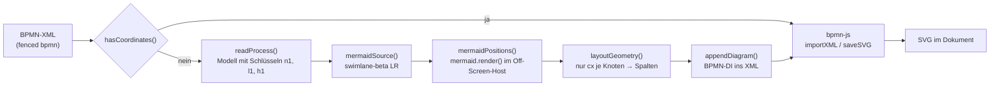

# Mermaid im BPMN-Code

Analyse, wo und wozu der BPMN-Code von dokufix Mermaid verwendet. Im Mittelpunkt stehen die beiden Produktmodule `src/app/bpmn.js` und `src/app/bpmn-layout.js`. Dazu kommen ihre Einbindung (`src/app.js`, `src/index.html`, `src/app/licences.js`), die Tests und Werkzeuge in `tests/` sowie die Artefakte außerhalb des Builds (BPMN-Assistent, Spike).
Stand 7. Oktober 2026, Commit `8266ec4`. Alle Zeilenangaben beziehen sich auf diesen Stand. Die Analyse ändert nichts am Code; die Hinweise am Ende sind Vorschläge.

## Ergebnis in Kürze

- **Mermaid zeichnet kein BPMN.** Gezeichnet wird BPMN immer von bpmn-js. Mermaid hat im BPMN-Code genau eine Aufgabe: Es ist die **Layout-Engine für BPMN-XML ohne Koordinaten** (ohne `BPMNShape`). Das kam mit Story 2.8.
- **Mermaid liefert nur die Reihenfolge der Spalten.** Seit Story 2.27 liest das Layout aus Mermaids SVG nur noch die x-Koordinate der Knotenmitten. Raster, Zeilen, Routing und Beschriftungen berechnet `layoutGeometry()` selbst (Regeln R1–R17).
- **Mermaid wird nur an einer Stelle aufgerufen:** `mermaid.render()` in `mermaidPositions()` (`src/app/bpmn.js:269`). Alles andere sind Prüfungen, ob Mermaid vorhanden ist, das Erzeugen des Mermaid-Texts, das Auswerten des SVG, die Versionsbindung und die Tests.
- **Der Mermaid-Text nutzt das Beta-Schlüsselwort `swimlane-beta LR`** (`src/app/bpmn-layout.js:406`). Das ist das größte Risiko bei einem Versionswechsel. Deshalb ist die Version an drei Stellen auf `12.0.0` festgelegt, und ein Test prüft, dass sie übereinstimmen.
- **Mermaids Bild landet nie im Dokument.** Mermaid rendert in einen flüchtigen Host außerhalb des sichtbaren Bereichs, der danach in jedem Fall entfernt wird. Die Exporte enthalten keine Spur davon; `tests/durchlaeufe.mjs` prüft das.
- **Ohne Mermaid** werden BPMN-Diagramme mit Koordinaten weiterhin gezeichnet. BPMN ohne Koordinaten wird zur Warnung „Die Bibliothek Mermaid wurde nicht geladen; sie ordnet BPMN ohne Koordinaten an.“

## Vorgehen

1. Volltextsuche nach `mermaid` (Groß-/Kleinschreibung egal) über das ganze Repository, ohne `.git`.
2. `src/app/bpmn.js` vollständig gelesen, `src/app/bpmn-layout.js` an allen Fundstellen und dem dazwischen liegenden Datenfluss (`readProcess()` → `mermaidSource()` → `mermaidPositions()` → `layoutGeometry()` → `appendDiagram()`).
3. Einbindung (Konfiguration, CDN-Tag, Lizenzliste, ESLint-Globals), Tests und Werkzeuge an den Fundstellen gelesen, ebenso die zugehörigen Abschnitte von `src/README.md`.
4. Abgegrenzt gegen die Stellen, an denen Mermaid seine eigenen Diagramme zeichnet (fenced ` ```mermaid `). Diese gehören nicht zum BPMN-Code und stehen nur zur Einordnung im Abschnitt *Abgrenzung*.

Die Tests wurden nicht ausgeführt: Im Container ist `node_modules` nicht installiert. Die Analyse stützt sich auf das Lesen des Codes.

## Datenfluss: BPMN ohne Koordinaten



Nur der Schritt `mermaidPositions()` braucht eine Seite und Mermaid. `readProcess()`, `mermaidSource()`, `layoutGeometry()` und `appendDiagram()` sind reine Logik und laufen in Node (`tests/bpmn-layout.test.mjs`, `tests/bpmn-fixtures.test.mjs`).

## Fundstellen im Produktcode

### `src/app/bpmn.js` (Browser-Teil des Layouts)

| Zeile | Was | Erläuterung |
|---|---|---|
| 2 | `import { …, mermaidSource, … } from './bpmn-layout.js'` | Holt den Generator des Mermaid-Texts. |
| 7–8 | Modulkommentar | „laid out first (src/app/bpmn-layout.js, Mermaid as the layout engine)“. |
| 28, 108–109 | `finishBpmnSvg()` | Kein Aufruf von Mermaid. Das BPMN-SVG bekommt `width="100%"` und `max-width` **wie ein Mermaid-SVG**, damit `drawnWidth()` in `diagrams.js` beide Arten gleich behandelt. |
| 32 | Modulkommentar | Die Bibliotheken der Seite: `BpmnJS`, „and mermaid for the layout“. |
| 39 | `BPMN_NO_MERMAID` | Text der Warnung, wenn Mermaid fehlt: „Die Bibliothek Mermaid wurde nicht geladen; sie ordnet BPMN ohne Koordinaten an.“ |
| 148–159 | `offscreenHost()` | Derselbe flüchtige Host (`data-dokufix-transient`, `aria-hidden`, `position:fixed; left:-10000px`) dient bpmn-js zum Zeichnen und Mermaid zum Layout. |
| 187 | `drawBpmn()` | Weiche: XML mit `BPMNShape` geht direkt an bpmn-js, Mermaid wird **nicht** gefragt. Ohne Koordinaten folgt `layoutBpmn()`. |
| 242–254 | `layoutBpmn()` | Reihenfolge der Prüfungen: XML nicht lesbar oder keine `definitions` → unverändert an bpmn-js, das den Fehler formuliert. **Erst danach** (Z. 247) kommt die Prüfung auf Mermaid: `typeof mermaid === 'undefined' \|\| !mermaid \|\| typeof mermaid.render !== 'function'` wirft `BPMN_NO_MERMAID`. Z. 250 ruft `mermaidPositions()`. |
| 256–263 | Kommentar zu `mermaidPositions()` | Die Render-ID ist bei jedem Layout neu und darf `-flowchart-` nicht enthalten, weil Knoten über dieses Muster gefunden werden. Mermaid 12.0.0 gibt Knoten kein `data-id`. Die Funktion ist für `tests/capture-bpmn.mjs` exportiert. |
| 264–308 | `mermaidPositions(model, doc, index)` | **Der einzige Aufruf von Mermaid im BPMN-Code**, Details unten. |

**`mermaidPositions()` im Einzelnen:**

1. Z. 266: eigener Off-Screen-Host, im `finally` (Z. 305–307) in jedem Fall entfernt.
2. Z. 268: Render-ID `dokufix-bpmn-layout-<index>-<laufende Nummer>` (Zähler `layoutRuns`, Z. 264).
3. Z. 269: `await mermaid.render(id, mermaidSource(model), host)`. Mermaid legt sein temporäres Element in den Host.
4. Z. 270–272: Das SVG wird als `innerHTML` in den Host gesetzt und als `svg` gesucht; ohne SVG: Fehler „Mermaid hat kein SVG geliefert.“
5. Z. 274–281, **Knoten:** `g.node`, gefunden über `id` mit `-flowchart-<key>-`; Mitte aus `transform="translate(x, y)"`, Größe aus `getBBox()`. Das gilt für die Knoten des Modells und die Platzhalter leerer Bahnen (`hold`).
6. Z. 282–289, **Bahnen:** `g.cluster.swimlane[data-id]` mit `rect.swimlane-body` und `rect.swimlane-title`, daraus der umschließende Kasten.
7. Z. 290–303, **Kanten:** `path[data-edge="true"][data-id]`, Präfix `L_<von>_<nach>_`; die Punkte stehen base64-kodiert in `data-points` (`JSON.parse(atob(…))`). Bei zwei Flüssen zwischen demselben Paar nimmt jeder den ersten noch freien Pfad. Flüsse von einem angehefteten Ereignis werden über dessen Host-Knoten zugeordnet (Z. 295).
8. Rückgabe `raw = { nodes, lanes, edges }`.

Diese Funktion hängt eng an der Struktur des SVG, das Mermaid 12.0.0 für `swimlane-beta` schreibt: Klassennamen `g.node`, `g.cluster.swimlane`, `rect.swimlane-body`, `rect.swimlane-title`, die Attribute `data-edge`, `data-id`, `data-points` und das ID-Muster `-flowchart-`.

### `src/app/bpmn-layout.js` (reine Logik)

| Zeile | Was | Erläuterung |
|---|---|---|
| 1–26 | Modulkommentar | Die fünf Schritte. „Mermaid gives the order of the columns, not the picture, and is not the writing format“; „Mermaid's picture never reaches the document.“ |
| 47–51 | `MERMAID_LAYOUT_VERSION = '12.0.0'` | Die Version, mit der Layout und Prüfungen gemacht sind. Muss mit dem Pin in `src/index.html` übereinstimmen (`tests/licences.test.mjs`). |
| 118–123, 148 | Doku des Modells | Synthetische Bahn „gives Mermaid its row“; `hold` ist die Mermaid-ID des Platzhalters einer leeren Bahn; `key` ist „the id Mermaid gets for it (n1…, l1…)“. |
| 311 | `key: 'n' + …` | Knoten bekommen eigene IDs `n1…`, die Autoren-IDs erreichen Mermaid nie. |
| 347 | `key = () => 'l' + …` | Bahnen bekommen `l1…`. |
| 371–373 | `l.hold = 'h' + …` | Eine leere Bahn bekommt einen Platzhalterknoten `h1…`. Ohne ihn zeichnet Mermaid sie als eigenen Streifen. |
| 379–380 | Fluss auf sich selbst | Wird ausgelassen („a flow from a node to itself“), weil Mermaids Swimlane-Layout daran scheitert. |
| 393–410 | `mermaidSource(model)` | **Erzeugt den Mermaid-Text**, Details unten. |
| 800–804 | Doku von `layoutGeometry()` | `raw` ist „what Mermaid's SVG says“. Gelesen wird **nur** `nodes[key].cx`. Knoten mit weniger als einer Einheit Abstand teilen sich eine Spalte; der Platzhalter einer leeren Bahn wird nicht gelesen. |
| 876–893 | `buildGrid()` | Aus den `cx` aller Knoten entstehen sortierte Spalten (`col` = „Mermaid's rank“). Fehlt ein Knoten: Fehler „Mermaid hat das Element „…“ nicht angeordnet.“ |
| 830–832 | Abschnittskommentar Raster | „Mermaid gives the order of the columns and each node's lane“. |
| 1345–1353 | `ruleCompact()` (R7) | Schließt die Spalten, die Reihenfolge von links nach rechts bleibt Mermaids (`byMermaid`). |
| 1909–1912 | `finishGrid()` (R9) | Jede Runde startet wieder bei Mermaids Spalten. |

**`mermaidSource()` im Einzelnen** (Z. 401–410):

- Kopfzeile `swimlane-beta LR`: Diagrammtyp Swimlane, eine **Beta-Syntax** von Mermaid, von links nach rechts.
- Je Bahn ein `subgraph l<n>["Name"] … end` mit ihren Knoten, bei leerer Bahn mit Platzhalter `h<n>[" "]`.
- Knotenformen: Task `n1["…"]`, Gateway `n2{"…"}` (ohne Namen `+`), Ereignisse `n3(("…"))`.
- Danach die Sequenzflüsse `n1 --> n2`, mit Namen `n1 -->|"…"| n2`.
- Beschriftungen verlieren `" < > & # ` \`; leere Beschriftungen werden zu einem Leerzeichen. So kann nichts eine Beschriftung beenden, eine Entität oder einen Markdown-String beginnen.
- Die Bahnen **aller Pools** gehen als eine Liste an Mermaid, **ohne Nachrichtenflüsse**: Die setzen dort keine Spalte, das erledigt R7 (Ben, 2026-10-06).
- Angeheftete Ereignisse (Boundary Events) sind keine Mermaid-Knoten: Ihre Flüsse gehen vom Host aus. Flüsse zurück in den Host fallen weg (Story 2.30).
- Black Boxes (Pools ohne Prozess) und Textanmerkungen sieht Mermaid nie (Stories 2.29, 2.31).

### Einbindung und Konfiguration

| Datei:Zeile | Was | Bezug zum BPMN-Code |
|---|---|---|
| `src/index.html:111–118` | `<script src="https://cdn.jsdelivr.net/npm/mermaid@12.0.0/dist/mermaid.min.js">` | Liefert das globale `mermaid`, das auch das BPMN-Layout nutzt. Der Kommentar verlangt bei einem Versionswechsel `tests/vergleich.mjs`. |
| `src/app.js:24–38` | `mermaid.initialize({ startOnLoad: false, theme: 'default', securityLevel: 'strict', suppressErrorRendering: true, flowchart: { curve: 'basis' } })` | Wird nur aufgerufen, wenn `mermaid` existiert, damit das Skript ohne Mermaid weiterläuft (seit Story 2.8). Das BPMN-Layout setzt **keine eigene Konfiguration**; es rendert mit dieser globalen. |
| `src/app/licences.js:46` | Lizenzeintrag Mermaid 12.0.0, MIT, `use: 'cdn'` | Wird gegen den Pin in `index.html` geprüft. |
| `eslint.config.mjs:48` | `mermaid: 'readonly'` | Globale Variable für `bpmn.js`, `diagrams.js` und `app.js`. |

## Versionsbindung

Die Mermaid-Version steht an diesen Stellen:

| Ort | Wert | Rolle |
|---|---|---|
| `src/index.html:118` | `mermaid@12.0.0` | Was die Seite lädt. |
| `src/app/licences.js:46` | `version: '12.0.0'` | Lizenzhinweis. |
| `src/app/bpmn-layout.js:51` | `MERMAID_LAYOUT_VERSION = '12.0.0'` | Womit das Layout gemacht und geprüft ist. |
| `tests/fixtures/bpmn-layout/index.json:2` | `"mermaid": "12.0.0"` | Mit welcher Version die Rohpositionen der 57 Fixtures erfasst sind. |
| `dist/bpmn-assistant.html` | `mermaid@12.0.0`, `MERMAID_LAYOUT_VERSION = "12.0.0"` | Gebündelte Kopie, außerhalb des Builds. |

Die Wächter:

- `tests/licences.test.mjs:112–121, 159–168`: meldet „src/index.html pins mermaid X, and the layout of BPMN without coordinates is made with 12.0.0 … raise both together, with the regression check of story 2.8“, sobald Pin und `MERMAID_LAYOUT_VERSION` abweichen. Ein Abweichen der Lizenzliste wird ebenfalls gemeldet.
- `tests/bpmn-fixtures.test.mjs:26`: `index.json` muss `MERMAID_LAYOUT_VERSION` nennen, sonst „a new Mermaid: capture the raw positions anew (npm run capture)“.
- `tests/bpmn-layout.test.mjs:180–181`: `MERMAID_LAYOUT_VERSION` ist `12.0.0`.

Ablauf bei einem Versionswechsel laut `src/README.md` (Abschnitt *Libraries*, Z. 192): Pin und `MERMAID_LAYOUT_VERSION` gemeinsam anheben, die Rohpositionen neu erfassen (`npm run capture`) und den Vergleichslauf `tests/vergleich.mjs` auf `tests/referenz.md` fahren (Referenzeingabe „Übergabe an die Tourenplanung“, beide Browser).

## Fehlerfälle

| Situation | Verhalten | Stelle |
|---|---|---|
| Mermaid nicht geladen, BPMN **mit** Koordinaten | Wird gezeichnet, Mermaid wird nicht gefragt. | `bpmn.js:187` |
| Mermaid nicht geladen, BPMN **ohne** Koordinaten | Warnung „Das Diagramm „…“ konnte nicht gezeichnet werden.“ mit Detail `BPMN_NO_MERMAID`. Es entsteht kein Host. | `bpmn.js:247` |
| XML nicht lesbar oder keine `definitions` | Geht unverändert an bpmn-js, das den Grund nennt; die Prüfung auf Mermaid kommt danach. | `bpmn.js:244–246` |
| Layout lehnt ab (nichts anzuordnen, Knoten ohne Bahn) | Ablehnung **vor** dem Aufruf von Mermaid, der Grund wird zur Warnung. | `bpmn.js:248`, `readProcess()` |
| `mermaid.render()` wirft (z. B. Parse-Fehler) | Der Fehler ist der Grund der Warnung, der Host wird entfernt. | `bpmn.js:305–307` |
| Mermaid liefert kein SVG | „Mermaid hat kein SVG geliefert.“ | `bpmn.js:272` |
| Mermaid ordnet einen Knoten nicht an | „Mermaid hat das Element „…“ nicht angeordnet.“ | `bpmn-layout.js:885` |
| Fluss von einem Knoten auf sich selbst | Ausgelassen, Konsolenzeile „BPMN layout, left out: …“. | `bpmn-layout.js:379–380`, `bpmn.js:252` |

## Tests und Werkzeuge

| Datei | Mermaid-Bezug |
|---|---|
| `tests/bpmn.test.mjs` | Ersetzt das globale `mermaid` durch einen Stand-in (`mermaidStandIn()`, ab Z. 217), der ein SVG in der Form von Mermaid 12.0.0 liefert. Geprüft wird: Layout im flüchtigen Host, beide Hosts danach weg (Z. 242–265); XML mit Koordinaten fragt Mermaid nicht (Z. 320); ohne Mermaid die Ablehnung `BPMN_NO_MERMAID` ohne Host (Z. 357–361); Ablehnung des Layouts vor Mermaid, Fehler von Mermaid als Grund (Z. 366–380); Warnung im Dokument (Z. 421–444). |
| `tests/bpmn-layout.test.mjs` | Läuft ohne Browser und ohne Mermaid. Prüft den Mermaid-Text (Z. 128, 137–177: Subgraphs, eigene IDs, Bereinigung der Beschriftungen), die Version (Z. 180), dass `layoutGeometry()` Bahnen und Kanten aus `raw` nicht liest (Z. 366–370), Rohpositionen „in the shape Mermaid gives“ (Z. 467–490), keinen Fluss auf sich selbst (Z. 495–499), keine Nachrichtenflüsse und keine Black Box im Text (Z. 785–840), Flüsse von angehefteten Ereignissen (Z. 1123) und keine Textanmerkungen (Z. 1279–1287). |
| `tests/bpmn-fixtures.mjs`, `tests/bpmn-fixtures.test.mjs` | Je Fixture `<n>.raw.json` mit den Rohpositionen von Mermaid. Der Test legt sie in Node neu an und prüft die Mermaid-Version in `index.json`. |
| `tests/capture-bpmn.mjs` (`npm run capture`) | Bündelt `mermaidPositions()` und `labelMeasurer()` aus `src/app/bpmn.js` per esbuild in `dist/dokufix.html` und erfasst die Rohpositionen in Chromium. Meldet Knoten oder Kanten, die Mermaid nicht angeordnet hat (Z. 113–116). |
| `tests/licences.test.mjs` | Versionswächter, siehe oben. |
| `tests/durchlaeufe.mjs` | Browserläufe. Szenario 13 „Mermaid cannot be loaded“ (Z. 89–93, Dokument `DOC_NO_MERMAID` ab Z. 307). `LAYOUT_TRACES` (Z. 306) prüft, dass keine Datei Spuren von Mermaids Layout trägt: keine URL, kein `swimlane`, kein `-flowchart-`, keine Render-ID `dokufix-bpmn-layout` (Z. 1056). |
| `tests/vergleich.mjs` | Regressionslauf bei einem Wechsel der Mermaid-Version. Er setzt voraus, dass die Seite Mermaid hat (Z. 546–547). |
| `tests/cdn.mjs` | Lokaler Spiegel der CDN-Dateien, darunter `mermaid@12.0.0`, für die Browserläufe. |

## Außerhalb des Produkt-Builds

- **BPMN-Assistent** (`dist/bpmn-assistant.html`): Kein Teil des Builds. Er wird im Store von `spike-2-26/testtool/bauen.mjs` aus `src/app/bpmn.js`, `src/app/bpmn-layout.js` und weiteren Modulen gebündelt (`src/README.md:76`). Er lädt Mermaid 12.0.0 vom CDN, ruft `mermaid.initialize()` mit derselben Konfiguration wie die App und nutzt `mermaidPositions()` und `mermaidSource()` unverändert (als `window.T`). Nach einer Änderung am Layout muss er neu gebaut werden.
- **Spike `spikes/komponenten-aus-markdown/src/bpmn.js`**: Der historische Vorläufer. Dort war Mermaid auch **Schreibformat**: `fromMermaid()` und `parseMermaid()` lesen Mermaid-Swimlane-Text über `mermaid.mermaidAPI.getDiagramFromText()` (Z. 36–38). `layoutFromMermaid()` (Z. 286–290) übernahm Mermaids Koordinaten und stauchte und korrigierte sie (Z. 103–171). Das Produkt hat das nicht übernommen: Mermaid ist kein Schreibformat mehr, und seit Story 2.27 ersetzt das Raster das Skalieren und die Korrekturen. Die Tests unter `spikes/komponenten-aus-markdown/tests/mermaid-*.mjs` und ihre Ausgaben in `tests/out/` gehören zu diesem Spike.

## Abgrenzung: Mermaid ohne BPMN-Bezug

Diese Stellen nutzen Mermaid für eigene Diagramme (fenced ` ```mermaid `) und gehören nicht zum BPMN-Code. Sie stehen hier nur, damit sie nicht verwechselt werden:

- `src/app/diagrams.js:179–196` `renderMermaid()` mit `mermaid.run()` (nicht `render()`), Warnung `MERMAID_NO_LIBRARY`, Aufräumen von `dmermaid-*`/`imermaid-*`; Z. 214–218 Art `mermaid` mit Download `.mmd`; Z. 274–279 Entfernen von `.mermaidTooltip`.
- `src/app/diagram-kinds.js:23` Bezeichnung „Mermaid-Diagramm“; `src/app/search.js`, `src/app/search-places.js`, `src/search.css:99–102` Suchtreffer der Art Mermaid.
- `src/app/live-viewer.js:14`: Ein Mermaid-Diagramm behält überall die statische Großansicht; nur BPMN bekommt den Live-Viewer.
- Gemeinsam mit BPMN ist nur die SVG-Konvention: `finishBpmnSvg()` schreibt Breite und `max-width` wie Mermaid, damit `drawnWidth()` (`diagrams.js:166–178`) beide gleich liest.

## Hinweise

1. **Abhängigkeit von einer Beta-Syntax und vom SVG-Aufbau.** `swimlane-beta` und die von `mermaidPositions()` gelesenen Klassen, Attribute und das ID-Muster `-flowchart-` sind kein zugesichertes API von Mermaid. Der Versionswächter verhindert ein unbemerktes Anheben. Ein Wechsel bleibt trotzdem aufwendig: neu erfassen und Vergleichslauf. Das ist dokumentiert und so gewollt; es lohnt sich, das bei jeder Planung eines Mermaid-Updates einzupreisen.
2. **Erfasst wird mehr, als das Layout liest.** `mermaidPositions()` sammelt `cy`, `w`, `h` (über `getBBox()` je Knoten), die Kästen der Bahnen und die Punkte der Kanten. `layoutGeometry()` liest davon nur `cx` (`bpmn-layout.js:800–804`, Test `bpmn-layout.test.mjs:366–370`). Der Rest dient den Werkzeugen: `capture-bpmn.mjs` prüft mit `raw.edges`, ob jede Kante angeordnet wurde, und die Fixtures speichern die vollständige Form. Im Seitenlauf sind die `getBBox()`-Aufrufe und das Dekodieren von `data-points` deshalb Arbeit ohne Wirkung aufs Ergebnis. Der Aufwand ist klein; ein Umbau lohnt sich nur, wenn große Diagramme spürbar langsam werden.
3. **Geteilte globale Konfiguration.** Das BPMN-Layout rendert mit der Konfiguration aus `src/app.js` (`securityLevel: 'strict'`, `flowchart.curve: 'basis'` usw.). Wer diese Konfiguration für Mermaid-Diagramme ändert, ändert möglicherweise auch die Spaltenreihenfolge des BPMN-Layouts. Der Kommentar in `src/app.js:24–38` erwähnt das nicht; ein Satz dort oder ein Verweis auf den Vergleichslauf würde helfen.
4. **Zwei verschiedene Prüfungen auf Mermaid.** `bpmn.js:247` prüft `mermaid.render`, `diagrams.js:188` prüft `mermaid.run`. Beide passen zum jeweiligen Aufruf, das ist also korrekt. Fällt eine der beiden Funktionen in einer künftigen Version weg, ist das Verhalten aber uneinheitlich.
5. **Kopie im BPMN-Assistenten.** `dist/bpmn-assistant.html` enthält eine gebündelte Kopie von `mermaidSource()` und `mermaidPositions()` samt Versionskonstante. Die Wächter in `tests/` prüfen diese Datei nicht. Bei einem Mermaid-Update oder einer Änderung an diesen Funktionen muss der Assistent von Hand neu gebaut werden (`src/README.md:76`).
