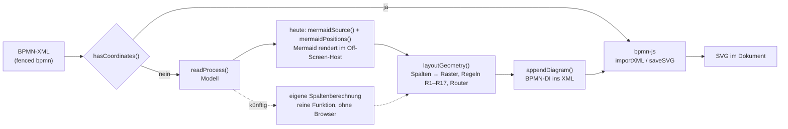

# Mermaid im BPMN-Code: Grundlage für die Ablösung

Ziel dieses Dokuments ist es, Mermaid im BPMN-Layout durch eine eigene Lösung ersetzen zu können. Es beschreibt:

- was Mermaid heute zum BPMN-Layout beiträgt (die Schnittstelle),
- wie Mermaid 12.0.0 diesen Beitrag berechnet (den Algorithmus),
- den Nachweis, dass ein Nachbau dasselbe Ergebnis liefert,
- was sich beim Ersatz in Code, Tests und Dokumentation ändert,
- einen Vorschlag für das Vorgehen und die Abnahmekriterien.

Im Anhang stehen die vollständige Bestandsaufnahme aller Mermaid-Stellen (Anhang A) und die Befunde zur heutigen Nutzung (Anhang B).

Stand 7. Oktober 2026, Commit `8266ec4`. Alle Zeilenangaben beziehen sich auf diesen Stand. Das Dokument ändert nichts am Code; Vorschläge sind als solche gekennzeichnet. Es beruht auf dem Lesen des Codes, auf dem Quellcode des npm-Pakets `mermaid@12.0.0` und auf Versuchen im Browser (Chromium, Mermaid 12.0.0) und in Node.

Mermaid bleibt auch nach der Ablösung in dokufix: Es zeichnet weiterhin die Diagramme der Autoren in ` ```mermaid `-Blöcken. Abgelöst wird nur seine Rolle als Layout-Engine für BPMN.

## Ergebnis in Kürze

- **Mermaid liefert dem BPMN-Layout genau eine Information: die Spalte jedes Knotens.** Das Layout liest aus Mermaids SVG nur die x-Koordinate der Knotenmitten. Daraus wird eine Spaltennummer; alles andere (Zeilen, Routing, Beschriftungen, Rahmen) berechnet `layoutGeometry()` selbst.
- **Diese Spalte entsteht in Mermaid 12.0.0 durch einen kleinen, deterministischen Algorithmus** (`assignLayers_LaneAwareCompact` mit vorgeschalteter Zyklenauflösung, zusammen unter 100 Zeilen im Mermaid-Quellcode). Schrift, Thema, Abstände und Kantenrouting spielen für die Spalte keine Rolle.
- **Ein Nachbau in reinem JavaScript (rund 50 Zeilen, ohne Browser) liefert exakt dasselbe Ergebnis.** Belegt durch:
  - 57 von 57 Fixtures: dieselbe Spaltenordnung wie Mermaid, das angeordnete XML Byte für Byte gleich, in beiden Messarten (`measured` und `estimated`).
  - 300 von 300 zufällig erzeugten Prozessen: dieselbe Spaltenordnung wie das echte Mermaid im Browser.
- **Der Ersatz lässt sich an einer einzigen Stelle einhängen:** Statt `mermaidPositions()` liefert eine reine Funktion die Spalten. `layoutGeometry()` und alle Regeln R1–R17 bleiben unverändert.
- **Was der Ersatz bringt:**
  - Die Anordnung dauert für alle 57 Fixtures 8 ms statt 18,6 s, das sind etwa 98 % der bisherigen Layoutzeit.
  - Das ganze Layout läuft in Node. Die Fixtures brauchen keine Rohpositionen aus dem Browser mehr.
  - Es gibt keine Kopplung an eine Mermaid-Version und an eine Beta-Syntax mehr.
  - BPMN ohne Koordinaten wird auch ohne Mermaid gezeichnet.
  - Mehrere Fehler und Risiken der heutigen Nutzung verschwinden (Anhang B), etwa der Abbruch bei `%%{` in Beschriftungen.
- **Die Komponente heißt arielle.** Der Name spielt auf die Meerjungfrau an. arielle kapselt alles, was von Mermaid übernommen ist, in einem eigenen Modul, sagt offen, dass es auf Mermaid beruht, und steht wie Mermaid unter der MIT-Lizenz (Abschnitt 4a).
- **Mermaids Spaltenreihung ist volatil, und arielle beseitigt das.** Mit Mermaids Spalten ändern sich die Spalten bei 24 % bedeutungsloser Umordnungen des XML, etwa einer anderen Reihenfolge der Flussknoten oder Sequenzflüsse. arielle ersetzt Mermaids Sortierung nach Schlüsseln durch eine Ordnung aus der Struktur des Prozesses (Abschnitt 3a). Ergebnis: Die Spalten ändern sich bei 0 % der Umordnungen, und auch Umbenennungen von IDs ändern in den Fixtures nichts. Die Qualität bleibt gleich oder wird besser: 2 von 57 Fixtures ändern sich, 1 Regelverstoß weniger, keiner neu, Kreuzungen 52 → 48.
- **Auch das fertige Layout lässt sich stabil machen.** Mit arielle allein ändert sich das Bild noch bei rund 21–23 % der Umordnungen, weil Regeln des eigenen Rasters bei Gleichstand der Reihenfolge des Modells folgen. Die Lösung ist `kanonisch()`: Das Modell wird vor dem Layout einmal in arielles Reihenfolge gebracht. Knoten kommen in der Reihenfolge der Rangvergabe, Flüsse in der Reihenfolge von arielles Tiefensuche (Abschnitt 3b). Ergebnis: Das Bild ändert sich bei **0 von 570** Umordnungen und bei 0 von 570 Umbenennungen. Die Qualität wird besser: 43 statt 44 Verstöße, 46 statt 48 Kreuzungen, 324 statt 325 Knicke.
- **Empfehlung:** arielle samt `kanonisch()` als eigenes Modul `src/app/arielle.js` übernehmen und einhängen. Das sortierte Modell geht an `layoutGeometry()`, das Modell des Autors an `appendDiagram()`, sodass das geschriebene XML seine Reihenfolge behält. 10 der 57 Fixtures werden einmal neu geschrieben.

## Vorgehen

1. Volltextsuche nach `mermaid` (Groß-/Kleinschreibung egal) über das ganze Repository; `src/app/bpmn.js` vollständig, `src/app/bpmn-layout.js` an allen Fundstellen und im Datenfluss gelesen, ebenso Einbindung, Tests, Werkzeuge und `src/README.md` (Ergebnis: Anhang A).
2. Die Tests mit Mermaid-Bezug ausgeführt: `node --test tests/bpmn.test.mjs tests/bpmn-layout.test.mjs tests/licences.test.mjs tests/bpmn-fixtures.test.mjs`, 268 Tests, alle grün.
3. Den Quellcode von `mermaid@12.0.0` gelesen (npm-Paket, `dist/chunks/mermaid.core/`): Swimlane-Diagramm, Layout-Pipeline, Rangberechnung, Kanten-IDs, Direktiven. Die Pfade unten sind die Quellpfade, die das Paket in seinen Kommentaren nennt.
4. Versuche im Browser: Chromium aus `/opt/pw-browsers`, `dist/dokufix.html` mit den Bibliotheken aus dem CDN-Spiegel von `tests/cdn.mjs`, `mermaidPositions()` per esbuild hineingebündelt wie in `tests/capture-bpmn.mjs` (Aufbau im Detail: Anhang B, *Versuchsaufbau*).
5. Den Algorithmus in Node nachgebaut und gegen die 57 Fixtures und gegen das echte Mermaid an 300 Zufallsprozessen verglichen.
6. Den Nachbau von einem zweiten Agenten reviewen lassen: Korrektheit, Vereinfachung, Volatilität gegen Umordnung und Umbenennung, Qualität der Varianten (Abschnitt 3a). Seine Kernergebnisse habe ich mit eigenen Tests nachgeprüft: Qualitätsmessung erneut ausgeführt, Invarianz unabhängig nachgemessen.
7. Die verbleibende Volatilität im Raster gemessen und eine kanonische Sortierung des Modells als Gegenmittel ausprobiert (Abschnitt 3b).

Die Versuchsskripte, der Nachbau, arielle und der Review-Bericht liegen bisher nur im Scratchpad dieser Sitzung (`review/BERICHT.md`, `review/ranks-optimiert.mjs`, `review/ranks-exakt.mjs`), nicht im Repository. Abschnitte 2, 3 und 3a beschreiben sie so genau, dass sie sich nachvollziehen lassen.

## Datenfluss heute und nach der Ablösung



Heute braucht nur der Schritt `mermaidPositions()` eine Seite und Mermaid. Nach der Ablösung ist der ganze Weg von `readProcess()` bis `appendDiagram()` reine Logik.

## 1. Was Mermaid heute beiträgt

### Die Schnittstelle

`layoutBpmn()` (`src/app/bpmn.js:242–254`) ruft:

```js
const raw = await mermaidPositions(read.model, doc, index);
const laidOut = appendDiagram(xml, read.model, layoutGeometry(read.model, raw, measurer()));
```

`layoutGeometry(model, raw, measure, options)` (`src/app/bpmn-layout.js:817`) liest von `raw` **nur** `raw.nodes[key].cx` je Knoten des Modells (`buildGrid()`, `bpmn-layout.js:879–893`):

1. Alle `cx` der Knoten werden gesammelt; Werte, die weniger als eine Einheit auseinanderliegen, gelten als gleich.
2. Die verschiedenen Werte werden aufsteigend sortiert. Die Spalte eines Knotens ist der Index seines Werts in dieser Liste.
3. Fehlt ein Knoten in `raw.nodes`, wirft `buildGrid()` „Mermaid hat das Element „…“ nicht angeordnet.“

Für den Ersatz heißt das: **Gebraucht wird für jeden Knoten eine Zahl, deren Ordnung die Spalten festlegt.** Gleiche Zahl heißt gleiche Spalte. Die Skala ist egal, Lücken sind egal. `raw.nodes[key] = { cx: rang }` genügt. Das zeigt auch der vorhandene Test `the geometry refuses positions that lack a node; Mermaid's lanes and flows it does not read` (`tests/bpmn-layout.test.mjs:366–370`).

### Die Eingabe

Mermaid sieht das Modell so, wie `mermaidSource()` (`bpmn-layout.js:401–410`) es schreibt. Für die Spalten zählen davon:

| Teil des Modells | Wie Mermaid es sieht |
|---|---|
| `model.lanes` (alle Bahnen aller Pools, in dieser Reihenfolge) | je eine Gruppe (`subgraph l<n>`); eine Bahn ist die Einheit, in der sich Knoten eine Spalte nicht teilen dürfen |
| `lane.nodes` | die Knoten der Bahn, in dieser Reihenfolge |
| `lane.hold` (leere Bahn) | ein Platzhalterknoten `h<n>` ohne Kanten; beeinflusst keine anderen Knoten |
| `model.nodes[].key` (`n1…`) | die Knoten-ID; geht in Sortierungen ein (siehe Abschnitt 2) |
| `model.flows` | je eine Kante von `key(from)` nach `key(to)`; ein Fluss von einem angehefteten Ereignis geht vom Host aus; ein Fluss, dessen beide Enden derselbe Knoten sind (auch Host ↔ eigenes Ereignis), entfällt |
| `flow.name` (nicht leer) | macht aus der Kante eine **beschriftete** Kante, die eine eigene Spalte bekommt (Abschnitt 2, Schritt 0) |
| Knotentyp, Knotenname, Bahnname | spielen für die Spalte keine Rolle |
| Nachrichtenflüsse, Black Boxes, Textanmerkungen, Assoziationen | sieht Mermaid nicht |

### Wie das Layout die Spalten verwendet

Die Spalten sind mehr als eine Startreihenfolge. Sie wirken an drei Stellen:

1. **Als Startraster.** `buildGrid()` setzt `col` jeder Zelle. Die Regeln laufen vor R7 auf diesem Raster (Reihenfolge in `layoutGrid()`, `bpmn-layout.js:1494–1512`). R1, R2, R4, R5, R6, R9 und R17 lesen die Spalten direkt, etwa über `byCol`, das Knoten nach Spalte ordnet. Die Proben R10 und R12 bis R16 bewerten Varianten, die jeweils von diesen Spalten ausgehen.
2. **Als Sortierschlüssel in R7.** `ruleCompact()` (`bpmn-layout.js:1350ff.`) verdichtet die Spalten neu, behält aber „Mermaid's order“ als Sortierung bei (`byMermaid`: Spalte, dann Bahn, dann Zeile).
3. **Als Ausgangspunkt jeder Runde von R9.** `finishGrid()` (`bpmn-layout.js:1909–1912`) setzt die Spalten in jeder Runde auf die ursprünglichen zurück.

Eine andere Spaltenberechnung ändert deshalb in der Regel das fertige Bild. Wie stark, hängt vom Prozess ab (Abschnitt 3, Varianten). Wer das heutige Layout erhalten will, muss Mermaids Spalten exakt treffen.

## 2. Wie Mermaid 12.0.0 die Spalten berechnet

`swimlane-beta` ist in Mermaid 12.0.0 ein Flowchart mit eigenem Layout (`src/diagrams/swimlanes/swimlanesDiagram.ts`: `createFlowDiagram(…)`). Das Layout steckt in `src/rendering-util/layout-algorithms/swimlanes/`. Der Einstieg `runSwimlaneLayoutCore()` (`layoutCore.ts`) ruft `sugiyamaLayout()` (`pipeline.ts`) mit den Voreinstellungen, denn dokufix setzt keine `swimlane`-Schlüssel. Für die x-Koordinate, also die Spalte, sind nur die folgenden Schritte maßgeblich. Die Reihenfolge innerhalb einer Spalte (`orderLayers`, vertikal), die Koordinaten (`assignCoordinates`) und das Kantenrouting bestimmen nur die y-Lage, Abstände und Linien, die dokufix nicht liest.

**Schritt 0: der Graph** (`toGraphView()` in `helpers.ts`, `createEdgeLabelNodes()` in `edgeLabelNodes.ts`, Kanten-IDs in `getEdgeId()` und `addLink()` des Flowchart-Modells)

- Knoten in dieser Reihenfolge: die Gruppen (Bahnen) in **umgekehrter** Reihenfolge, dann die Knoten in Textreihenfolge (Bahn für Bahn, je mit Platzhalter), dann die Beschriftungsknoten in der Reihenfolge der Kanten.
- Kanten-ID: `L_<a>_<b>_0` für die erste Kante zwischen `a` und `b`, für jede weitere `L_<a>_<b>_<k+1>`, wobei `k` die Zahl der schon vorhandenen ist (also `_0`, `_2`, `_3`, …).
- Jede beschriftete Kante wird ersetzt: Es entsteht ein Beschriftungsknoten `edge-label-<a>-<b>-<Kanten-ID>`, dazu die Kanten `a → Beschriftung` und `Beschriftung → b`. Der Beschriftungsknoten gehört zur Bahn der Quelle, bei einer Kante über Bahngrenzen zur Bahn des Ziels.

**Schritt 1: Zyklen auflösen** (`removeCycles_DFS()` in `phase1.cycles.ts`)

- Tiefensuche. Die ausgehenden Kanten jedes Knotens werden nach Zielknoten sortiert (`localeCompare`), bei gleichem Ziel nach Kanten-ID.
- Startknoten der Suche: zuerst alle Knoten ohne eingehende Kante, dann alle übrigen, jeweils in Knotenreihenfolge (Schritt 0).
- Jede Kante zu einem Knoten, der gerade auf dem Suchpfad liegt, wird umgedreht.

**Schritt 2: Verarbeitungsreihenfolge** (`topoSortByGenerationIfAcyclic()` in `phase2.laneAwareCompact.ts`, bei `LR`)

- Topologische Sortierung nach Generationen (Kahn): zuerst alle Knoten ohne eingehende Kante, sortiert mit `localeCompare`; dann jeweils die Knoten, deren letzte eingehende Kante gerade abgearbeitet wurde, wieder sortiert.

**Schritt 3: Ränge** (`assignLayers_LaneAwareCompact()` im selben Modul)

```text
für jeden Knoten v in der Reihenfolge aus Schritt 2 (Gruppen übersprungen):
  basis   = Maximum über alle eingehenden Kanten u → v von
            rang(u) + (1, wenn u und v in derselben Bahn liegen, sonst 0)
  rang(v) = max(basis, frei(bahn(v)))
  frei(bahn(v)) = rang(v) + 1
```

**Schritt 4: von Rängen zu Spalten** (in dokufix)

Mermaid legt jeden Rang auf eine eigene x-Position (bei `LR`), alle Knoten eines Rangs auf dieselbe. `buildGrid()` liest nur die echten Knoten. Ränge, die nur Beschriftungs- oder Platzhalterknoten tragen, fallen damit heraus. Die Spalte ist also der dichte Rang unter den echten Knoten.

**Was daraus folgt, in Worten:**

- In einer Bahn steht in jeder Spalte höchstens ein Knoten. Die Knoten einer Bahn stehen in der Reihenfolge, in der Schritt 2 sie abarbeitet.
- Ein Fluss innerhalb einer Bahn schiebt das Ziel mindestens eine Spalte nach rechts. Ein Fluss über eine Bahngrenze erlaubt dieselbe Spalte.
- Eine Beschriftung kostet eine Spalte: Ein beschrifteter Fluss in einer Bahn schiebt das Ziel zwei Spalten weiter, nicht eine.
- Die Pools teilen sich die Ränge, weil ihre Bahnen als eine Liste an Mermaid gehen. Nachrichtenflüsse gehen nicht ein; um sie kümmert sich R7.

**Was keine Rolle spielt** (gemessen, Anhang B, Hinweis 3a): Thema, Schriftgröße, `securityLevel`, `flowchart.curve`, `flowchart.nodeSpacing`, `flowchart.rankSpacing`, `swimlane.optimizeRanksByCrossings` (wirkt nur im anderen Zweig `assignLayers_Gravity`), `swimlane.automaticLaneOrdering` (wirkt nur auf die Reihenfolge innerhalb einer Spalte) und `swimlane.lineHops`. Nur `swimlane.ignoreCrossLaneEdges: false` schaltet auf einen anderen Algorithmus (`assignLayers_Gravity`) um. dokufix setzt diesen Schlüssel nicht.

## 3. Nachweis: Ein Nachbau liefert dasselbe Ergebnis

Der Nachbau setzt die Schritte 0 bis 3 in einer Funktion `mermaidRanks(model)` um: rund 50 Zeilen, ohne DOM, ohne Mermaid. Er arbeitet auf dem Modell aus `readProcess()`. Das Ergebnis wurde als `raw = { nodes: { key: { cx: rang * 100 } } }` an das unveränderte `layoutGeometry()` gegeben.

**Gegen die Fixtures** (`tests/fixtures/bpmn-layout/`, Node, `layOut()` aus `tests/bpmn-fixtures.mjs`):

| Vergleich | Gleich |
|---|---|
| Spaltenordnung wie in den gespeicherten Rohpositionen von Mermaid | **57 von 57** |
| Angeordnetes XML wie `<n>.estimated.bpmn` | **57 von 57** |
| Angeordnetes XML wie `<n>.measured.bpmn` | **57 von 57** |

Die Fixtures decken Bahnen, leere Bahnen, mehrere Pools, Black Boxes, angeheftete Ereignisse, Textanmerkungen, Schleifen und beschriftete Flüsse ab.

**Gegen das echte Mermaid** (Browser, `mermaidPositions()` mit Mermaid 12.0.0): 300 zufällig erzeugte Prozesse mit 1 bis 4 Bahnen, 3 bis 24 Knoten, bis zu 33 Flüssen, zufälligen Rückwärtsflüssen, etwa 30 % beschrifteten Flüssen und leeren Bahnen. Die Spaltenordnung war **in 300 von 300 Fällen gleich**. Mermaid lieferte in keinem Fall einen Fehler.

**Ein Fehler, den das Review gefunden hat:** Besteht ein Flussname nur aus Zeichen, die `mermaidSource()` entfernt (`` " < > & # ` \ ``), schreibt `q()` die Beschriftung `|" "|`. Für Mermaid ist das **keine** Beschriftung. Mein Nachbau legte dafür trotzdem einen Beschriftungsknoten an und verschob eine Spalte. In den Fixtures und in meinen 300 Zufallsprozessen kam das nicht vor. Das Review hat es im Browser belegt: Mit gezielt erzeugten Beschriftungen stimmten nur 237 von 400 Zufallsprozessen, mit der Regel „nach `q()` leer heißt keine Beschriftung“ 400 von 400. Die korrigierte Referenzfassung heißt `arielleExakt`. Sie stimmt außerdem mit 20 000 Zufallsmodellen überein, darunter angeheftete Ereignisse, mehrere Pools und mehr als zehn parallele Flüsse.

**Varianten des Nachbaus:**

| Variante | Spaltenordnung gleich | Angeordnetes XML gleich |
|---|---|---|
| exakter Nachbau | 57 / 57 | 57 / 57 |
| `localeCompare` durch einfachen Zeichenvergleich (`<`) ersetzt | 57 / 57, ebenso in 2 000 Zufallsprozessen | 57 / 57 |
| ohne Beschriftungsknoten (Beschriftung kostet keine Spalte) | 33 / 57 | 56 / 57 (anders: `notiz-hund2`) |

Daraus folgt:

- Der Vergleich mit `localeCompare` lässt sich durch einen einfachen Zeichenvergleich ersetzen. Die IDs bestehen nur aus Kleinbuchstaben, Ziffern, `-` und `_`. Der Nachbau hängt dann nicht mehr an der Collation des Browsers.
- Die Beschriftungsspalte ist eine Eigenheit von Mermaid, die das Raster weitgehend ausgleicht: Ohne sie ändern sich die Spalten in 24 Fixtures, das fertige Bild aber nur in einem. Für einen exakten Ersatz gehört sie dazu; ob sie gewollt ist, kann später entschieden werden.

**Laufzeit:** Der Nachbau braucht für alle 57 Fixtures zusammen etwa 8 ms (Node, Mittel aus zehn Durchläufen). `mermaid.render()` brauchte für dieselben 57 im Browser 18,6 s (Anhang B, Hinweis 2).

**Eine Eigenheit für später:** Mermaid und dokufix bestimmen Rückwärtsflüsse unterschiedlich. Mermaid sortiert die Kanten in der Tiefensuche nach Ziel-ID (Schritt 1). `buildGrid()` (`bpmn-layout.js:896–907`) geht die Flüsse in XML-Reihenfolge durch, ab den Knoten ohne eingehenden Fluss. In einer Näherung (Rückwärtsfluss bei Mermaid: innerhalb einer Bahn kein steigender Rang) unterscheiden sich die beiden in einem Fixture (`r05`). Für einen exakten Ersatz bleibt das so. Eine spätere eigene Lösung kann beides vereinheitlichen.

## 3a. arielle: die empfohlene Fassung

Weil Mermaids Spaltenreihung volatil ist, muss arielle Mermaid nicht exakt treffen. Maßstab ist die Qualität des fertigen Layouts und die Stabilität gegen bedeutungslose Änderungen am XML. Das Review hat dafür elf Varianten gemessen.

### Woher die Volatilität kommt

Mermaids Algorithmus greift an mehreren Stellen auf die Schlüssel `n1…` zurück, und die entstehen in XML-Reihenfolge:

- `localeCompare` ordnet die Knoten einer Generation rein lexikografisch („n10“ vor „n9“). Diese Reihenfolge entscheidet, welcher von zwei Knoten derselben Bahn die frühere Spalte bekommt.
- Beschriftungsknoten stehen durch ihr Präfix `edge-label-` vor allen Knoten ihrer Generation.
- Die Tiefensuche sortiert die Kanten nach Ziel-Schlüssel und startet in der Reihenfolge der `flowNodeRef`. Davon hängt ab, welche Flüsse als Rückwärtsflüsse gelten.

Wird ein Element im XML verschoben, bekommen andere Knoten andere Schlüssel, und die Spalten können kippen.

### Die Regeln von arielle

Die Schichtung bleibt die von Mermaid: Tiefensuche für Zyklen, Generationen, bahnweise Verdichtung. Nur dort, wo Mermaid auf die Schlüssel zurückgreift, entscheidet bei arielle die Struktur:

- **Startknoten** der Tiefensuche: die Knoten ohne eingehenden Fluss zuerst, nach Bahn (oben zuerst), dann nach dem Tie-Break.
- **Ausgehende Flüsse eines Knotens:** nach dem Tie-Break.
- **Reihenfolge innerhalb einer Generation:** die Reihenfolge, in der die Knoten erreicht werden. Die Generation wird nicht mehr global nach Schlüsseln sortiert.
- **Tie-Break:** zuerst der Weg, der mehr Knoten erreicht (der Hauptweg vor der kurzen Ausnahme), dann der Flussname, dann der Knotenname, zuletzt die Element-ID.
- **Keine Beschriftungsspalte:** Ein Flussname setzt keine Spalte. Gemessen liefern „ohne Beschriftungsspalte“ und „Beschriftung als Gewicht“ dieselben Bilder, weil R7 die leere Spalte ohnehin schließt. Damit entfällt die ganze Mechanik der Hilfsknoten.

**Umfang:** 81 Zeilen mit Kopfkommentar, davon 41 Zeilen Code, eine Funktion `arielle(model)`, die `{ n1: rang, … }` zurückgibt. Sie meldet keine ESLint-Fehler mit der Konfiguration des Repositorys. Laufzeit für alle 57 Fixtures: 3,2 ms. Die Reichweite kostet O(V·(V+E)); eine Kette aus 5 000 Knoten braucht 0,86 s, was für BPMN-Größen belanglos ist.

### Gemessen

**Qualität** (57 Fixtures, Messart `measured`, Regelverstöße aus `breaksOf()` gegen `known-breaks.json`):

| Fassung | XML geändert | Verstöße (neu / weg) | Kreuzungen | Knicke |
|---|---|---|---|---|
| exakter Nachbau (heutiges Layout) | 0 | 45 (0 / 0) | 52 | 327 |
| **arielle** | **2** | **44 (0 / 1)** | **48** | **325** |

Die zwei Änderungen sind:

- **`ref3`:** Der längere Weg nach dem Gateway bekommt die erste Spalte. Das Bild wird schmaler und etwas höher (1678 × 700 → 1546 × 780), Knicke 6 → 5.
- **`notiz-hund2`:** Der bekannte Verstoß `association-through A_Temp Task_Verwerfen` fällt weg, Kreuzungen 8 → 4.

Ich habe die Qualitätsmessung erneut ausgeführt und dieselben Zahlen bekommen.

**Stabilität** (je Fixture 10 Umordnungen, die in BPMN keine Bedeutung haben: Flussknoten, angeheftete Ereignisse, Sequenzflüsse, `flowNodeRef`; Bahnen und Pools bleiben):

| Fassung | Spalten geändert bei Umordnung | Spalten geändert bei Umbenennung der IDs |
|---|---|---|
| exakter Nachbau (Mermaid) | 24,0 % (19 Fixtures) | 0,0 % |
| arielle mit Tie-Break nur Element-ID | 0,0 % | 22,5 % |
| arielle mit Tie-Break Reichweite → Flussname → ID | 0,0 % | 6,3 % |
| **arielle mit Tie-Break Reichweite → Flussname → Knotenname → ID** | **0,0 %** | **0,0 %** |

Den Wert für Umordnung habe ich mit einem eigenen Test unabhängig nachgemessen: exakter Nachbau 136 von 570 Umordnungen mit anderen Spalten (23,9 %), arielle 0 von 570.

**Wo keine Invarianz möglich ist:** Bei zwei Wegen, die in Reichweite, Flussnamen und Knotennamen gleich sind, etwa zwei unbenannten Zweigen eines parallelen Gateways mit gleich benannten Aufgaben, entscheidet die kleinere ID. Die Ordnung ist dann stabil gegen Umordnung, aber nicht gegen Umbenennung. Das Bild ist in beiden Fällen gleich gut, nur gespiegelt. In einer Schleife haben alle Knoten dieselbe Reichweite, dort entscheiden Namen und ID.

**Abstand zu Mermaid:** arielle ist strukturell eigenständiger als der erste Nachbau. Es gibt keine String-IDs, keine Gruppen, keine Platzhalter und keine Hilfsknoten, dafür eine eigene strukturelle Ordnung. Die Schichtung selbst bleibt aber die von Mermaid. arielle ist deshalb weiter als von Mermaid abgeleitet zu behandeln (Abschnitt 4a).

## 3b. Die verbleibende Volatilität im Raster

arielle macht die Spalten stabil, das fertige Bild aber noch nicht:

| Messung (570 Umordnungen) | Layout geändert |
|---|---|
| exakter Nachbau | 24,7 % (23 Fixtures) |
| arielle | 21–23 % (21 Fixtures) |
| Spalten je Element-ID festgehalten, nur das Raster | 23,7 % |

Die Ursache liegt in `src/app/bpmn-layout.js`: Mehrere Regeln folgen bei Gleichstand der Reihenfolge des Modells. Beispiele sind `byCol` (Z. 951, ein stabiles Sortieren nach Spalte), `at()` (Z. 922, die erste passende Zelle) und etwa 44 Schleifen über `model.nodes` oder `model.flows` zwischen Z. 879 und 2000. Andere Rückwärtsflüsse in `buildGrid()` erklären nur 6 von 131 Änderungen, alle in `r05`.

**Versuch: das Modell vor dem Layout kanonisch sortieren.** Die Idee: `model.nodes`, `lane.nodes`, `model.flows`, `model.boundaries` und die übrigen Listen werden vor `layoutGeometry()` einmal in eine Ordnung gebracht, die nur von der Struktur abhängt. Getestet habe ich:

- Knoten nach arielles Spalte, Bahn, Name, ID,
- Flüsse nach der Position ihrer Enden, Name, ID,
- angeheftete Ereignisse nach Host, Name, ID,
- der Rest nach ID.

| Messung | Ergebnis |
|---|---|
| Layout geändert bei Umordnung | **0 von 570** (vorher 120 von 570, also 21,1 %) |
| Fixtures, deren Layout sich durch die Sortierung einmalig ändert | 15 von 57 |
| Verstöße / Kreuzungen / Knicke (Summe, `measured`) | 44 → 46 / 48 → 47 / 325 → 331 |

Das zeigt: Die Volatilität des Rasters lässt sich ohne Eingriff in die Regeln vollständig beseitigen, allein durch eine feste Eingangsreihenfolge. Die getestete Sortierung ist aber noch nicht ausgewogen. Unter dem Strich kommen zwei Verstöße und sechs Knicke hinzu:

- **schlechter:** `demo6` (neuer Verstoß `node-outside-lane`, Knicke 3 → 8), `r18` (neuer Verstoß `on-one-line-foreign`, Kreuzungen 3 → 7), `notiz-morgen` (neuer Verstoß `note-on-note`), `r15` (zwei Verstöße weg, drei neu),
- **besser:** `r04` (ein Verstoß weg), `angeheftet-antrag` (ein Verstoß weg, Kreuzungen 1 → 0), `notiz-bauantrag` (Kreuzungen 10 → 8).

Zur Einordnung: Die heutige Reihenfolge des XML ist selbst nur eine zufällige Stichprobe. Über alle Umordnungen gemittelt liegen die Verstöße bei etwa 0,78 je Fixture, also rund 45 für alle 57. Eine kanonische Sortierung muss also nicht das heutige Bild schlagen, sondern dieses Mittel.

### Die verbesserte Sortierung: `kanonisch()`

Ein zweites Review (`spikes/arielle/kanonisch/BERICHT.md`) hat den Versuch geprüft und eine bessere Ordnung gefunden. Die Befunde zum ersten Versuch:

- **Vollständig und bedeutungstreu.** Sortiert sind alle Listen, deren Reihenfolge `layoutGeometry()` liest. Bahnen und Pools behalten ihre Reihenfolge.
- **Falsch gewichtet.** Notizen, Assoziationen und Nachrichtenflüsse nach ID zu sortieren ist unnötig und schadet. Die Reihenfolge der Notizen ist die des Autors (Review von Story 2.31): Eine früher stehende Notiz bekommt den besseren Platz. Das kostete den neuen Verstoß in `notiz-morgen`. Außerdem bedient die Flussordnung „nach Position der Enden“ die Gleichstände der Regeln schlechter als die XML-Reihenfolge.
- **Ein Messfehler in meinem Skript:** `canon-quality.mjs` verglich Diagramme, deren Schlüsselreihenfolge der Modellreihenfolge folgt. Viele „geänderte“ Fixtures waren deshalb nur anders serialisiert. Die Gesamtzahlen hielten der Nachmessung stand.

**Die Regeln von `kanonisch(model)`:**

| Liste | Ordnung |
|---|---|
| `model.nodes` | die Reihenfolge, in der arielle die Ränge vergibt: Spalte für Spalte, der Hauptweg zuerst |
| `model.flows` | die Reihenfolge, in der arielles Tiefensuche die Flüsse durchläuft: der Hauptweg bis zum Ende, dann die Alternativen, jeder Rückwärtsfluss dort, wo die Suche auf ihn trifft |
| `model.boundaries` | nach der Position des Hosts, dann nach dem ersten Fluss des Ereignisses, dann Name, dann ID |
| `lane.nodes` | wie die Knoten |
| Bahnen, Pools, Nachrichtenflüsse, Notizen, Assoziationen | **unverändert**: Ihre Reihenfolge hat Bedeutung oder ist die des Autors |

Die Ordnungen fallen bei arielles Lauf ohnehin an. `kanonisch(model)` gibt deshalb Modell und Ränge in einem Lauf zurück: `{ model, rank }`.

**Gemessen** (57 Fixtures, Messart `measured`, Diagrammteil je Element-ID):

| | arielle allein | erster Versuch | **`kanonisch()`** |
|---|---|---|---|
| Verstöße (neu / weg gegenüber arielle) | 44 | 46 (+6 / −4) | **43 (+3 / −4)** |
| Kreuzungen / Knicke | 48 / 325 | 47 / 331 | **46 / 324** |
| Bilder anders als mit arielle allein | – | 16 | 10 |
| Layout anders bei Umordnung (570) | 21–23 % (21 Fixtures) | 0 | **0** |
| Layout anders bei Umbenennung (570) | 0 | 0 | **0** |

Die drei „neuen“ Verstöße sind Tausche gleicher Art: In `r15` und `r17` liegt ein Verstoß an einem anderen Flusspaar, dafür gibt es in `r15` einen Knick und in `r17` eine Kreuzung weniger. `angeheftet-antrag` verliert seinen Verstoß `node-outside-lane`. In der Messart `estimated` ändern sich dieselben 10 Fixtures, Kreuzungen 47 → 45, Knicke 325 → 324.

Die Invarianz und die Gesamtzahlen habe ich mit einem eigenen Skript nachgemessen (`spikes/arielle/check/kanonisch-check.mjs`): 0 von 570 Umordnungen ändern das Bild; 43 Verstöße, 46 Kreuzungen, 324 Knicke.

**Warum der erste Versuch in vier Fixtures schlechter war:**

- `demo6`: R1 setzt ein Ende in die Bahn seines ersten gleichwertigen Vorgängers (`preds.reduce`, `bpmn-layout.js:979`). Die Ordnung „nach Enden“ stellte den Vorgänger vom angehefteten Ereignis nach vorn.
- `r18` und `r15`: Der Router legt Flüsse gleicher Länge in Modellreihenfolge. Andere Rückwärtsflüsse zuerst bedeuteten andere Spuren, danach andere Proben in R13 und R16.
- `notiz-morgen`: die Notizen nach ID statt in der Reihenfolge des Autors.

Bei 8 der 10 Bildänderungen mit `kanonisch()` steht jeder Knoten an derselben Stelle; nur der Router legt Flüsse gleicher Länge anders.

**Grenzen:**

- Werden auch Notizen und Nachrichtenflüsse umgeordnet, ändert sich das Bild noch bei 4,9 % der Umordnungen, nur in den 5 Fixtures mit Notizen. Das ist gewollt, denn deren Reihenfolge ist die des Autors.
- Gleichstände in R1 und im Router sind damit deterministisch, aber nicht inhaltlich entschieden. Eine inhaltliche Regel dafür wäre ein eigener Schritt.

**Die Alternative, die Ordnung als letzten Schlüssel in die Regeln zu tragen, ist nicht nötig.** Etwa 30 Stellen in 15 Funktionen lesen die Modellreihenfolge. Alle lesen nur `model.nodes`, `model.flows`, `model.boundaries` und die daraus gebauten Zellen. Eine Sortierung am Eingang wirkt daher genauso; auf einer Kopie von `bpmn-layout.js` gemessen, war der Diagrammteil bei 57 von 57 Fixtures gleich.

## 4. Was sich beim Ersatz ändert

Die Liste geht davon aus, dass der Nachbau als Komponente **arielle** in einem eigenen Modul `src/app/arielle.js` landet (Abschnitt 4a), als reine Funktion `arielle(model)`. Sie gibt `{ nodes: { key: { cx } } }` zurück, sodass `layoutGeometry()` unverändert bleibt. Wo es eine Entscheidung braucht, steht sie in Abschnitt 7.

### 4a. Die Komponente arielle und ihre Lizenz

**Ort.** Ein eigenes Modul `src/app/arielle.js` mit der reinen Funktion `arielle(model)` (Modell aus `readProcess()`, Rückgabe `{ nodes: { key: { cx } } }`). Ihre Tests liegen in einer eigenen Datei, etwa `tests/arielle.test.mjs`. `src/app/bpmn-layout.js` und `src/app/bpmn.js` enthalten danach keinen von Mermaid übernommenen Code. Sie rufen arielle nur auf.

**Warum ein eigenes Modul:** Die Grenze zwischen übernommenem und eigenem Code ist dann eine Dateigrenze. Lizenzkopf, Herkunftsangabe und Lizenzeintrag beziehen sich auf genau diese Datei. Wer später den Algorithmus durch einen eigenen ersetzt, tauscht ein Modul aus, ohne das Layout anzufassen.

**Lizenzrechtliche Einordnung** (eine fachliche Einschätzung, keine Rechtsberatung):

- arielle ist eine Portierung von Teilen des Swimlane-Layouts von Mermaid 12.0.0. Das ist von Mermaid abgeleiteter Code, auch wenn er gekürzt und umgeschrieben ist.
- Mermaid steht unter der MIT-Lizenz (`LICENSE` des npm-Pakets: „Copyright (c) 2014 - 2022 Knut Sveidqvist“). MIT erlaubt Verwenden, Ändern und Weitergeben unter einer einzigen Bedingung: Der Copyright-Hinweis und der Lizenztext müssen in allen Kopien oder wesentlichen Teilen enthalten sein.
- arielle unter dieselbe Lizenz zu stellen ist der einfachste saubere Weg. Die Datei hat dann eine einheitliche Lizenz. Die eigenen Änderungen bekommen eine zusätzliche Copyright-Zeile für dokufix; die Zeile von Mermaid bleibt stehen.
- Weil MIT eine freizügige Lizenz ist, verträgt sich ein MIT-Modul mit nahezu jeder Lizenz des übrigen dokufix-Codes, auch einer anderen. Offen ist, unter welcher Lizenz dokufix selbst steht: Das Repository hat keine `LICENSE`-Datei (Abschnitt 7).

**Was dafür konkret nötig ist:**

1. **Kopf von `src/app/arielle.js`:**
   - der Name und wofür die Komponente da ist,
   - die Herkunft: Mermaid 12.0.0, `src/rendering-util/layout-algorithms/swimlanes/` (`phase1.cycles.ts`, `phase2.laneAwareCompact.ts`, `helpers.ts`, `edgeLabelNodes.ts`) und die Kanten-IDs des Flowchart-Modells,
   - der Hinweis, dass der Code angepasst und gekürzt ist,
   - die Copyright-Zeile von Mermaid, eine Copyright-Zeile für dokufix und der vollständige MIT-Lizenztext.

   Der volle Text im Kopf ist die sicherste Form, denn der Quelltext wird auch einzeln weitergegeben, etwa über das Repository. MIT verlangt nicht, Änderungen zu kennzeichnen; es ist trotzdem gute Praxis.
2. **Lizenzliste `src/app/licences.js`:** Ein Eintrag für arielle mit `use: 'embedded'`, Lizenz MIT und beiden Copyright-Zeilen. Der Grund: dokufix wird als eine HTML-Datei weitergegeben, in der der Kommentarkopf nach dem Build nicht mehr sicher steht. Die Lizenzansicht steht in jeder Variante, auch in den Exporten (Kommentar am Anfang von `licences.js`), und trägt den Hinweis so mit. Den MIT-Text kennt `LICENCE_TEXTS` schon. `tests/licences.test.mjs` (Z. 69, die Liste der Einträge) wird um den Eintrag ergänzt.
3. **Mermaid-Eintrag:** Der bestehende Eintrag `use: 'cdn'` bleibt, weil Mermaid für Mermaid-Diagramme weiter vom CDN geladen wird. Der arielle-Eintrag nennt Mermaid als Herkunft.
4. **`src/README.md`:** In der Modultabelle und im Abschnitt *Licence information* einen Satz zu arielle, dass sie auf Mermaid beruht und unter MIT steht.

### Produktcode

| Datei, Stelle | Heute | Beim Ersatz |
|---|---|---|
| `src/app/bpmn.js:2` | importiert `mermaidSource` | entfällt; stattdessen `arielle` aus `./arielle.js` |
| `src/app/bpmn.js:7–8, 32` | Kommentare „Mermaid as the layout engine“, „mermaid for the layout“ | anpassen |
| `src/app/bpmn.js:39` | `BPMN_NO_MERMAID` | entfällt |
| `src/app/bpmn.js:148` | Kommentar zu `offscreenHost()`: „and Mermaid lays out in“ | anpassen; der Host bleibt für bpmn-js |
| `src/app/bpmn.js:245–247` | Prüfung auf Mermaid in `layoutBpmn()` | entfällt |
| `src/app/bpmn.js:250` | `await mermaidPositions(…)` | Aufruf von `arielle(read.model)`, synchron |
| `src/app/bpmn.js:256–308` | `mermaidPositions()`, Zähler `layoutRuns` | entfällt |
| `src/app/bpmn-layout.js:1–26` | Modulkommentar, Schritte 2 und 3 über Mermaid | neu schreiben: Schritt „Spalten“ statt Mermaid |
| `src/app/bpmn-layout.js:47–51` | `MERMAID_LAYOUT_VERSION` | entfällt |
| `src/app/bpmn-layout.js:118–123, 148` | Doku von `synthetic`, `hold`, `key` mit Bezug auf Mermaid | anpassen; `key` bleibt, weil das Layout intern damit arbeitet (`laneBox[l.key]`) |
| `src/app/bpmn-layout.js:371–373` | Platzhalter `hold` für leere Bahnen | wird nicht mehr gebraucht: Ein Platzhalter ohne Kanten beeinflusst keine Spalte. Kann entfallen, samt Erwähnungen in den Tests |
| `src/app/bpmn-layout.js:379–380` | Fluss auf sich selbst wird ausgelassen, „Mermaid's swimlane layout fails“ | Begründung entfällt; ob solche Flüsse künftig gezeichnet werden, ist eine eigene Entscheidung (Abschnitt 7) |
| `src/app/bpmn-layout.js:393–410` | `mermaidSource()` | entfällt, oder bleibt nur für den einmaligen Differenztest (Abschnitt 5) |
| `src/app/bpmn-layout.js:800–804, 830–832, 876–885` | Doku und Fehlermeldung „Mermaid hat das Element … nicht angeordnet“ | anpassen; die Fehlermeldung kann nicht mehr auftreten oder wird zur internen Zusicherung |
| `src/app/bpmn-layout.js:1345–1353, 1909–1912` | Kommentare und `byMermaid` in R7 und R9 | umbenennen, etwa in „the columns' order“ |
| `src/app.js:24–26` | Kommentar nennt `app/bpmn.js` als Nutzer von Mermaid | anpassen; `mermaid.initialize()` bleibt für Mermaid-Diagramme |
| `src/index.html:118`, `src/app/licences.js:46`, `eslint.config.mjs:48` | Mermaid laden, Lizenz, Global | **bleibt** (Mermaid-Diagramme) |

### Tests und Werkzeuge

| Datei, Stelle | Heute | Beim Ersatz |
|---|---|---|
| `tests/bpmn.test.mjs:11–14, 216–444` | Stand-in für Mermaid, Tests „laid out by Mermaid in a transient host“, „without Mermaid: refused“, „an error of Mermaid is the reason“ | Stand-in entfällt. Neu: BPMN ohne Koordinaten wird ohne `mermaid` gezeichnet, und es entsteht nur noch der Host von bpmn-js |
| `tests/bpmn.test.mjs:55` | Prüfung des Texts von `BPMN_NO_MERMAID` | entfällt |
| `tests/bpmn-layout.test.mjs:128, 137–177, 495–509, 799–800, 840, 1123–1126, 1279–1287` | Tests des Mermaid-Texts | werden zu Tests der Spaltenberechnung: eine Spalte je Knoten und Bahn, Fluss über Bahngrenzen, Beschriftung, angeheftetes Ereignis, Schleife, keine Nachrichtenflüsse |
| `tests/bpmn-layout.test.mjs:180–181` | `MERMAID_LAYOUT_VERSION` | entfällt |
| `tests/bpmn-layout.test.mjs:289, 366–370, 467–490, 662, 785, 1085, 1254` | erfundene Rohpositionen „in the shape Mermaid gives“ | funktionieren weiter, weil das Format von `raw` bleibt; nur die Kommentare anpassen. Wo die Spalten aus dem Modell folgen sollen, `arielle()` nehmen |
| `tests/licences.test.mjs:33–34, 112–121, 147–168, 196–198` | Wächter „Mermaid pin = MERMAID_LAYOUT_VERSION“ (Story 2.8, AC6) | entfällt; die Prüfung „Lizenzliste = Pin“ bleibt |
| `tests/fixtures/bpmn-layout/*.raw.json` (57 Dateien), `index.json` (`"mermaid"`) | Rohpositionen aus dem Browser | entfallen; `tests/bpmn-fixtures.mjs` berechnet die Spalten selbst. Alternativ als Referenz für den Differenztest behalten (Abschnitt 7) |
| `tests/bpmn-fixtures.mjs:12–19, 50`, `tests/bpmn-fixtures.test.mjs:14, 21–26` | Lesen von `raw.json`, Versionsprüfung | auf `arielle()` umstellen; vier statt fünf Dateien je Fixture |
| `tests/capture-bpmn.mjs` | erfasst Rohpositionen und Größen der Beschriftungen | nur noch die Größen (`labelMeasurer()` braucht weiter den Browser); `mermaidPositions` und die Kantenprüfung entfallen |
| `tests/durchlaeufe.mjs:89–93, 307–312` | Szenario 13: ohne Mermaid wird BPMN ohne Koordinaten zur Warnung | Erwartung umdrehen: Es wird gezeichnet; nur das Mermaid-Diagramm wird zur Warnung |
| `tests/durchlaeufe.mjs:306, 1056` | `LAYOUT_TRACES`: keine Spuren von Mermaids Layout in Dateien | kann bleiben (schadet nicht) oder entfallen |
| `tests/vergleich.mjs:546–547` | „The run assumes the page has Mermaid“ für BPMN ohne Koordinaten | Kommentar anpassen |

### Dokumentation und Artefakte

| Stelle | Beim Ersatz |
|---|---|
| `src/README.md:12` (Features), `:61` und `:388` (Größen), `:192` und `:194` (*Libraries*), `:325–330`, `:371–375` (*Diagrams*), `:1251–1252` (Modultabelle) | Mermaid als Layout-Engine streichen, den neuen Schritt beschreiben, die Größenänderung des Builds nachtragen |
| `dist/bpmn-assistant.html` | im Store neu bauen (`spike-2-26/testtool/bauen.mjs`); den CDN-Tag und `mermaid.initialize()` können entfallen, der Assistent braucht Mermaid dann nicht mehr |
| `docs/dokufix-fuer-llms.md` | bleibt; der Mermaid-Abschnitt betrifft Mermaid-Diagramme |

## 5. Vorschlag für das Vorgehen

**Schritt 1: arielle übernehmen, parallel zu Mermaid.**

- `src/app/arielle.js` mit `arielle(model)` in der Fassung aus dem Review (Abschnitt 3a) und `kanonisch(model)` (Abschnitt 3b), mit Lizenzkopf und Eintrag in der Lizenzliste (Abschnitt 4a). Beide teilen sich einen Lauf.
- `tests/arielle.test.mjs` mit:
  - einem Fall je Regel aus Abschnitt 3a,
  - dem Invarianztest: dieselben Spalten und derselbe fertige Diagrammteil bei Umordnung des XML und bei Umbenennung der IDs (für `npm test` eine kleine Zahl Umordnungen mit festem Startwert, die volle Messung als Skript),
  - als Referenz `arielleExakt`, die korrigierte exakte Fassung, nur im Test: Sie belegt, dass die Schichtung der von Mermaid entspricht. Geprüft wird das gegen `raw.json`, solange es die Datei noch gibt.

**Schritt 2: umschalten.**

- `layoutBpmn()` nutzt `kanonisch()` statt `mermaidPositions()`: das sortierte Modell und die Ränge für `layoutGeometry()`, das Modell des Autors für `appendDiagram()`.
- `npm run fixtures` meldet genau 10 Fixtures: `ref3`, `demo5`, `r06`, `r15`, `r17`, `r21`, `pools-bestellung`, `pools-bewerbung`, `angeheftet-antrag`, `angeheftet-stoerung`. Alle ansehen, dann mit `npm run fixtures -- --write` neu schreiben; `known-breaks.json` verliert `angeheftet-antrag`, und in `r15` und `r17` tauscht je ein Verstoß sein Flusspaar.
- Danach `tests/vergleich.mjs` und die Durchläufe. Szenario 13 ändert sich bewusst.

**Schritt 3: aufräumen.**

- Alles aus Abschnitt 4 mit „entfällt“: `mermaidPositions()`, `mermaidSource()`, `MERMAID_LAYOUT_VERSION`, `BPMN_NO_MERMAID`, die Platzhalter, der Versionswächter, `raw.json`, der Rohpositionsteil von `capture-bpmn.mjs`.
- `src/README.md` nachziehen.
- Den BPMN-Assistenten im Store ohne Mermaid neu bauen.

**Schritt 4 (eigene Story, optional): Gleichstände inhaltlich entscheiden.** Mit `kanonisch()` ist das Layout schon in Schritt 1 stabil. Offen bleibt, die Gleichstände in R1 und im Router inhaltlich statt nur deterministisch zu entscheiden (Abschnitt 3b, Grenzen).

**Danach, bei Bedarf:**

- eine gemeinsame Definition von Rückwärtsflüssen für arielle und `buildGrid()`,
- Nachrichtenflüsse schon bei den Spalten berücksichtigen statt erst in R7,
- Flüsse von einem Knoten auf sich selbst zulassen.

## 6. Abnahmekriterien

Für die Schritte 1 bis 3:

1. `npm run fixtures`: Nur die 10 Fixtures aus Schritt 2 ändern sich, in beiden Messarten. Alle sind angesehen und neu geschrieben.
2. `known-breaks.json`: 43 statt 45 Verstöße; neu sind nur die Tausche in `r15` und `r17`.
3. `tests/arielle.test.mjs`: Spalten und fertiger Diagrammteil sind für alle 57 Fixtures gleich bei Umordnung und bei Umbenennung der IDs.
4. Vor dem Entfernen von `raw.json`: `arielleExakt` trifft die Spaltenordnung aller 57 Rohpositionen.
5. `tests/vergleich.mjs` auf `tests/referenz.md`: Die BPMN-Diagramme ohne Koordinaten sind in beiden Browsern gleich, bis auf die bewusst geänderten.
6. `tests/durchlaeufe.mjs`: grün, mit geändertem Szenario 13 (BPMN ohne Koordinaten wird ohne Mermaid gezeichnet).
7. `src/app/bpmn.js` und `src/app/bpmn-layout.js` enthalten kein `mermaid` mehr. Der von Mermaid übernommene Code steht nur in `src/app/arielle.js`, mit Lizenzkopf; die Lizenzliste hat einen Eintrag für arielle.
8. `npm test` und `npm run check` grün.

Gesamtzahlen an den 57 Fixtures (`measured`) nicht schlechter als 43 Verstöße, 46 Kreuzungen, 324 Knicke.

## 7. Offene Entscheidungen

| Frage | Optionen | Empfehlung |
|---|---|---|
| Exakter Nachbau oder eigene Ordnung? | exakt wie Mermaid; strukturelle Ordnung | **Entschieden:** strukturelle Ordnung (arielle). Mermaids Reihung ist volatil, eine Abweichung ist gewollt. Der exakte Nachbau bleibt nur als Referenz im Test |
| Schnittstelle zu `layoutGeometry()` | `raw` im heutigen Format `{ nodes: { key: { cx } } }`; neue Form, etwa `columns: Map<key, number>` | Zunächst das heutige Format: keine Änderung an `layoutGeometry()` und an den Tests mit erfundenen Positionen. Umbenennen später, beim Aufräumen |
| Was passiert mit `raw.json`? | löschen; als Referenz von Mermaid 12.0.0 behalten | Bis Schritt 2 behalten (Abnahmekriterium 4), danach löschen |
| Beschriftungsspalte beibehalten? | ja (wie Mermaid); nein | **Entschieden:** nein. Gleiche Bilder wie „als Gewicht“, ein Verstoß weniger als mit Spalte, und die Hilfsknoten entfallen |
| Tie-Break bei gleichwertigen Wegen | Reichweite → Flussname → Knotenname → ID; Flussname zuerst („ja“ immer vor „nein“) | Reichweite zuerst (Empfehlung des Reviews): Der Hauptweg kommt vor der kurzen Ausnahme, und das Ergebnis ist in den Fixtures stabil gegen Umordnung und Umbenennung. Wer „ja“ immer vorn haben will, tauscht die ersten beiden Glieder |
| Kanonische Ordnung für das Raster | mit arielle; als eigene Story; die Ordnung als Schlüssel in die Regeln tragen | **Empfehlung: mit arielle**, als `kanonisch()`. Sie macht das Layout vollständig stabil und verbessert die Qualität leicht. Die Regeln anzufassen ist nicht nötig |
| Wo `kanonisch()` hingehört | `readProcess()`; `arielle.js`; `layoutGeometry()` | `arielle.js`, aufgerufen in `layoutBpmn()`. `readProcess()` soll das Modell des Autors liefern, `layoutGeometry()` nicht von arielle abhängen |
| Flüsse von einem Knoten auf sich selbst | weiter auslassen; zeichnen | Zunächst weiter auslassen (heutiges Verhalten); eigene Story, weil der Router dafür einen Weg braucht |
| Herkunft und Lizenz | Kommentar; eigenes Modul unter MIT mit Lizenzkopf und Eintrag in der Lizenzliste | **Entschieden:** arielle als eigenes Modul, offen als Portierung von Mermaid gekennzeichnet, unter MIT (Abschnitt 4a). Bei Unsicherheit, etwa vor einer kommerziellen Nutzung, sollte das jemand mit Rechtskenntnis bestätigen |
| Lizenz von dokufix selbst | festlegen; offen lassen | Festlegen. Das Repository hat keine `LICENSE`-Datei. Für arielle genügt MIT; für das übrige dokufix bestimmt die Wahl, wie andere es nutzen dürfen. Ist dokufix selbst MIT, ist das Gesamtbild am einfachsten |
| Was tun, solange Mermaid noch das Layout macht? | nichts; die kleine Korrektur für `%%{` (Anhang B, Hinweis 3b) vorziehen | Nur wenn der Ersatz nicht bald kommt. Mit dem Ersatz verschwindet der Fehler von selbst |

## Anhang A: Bestandsaufnahme aller Mermaid-Stellen

Die vollständige Liste der Stellen, an denen der BPMN-Code heute Mermaid verwendet. Was davon beim Ersatz entfällt, steht in Abschnitt 4.

### Fundstellen im Produktcode

#### `src/app/bpmn.js` (Browser-Teil des Layouts)

| Zeile | Was | Erläuterung |
|---|---|---|
| 2 | `import { …, mermaidSource, … } from './bpmn-layout.js'` | Holt den Generator des Mermaid-Texts. |
| 7–8 | Modulkommentar | „laid out first (src/app/bpmn-layout.js, Mermaid as the layout engine)“. |
| 28, 108–109 | `finishBpmnSvg()` | Kein Aufruf von Mermaid. Das BPMN-SVG bekommt `width="100%"` und `max-width` **wie ein Mermaid-SVG**, damit `drawnWidth()` in `diagrams.js` beide Arten gleich behandelt. |
| 32 | Modulkommentar | Die Bibliotheken der Seite: `BpmnJS`, „and mermaid for the layout“. |
| 39 | `BPMN_NO_MERMAID` | Text der Warnung, wenn Mermaid fehlt: „Die Bibliothek Mermaid wurde nicht geladen; sie ordnet BPMN ohne Koordinaten an.“ |
| 148–159 | `offscreenHost()` | Derselbe flüchtige Host (`data-dokufix-transient`, `aria-hidden`, `position:fixed; left:-10000px`) dient bpmn-js zum Zeichnen und Mermaid zum Layout. |
| 187 | `drawBpmn()` | Weiche: XML mit `BPMNShape` geht direkt an bpmn-js, Mermaid wird **nicht** gefragt. Ohne Koordinaten folgt `layoutBpmn()`. |
| 242–254 | `layoutBpmn()` | Reihenfolge der Prüfungen: XML nicht lesbar oder keine `definitions` → unverändert an bpmn-js, das den Fehler formuliert. **Erst danach** (Z. 247) kommt die Prüfung auf Mermaid: `typeof mermaid === 'undefined' \|\| !mermaid \|\| typeof mermaid.render !== 'function'` wirft `BPMN_NO_MERMAID`. Z. 250 ruft `mermaidPositions()`. |
| 256–263 | Kommentar zu `mermaidPositions()` | Die Render-ID ist bei jedem Layout neu und darf `-flowchart-` nicht enthalten, weil Knoten über dieses Muster gefunden werden. Mermaid 12.0.0 gibt Knoten kein `data-id`. Die Funktion ist für `tests/capture-bpmn.mjs` exportiert. |
| 264–308 | `mermaidPositions(model, doc, index)` | **Der einzige Aufruf von Mermaid im BPMN-Code**, Details unten. |

**`mermaidPositions()` im Einzelnen:**

1. Z. 266: eigener Off-Screen-Host, im `finally` (Z. 305–307) in jedem Fall entfernt.
2. Z. 268: Render-ID `dokufix-bpmn-layout-<index>-<laufende Nummer>` (Zähler `layoutRuns`, Z. 264).
3. Z. 269: `await mermaid.render(id, mermaidSource(model), host)`. Mermaid legt sein temporäres Element in den Host.
4. Z. 270–272: Das SVG wird als `innerHTML` in den Host gesetzt und als `svg` gesucht; ohne SVG: Fehler „Mermaid hat kein SVG geliefert.“
5. Z. 274–281, **Knoten:** `g.node`, gefunden über `id` mit `-flowchart-<key>-`; Mitte aus `transform="translate(x, y)"`, Größe aus `getBBox()`. Das gilt für die Knoten des Modells und die Platzhalter leerer Bahnen (`hold`).
6. Z. 282–289, **Bahnen:** `g.cluster.swimlane[data-id]` mit `rect.swimlane-body` und `rect.swimlane-title`, daraus der umschließende Kasten.
7. Z. 290–303, **Kanten:** `path[data-edge="true"][data-id]`, Präfix `L_<von>_<nach>_`; die Punkte stehen base64-kodiert in `data-points` (`JSON.parse(atob(…))`). Bei zwei Flüssen zwischen demselben Paar nimmt jeder den ersten noch freien Pfad. Flüsse von einem angehefteten Ereignis werden über dessen Host-Knoten zugeordnet (Z. 295).
8. Rückgabe `raw = { nodes, lanes, edges }`.

Diese Funktion hängt eng an der Struktur des SVG, das Mermaid 12.0.0 für `swimlane-beta` schreibt: Klassennamen `g.node`, `g.cluster.swimlane`, `rect.swimlane-body`, `rect.swimlane-title`, die Attribute `data-edge`, `data-id`, `data-points` und das ID-Muster `-flowchart-`.

#### `src/app/bpmn-layout.js` (reine Logik)

| Zeile | Was | Erläuterung |
|---|---|---|
| 1–26 | Modulkommentar | Die fünf Schritte. „Mermaid gives the order of the columns, not the picture, and is not the writing format“; „Mermaid's picture never reaches the document.“ |
| 47–51 | `MERMAID_LAYOUT_VERSION = '12.0.0'` | Die Version, mit der Layout und Prüfungen gemacht sind. Muss mit dem Pin in `src/index.html` übereinstimmen (`tests/licences.test.mjs`). |
| 118–123, 148 | Doku des Modells | Synthetische Bahn „gives Mermaid its row“; `hold` ist die Mermaid-ID des Platzhalters einer leeren Bahn; `key` ist „the id Mermaid gets for it (n1…, l1…)“. |
| 311 | `key: 'n' + …` | Knoten bekommen eigene IDs `n1…`, die Autoren-IDs erreichen Mermaid nie. |
| 347 | `key = () => 'l' + …` | Bahnen bekommen `l1…`. |
| 371–373 | `l.hold = 'h' + …` | Eine leere Bahn bekommt einen Platzhalterknoten `h1…`. Ohne ihn zeichnet Mermaid sie als eigenen Streifen. |
| 379–380 | Fluss auf sich selbst | Wird ausgelassen („a flow from a node to itself“), weil Mermaids Swimlane-Layout daran scheitert. |
| 393–410 | `mermaidSource(model)` | **Erzeugt den Mermaid-Text**, Details unten. |
| 800–804 | Doku von `layoutGeometry()` | `raw` ist „what Mermaid's SVG says“. Gelesen wird **nur** `nodes[key].cx`. Knoten mit weniger als einer Einheit Abstand teilen sich eine Spalte; der Platzhalter einer leeren Bahn wird nicht gelesen. |
| 876–893 | `buildGrid()` | Aus den `cx` aller Knoten entstehen sortierte Spalten (`col` = „Mermaid's rank“). Fehlt ein Knoten: Fehler „Mermaid hat das Element „…“ nicht angeordnet.“ |
| 830–832 | Abschnittskommentar Raster | „Mermaid gives the order of the columns and each node's lane“. |
| 1345–1353 | `ruleCompact()` (R7) | Schließt die Spalten, die Reihenfolge von links nach rechts bleibt Mermaids (`byMermaid`). |
| 1909–1912 | `finishGrid()` (R9) | Jede Runde startet wieder bei Mermaids Spalten. |

**`mermaidSource()` im Einzelnen** (Z. 401–410):

- Kopfzeile `swimlane-beta LR`: Diagrammtyp Swimlane, eine **Beta-Syntax** von Mermaid, von links nach rechts.
- Je Bahn ein `subgraph l<n>["Name"] … end` mit ihren Knoten, bei leerer Bahn mit Platzhalter `h<n>[" "]`.
- Knotenformen: Task `n1["…"]`, Gateway `n2{"…"}` (ohne Namen `+`), Ereignisse `n3(("…"))`.
- Danach die Sequenzflüsse `n1 --> n2`, mit Namen `n1 -->|"…"| n2`.
- Beschriftungen verlieren `` " < > & # ` \ ``; leere Beschriftungen werden zu einem Leerzeichen. So kann nichts eine Beschriftung beenden, eine Entität oder einen Markdown-String beginnen.
- Die Bahnen **aller Pools** gehen als eine Liste an Mermaid, **ohne Nachrichtenflüsse**: Die setzen dort keine Spalte, das erledigt R7 (Ben, 2026-10-06).
- Angeheftete Ereignisse (Boundary Events) sind keine Mermaid-Knoten: Ihre Flüsse gehen vom Host aus. Flüsse zurück in den Host fallen weg (Story 2.30).
- Black Boxes (Pools ohne Prozess) und Textanmerkungen sieht Mermaid nie (Stories 2.29, 2.31).

#### Einbindung und Konfiguration

| Datei:Zeile | Was | Bezug zum BPMN-Code |
|---|---|---|
| `src/index.html:111–118` | `<script src="https://cdn.jsdelivr.net/npm/mermaid@12.0.0/dist/mermaid.min.js">` | Liefert das globale `mermaid`, das auch das BPMN-Layout nutzt. Der Kommentar verlangt bei einem Versionswechsel `tests/vergleich.mjs`. |
| `src/app.js:24–38` | `mermaid.initialize({ startOnLoad: false, theme: 'default', securityLevel: 'strict', suppressErrorRendering: true, flowchart: { curve: 'basis' } })` | Wird nur aufgerufen, wenn `mermaid` existiert, damit das Skript ohne Mermaid weiterläuft (seit Story 2.8). Das BPMN-Layout setzt **keine eigene Konfiguration**; es rendert mit dieser globalen. |
| `src/app/licences.js:46` | Lizenzeintrag Mermaid 12.0.0, MIT, `use: 'cdn'` | Wird gegen den Pin in `index.html` geprüft. |
| `eslint.config.mjs:48` | `mermaid: 'readonly'` | Globale Variable für `bpmn.js`, `diagrams.js` und `app.js`. |

### Versionsbindung

Die Mermaid-Version steht an diesen Stellen:

| Ort | Wert | Rolle |
|---|---|---|
| `src/index.html:118` | `mermaid@12.0.0` | Was die Seite lädt. |
| `src/app/licences.js:46` | `version: '12.0.0'` | Lizenzhinweis. |
| `src/app/bpmn-layout.js:51` | `MERMAID_LAYOUT_VERSION = '12.0.0'` | Womit das Layout gemacht und geprüft ist. |
| `tests/fixtures/bpmn-layout/index.json:2` | `"mermaid": "12.0.0"` | Mit welcher Version die Rohpositionen der 57 Fixtures erfasst sind. |
| `dist/bpmn-assistant.html` | `mermaid@12.0.0`, `MERMAID_LAYOUT_VERSION = "12.0.0"` | Gebündelte Kopie, außerhalb des Builds. |

Die Wächter:

- `tests/licences.test.mjs:112–121, 159–168`: meldet „src/index.html pins mermaid X, and the layout of BPMN without coordinates is made with 12.0.0 … raise both together, with the regression check of story 2.8“, sobald Pin und `MERMAID_LAYOUT_VERSION` abweichen. Ein Abweichen der Lizenzliste wird ebenfalls gemeldet.
- `tests/bpmn-fixtures.test.mjs:26`: `index.json` muss `MERMAID_LAYOUT_VERSION` nennen, sonst „a new Mermaid: capture the raw positions anew (npm run capture)“.
- `tests/bpmn-layout.test.mjs:180–181`: `MERMAID_LAYOUT_VERSION` ist `12.0.0`.

Ablauf bei einem Versionswechsel laut `src/README.md` (Abschnitt *Libraries*, Z. 192): Pin und `MERMAID_LAYOUT_VERSION` gemeinsam anheben, die Rohpositionen neu erfassen (`npm run capture`) und den Vergleichslauf `tests/vergleich.mjs` auf `tests/referenz.md` fahren (Referenzeingabe „Übergabe an die Tourenplanung“, beide Browser).

### Fehlerfälle

| Situation | Verhalten | Stelle |
|---|---|---|
| Mermaid nicht geladen, BPMN **mit** Koordinaten | Wird gezeichnet, Mermaid wird nicht gefragt. | `bpmn.js:187` |
| Mermaid nicht geladen, BPMN **ohne** Koordinaten | Warnung „Das Diagramm „…“ konnte nicht gezeichnet werden.“ mit Detail `BPMN_NO_MERMAID`. Es entsteht kein Host. | `bpmn.js:247` |
| XML nicht lesbar oder keine `definitions` | Geht unverändert an bpmn-js, das den Grund nennt; die Prüfung auf Mermaid kommt danach. | `bpmn.js:244–246` |
| Layout lehnt ab (nichts anzuordnen, Knoten ohne Bahn) | Ablehnung **vor** dem Aufruf von Mermaid, der Grund wird zur Warnung. | `bpmn.js:248`, `readProcess()` |
| `mermaid.render()` wirft (z. B. Parse-Fehler) | Der Fehler ist der Grund der Warnung, der Host wird entfernt. | `bpmn.js:305–307` |
| Mermaid liefert kein SVG | „Mermaid hat kein SVG geliefert.“ | `bpmn.js:272` |
| Mermaid ordnet einen Knoten nicht an | „Mermaid hat das Element „…“ nicht angeordnet.“ | `bpmn-layout.js:885` |
| Fluss von einem Knoten auf sich selbst | Ausgelassen, Konsolenzeile „BPMN layout, left out: …“. | `bpmn-layout.js:379–380`, `bpmn.js:252` |

### Tests und Werkzeuge

| Datei | Mermaid-Bezug |
|---|---|
| `tests/bpmn.test.mjs` | Ersetzt das globale `mermaid` durch einen Stand-in (`mermaidStandIn()`, ab Z. 217), der ein SVG in der Form von Mermaid 12.0.0 liefert. Geprüft wird: Layout im flüchtigen Host, beide Hosts danach weg (Z. 242–265); XML mit Koordinaten fragt Mermaid nicht (Z. 320); ohne Mermaid die Ablehnung `BPMN_NO_MERMAID` ohne Host (Z. 357–361); Ablehnung des Layouts vor Mermaid, Fehler von Mermaid als Grund (Z. 366–380); Warnung im Dokument (Z. 421–444). |
| `tests/bpmn-layout.test.mjs` | Läuft ohne Browser und ohne Mermaid. Prüft den Mermaid-Text (Z. 128, 137–177: Subgraphs, eigene IDs, Bereinigung der Beschriftungen), die Version (Z. 180), dass `layoutGeometry()` Bahnen und Kanten aus `raw` nicht liest (Z. 366–370), Rohpositionen „in the shape Mermaid gives“ (Z. 467–490), keinen Fluss auf sich selbst (Z. 495–499), keine Nachrichtenflüsse und keine Black Box im Text (Z. 785–840), Flüsse von angehefteten Ereignissen (Z. 1123) und keine Textanmerkungen (Z. 1279–1287). |
| `tests/bpmn-fixtures.mjs`, `tests/bpmn-fixtures.test.mjs` | Je Fixture `<n>.raw.json` mit den Rohpositionen von Mermaid. Der Test legt sie in Node neu an und prüft die Mermaid-Version in `index.json`. |
| `tests/capture-bpmn.mjs` (`npm run capture`) | Bündelt `mermaidPositions()` und `labelMeasurer()` aus `src/app/bpmn.js` per esbuild in `dist/dokufix.html` und erfasst die Rohpositionen in Chromium. Meldet Knoten oder Kanten, die Mermaid nicht angeordnet hat (Z. 113–116). |
| `tests/licences.test.mjs` | Versionswächter, siehe oben. |
| `tests/durchlaeufe.mjs` | Browserläufe. Szenario 13 „Mermaid cannot be loaded“ (Z. 89–93, Dokument `DOC_NO_MERMAID` ab Z. 307). `LAYOUT_TRACES` (Z. 306) prüft, dass keine Datei Spuren von Mermaids Layout trägt: keine URL, kein `swimlane`, kein `-flowchart-`, keine Render-ID `dokufix-bpmn-layout` (Z. 1056). |
| `tests/vergleich.mjs` | Regressionslauf bei einem Wechsel der Mermaid-Version. Er setzt voraus, dass die Seite Mermaid hat (Z. 546–547). |
| `tests/cdn.mjs` | Lokaler Spiegel der CDN-Dateien, darunter `mermaid@12.0.0`, für die Browserläufe. |

### Außerhalb des Produkt-Builds

- **BPMN-Assistent** (`dist/bpmn-assistant.html`): Kein Teil des Builds. Er wird im Store von `spike-2-26/testtool/bauen.mjs` aus `src/app/bpmn.js`, `src/app/bpmn-layout.js` und weiteren Modulen gebündelt (`src/README.md:76`). Er lädt Mermaid 12.0.0 vom CDN, ruft `mermaid.initialize()` mit derselben Konfiguration wie die App und nutzt `mermaidPositions()` und `mermaidSource()` unverändert (als `window.T`). Nach einer Änderung am Layout muss er neu gebaut werden.
- **Spike `spikes/komponenten-aus-markdown/src/bpmn.js`**: Der historische Vorläufer. Dort war Mermaid auch **Schreibformat**: `fromMermaid()` und `parseMermaid()` lesen Mermaid-Swimlane-Text über `mermaid.mermaidAPI.getDiagramFromText()` (Z. 36–38). `layoutFromMermaid()` (Z. 286–290) übernahm Mermaids Koordinaten und stauchte und korrigierte sie (Z. 103–171). Das Produkt hat das nicht übernommen: Mermaid ist kein Schreibformat mehr, und seit Story 2.27 ersetzt das Raster das Skalieren und die Korrekturen. Die Tests unter `spikes/komponenten-aus-markdown/tests/mermaid-*.mjs` und ihre Ausgaben in `tests/out/` gehören zu diesem Spike.

### Abgrenzung: Mermaid ohne BPMN-Bezug

Diese Stellen nutzen Mermaid für eigene Diagramme (fenced ` ```mermaid `) und gehören nicht zum BPMN-Code. Sie stehen hier nur, damit sie nicht verwechselt werden:

- `src/app/diagrams.js:179–196` `renderMermaid()` mit `mermaid.run()` (nicht `render()`), Warnung `MERMAID_NO_LIBRARY`, Aufräumen von `dmermaid-*`/`imermaid-*`; Z. 214–218 Art `mermaid` mit Download `.mmd`; Z. 274–279 Entfernen von `.mermaidTooltip`.
- `src/app/diagram-kinds.js:23` Bezeichnung „Mermaid-Diagramm“; `src/app/search.js`, `src/app/search-places.js`, `src/search.css:99–102` Suchtreffer der Art Mermaid.
- `src/app/live-viewer.js:14`: Ein Mermaid-Diagramm behält überall die statische Großansicht; nur BPMN bekommt den Live-Viewer.
- Gemeinsam mit BPMN ist nur die SVG-Konvention: `finishBpmnSvg()` schreibt Breite und `max-width` wie Mermaid, damit `drawnWidth()` (`diagrams.js:166–178`) beide gleich liest.

## Anhang B: Befunde zur heutigen Nutzung

Diese Befunde beschreiben die Nutzung von Mermaid, wie sie heute ist. Sie sind die Motivation für die Ablösung und zeigen, was mit ihr verschwindet. Jeder Hinweis nennt am Anfang, was der Ersatz daran ändert.

Die fünf Hinweise jeweils mit Befund, Belegen, Auswirkung und Vorschlag. Die Schwere ist eine Einschätzung: **niedrig** heißt, dass im heutigen Betrieb mit Mermaid 12.0.0 nichts sichtbar falsch läuft, **mittel**, dass ein Autor oder Sprachmodell es mit gewöhnlichem Inhalt auslösen kann.

### Versuchsaufbau

Alle Messungen stammen aus einem Lauf in diesem Container:

- Seite `dist/dokufix.html` (Commit `8266ec4`) in Chromium (`/opt/pw-browsers/chromium`, headless). Die Bibliotheken kamen aus dem lokalen CDN-Spiegel von `tests/cdn.mjs`, also Mermaid 12.0.0 und bpmn-js 18.31.0 in genau den festgelegten Versionen.
- `mermaidPositions()` aus `src/app/bpmn.js` wurde mit `captureBundle()` aus `tests/capture-bpmn.mjs` in die Seite gebündelt. Das ist derselbe Weg, auf dem die Fixtures entstehen.
- Eingaben sind die 57 Fixtures in `tests/fixtures/bpmn-layout/`. Das Modell wurde mit `readModel()` aus `tests/bpmn-fixtures.mjs` gelesen und das Ergebnis mit `layOut(…, 'estimated')` gebildet. Verglichen wurde Byte für Byte mit `<n>.estimated.bpmn`.
- Konfigurationsvarianten wurden mit `mermaid.initialize()` gesetzt: die Konfiguration aus `src/app.js` plus jeweils genau eine Änderung.
- Für Mermaids Verhalten wurde der Quellcode des npm-Pakets `mermaid@12.0.0` gelesen (`dist/chunks/mermaid.core/`). Die Dateinamen unten sind die Quellpfade, die das Paket in seinen Kommentaren nennt.

**Referenzlauf** mit unveränderter Konfiguration:

| Vergleich mit den gespeicherten Fixtures | Gleich |
|---|---|
| `raw.json` vollständig gleich | 5 von 57 |
| `cx` aller Knoten gleich | 5 von 57 |
| Spaltenzuordnung (Rang von `cx`) gleich | 57 von 57 |
| Angeordnetes XML (`.estimated.bpmn`) gleich | **57 von 57** |

Die Zahlenwerte weichen ab, weil die Schriften in diesem Container andere Knotenbreiten ergeben als auf dem Rechner, auf dem die Fixtures erfasst wurden. Die Reihenfolge der Spalten bleibt gleich, und nur sie liest das Layout. Das Ergebnis ist deshalb identisch. Damit ist der Aufbau als Messinstrument bestätigt.

### Hinweis 1: Abhängigkeit von einer Beta-Syntax und vom SVG-Aufbau

**Mit dem Ersatz:** entfällt vollständig. Keine Beta-Syntax, kein SVG-Aufbau, kein Algorithmuswechsel durch ein Update von Mermaid. Die Checkliste unten gilt nur, solange Mermaid das Layout macht.

**Schwere:** niedrig im Betrieb, hoch für den Aufwand eines Mermaid-Updates.

**Befund.** Das BPMN-Layout hängt an drei Dingen von Mermaid, die kein zugesichertes API sind:

1. **Die Eingabesyntax.** `mermaidSource()` schreibt `swimlane-beta LR`, `subgraph l1["…"] … end`, die Formen `[…]`, `{…}` und `((…))`, Kanten `-->` und Beschriftungen `|"…"|`. In Mermaid 12.0.0 ist `swimlane-beta` ein Schlüsselwort der Flowchart-Grammatik. Das Diagramm ist ein Flowchart mit eigenem Layout (`src/diagrams/swimlanes/swimlanesDiagram.ts`: `createFlowDiagram(…)`, Layout in `src/rendering-util/layout-algorithms/swimlanes/`). Das Suffix `-beta` kündigt an, dass sich Syntax und Verhalten ändern dürfen.
2. **Der Aufbau des SVG.** `mermaidPositions()` (`src/app/bpmn.js:265–308`) liest:

   | Gelesen | Selektor bzw. Muster | Vom Layout genutzt |
   |---|---|---|
   | Knoten | `g.node`, dessen `id` `-flowchart-<key>-` enthält (`<render-id>-flowchart-n1-0`) | ja |
   | Knotenmitte | `transform="translate(x, y)"` am `g.node` | nur `x` |
   | Knotengröße | `getBBox()` am `g.node` | nein |
   | Bahnen | `g.cluster.swimlane[data-id]` mit `rect.swimlane-body`, `rect.swimlane-title` | nein |
   | Kanten | `path[data-edge="true"][data-id]`, Präfix `L_<von>_<nach>_` | nein |
   | Kantenpunkte | `data-points`, Base64-kodiertes JSON | nein |

3. **Der Layout-Algorithmus selbst.** Die Spaltenreihenfolge ergibt sich aus Mermaids Sugiyama-Layout (`runSwimlaneLayoutCore()` in `layoutCore.ts`) mit seinen Voreinstellungen. Ändert Mermaid dort etwas, ändert sich die Reihenfolge, ohne dass ein Fehler auftritt.

**Wie sich eine Änderung zeigen würde:**

| Änderung in einer neuen Mermaid-Version | Folge in dokufix | Bemerkt durch |
|---|---|---|
| `swimlane-beta` umbenannt oder entfernt | `mermaid.render()` wirft einen Parse-Fehler, jedes BPMN ohne Koordinaten wird zur Warnung | sofort sichtbar, `tests/vergleich.mjs`, `tests/durchlaeufe.mjs` |
| ID-Muster `-flowchart-` oder `translate(…)` geändert | Knoten werden nicht gefunden, `buildGrid()` wirft „Mermaid hat das Element „…“ nicht angeordnet.“ (`bpmn-layout.js:885`) | sofort sichtbar |
| Klassen der Bahnen oder Attribute der Kanten geändert | Im Seitenlauf **keine** Folge, die Werte werden nicht gelesen | erst beim Neuerfassen: `capture-bpmn.mjs` meldet fehlende Kanten (Z. 113–116) |
| Andere Reihenfolge der Knoten im Sugiyama-Layout | Andere Spalten, also ein anderes Bild, **ohne Fehler** | nur durch Neuerfassen plus Vergleich mit den Fixtures oder durch `tests/vergleich.mjs` |

Die letzte Zeile ist die eigentliche Gefahr: Sie fällt nur auf, wenn jemand bewusst neu erfasst und vergleicht. `tests/bpmn-fixtures.test.mjs` läuft in Node mit den **gespeicherten** Rohpositionen und kann eine neue Mermaid-Version gar nicht bemerken. Er prüft nur, dass `index.json` die Version aus `MERMAID_LAYOUT_VERSION` nennt.

**Was schon schützt.** Der Versionswächter in `tests/licences.test.mjs` verhindert, dass der Pin in `src/index.html` allein angehoben wird. `src/README.md` (Abschnitt *Libraries*, Z. 192) beschreibt den Ablauf.

**Vorschlag.** Eine Checkliste für das Mermaid-Update an einer Stelle, etwa in `src/README.md` oder als Kommentar bei `MERMAID_LAYOUT_VERSION`:

1. Pin in `src/index.html`, Eintrag in `src/app/licences.js` und `MERMAID_LAYOUT_VERSION` gemeinsam anheben.
2. `npm run build`, dann `npm run capture -- tests/fixtures/bpmn-layout/*.bpmn` und `"mermaid"` in `index.json` anpassen.
3. `npm run fixtures` zeigt jedes Fixture, dessen Layout sich durch die neue Spaltenreihenfolge ändert. Jede Änderung ansehen und erst dann mit `--write` übernehmen.
4. `tests/vergleich.mjs` auf `tests/referenz.md` in beiden Browsern.
5. Den BPMN-Assistenten neu bauen (Hinweis 5).

Hilfreich wäre außerdem ein Hinweis bei Schritt 2, dass sich `raw.json` auch ohne Versionswechsel auf jedem Rechner ändert (Hinweis 2). Ein großer Diff in diesen Dateien ist deshalb noch kein Befund; maßgeblich ist Schritt 3.

### Hinweis 2: Erfasst wird mehr, als das Layout liest

**Mit dem Ersatz:** entfällt. Es gibt keine Rohpositionen mehr; die Fixtures hängen nicht mehr von den Schriften des Rechners ab. Die Messung hier ist zugleich die Grundlage für den Laufzeitgewinn in Abschnitt 3.

**Schwere:** niedrig.

**Befund.** `mermaidPositions()` liefert `raw = { nodes: { key: { cx, cy, w, h } }, lanes: { key: { x1, y1, x2, y2 } }, edges: [[{ x, y }, …] | null] }`. Davon nutzen:

| Feld | Nutzer |
|---|---|
| `nodes[key].cx` | `buildGrid()` (`bpmn-layout.js:879–893`): Knoten mit weniger als einer Einheit Abstand teilen sich eine Spalte |
| `nodes[key]` (Existenz) | `buildGrid()` wirft, wenn ein Knoten fehlt; `capture-bpmn.mjs` meldet ihn |
| `nodes[key].cy`, `w`, `h` | niemand; nur in `<n>.raw.json` gespeichert |
| `lanes` | niemand; nur gespeichert |
| `edges` | nur `capture-bpmn.mjs` (Z. 115): Prüfung, dass jeder Fluss eine Kante hat |

Der Test `the geometry refuses positions that lack a node; Mermaid's lanes and flows it does not read` (`tests/bpmn-layout.test.mjs:366–370`) hält fest, dass `layoutGeometry(model, { nodes })` dasselbe ergibt wie mit allen drei Teilen.

**Gemessen** (57 Fixtures, ein Durchlauf, Zeiten im headless Chromium dieses Containers, nur als Größenordnung):

| Schritt | Zeit gesamt | Anteil |
|---|---|---|
| `mermaid.render()` | 18 642 ms (etwa 327 ms je Diagramm) | etwa 98 % |
| Knoten: `transform` lesen und `getBBox()` | 276 ms | etwa 1,5 % |
| Bahnen (`getBBox()`) und Kanten (`atob`, `JSON.parse`) | 4 ms | unter 0,1 % |

Die zusätzliche Arbeit kostet also kaum Zeit. Fast die ganze Laufzeit steckt in Mermaid selbst.

**Die eigentliche Folge** ist eine andere: Weil `raw.json` auch `cy`, `w`, `h`, Bahnen und Kantenpunkte speichert, hängen die Fixture-Dateien von den Schriften des Rechners ab. Im Referenzlauf oben waren 52 von 57 `raw.json` anders als die gespeicherten, obwohl alle 57 Layouts gleich blieben. Wer auf einem anderen Rechner neu erfasst, bekommt einen großen Diff ohne inhaltliche Änderung.

**Vorschläge**, nach Aufwand geordnet:

1. **So lassen (empfohlen).** Die Laufzeitkosten sind vernachlässigbar, und die vollständigen Daten helfen bei der Fehlersuche, wenn Mermaid sich ändert (Hinweis 1). Den Zusammenhang in `tests/bpmn-fixtures.mjs` oder `src/README.md` notieren: „raw.json ändert sich mit den Schriften; maßgeblich ist, ob `npm run fixtures` Unterschiede meldet.“
2. **Fixtures schlanker speichern.** `capture-bpmn.mjs` schreibt nur `cx` je Knoten, und die Kantenprüfung bleibt im Werkzeug. Das macht die Diffs klein und ehrlich. Kosten: Die Rohdaten für eine spätere Analyse fehlen, und alle 57 `raw.json` ändern sich einmal.
3. **Seitenlauf verschlanken.** `mermaidPositions()` liest im Seitenlauf nur `cx` und überspringt `getBBox()`, Bahnen und Kanten (etwa über einen Parameter für das Werkzeug). Das spart rund 1,5 % der Layoutzeit. Der Gewinn rechtfertigt den zusätzlichen Pfad nicht.

### Hinweis 3: Geteilte globale Konfiguration und Direktiven in Beschriftungen

**Mit dem Ersatz:** entfällt. Die Konfiguration von Mermaid wirkt nur noch auf Mermaid-Diagramme, und BPMN-Beschriftungen gelangen nicht mehr in einen Mermaid-Text. Die Messung in 3a belegt zugleich, dass die Spalten nur vom Algorithmus in Abschnitt 2 abhängen.

**Schwere:** niedrig für die Konfiguration, **mittel** für die Direktiven.

#### 3a. Die globale Konfiguration wirkt auf das Layout

**Befund.** `mermaidPositions()` ruft `mermaid.render()` ohne eigene Konfiguration auf. Es gilt die, die `src/app.js:27–38` für alle Mermaid-Diagramme setzt. Laut Mermaids Quellcode liest das Swimlane-Layout diese Schlüssel (`layoutCore.ts`, `runSwimlaneLayoutCore()`; `adjustLayout.ts`):

| Schlüssel | Voreinstellung in 12.0.0 | Wirkung |
|---|---|---|
| `flowchart.nodeSpacing` | 40 | Abstand der Knoten |
| `flowchart.rankSpacing` | 100 | Abstand der Ränge |
| `swimlane.ignoreCrossLaneEdges` | `true` | ob Kanten zwischen Bahnen in die Reihenfolge eingehen |
| `swimlane.optimizeRanksByCrossings` | `true` | Rangoptimierung nach Kreuzungen |
| `swimlane.automaticLaneOrdering` | `false` | automatische Reihenfolge der Bahnen |
| `swimlane.lineHops` | an | Sprungbögen an Kreuzungen, nur Darstellung |
| `flowchart.curve` | — | Für Swimlanes wird `basis` zu `rounded` umgesetzt; der Wert `basis` aus `src/app.js` ist hier also wirkungslos |

Dazu kommen Schrift und Thema, die die Knotengrößen bestimmen.

**Gemessen:** 57 Fixtures, die App-Konfiguration plus jeweils eine Änderung:

| Variante | Spalten gleich | Layout gleich |
|---|---|---|
| Referenz (`src/app.js`) | 57 / 57 | 57 / 57 |
| `flowchart.curve: 'linear'` | 57 / 57 | 57 / 57 |
| `theme: 'dark'` | 57 / 57 | 57 / 57 |
| `securityLevel: 'loose'` | 57 / 57 | 57 / 57 |
| `fontSize: 20` | 57 / 57 (alle `cx` anders) | 57 / 57 |
| `flowchart.nodeSpacing: 20` | 57 / 57 | 57 / 57 |
| `flowchart.rankSpacing: 40` | 57 / 57 | 57 / 57 |
| `swimlane.optimizeRanksByCrossings: false` | 57 / 57 | 57 / 57 |
| `swimlane.automaticLaneOrdering: true` | 57 / 57 | 57 / 57 |
| `swimlane.lineHops: false` | 57 / 57 | 57 / 57 |
| **`swimlane.ignoreCrossLaneEdges: false`** | **23 / 57** | **53 / 57** (anders: `r19`, `r20`, `pools-bestellung`, `angeheftet-antrag`) |

Das Layout ist also robust gegen fast alle Einstellungen. Eine einzige Option ändert die Spalten von 34 Fixtures und das fertige Bild von vier. Bei den übrigen 30 gleicht das eigene Raster die andere Reihenfolge aus. Die Seite setzt heute keinen `swimlane`-Schlüssel. Das Risiko entsteht erst, wenn jemand die Konfiguration für Mermaid-Diagramme um `swimlane: { … }` erweitert, etwa für Swimlane-Diagramme der Autoren.

Hinzu kommt eine Lücke in den Tests: Weil `tests/bpmn-fixtures.test.mjs` mit gespeicherten Rohpositionen arbeitet, bemerkt kein Node-Test eine Änderung an `mermaid.initialize()`. Nur die Browserläufe bemerken sie.

**Vorschlag.** Im Kommentar von `src/app.js:24–38` ein Satz: „Mermaid lays out BPMN without coordinates with this configuration too (src/app/bpmn.js); a key of `swimlane` or `flowchart` changes that layout: run tests/vergleich.mjs.“ Alternativ, robuster: `mermaidPositions()` gibt die für das Layout maßgeblichen Schlüssel ausdrücklich im Mermaid-Text mit. Dafür setzt es eine Frontmatter-Konfiguration vor `swimlane-beta LR` (`---\nconfig:\n  swimlane:\n    ignoreCrossLaneEdges: true\n---`). Dann ist das BPMN-Layout von der Seitenkonfiguration entkoppelt. Das müsste vor einer Umsetzung im Browser geprüft werden.

#### 3b. Direktiven gelangen über Beschriftungen in den Layout-Text

**Befund.** `mermaidSource()` entfernt aus Beschriftungen `` " < > & # ` \ `` (`bpmn-layout.js:402`), aber nicht `%`. Mermaid sucht Direktiven der Form `%%{typ: …}%%` **im ganzen Text**, nicht nur am Anfang (`src/diagram-api/regexes.ts`: `directiveRegex`; `src/utils.ts`: `detectDirective()`, das vorher jedes `'` durch `"` ersetzt; `src/preprocess.ts`: `preprocessDiagram()`). Eine BPMN-Beschriftung landet unverändert in `n1["…"]` und damit in dieser Suche. Den Ausdruck `%%{` muss niemand absichtlich schreiben: Er kommt in Vorlagen- und Platzhaltersyntax vor, und ein Sprachmodell kann ihn in eine Beschriftung übernehmen.

**Gemessen** (Beschriftung der ersten Aufgabe von Fixture `r01` ersetzt, `mermaidPositions()` im Browser):

| Beschriftung | Ergebnis |
|---|---|
| `Rabatt 5 %%` | angeordnet |
| `Platzhalter %{x}` | angeordnet |
| `Vorlage %%{` (kein Wort nach `{`) | angeordnet |
| `Wert %%{betrag}%%` | angeordnet, die Direktive wird aus dem Text entfernt |
| **`Wert %%{betrag}`** | **Parse error**, das Diagramm wird zur Warnung |
| **`%%{wrap}%%`** | **Parse error**: Die Beschriftung wird leer, `n2[""]` ist ungültig |
| **`%%{init: {"theme": "dark"}}%%`** | **Parse error**: `q()` entfernt die `"`, `JSON.parse` scheitert, die Beschriftung wird leer |

Der Mechanismus bei `%%{wort` ohne Abschluss: Das schließende `}%%` ist im regulären Ausdruck optional, und der Rumpf `((?:(?!}%{2}).|\r?\n)*)` frisst alles bis zum Textende. `removeDirectives()` löscht damit den ganzen Rest des Layout-Texts, also alle folgenden Knoten, Bahnen und Flüsse.

**Eine geschlossene Init-Direktive wird angewendet.** Mit einfachen Anführungszeichen übersteht sie `q()`, weil Mermaid `'` selbst in `"` umsetzt:

| Fixture | Beschriftung um `%%{init: {'swimlane': {'ignoreCrossLaneEdges': false}}}%%` ergänzt |
|---|---|
| `r19`, `r20`, `pools-bestellung`, `angeheftet-antrag` | in allen vier ein anderes Layout als ohne Direktive |
| `r01` mit `'flowchart': {'rankSpacing': 300}` | alle `cx` etwa verdreifacht, Spalten gleich |

Die Direktive gilt nur für diesen einen Aufruf. Der nächste Aufruf von `mermaidPositions()` lieferte wieder die Werte ohne Direktive. Sicherheitsrelevante Schlüssel wie `securityLevel`, `startOnLoad`, `maxTextSize`, `suppressErrorRendering` und `maxEdges` lässt Mermaid aus Direktiven nicht zu (Liste `secure` in der Voreinstellung, `src/utils/sanitizeDirective.ts`). Mermaids Bild wird verworfen. Ein Sicherheitsproblem ist das nicht. Die Folge ist ein falsches oder fehlendes Layout.

**Vorschlag.** In `mermaidSource()` `%` in die Liste der entfernten Zeichen aufnehmen (`` /["<>&#`\\%]/g ``) oder zumindest `%%` zu `% %` aufbrechen. Dazu ein Test in `tests/bpmn-layout.test.mjs` nach dem Muster von `the Mermaid text: a label loses what would end it …` (Z. 165). Folgen für die Fixtures: Ihr Layout bleibt gleich, weil `bpmn-fixtures.test.mjs` mit gespeicherten Rohpositionen arbeitet. Nur `ref8` enthält ein `%` („5 % zahlen“), und das würde sich erst beim nächsten Neuerfassen in `raw.json` zeigen. Mermaids Bild wird nie gezeigt, die Beschriftung im gezeichneten BPMN bleibt die des Autors.

### Hinweis 4: Vier verschiedene Prüfungen auf Mermaid

**Mit dem Ersatz:** Die Prüfung in `bpmn.js` entfällt. Die Prüfungen in `app.js` und `diagrams.js` betreffen dann nur Mermaid-Diagramme; Vorschlag 2 bleibt sinnvoll. Der Abbruch des Assistenten verschwindet, wenn er ohne Mermaid gebaut wird.

**Schwere:** niedrig.

**Befund.** Ob Mermaid vorhanden ist, wird an vier Stellen geprüft, und jede prüft etwas anderes:

| Stelle | Prüfung | Bei Fehlen |
|---|---|---|
| `src/app.js:27` | `typeof mermaid !== 'undefined'` | `initialize()` wird übersprungen, das Skript läuft weiter |
| `src/app/diagrams.js:188` | `typeof mermaid === 'undefined' \|\| !mermaid \|\| typeof mermaid.run !== 'function'` | Mermaid-Diagramm wird zur Warnung, Detail `MERMAID_NO_LIBRARY` |
| `src/app/bpmn.js:247` | `typeof mermaid === 'undefined' \|\| !mermaid \|\| typeof mermaid.render !== 'function'` | BPMN ohne Koordinaten wird zur Warnung, Detail `BPMN_NO_MERMAID` |
| `dist/bpmn-assistant.html:3379` | keine | `ReferenceError`, siehe unten |

Jede Prüfung passt zu dem Aufruf, den sie schützt. Im Produkt ist das Verhalten deshalb korrekt. Getestet ist aber nur der Fall „`mermaid` fehlt ganz“: `tests/diagrams.test.mjs:195–206`, `tests/bpmn.test.mjs:357–361` und Szenario 13 in `tests/durchlaeufe.mjs`.

**Wo die Prüfungen auseinanderlaufen** (aus dem Code abgeleitet, nicht gemessen):

- **Ein globales `mermaid`, das nicht Mermaid ist**, zum Beispiel ein anderes Skript, das den Namen belegt. `app.js` ruft dann `mermaid.initialize()` auf, das wirft beim Laden einen `TypeError`. Das ganze App-Skript bricht ab, so wie vor Story 2.8 bei fehlendem Mermaid. `diagrams.js` und `bpmn.js` würden den Fall dagegen sauber als Warnung behandeln.
- **Eine künftige Mermaid-Version, in der `run` oder `render` wegfällt oder anders heißt.** Dann zeigt die Seite für die eine Diagrammart eine Warnung „nicht geladen“, obwohl Mermaid geladen ist, und die andere Art funktioniert. Wegen des Versionspins kann das nur bei einem bewussten Update auftreten (Hinweis 1).
- **Reihenfolge in `layoutBpmn()`:** Die Prüfung auf Mermaid kommt nach „XML nicht lesbar“ und „keine `definitions`“, aber vor `readProcess()`. Ohne Mermaid bekommt XML, das das Layout ohnehin ablehnen würde (etwa „Das BPMN-XML enthält kein Element, das sich anordnen lässt.“), die Meldung `BPMN_NO_MERMAID`. Das ist gewollt: Die Reihenfolge der Gründe ist in `src/README.md:371` so beschrieben.

**Gemessen** (BPMN-Assistent, Anfrage an `npm/mermaid@` im Browser abgebrochen):

| | Mermaid geladen | Mermaid blockiert |
|---|---|---|
| Fehler auf der Seite | keine | `ReferenceError: mermaid is not defined` |
| Schaltflächen auf der Seite | 125 | 10 |
| SVGs auf der Seite | 13 | 7 |

Ohne Mermaid bricht das Skript der Oberfläche (`dist/bpmn-assistant.html:3378–4120`) bei seiner ersten Anweisung ab. Damit fehlen auch die Beispiele und das Zeichnen von XML **mit** Koordinaten, für das Mermaid gar nicht nötig wäre.

**Vorschlag.**

1. Eine gemeinsame Prüfung, etwa `mermaidApi(name)` in einem kleinen Modul: Sie liefert die Funktion `mermaid[name]` oder `null`. `diagrams.js`, `bpmn.js` und `app.js` nutzen sie (`app.js` mit `'initialize'`). Dann sind alle drei Stellen gleich robust, und ein Test kann den Fall „`mermaid` ohne die Funktion“ für alle abdecken.
2. Mindestens `src/app.js:27` auf `typeof mermaid !== 'undefined' && mermaid && typeof mermaid.initialize === 'function'` erweitern. Das ist eine Zeile.
3. Im BPMN-Assistenten den Aufruf von `mermaid.initialize()` ebenso absichern (Hinweis 5).

### Hinweis 5: Kopie im BPMN-Assistenten

**Mit dem Ersatz:** Der Assistent muss einmal neu gebaut werden und braucht Mermaid danach nicht mehr. Die Gefahr, dass er hinter dem Produkt zurückbleibt, bleibt für das Layout selbst bestehen; Vorschlag 2 gilt weiter.

**Schwere:** niedrig. Der Assistent ist ein Werkzeug, kein Teil des Produkts.

**Befund.** `dist/bpmn-assistant.html` wird außerhalb dieses Repositorys gebaut, von `spike-2-26/testtool/bauen.mjs` im Store (`src/README.md:76`). Die Datei enthält gebündelte Kopien von `src/app/bpmn.js`, `src/app/bpmn-layout.js`, `src/app/diagram-downloads.js` und `tests/bpmn-rules.mjs`. Dazu kommen ein eigener CDN-Tag `mermaid@12.0.0` (Z. 8) und ein eigener Aufruf von `mermaid.initialize()` mit derselben Konfiguration wie `src/app.js` (Z. 3379).

**Gemessen: Ist die Kopie aktuell?** `src/app/bpmn.js` und `src/app/bpmn-layout.js` wurden mit esbuild gebündelt, und jede Funktion wurde mit der gleichnamigen im Assistenten verglichen, Leerraum normalisiert:

| Ergebnis | Funktionen |
|---|---|
| wörtlich gleich, darunter `mermaidSource`, `mermaidPositions`, `readProcess`, `layoutGeometry`, `buildGrid`, `labelMeasurer` | 58 von 75 |
| nur durch Umbenennungen von esbuild verschieden (`j` → `j4`, `P` → `P4`, `{ j }` → `{ j: j }`) | 11 von 75 |
| im Assistenten nicht enthalten: `renderBpmn`, `drawBpmn`, `layoutBpmn`, `finishBpmnSvg`, `hasCoordinates`, `bpmnWarningText`; der Assistent zeichnet selbst | 6 von 75 |
| `MERMAID_LAYOUT_VERSION` | `"12.0.0"` in beiden |

Die Kopie entspricht also dem Stand von `8266ec4`. Der Assistent wurde in `22a2616` und `8266ec4` nach der letzten Änderung am Layout (`9dfa55d`) neu gebaut.

**Was nicht geschützt ist:**

- Kein Test in `tests/` liest `dist/bpmn-assistant.html`. Der Versionswächter in `tests/licences.test.mjs` prüft nur `src/index.html` und `src/app/licences.js`. Ein Mermaid-Update, das den Assistenten vergisst, fällt nicht auf. Der Assistent würde dann eine andere Mermaid-Version laden als die, mit der sein gebündeltes Layout gemacht ist.
- Eine Änderung an `mermaidSource()` oder `mermaidPositions()` ohne Neubau führt dazu, dass der Assistent anders anordnet als dokufix. Gerade das soll er aber zeigen.
- Ohne Mermaid bricht der Assistent vollständig ab (Hinweis 4).

**Vorschläge**, nach Aufwand geordnet:

1. **Versionsprüfung des Assistenten (wenig Aufwand).** Ein Test in `tests/licences.test.mjs` oder `tests/build.test.mjs` prüft: `dist/bpmn-assistant.html` lädt `mermaid@<MERMAID_LAYOUT_VERSION>` und enthält `MERMAID_LAYOUT_VERSION = "<dieselbe Version>"`.
2. **Aktualitätsprüfung (mittlerer Aufwand).** Ein Test bündelt `src/app/bpmn.js` und `src/app/bpmn-layout.js` mit esbuild und vergleicht die Funktionen mit denen im Assistenten, wie im Versuch oben (Umbenennungen von esbuild herausgerechnet). Er schlägt fehl, wenn das Layout geändert und der Assistent nicht neu gebaut wurde.
3. **Bauskript ins Repository (größerer Aufwand).** `bauen.mjs` liegt heute im Store. Läge es im Repository, könnte `npm run build` den Assistenten mitbauen, und die Prüfungen 1 und 2 würden überflüssig. Dagegen spricht `bpmn-auto-layout`, das der Assistent aus `spike-2-26/node_modules` bündelt und das bewusst keine Abhängigkeit des Produkts ist (`src/README.md:76`).
4. **Absicherung gegen fehlendes Mermaid im Assistenten.** Den Aufruf von `mermaid.initialize()` wie in `src/app.js` nur ausführen, wenn Mermaid da ist, und vor `T.mermaidPositions()` eine verständliche Meldung geben. Das muss im Bauskript im Store geschehen, nicht in `dist/`.
