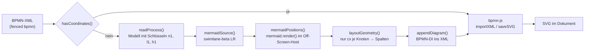

# Mermaid im BPMN-Code

Analyse, wo und wozu der BPMN-Code von dokufix Mermaid verwendet. Im Mittelpunkt stehen die beiden Produktmodule `src/app/bpmn.js` und `src/app/bpmn-layout.js`. Dazu kommen ihre Einbindung (`src/app.js`, `src/index.html`, `src/app/licences.js`), die Tests und Werkzeuge in `tests/` sowie die Artefakte außerhalb des Builds (BPMN-Assistent, Spike).
Stand 7. Oktober 2026, Commit `8266ec4`. Alle Zeilenangaben beziehen sich auf diesen Stand. Die Analyse ändert nichts am Code; die Hinweise am Ende sind Vorschläge. Der Abschnitt *Hinweise im Detail* beruht zusätzlich auf Versuchen im Browser (Chromium, Mermaid 12.0.0) und auf dem Quellcode des npm-Pakets `mermaid@12.0.0`.

## Ergebnis in Kürze

- **Mermaid zeichnet kein BPMN.** Gezeichnet wird BPMN immer von bpmn-js. Mermaid hat im BPMN-Code genau eine Aufgabe: Es ist die **Layout-Engine für BPMN-XML ohne Koordinaten** (ohne `BPMNShape`). Das kam mit Story 2.8.
- **Mermaid liefert nur die Reihenfolge der Spalten.** Seit Story 2.27 liest das Layout aus Mermaids SVG nur noch die x-Koordinate der Knotenmitten. Raster, Zeilen, Routing und Beschriftungen berechnet `layoutGeometry()` selbst (Regeln R1–R17).
- **Mermaid wird nur an einer Stelle aufgerufen:** `mermaid.render()` in `mermaidPositions()` (`src/app/bpmn.js:269`). Alles andere sind Prüfungen, ob Mermaid vorhanden ist, das Erzeugen des Mermaid-Texts, das Auswerten des SVG, die Versionsbindung und die Tests.
- **Der Mermaid-Text nutzt das Beta-Schlüsselwort `swimlane-beta LR`** (`src/app/bpmn-layout.js:406`). Das ist das größte Risiko bei einem Versionswechsel. Deshalb ist die Version an drei Stellen auf `12.0.0` festgelegt, und ein Test prüft, dass sie übereinstimmen.
- **Mermaids Bild landet nie im Dokument.** Mermaid rendert in einen flüchtigen Host außerhalb des sichtbaren Bereichs, der danach in jedem Fall entfernt wird. Die Exporte enthalten keine Spur davon; `tests/durchlaeufe.mjs` prüft das.
- **Ohne Mermaid** werden BPMN-Diagramme mit Koordinaten weiterhin gezeichnet. BPMN ohne Koordinaten wird zur Warnung „Die Bibliothek Mermaid wurde nicht geladen; sie ordnet BPMN ohne Koordinaten an.“
- **Zwei Befunde aus den Versuchen** (Details unter *Hinweise im Detail*):
  - Eine BPMN-Beschriftung mit `%%{wort` gelangt als Mermaid-Direktive in den Layout-Text. Fehlt das schließende `}%%`, scheitert das ganze Layout mit „Parse error“, und das Diagramm wird zur Warnung. Ist die Direktive geschlossen, wird sie angewendet und kann die Spaltenreihenfolge ändern (Hinweis 3).
  - Der BPMN-Assistent bricht ohne Mermaid vollständig ab (`ReferenceError: mermaid is not defined`), auch für XML mit Koordinaten (Hinweise 4 und 5).

## Vorgehen

1. Volltextsuche nach `mermaid` (Groß-/Kleinschreibung egal) über das ganze Repository, ohne `.git`.
2. `src/app/bpmn.js` vollständig gelesen, `src/app/bpmn-layout.js` an allen Fundstellen und dem dazwischen liegenden Datenfluss (`readProcess()` → `mermaidSource()` → `mermaidPositions()` → `layoutGeometry()` → `appendDiagram()`).
3. Einbindung (Konfiguration, CDN-Tag, Lizenzliste, ESLint-Globals), Tests und Werkzeuge an den Fundstellen gelesen, ebenso die zugehörigen Abschnitte von `src/README.md`.
4. Abgegrenzt gegen die Stellen, an denen Mermaid seine eigenen Diagramme zeichnet (fenced ` ```mermaid `). Diese gehören nicht zum BPMN-Code und stehen nur zur Einordnung im Abschnitt *Abgrenzung*.

5. Die Tests mit Mermaid-Bezug ausgeführt: `node --test tests/bpmn.test.mjs tests/bpmn-layout.test.mjs tests/licences.test.mjs tests/bpmn-fixtures.test.mjs`, 268 Tests, alle grün.
6. Für die Hinweise eigene Versuche im Browser gemacht: Chromium aus `/opt/pw-browsers`, `dist/dokufix.html` mit den Bibliotheken aus dem lokalen CDN-Spiegel (`tests/cdn.mjs`), `mermaidPositions()` per esbuild hineingebündelt wie in `tests/capture-bpmn.mjs`. Die Versuchsskripte liegen nicht im Repository; Aufbau und Ergebnisse stehen bei den Hinweisen.

## Datenfluss: BPMN ohne Koordinaten



Nur der Schritt `mermaidPositions()` braucht eine Seite und Mermaid. `readProcess()`, `mermaidSource()`, `layoutGeometry()` und `appendDiagram()` sind reine Logik und laufen in Node (`tests/bpmn-layout.test.mjs`, `tests/bpmn-fixtures.test.mjs`).

## Fundstellen im Produktcode

### `src/app/bpmn.js` (Browser-Teil des Layouts)

| Zeile | Was | Erläuterung |
|---|---|---|
| 2 | `import { …, mermaidSource, … } from './bpmn-layout.js'` | Holt den Generator des Mermaid-Texts. |
| 7–8 | Modulkommentar | „laid out first (src/app/bpmn-layout.js, Mermaid as the layout engine)“. |
| 28, 108–109 | `finishBpmnSvg()` | Kein Aufruf von Mermaid. Das BPMN-SVG bekommt `width="100%"` und `max-width` **wie ein Mermaid-SVG**, damit `drawnWidth()` in `diagrams.js` beide Arten gleich behandelt. |
| 32 | Modulkommentar | Die Bibliotheken der Seite: `BpmnJS`, „and mermaid for the layout“. |
| 39 | `BPMN_NO_MERMAID` | Text der Warnung, wenn Mermaid fehlt: „Die Bibliothek Mermaid wurde nicht geladen; sie ordnet BPMN ohne Koordinaten an.“ |
| 148–159 | `offscreenHost()` | Derselbe flüchtige Host (`data-dokufix-transient`, `aria-hidden`, `position:fixed; left:-10000px`) dient bpmn-js zum Zeichnen und Mermaid zum Layout. |
| 187 | `drawBpmn()` | Weiche: XML mit `BPMNShape` geht direkt an bpmn-js, Mermaid wird **nicht** gefragt. Ohne Koordinaten folgt `layoutBpmn()`. |
| 242–254 | `layoutBpmn()` | Reihenfolge der Prüfungen: XML nicht lesbar oder keine `definitions` → unverändert an bpmn-js, das den Fehler formuliert. **Erst danach** (Z. 247) kommt die Prüfung auf Mermaid: `typeof mermaid === 'undefined' \|\| !mermaid \|\| typeof mermaid.render !== 'function'` wirft `BPMN_NO_MERMAID`. Z. 250 ruft `mermaidPositions()`. |
| 256–263 | Kommentar zu `mermaidPositions()` | Die Render-ID ist bei jedem Layout neu und darf `-flowchart-` nicht enthalten, weil Knoten über dieses Muster gefunden werden. Mermaid 12.0.0 gibt Knoten kein `data-id`. Die Funktion ist für `tests/capture-bpmn.mjs` exportiert. |
| 264–308 | `mermaidPositions(model, doc, index)` | **Der einzige Aufruf von Mermaid im BPMN-Code**, Details unten. |

**`mermaidPositions()` im Einzelnen:**

1. Z. 266: eigener Off-Screen-Host, im `finally` (Z. 305–307) in jedem Fall entfernt.
2. Z. 268: Render-ID `dokufix-bpmn-layout-<index>-<laufende Nummer>` (Zähler `layoutRuns`, Z. 264).
3. Z. 269: `await mermaid.render(id, mermaidSource(model), host)`. Mermaid legt sein temporäres Element in den Host.
4. Z. 270–272: Das SVG wird als `innerHTML` in den Host gesetzt und als `svg` gesucht; ohne SVG: Fehler „Mermaid hat kein SVG geliefert.“
5. Z. 274–281, **Knoten:** `g.node`, gefunden über `id` mit `-flowchart-<key>-`; Mitte aus `transform="translate(x, y)"`, Größe aus `getBBox()`. Das gilt für die Knoten des Modells und die Platzhalter leerer Bahnen (`hold`).
6. Z. 282–289, **Bahnen:** `g.cluster.swimlane[data-id]` mit `rect.swimlane-body` und `rect.swimlane-title`, daraus der umschließende Kasten.
7. Z. 290–303, **Kanten:** `path[data-edge="true"][data-id]`, Präfix `L_<von>_<nach>_`; die Punkte stehen base64-kodiert in `data-points` (`JSON.parse(atob(…))`). Bei zwei Flüssen zwischen demselben Paar nimmt jeder den ersten noch freien Pfad. Flüsse von einem angehefteten Ereignis werden über dessen Host-Knoten zugeordnet (Z. 295).
8. Rückgabe `raw = { nodes, lanes, edges }`.

Diese Funktion hängt eng an der Struktur des SVG, das Mermaid 12.0.0 für `swimlane-beta` schreibt: Klassennamen `g.node`, `g.cluster.swimlane`, `rect.swimlane-body`, `rect.swimlane-title`, die Attribute `data-edge`, `data-id`, `data-points` und das ID-Muster `-flowchart-`.

### `src/app/bpmn-layout.js` (reine Logik)

| Zeile | Was | Erläuterung |
|---|---|---|
| 1–26 | Modulkommentar | Die fünf Schritte. „Mermaid gives the order of the columns, not the picture, and is not the writing format“; „Mermaid's picture never reaches the document.“ |
| 47–51 | `MERMAID_LAYOUT_VERSION = '12.0.0'` | Die Version, mit der Layout und Prüfungen gemacht sind. Muss mit dem Pin in `src/index.html` übereinstimmen (`tests/licences.test.mjs`). |
| 118–123, 148 | Doku des Modells | Synthetische Bahn „gives Mermaid its row“; `hold` ist die Mermaid-ID des Platzhalters einer leeren Bahn; `key` ist „the id Mermaid gets for it (n1…, l1…)“. |
| 311 | `key: 'n' + …` | Knoten bekommen eigene IDs `n1…`, die Autoren-IDs erreichen Mermaid nie. |
| 347 | `key = () => 'l' + …` | Bahnen bekommen `l1…`. |
| 371–373 | `l.hold = 'h' + …` | Eine leere Bahn bekommt einen Platzhalterknoten `h1…`. Ohne ihn zeichnet Mermaid sie als eigenen Streifen. |
| 379–380 | Fluss auf sich selbst | Wird ausgelassen („a flow from a node to itself“), weil Mermaids Swimlane-Layout daran scheitert. |
| 393–410 | `mermaidSource(model)` | **Erzeugt den Mermaid-Text**, Details unten. |
| 800–804 | Doku von `layoutGeometry()` | `raw` ist „what Mermaid's SVG says“. Gelesen wird **nur** `nodes[key].cx`. Knoten mit weniger als einer Einheit Abstand teilen sich eine Spalte; der Platzhalter einer leeren Bahn wird nicht gelesen. |
| 876–893 | `buildGrid()` | Aus den `cx` aller Knoten entstehen sortierte Spalten (`col` = „Mermaid's rank“). Fehlt ein Knoten: Fehler „Mermaid hat das Element „…“ nicht angeordnet.“ |
| 830–832 | Abschnittskommentar Raster | „Mermaid gives the order of the columns and each node's lane“. |
| 1345–1353 | `ruleCompact()` (R7) | Schließt die Spalten, die Reihenfolge von links nach rechts bleibt Mermaids (`byMermaid`). |
| 1909–1912 | `finishGrid()` (R9) | Jede Runde startet wieder bei Mermaids Spalten. |

**`mermaidSource()` im Einzelnen** (Z. 401–410):

- Kopfzeile `swimlane-beta LR`: Diagrammtyp Swimlane, eine **Beta-Syntax** von Mermaid, von links nach rechts.
- Je Bahn ein `subgraph l<n>["Name"] … end` mit ihren Knoten, bei leerer Bahn mit Platzhalter `h<n>[" "]`.
- Knotenformen: Task `n1["…"]`, Gateway `n2{"…"}` (ohne Namen `+`), Ereignisse `n3(("…"))`.
- Danach die Sequenzflüsse `n1 --> n2`, mit Namen `n1 -->|"…"| n2`.
- Beschriftungen verlieren `` " < > & # ` \ ``; leere Beschriftungen werden zu einem Leerzeichen. So kann nichts eine Beschriftung beenden, eine Entität oder einen Markdown-String beginnen.
- Die Bahnen **aller Pools** gehen als eine Liste an Mermaid, **ohne Nachrichtenflüsse**: Die setzen dort keine Spalte, das erledigt R7 (Ben, 2026-10-06).
- Angeheftete Ereignisse (Boundary Events) sind keine Mermaid-Knoten: Ihre Flüsse gehen vom Host aus. Flüsse zurück in den Host fallen weg (Story 2.30).
- Black Boxes (Pools ohne Prozess) und Textanmerkungen sieht Mermaid nie (Stories 2.29, 2.31).

### Einbindung und Konfiguration

| Datei:Zeile | Was | Bezug zum BPMN-Code |
|---|---|---|
| `src/index.html:111–118` | `<script src="https://cdn.jsdelivr.net/npm/mermaid@12.0.0/dist/mermaid.min.js">` | Liefert das globale `mermaid`, das auch das BPMN-Layout nutzt. Der Kommentar verlangt bei einem Versionswechsel `tests/vergleich.mjs`. |
| `src/app.js:24–38` | `mermaid.initialize({ startOnLoad: false, theme: 'default', securityLevel: 'strict', suppressErrorRendering: true, flowchart: { curve: 'basis' } })` | Wird nur aufgerufen, wenn `mermaid` existiert, damit das Skript ohne Mermaid weiterläuft (seit Story 2.8). Das BPMN-Layout setzt **keine eigene Konfiguration**; es rendert mit dieser globalen. |
| `src/app/licences.js:46` | Lizenzeintrag Mermaid 12.0.0, MIT, `use: 'cdn'` | Wird gegen den Pin in `index.html` geprüft. |
| `eslint.config.mjs:48` | `mermaid: 'readonly'` | Globale Variable für `bpmn.js`, `diagrams.js` und `app.js`. |

## Versionsbindung

Die Mermaid-Version steht an diesen Stellen:

| Ort | Wert | Rolle |
|---|---|---|
| `src/index.html:118` | `mermaid@12.0.0` | Was die Seite lädt. |
| `src/app/licences.js:46` | `version: '12.0.0'` | Lizenzhinweis. |
| `src/app/bpmn-layout.js:51` | `MERMAID_LAYOUT_VERSION = '12.0.0'` | Womit das Layout gemacht und geprüft ist. |
| `tests/fixtures/bpmn-layout/index.json:2` | `"mermaid": "12.0.0"` | Mit welcher Version die Rohpositionen der 57 Fixtures erfasst sind. |
| `dist/bpmn-assistant.html` | `mermaid@12.0.0`, `MERMAID_LAYOUT_VERSION = "12.0.0"` | Gebündelte Kopie, außerhalb des Builds. |

Die Wächter:

- `tests/licences.test.mjs:112–121, 159–168`: meldet „src/index.html pins mermaid X, and the layout of BPMN without coordinates is made with 12.0.0 … raise both together, with the regression check of story 2.8“, sobald Pin und `MERMAID_LAYOUT_VERSION` abweichen. Ein Abweichen der Lizenzliste wird ebenfalls gemeldet.
- `tests/bpmn-fixtures.test.mjs:26`: `index.json` muss `MERMAID_LAYOUT_VERSION` nennen, sonst „a new Mermaid: capture the raw positions anew (npm run capture)“.
- `tests/bpmn-layout.test.mjs:180–181`: `MERMAID_LAYOUT_VERSION` ist `12.0.0`.

Ablauf bei einem Versionswechsel laut `src/README.md` (Abschnitt *Libraries*, Z. 192): Pin und `MERMAID_LAYOUT_VERSION` gemeinsam anheben, die Rohpositionen neu erfassen (`npm run capture`) und den Vergleichslauf `tests/vergleich.mjs` auf `tests/referenz.md` fahren (Referenzeingabe „Übergabe an die Tourenplanung“, beide Browser).

## Fehlerfälle

| Situation | Verhalten | Stelle |
|---|---|---|
| Mermaid nicht geladen, BPMN **mit** Koordinaten | Wird gezeichnet, Mermaid wird nicht gefragt. | `bpmn.js:187` |
| Mermaid nicht geladen, BPMN **ohne** Koordinaten | Warnung „Das Diagramm „…“ konnte nicht gezeichnet werden.“ mit Detail `BPMN_NO_MERMAID`. Es entsteht kein Host. | `bpmn.js:247` |
| XML nicht lesbar oder keine `definitions` | Geht unverändert an bpmn-js, das den Grund nennt; die Prüfung auf Mermaid kommt danach. | `bpmn.js:244–246` |
| Layout lehnt ab (nichts anzuordnen, Knoten ohne Bahn) | Ablehnung **vor** dem Aufruf von Mermaid, der Grund wird zur Warnung. | `bpmn.js:248`, `readProcess()` |
| `mermaid.render()` wirft (z. B. Parse-Fehler) | Der Fehler ist der Grund der Warnung, der Host wird entfernt. | `bpmn.js:305–307` |
| Mermaid liefert kein SVG | „Mermaid hat kein SVG geliefert.“ | `bpmn.js:272` |
| Mermaid ordnet einen Knoten nicht an | „Mermaid hat das Element „…“ nicht angeordnet.“ | `bpmn-layout.js:885` |
| Fluss von einem Knoten auf sich selbst | Ausgelassen, Konsolenzeile „BPMN layout, left out: …“. | `bpmn-layout.js:379–380`, `bpmn.js:252` |

## Tests und Werkzeuge

| Datei | Mermaid-Bezug |
|---|---|
| `tests/bpmn.test.mjs` | Ersetzt das globale `mermaid` durch einen Stand-in (`mermaidStandIn()`, ab Z. 217), der ein SVG in der Form von Mermaid 12.0.0 liefert. Geprüft wird: Layout im flüchtigen Host, beide Hosts danach weg (Z. 242–265); XML mit Koordinaten fragt Mermaid nicht (Z. 320); ohne Mermaid die Ablehnung `BPMN_NO_MERMAID` ohne Host (Z. 357–361); Ablehnung des Layouts vor Mermaid, Fehler von Mermaid als Grund (Z. 366–380); Warnung im Dokument (Z. 421–444). |
| `tests/bpmn-layout.test.mjs` | Läuft ohne Browser und ohne Mermaid. Prüft den Mermaid-Text (Z. 128, 137–177: Subgraphs, eigene IDs, Bereinigung der Beschriftungen), die Version (Z. 180), dass `layoutGeometry()` Bahnen und Kanten aus `raw` nicht liest (Z. 366–370), Rohpositionen „in the shape Mermaid gives“ (Z. 467–490), keinen Fluss auf sich selbst (Z. 495–499), keine Nachrichtenflüsse und keine Black Box im Text (Z. 785–840), Flüsse von angehefteten Ereignissen (Z. 1123) und keine Textanmerkungen (Z. 1279–1287). |
| `tests/bpmn-fixtures.mjs`, `tests/bpmn-fixtures.test.mjs` | Je Fixture `<n>.raw.json` mit den Rohpositionen von Mermaid. Der Test legt sie in Node neu an und prüft die Mermaid-Version in `index.json`. |
| `tests/capture-bpmn.mjs` (`npm run capture`) | Bündelt `mermaidPositions()` und `labelMeasurer()` aus `src/app/bpmn.js` per esbuild in `dist/dokufix.html` und erfasst die Rohpositionen in Chromium. Meldet Knoten oder Kanten, die Mermaid nicht angeordnet hat (Z. 113–116). |
| `tests/licences.test.mjs` | Versionswächter, siehe oben. |
| `tests/durchlaeufe.mjs` | Browserläufe. Szenario 13 „Mermaid cannot be loaded“ (Z. 89–93, Dokument `DOC_NO_MERMAID` ab Z. 307). `LAYOUT_TRACES` (Z. 306) prüft, dass keine Datei Spuren von Mermaids Layout trägt: keine URL, kein `swimlane`, kein `-flowchart-`, keine Render-ID `dokufix-bpmn-layout` (Z. 1056). |
| `tests/vergleich.mjs` | Regressionslauf bei einem Wechsel der Mermaid-Version. Er setzt voraus, dass die Seite Mermaid hat (Z. 546–547). |
| `tests/cdn.mjs` | Lokaler Spiegel der CDN-Dateien, darunter `mermaid@12.0.0`, für die Browserläufe. |

## Außerhalb des Produkt-Builds

- **BPMN-Assistent** (`dist/bpmn-assistant.html`): Kein Teil des Builds. Er wird im Store von `spike-2-26/testtool/bauen.mjs` aus `src/app/bpmn.js`, `src/app/bpmn-layout.js` und weiteren Modulen gebündelt (`src/README.md:76`). Er lädt Mermaid 12.0.0 vom CDN, ruft `mermaid.initialize()` mit derselben Konfiguration wie die App und nutzt `mermaidPositions()` und `mermaidSource()` unverändert (als `window.T`). Nach einer Änderung am Layout muss er neu gebaut werden.
- **Spike `spikes/komponenten-aus-markdown/src/bpmn.js`**: Der historische Vorläufer. Dort war Mermaid auch **Schreibformat**: `fromMermaid()` und `parseMermaid()` lesen Mermaid-Swimlane-Text über `mermaid.mermaidAPI.getDiagramFromText()` (Z. 36–38). `layoutFromMermaid()` (Z. 286–290) übernahm Mermaids Koordinaten und stauchte und korrigierte sie (Z. 103–171). Das Produkt hat das nicht übernommen: Mermaid ist kein Schreibformat mehr, und seit Story 2.27 ersetzt das Raster das Skalieren und die Korrekturen. Die Tests unter `spikes/komponenten-aus-markdown/tests/mermaid-*.mjs` und ihre Ausgaben in `tests/out/` gehören zu diesem Spike.

## Abgrenzung: Mermaid ohne BPMN-Bezug

Diese Stellen nutzen Mermaid für eigene Diagramme (fenced ` ```mermaid `) und gehören nicht zum BPMN-Code. Sie stehen hier nur, damit sie nicht verwechselt werden:

- `src/app/diagrams.js:179–196` `renderMermaid()` mit `mermaid.run()` (nicht `render()`), Warnung `MERMAID_NO_LIBRARY`, Aufräumen von `dmermaid-*`/`imermaid-*`; Z. 214–218 Art `mermaid` mit Download `.mmd`; Z. 274–279 Entfernen von `.mermaidTooltip`.
- `src/app/diagram-kinds.js:23` Bezeichnung „Mermaid-Diagramm“; `src/app/search.js`, `src/app/search-places.js`, `src/search.css:99–102` Suchtreffer der Art Mermaid.
- `src/app/live-viewer.js:14`: Ein Mermaid-Diagramm behält überall die statische Großansicht; nur BPMN bekommt den Live-Viewer.
- Gemeinsam mit BPMN ist nur die SVG-Konvention: `finishBpmnSvg()` schreibt Breite und `max-width` wie Mermaid, damit `drawnWidth()` (`diagrams.js:166–178`) beide gleich liest.

## Hinweise im Detail

Die fünf Hinweise jeweils mit Befund, Belegen, Auswirkung und Vorschlag. Die Schwere ist eine Einschätzung: **niedrig** heißt, dass im heutigen Betrieb mit Mermaid 12.0.0 nichts sichtbar falsch läuft, **mittel**, dass ein Autor oder Sprachmodell es mit gewöhnlichem Inhalt auslösen kann.

### Versuchsaufbau

Alle Messungen stammen aus einem Lauf in diesem Container:

- Seite `dist/dokufix.html` (Commit `8266ec4`) in Chromium (`/opt/pw-browsers/chromium`, headless). Die Bibliotheken kamen aus dem lokalen CDN-Spiegel von `tests/cdn.mjs`, also Mermaid 12.0.0 und bpmn-js 18.31.0 in genau den festgelegten Versionen.
- `mermaidPositions()` aus `src/app/bpmn.js` wurde mit `captureBundle()` aus `tests/capture-bpmn.mjs` in die Seite gebündelt. Das ist derselbe Weg, auf dem die Fixtures entstehen.
- Eingaben sind die 57 Fixtures in `tests/fixtures/bpmn-layout/`. Das Modell wurde mit `readModel()` aus `tests/bpmn-fixtures.mjs` gelesen und das Ergebnis mit `layOut(…, 'estimated')` gebildet. Verglichen wurde Byte für Byte mit `<n>.estimated.bpmn`.
- Konfigurationsvarianten wurden mit `mermaid.initialize()` gesetzt: die Konfiguration aus `src/app.js` plus jeweils genau eine Änderung.
- Für Mermaids Verhalten wurde der Quellcode des npm-Pakets `mermaid@12.0.0` gelesen (`dist/chunks/mermaid.core/`). Die Dateinamen unten sind die Quellpfade, die das Paket in seinen Kommentaren nennt.

**Referenzlauf** mit unveränderter Konfiguration:

| Vergleich mit den gespeicherten Fixtures | Gleich |
|---|---|
| `raw.json` vollständig gleich | 5 von 57 |
| `cx` aller Knoten gleich | 5 von 57 |
| Spaltenzuordnung (Rang von `cx`) gleich | 57 von 57 |
| Angeordnetes XML (`.estimated.bpmn`) gleich | **57 von 57** |

Die Zahlenwerte weichen ab, weil die Schriften in diesem Container andere Knotenbreiten ergeben als auf dem Rechner, auf dem die Fixtures erfasst wurden. Die Reihenfolge der Spalten bleibt gleich, und nur sie liest das Layout. Das Ergebnis ist deshalb identisch. Damit ist der Aufbau als Messinstrument bestätigt.

### Hinweis 1: Abhängigkeit von einer Beta-Syntax und vom SVG-Aufbau

**Schwere:** niedrig im Betrieb, hoch für den Aufwand eines Mermaid-Updates.

**Befund.** Das BPMN-Layout hängt an drei Dingen von Mermaid, die kein zugesichertes API sind:

1. **Die Eingabesyntax.** `mermaidSource()` schreibt `swimlane-beta LR`, `subgraph l1["…"] … end`, die Formen `[…]`, `{…}` und `((…))`, Kanten `-->` und Beschriftungen `|"…"|`. In Mermaid 12.0.0 ist `swimlane-beta` ein Schlüsselwort der Flowchart-Grammatik. Das Diagramm ist ein Flowchart mit eigenem Layout (`src/diagrams/swimlanes/swimlanesDiagram.ts`: `createFlowDiagram(…)`, Layout in `src/rendering-util/layout-algorithms/swimlanes/`). Das Suffix `-beta` kündigt an, dass sich Syntax und Verhalten ändern dürfen.
2. **Der Aufbau des SVG.** `mermaidPositions()` (`src/app/bpmn.js:265–308`) liest:

   | Gelesen | Selektor bzw. Muster | Vom Layout genutzt |
   |---|---|---|
   | Knoten | `g.node`, dessen `id` `-flowchart-<key>-` enthält (`<render-id>-flowchart-n1-0`) | ja |
   | Knotenmitte | `transform="translate(x, y)"` am `g.node` | nur `x` |
   | Knotengröße | `getBBox()` am `g.node` | nein |
   | Bahnen | `g.cluster.swimlane[data-id]` mit `rect.swimlane-body`, `rect.swimlane-title` | nein |
   | Kanten | `path[data-edge="true"][data-id]`, Präfix `L_<von>_<nach>_` | nein |
   | Kantenpunkte | `data-points`, Base64-kodiertes JSON | nein |

3. **Der Layout-Algorithmus selbst.** Die Spaltenreihenfolge ergibt sich aus Mermaids Sugiyama-Layout (`runSwimlaneLayoutCore()` in `layoutCore.ts`) mit seinen Voreinstellungen. Ändert Mermaid dort etwas, ändert sich die Reihenfolge, ohne dass ein Fehler auftritt.

**Wie sich eine Änderung zeigen würde:**

| Änderung in einer neuen Mermaid-Version | Folge in dokufix | Bemerkt durch |
|---|---|---|
| `swimlane-beta` umbenannt oder entfernt | `mermaid.render()` wirft einen Parse-Fehler, jedes BPMN ohne Koordinaten wird zur Warnung | sofort sichtbar, `tests/vergleich.mjs`, `tests/durchlaeufe.mjs` |
| ID-Muster `-flowchart-` oder `translate(…)` geändert | Knoten werden nicht gefunden, `buildGrid()` wirft „Mermaid hat das Element „…“ nicht angeordnet.“ (`bpmn-layout.js:885`) | sofort sichtbar |
| Klassen der Bahnen oder Attribute der Kanten geändert | Im Seitenlauf **keine** Folge, die Werte werden nicht gelesen | erst beim Neuerfassen: `capture-bpmn.mjs` meldet fehlende Kanten (Z. 113–116) |
| Andere Reihenfolge der Knoten im Sugiyama-Layout | Andere Spalten, also ein anderes Bild, **ohne Fehler** | nur durch Neuerfassen plus Vergleich mit den Fixtures oder durch `tests/vergleich.mjs` |

Die letzte Zeile ist die eigentliche Gefahr: Sie fällt nur auf, wenn jemand bewusst neu erfasst und vergleicht. `tests/bpmn-fixtures.test.mjs` läuft in Node mit den **gespeicherten** Rohpositionen und kann eine neue Mermaid-Version gar nicht bemerken. Er prüft nur, dass `index.json` die Version aus `MERMAID_LAYOUT_VERSION` nennt.

**Was schon schützt.** Der Versionswächter in `tests/licences.test.mjs` verhindert, dass der Pin in `src/index.html` allein angehoben wird. `src/README.md` (Abschnitt *Libraries*, Z. 192) beschreibt den Ablauf.

**Vorschlag.** Eine Checkliste für das Mermaid-Update an einer Stelle, etwa in `src/README.md` oder als Kommentar bei `MERMAID_LAYOUT_VERSION`:

1. Pin in `src/index.html`, Eintrag in `src/app/licences.js` und `MERMAID_LAYOUT_VERSION` gemeinsam anheben.
2. `npm run build`, dann `npm run capture -- tests/fixtures/bpmn-layout/*.bpmn` und `"mermaid"` in `index.json` anpassen.
3. `npm run fixtures` zeigt jedes Fixture, dessen Layout sich durch die neue Spaltenreihenfolge ändert. Jede Änderung ansehen und erst dann mit `--write` übernehmen.
4. `tests/vergleich.mjs` auf `tests/referenz.md` in beiden Browsern.
5. Den BPMN-Assistenten neu bauen (Hinweis 5).

Hilfreich wäre außerdem ein Hinweis bei Schritt 2, dass sich `raw.json` auch ohne Versionswechsel auf jedem Rechner ändert (Hinweis 2). Ein großer Diff in diesen Dateien ist deshalb noch kein Befund; maßgeblich ist Schritt 3.

### Hinweis 2: Erfasst wird mehr, als das Layout liest

**Schwere:** niedrig.

**Befund.** `mermaidPositions()` liefert `raw = { nodes: { key: { cx, cy, w, h } }, lanes: { key: { x1, y1, x2, y2 } }, edges: [[{ x, y }, …] | null] }`. Davon nutzen:

| Feld | Nutzer |
|---|---|
| `nodes[key].cx` | `buildGrid()` (`bpmn-layout.js:879–893`): Knoten mit weniger als einer Einheit Abstand teilen sich eine Spalte |
| `nodes[key]` (Existenz) | `buildGrid()` wirft, wenn ein Knoten fehlt; `capture-bpmn.mjs` meldet ihn |
| `nodes[key].cy`, `w`, `h` | niemand; nur in `<n>.raw.json` gespeichert |
| `lanes` | niemand; nur gespeichert |
| `edges` | nur `capture-bpmn.mjs` (Z. 115): Prüfung, dass jeder Fluss eine Kante hat |

Der Test `the geometry refuses positions that lack a node; Mermaid's lanes and flows it does not read` (`tests/bpmn-layout.test.mjs:366–370`) hält fest, dass `layoutGeometry(model, { nodes })` dasselbe ergibt wie mit allen drei Teilen.

**Gemessen** (57 Fixtures, ein Durchlauf, Zeiten im headless Chromium dieses Containers, nur als Größenordnung):

| Schritt | Zeit gesamt | Anteil |
|---|---|---|
| `mermaid.render()` | 18 642 ms (etwa 327 ms je Diagramm) | etwa 98 % |
| Knoten: `transform` lesen und `getBBox()` | 276 ms | etwa 1,5 % |
| Bahnen (`getBBox()`) und Kanten (`atob`, `JSON.parse`) | 4 ms | unter 0,1 % |

Die zusätzliche Arbeit kostet also kaum Zeit. Fast die ganze Laufzeit steckt in Mermaid selbst.

**Die eigentliche Folge** ist eine andere: Weil `raw.json` auch `cy`, `w`, `h`, Bahnen und Kantenpunkte speichert, hängen die Fixture-Dateien von den Schriften des Rechners ab. Im Referenzlauf oben waren 52 von 57 `raw.json` anders als die gespeicherten, obwohl alle 57 Layouts gleich blieben. Wer auf einem anderen Rechner neu erfasst, bekommt einen großen Diff ohne inhaltliche Änderung.

**Vorschläge**, nach Aufwand geordnet:

1. **So lassen (empfohlen).** Die Laufzeitkosten sind vernachlässigbar, und die vollständigen Daten helfen bei der Fehlersuche, wenn Mermaid sich ändert (Hinweis 1). Den Zusammenhang in `tests/bpmn-fixtures.mjs` oder `src/README.md` notieren: „raw.json ändert sich mit den Schriften; maßgeblich ist, ob `npm run fixtures` Unterschiede meldet.“
2. **Fixtures schlanker speichern.** `capture-bpmn.mjs` schreibt nur `cx` je Knoten, und die Kantenprüfung bleibt im Werkzeug. Das macht die Diffs klein und ehrlich. Kosten: Die Rohdaten für eine spätere Analyse fehlen, und alle 57 `raw.json` ändern sich einmal.
3. **Seitenlauf verschlanken.** `mermaidPositions()` liest im Seitenlauf nur `cx` und überspringt `getBBox()`, Bahnen und Kanten (etwa über einen Parameter für das Werkzeug). Das spart rund 1,5 % der Layoutzeit. Der Gewinn rechtfertigt den zusätzlichen Pfad nicht.

### Hinweis 3: Geteilte globale Konfiguration und Direktiven in Beschriftungen

**Schwere:** niedrig für die Konfiguration, **mittel** für die Direktiven.

#### 3a. Die globale Konfiguration wirkt auf das Layout

**Befund.** `mermaidPositions()` ruft `mermaid.render()` ohne eigene Konfiguration auf. Es gilt die, die `src/app.js:27–38` für alle Mermaid-Diagramme setzt. Laut Mermaids Quellcode liest das Swimlane-Layout diese Schlüssel (`layoutCore.ts`, `runSwimlaneLayoutCore()`; `adjustLayout.ts`):

| Schlüssel | Voreinstellung in 12.0.0 | Wirkung |
|---|---|---|
| `flowchart.nodeSpacing` | 40 | Abstand der Knoten |
| `flowchart.rankSpacing` | 100 | Abstand der Ränge |
| `swimlane.ignoreCrossLaneEdges` | `true` | ob Kanten zwischen Bahnen in die Reihenfolge eingehen |
| `swimlane.optimizeRanksByCrossings` | `true` | Rangoptimierung nach Kreuzungen |
| `swimlane.automaticLaneOrdering` | `false` | automatische Reihenfolge der Bahnen |
| `swimlane.lineHops` | an | Sprungbögen an Kreuzungen, nur Darstellung |
| `flowchart.curve` | — | Für Swimlanes wird `basis` zu `rounded` umgesetzt; der Wert `basis` aus `src/app.js` ist hier also wirkungslos |

Dazu kommen Schrift und Thema, die die Knotengrößen bestimmen.

**Gemessen:** 57 Fixtures, die App-Konfiguration plus jeweils eine Änderung:

| Variante | Spalten gleich | Layout gleich |
|---|---|---|
| Referenz (`src/app.js`) | 57 / 57 | 57 / 57 |
| `flowchart.curve: 'linear'` | 57 / 57 | 57 / 57 |
| `theme: 'dark'` | 57 / 57 | 57 / 57 |
| `securityLevel: 'loose'` | 57 / 57 | 57 / 57 |
| `fontSize: 20` | 57 / 57 (alle `cx` anders) | 57 / 57 |
| `flowchart.nodeSpacing: 20` | 57 / 57 | 57 / 57 |
| `flowchart.rankSpacing: 40` | 57 / 57 | 57 / 57 |
| `swimlane.optimizeRanksByCrossings: false` | 57 / 57 | 57 / 57 |
| `swimlane.automaticLaneOrdering: true` | 57 / 57 | 57 / 57 |
| `swimlane.lineHops: false` | 57 / 57 | 57 / 57 |
| **`swimlane.ignoreCrossLaneEdges: false`** | **23 / 57** | **53 / 57** (anders: `r19`, `r20`, `pools-bestellung`, `angeheftet-antrag`) |

Das Layout ist also robust gegen fast alle Einstellungen. Eine einzige Option ändert die Spalten von 34 Fixtures und das fertige Bild von vier. Bei den übrigen 30 gleicht das eigene Raster die andere Reihenfolge aus. Die Seite setzt heute keinen `swimlane`-Schlüssel. Das Risiko entsteht erst, wenn jemand die Konfiguration für Mermaid-Diagramme um `swimlane: { … }` erweitert, etwa für Swimlane-Diagramme der Autoren.

Hinzu kommt eine Lücke in den Tests: Weil `tests/bpmn-fixtures.test.mjs` mit gespeicherten Rohpositionen arbeitet, bemerkt kein Node-Test eine Änderung an `mermaid.initialize()`. Nur die Browserläufe bemerken sie.

**Vorschlag.** Im Kommentar von `src/app.js:24–38` ein Satz: „Mermaid lays out BPMN without coordinates with this configuration too (src/app/bpmn.js); a key of `swimlane` or `flowchart` changes that layout: run tests/vergleich.mjs.“ Alternativ, robuster: `mermaidPositions()` gibt die für das Layout maßgeblichen Schlüssel ausdrücklich im Mermaid-Text mit. Dafür setzt es eine Frontmatter-Konfiguration vor `swimlane-beta LR` (`---\nconfig:\n  swimlane:\n    ignoreCrossLaneEdges: true\n---`). Dann ist das BPMN-Layout von der Seitenkonfiguration entkoppelt. Das müsste vor einer Umsetzung im Browser geprüft werden.

#### 3b. Direktiven gelangen über Beschriftungen in den Layout-Text

**Befund.** `mermaidSource()` entfernt aus Beschriftungen `` " < > & # ` \ `` (`bpmn-layout.js:402`), aber nicht `%`. Mermaid sucht Direktiven der Form `%%{typ: …}%%` **im ganzen Text**, nicht nur am Anfang (`src/diagram-api/regexes.ts`: `directiveRegex`; `src/utils.ts`: `detectDirective()`, das vorher jedes `'` durch `"` ersetzt; `src/preprocess.ts`: `preprocessDiagram()`). Eine BPMN-Beschriftung landet unverändert in `n1["…"]` und damit in dieser Suche. Den Ausdruck `%%{` muss niemand absichtlich schreiben: Er kommt in Vorlagen- und Platzhaltersyntax vor, und ein Sprachmodell kann ihn in eine Beschriftung übernehmen.

**Gemessen** (Beschriftung der ersten Aufgabe von Fixture `r01` ersetzt, `mermaidPositions()` im Browser):

| Beschriftung | Ergebnis |
|---|---|
| `Rabatt 5 %%` | angeordnet |
| `Platzhalter %{x}` | angeordnet |
| `Vorlage %%{` (kein Wort nach `{`) | angeordnet |
| `Wert %%{betrag}%%` | angeordnet, die Direktive wird aus dem Text entfernt |
| **`Wert %%{betrag}`** | **Parse error**, das Diagramm wird zur Warnung |
| **`%%{wrap}%%`** | **Parse error**: Die Beschriftung wird leer, `n2[""]` ist ungültig |
| **`%%{init: {"theme": "dark"}}%%`** | **Parse error**: `q()` entfernt die `"`, `JSON.parse` scheitert, die Beschriftung wird leer |

Der Mechanismus bei `%%{wort` ohne Abschluss: Das schließende `}%%` ist im regulären Ausdruck optional, und der Rumpf `((?:(?!}%{2}).|\r?\n)*)` frisst alles bis zum Textende. `removeDirectives()` löscht damit den ganzen Rest des Layout-Texts, also alle folgenden Knoten, Bahnen und Flüsse.

**Eine geschlossene Init-Direktive wird angewendet.** Mit einfachen Anführungszeichen übersteht sie `q()`, weil Mermaid `'` selbst in `"` umsetzt:

| Fixture | Beschriftung um `%%{init: {'swimlane': {'ignoreCrossLaneEdges': false}}}%%` ergänzt |
|---|---|
| `r19`, `r20`, `pools-bestellung`, `angeheftet-antrag` | in allen vier ein anderes Layout als ohne Direktive |
| `r01` mit `'flowchart': {'rankSpacing': 300}` | alle `cx` etwa verdreifacht, Spalten gleich |

Die Direktive gilt nur für diesen einen Aufruf. Der nächste Aufruf von `mermaidPositions()` lieferte wieder die Werte ohne Direktive. Sicherheitsrelevante Schlüssel wie `securityLevel`, `startOnLoad`, `maxTextSize`, `suppressErrorRendering` und `maxEdges` lässt Mermaid aus Direktiven nicht zu (Liste `secure` in der Voreinstellung, `src/utils/sanitizeDirective.ts`). Mermaids Bild wird verworfen. Ein Sicherheitsproblem ist das nicht. Die Folge ist ein falsches oder fehlendes Layout.

**Vorschlag.** In `mermaidSource()` `%` in die Liste der entfernten Zeichen aufnehmen (`` /["<>&#`\\%]/g ``) oder zumindest `%%` zu `% %` aufbrechen. Dazu ein Test in `tests/bpmn-layout.test.mjs` nach dem Muster von `the Mermaid text: a label loses what would end it …` (Z. 165). Folgen für die Fixtures: Ihr Layout bleibt gleich, weil `bpmn-fixtures.test.mjs` mit gespeicherten Rohpositionen arbeitet. Nur `ref8` enthält ein `%` („5 % zahlen“), und das würde sich erst beim nächsten Neuerfassen in `raw.json` zeigen. Mermaids Bild wird nie gezeigt, die Beschriftung im gezeichneten BPMN bleibt die des Autors.

### Hinweis 4: Vier verschiedene Prüfungen auf Mermaid

**Schwere:** niedrig.

**Befund.** Ob Mermaid vorhanden ist, wird an vier Stellen geprüft, und jede prüft etwas anderes:

| Stelle | Prüfung | Bei Fehlen |
|---|---|---|
| `src/app.js:27` | `typeof mermaid !== 'undefined'` | `initialize()` wird übersprungen, das Skript läuft weiter |
| `src/app/diagrams.js:188` | `typeof mermaid === 'undefined' \|\| !mermaid \|\| typeof mermaid.run !== 'function'` | Mermaid-Diagramm wird zur Warnung, Detail `MERMAID_NO_LIBRARY` |
| `src/app/bpmn.js:247` | `typeof mermaid === 'undefined' \|\| !mermaid \|\| typeof mermaid.render !== 'function'` | BPMN ohne Koordinaten wird zur Warnung, Detail `BPMN_NO_MERMAID` |
| `dist/bpmn-assistant.html:3379` | keine | `ReferenceError`, siehe unten |

Jede Prüfung passt zu dem Aufruf, den sie schützt. Im Produkt ist das Verhalten deshalb korrekt. Getestet ist aber nur der Fall „`mermaid` fehlt ganz“: `tests/diagrams.test.mjs:195–206`, `tests/bpmn.test.mjs:357–361` und Szenario 13 in `tests/durchlaeufe.mjs`.

**Wo die Prüfungen auseinanderlaufen** (aus dem Code abgeleitet, nicht gemessen):

- **Ein globales `mermaid`, das nicht Mermaid ist**, zum Beispiel ein anderes Skript, das den Namen belegt. `app.js` ruft dann `mermaid.initialize()` auf, das wirft beim Laden einen `TypeError`. Das ganze App-Skript bricht ab, so wie vor Story 2.8 bei fehlendem Mermaid. `diagrams.js` und `bpmn.js` würden den Fall dagegen sauber als Warnung behandeln.
- **Eine künftige Mermaid-Version, in der `run` oder `render` wegfällt oder anders heißt.** Dann zeigt die Seite für die eine Diagrammart eine Warnung „nicht geladen“, obwohl Mermaid geladen ist, und die andere Art funktioniert. Wegen des Versionspins kann das nur bei einem bewussten Update auftreten (Hinweis 1).
- **Reihenfolge in `layoutBpmn()`:** Die Prüfung auf Mermaid kommt nach „XML nicht lesbar“ und „keine `definitions`“, aber vor `readProcess()`. Ohne Mermaid bekommt XML, das das Layout ohnehin ablehnen würde (etwa „Das BPMN-XML enthält kein Element, das sich anordnen lässt.“), die Meldung `BPMN_NO_MERMAID`. Das ist gewollt: Die Reihenfolge der Gründe ist in `src/README.md:371` so beschrieben.

**Gemessen** (BPMN-Assistent, Anfrage an `npm/mermaid@` im Browser abgebrochen):

| | Mermaid geladen | Mermaid blockiert |
|---|---|---|
| Fehler auf der Seite | keine | `ReferenceError: mermaid is not defined` |
| Schaltflächen auf der Seite | 125 | 10 |
| SVGs auf der Seite | 13 | 7 |

Ohne Mermaid bricht das Skript der Oberfläche (`dist/bpmn-assistant.html:3378–4120`) bei seiner ersten Anweisung ab. Damit fehlen auch die Beispiele und das Zeichnen von XML **mit** Koordinaten, für das Mermaid gar nicht nötig wäre.

**Vorschlag.**

1. Eine gemeinsame Prüfung, etwa `mermaidApi(name)` in einem kleinen Modul: Sie liefert die Funktion `mermaid[name]` oder `null`. `diagrams.js`, `bpmn.js` und `app.js` nutzen sie (`app.js` mit `'initialize'`). Dann sind alle drei Stellen gleich robust, und ein Test kann den Fall „`mermaid` ohne die Funktion“ für alle abdecken.
2. Mindestens `src/app.js:27` auf `typeof mermaid !== 'undefined' && mermaid && typeof mermaid.initialize === 'function'` erweitern. Das ist eine Zeile.
3. Im BPMN-Assistenten den Aufruf von `mermaid.initialize()` ebenso absichern (Hinweis 5).

### Hinweis 5: Kopie im BPMN-Assistenten

**Schwere:** niedrig. Der Assistent ist ein Werkzeug, kein Teil des Produkts.

**Befund.** `dist/bpmn-assistant.html` wird außerhalb dieses Repositorys gebaut, von `spike-2-26/testtool/bauen.mjs` im Store (`src/README.md:76`). Die Datei enthält gebündelte Kopien von `src/app/bpmn.js`, `src/app/bpmn-layout.js`, `src/app/diagram-downloads.js` und `tests/bpmn-rules.mjs`. Dazu kommen ein eigener CDN-Tag `mermaid@12.0.0` (Z. 8) und ein eigener Aufruf von `mermaid.initialize()` mit derselben Konfiguration wie `src/app.js` (Z. 3379).

**Gemessen: Ist die Kopie aktuell?** `src/app/bpmn.js` und `src/app/bpmn-layout.js` wurden mit esbuild gebündelt, und jede Funktion wurde mit der gleichnamigen im Assistenten verglichen, Leerraum normalisiert:

| Ergebnis | Funktionen |
|---|---|
| wörtlich gleich, darunter `mermaidSource`, `mermaidPositions`, `readProcess`, `layoutGeometry`, `buildGrid`, `labelMeasurer` | 58 von 75 |
| nur durch Umbenennungen von esbuild verschieden (`j` → `j4`, `P` → `P4`, `{ j }` → `{ j: j }`) | 11 von 75 |
| im Assistenten nicht enthalten: `renderBpmn`, `drawBpmn`, `layoutBpmn`, `finishBpmnSvg`, `hasCoordinates`, `bpmnWarningText`; der Assistent zeichnet selbst | 6 von 75 |
| `MERMAID_LAYOUT_VERSION` | `"12.0.0"` in beiden |

Die Kopie entspricht also dem Stand von `8266ec4`. Der Assistent wurde in `22a2616` und `8266ec4` nach der letzten Änderung am Layout (`9dfa55d`) neu gebaut.

**Was nicht geschützt ist:**

- Kein Test in `tests/` liest `dist/bpmn-assistant.html`. Der Versionswächter in `tests/licences.test.mjs` prüft nur `src/index.html` und `src/app/licences.js`. Ein Mermaid-Update, das den Assistenten vergisst, fällt nicht auf. Der Assistent würde dann eine andere Mermaid-Version laden als die, mit der sein gebündeltes Layout gemacht ist.
- Eine Änderung an `mermaidSource()` oder `mermaidPositions()` ohne Neubau führt dazu, dass der Assistent anders anordnet als dokufix. Gerade das soll er aber zeigen.
- Ohne Mermaid bricht der Assistent vollständig ab (Hinweis 4).

**Vorschläge**, nach Aufwand geordnet:

1. **Versionsprüfung des Assistenten (wenig Aufwand).** Ein Test in `tests/licences.test.mjs` oder `tests/build.test.mjs` prüft: `dist/bpmn-assistant.html` lädt `mermaid@<MERMAID_LAYOUT_VERSION>` und enthält `MERMAID_LAYOUT_VERSION = "<dieselbe Version>"`.
2. **Aktualitätsprüfung (mittlerer Aufwand).** Ein Test bündelt `src/app/bpmn.js` und `src/app/bpmn-layout.js` mit esbuild und vergleicht die Funktionen mit denen im Assistenten, wie im Versuch oben (Umbenennungen von esbuild herausgerechnet). Er schlägt fehl, wenn das Layout geändert und der Assistent nicht neu gebaut wurde.
3. **Bauskript ins Repository (größerer Aufwand).** `bauen.mjs` liegt heute im Store. Läge es im Repository, könnte `npm run build` den Assistenten mitbauen, und die Prüfungen 1 und 2 würden überflüssig. Dagegen spricht `bpmn-auto-layout`, das der Assistent aus `spike-2-26/node_modules` bündelt und das bewusst keine Abhängigkeit des Produkts ist (`src/README.md:76`).
4. **Absicherung gegen fehlendes Mermaid im Assistenten.** Den Aufruf von `mermaid.initialize()` wie in `src/app.js` nur ausführen, wenn Mermaid da ist, und vor `T.mermaidPositions()` eine verständliche Meldung geben. Das muss im Bauskript im Store geschehen, nicht in `dist/`.
