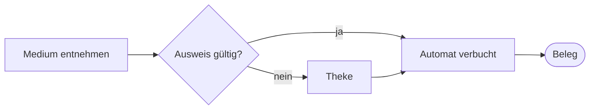
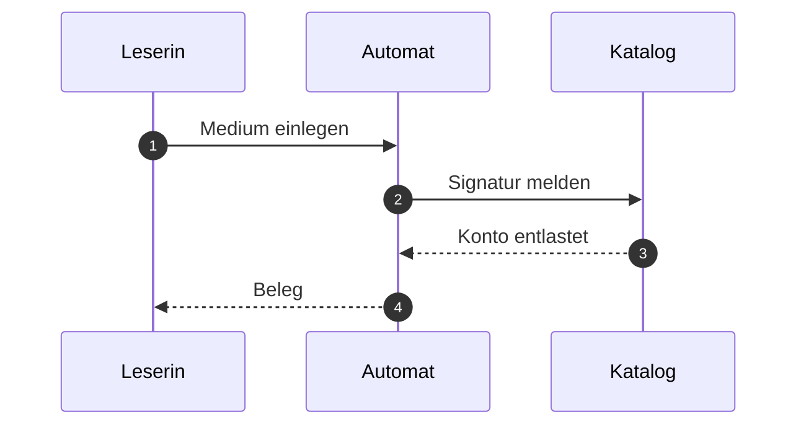

# Referenzdokument Stadtbibliothek

Dieses Dokument ist erfunden. Es dient nur dazu, alle vier Auslieferungen von dokufix mit **demselben Inhalt** zu bauen und Bild für Bild zu vergleichen. Die Ausleihe einer fiktiven Stadtbibliothek liefert den Stoff[^quelle]; fachlich stimmt daran nichts.

Es enthält jedes Element, für das dokufix eine Formatierung mitbringt: *kursiv*, **fett**, ~~durchgestrichen~~, `Inline-Code`, einen [Verweis](https://example.org/bibliothek) und eine Fußnote mit längerem Text[^lang].

[[toc]]

## Ausleihe

Wer ein Medium ausleiht, zeigt den Ausweis vor und nennt die Signatur. Die Frist beträgt vier Wochen[^quelle] und lässt sich zweimal verlängern.

### Voraussetzungen

- gültiger Bibliotheksausweis
- kein offenes Entgelt über 10 Euro
- höchstens 20 Medien gleichzeitig
  - davon höchstens 5 Spiele
  - davon höchstens 2 Geräte

### Ablauf

1. Medium am Regal entnehmen
2. Ausweis am Automaten scannen
3. Medium auf die Ablage legen
4. Beleg mitnehmen



#### Sonderfall Fernleihe

Medien aus anderen Häusern kommen über die Fernleihe. Die Frist setzt das gebende Haus[^quelle], nicht die Stadtbibliothek.

## Fristen und Entgelte

| Medium | Frist | Verlängerung | Entgelt je Woche Verzug |
|---|---|---|---|
| Buch | 28 Tage | zweimal | 1,00 € |
| Zeitschrift | 14 Tage | einmal | 0,50 € |
| Spiel | 14 Tage | keine | 2,00 € |
| Gerät | 7 Tage | keine | 5,00 € |

> **Merksatz.** Eine Verlängerung zählt ab dem Tag, an dem sie beantragt wird, nicht ab dem Ende der alten Frist.
>
> Das gilt auch für die Fernleihe.

### Abbildungen

Ein eingebettetes Bild, als `data:`-URI direkt im Quelltext:


Ein Verweis auf ein Bild, das im Speicher fehlt:


## Rückgabe

Die Rückgabe läuft über den Automaten im Eingang oder über die Klappe an der Außenwand.



### Schnittstelle des Automaten

Der Automat meldet jede Rückgabe als eine Zeile:

```json
{
  "signatur": "Gb 412/7",
  "zeitpunkt": "2026-10-02T09:30:00+02:00",
  "zustand": "in Ordnung"
}
```

---

## Schluss

Mehr steht hier nicht. Das Dokument endet mit den Fußnoten und, in den Auslieferungen ohne Editor, mit der Exportzeile.[^hinweis]

[^quelle]: Benutzungsordnung der fiktiven Stadtbibliothek, Abschnitt 4. Diese Fußnote wird absichtlich an drei Stellen zitiert, damit unten drei Rückwärtspfeile stehen.

[^lang]: Eine längere Fußnote mit `Code`, *Hervorhebung* und genug Text, dass die Vorschau umbrechen muss: Die Bibliothek führt für jedes Medium eine Signatur, einen Standort und einen Zustand; alle drei Angaben erscheinen auf dem Beleg, den der Automat bei Ausleihe und Rückgabe druckt.

[^hinweis]: Die Exportzeile trägt Datum und Uhrzeit; der Vergleichslauf gibt die Uhrzeit deshalb vor.
