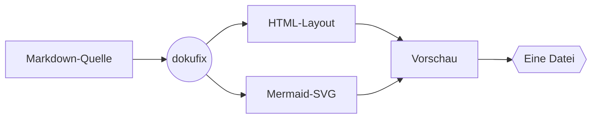
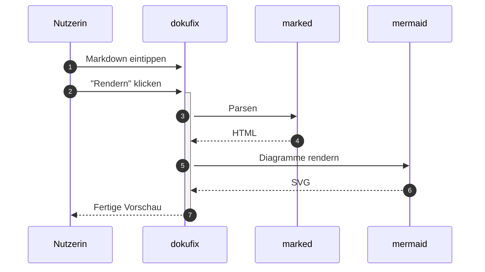

# Willkommen bei dokufix

Sie lesen gerade. Das hier ist der **Lesemodus** — keine Werkzeugleiste, keine Doppel-Ansicht, kein Chrome. Genau so kommt ein dokufix-Dokument beim Empfänger an: als ein Dokument, nicht als App.

Oben rechts gibt es einen einzigen kleinen Button: **„Editor ↩"**. Ein Klick — und Sie wechseln in die Bearbeitungsansicht und können diese Datei selbst verändern. Kein Tool installieren, kein Konto, keine Plattform dazwischen.

Manchmal sollen Empfänger gar nichts ändern können — bei einer veröffentlichten Richtlinie, einem Audit-Bericht, einer finalen Fassung. Dafür gibt es die **Auslieferung ohne Editor**: das Dokument bleibt lesbar, der Bearbeitungs-Modus fehlt komplett. Wird später doch eine Aktualisierung nötig, lässt sich der Inhalt jederzeit wieder in einen dokufix-Editor laden und weiterbearbeiten. Sie entscheiden bei jeder Auslieferung neu, ob das Dokument *gelesen* oder auch *fortgeschrieben* werden darf.

[[toc]]

## Was Sie in diesem Dokument sehen

- Überschriften, Listen, Tabellen
- *Kursiv*, **fett**, ~~durchgestrichen~~
- Inline-`Code` und Code-Blöcke
- Blockzitate und Hinweise
- Status-Chips
- Karten und Schrittlisten
- Tabellen mit Unterzeile, Filter und Suchfeld
- Bilder
- Fußnoten mit Vorschau
- **Mermaid-Diagramme**

## Wie das hier zusammenspielt



## Eine Tabelle

| Feature | Status |
|---|---|
| Markdown rendern | ✅ |
| Mermaid rendern | ✅ |
| Metadaten-Kopf | ✅ |
| Fußnoten mit Vorschau | ✅ |
| Editor-Modus | 🚧 |
| Self-Save | 🚧 |
| Self-Replication | 🚧 |

### Lesehilfen im Detail

Bei breiteren Bildschirmen erscheint rechts eine schwebende Schiene mit allen Überschriften des Dokuments. Der gerade gelesene Abschnitt ist markiert; ein Klick springt direkt dorthin. Die Schiene blendet sich auf schmaleren Geräten aus — dort übernimmt das eingebettete Inhaltsverzeichnis oben.

## Status-Chips

Ein Code-Span, der mit einem Farbpunkt beginnt, wird zu einem Status-Chip: Aus `` `🟢 in Betrieb` `` wird `🟢 in Betrieb`. Es gibt fünf Farben: `🟢 in Betrieb`, `🟡 geplant`, `🔴 gestört`, `⚪ Übergangslösung` und `🔵 im Test`. Jede hat ein eigenes Zeichen vor dem Text, damit ein Status auch ohne Farbe erkennbar bleibt.

| System | Status |
|---|---|
| Bestellannahme | `🟢 in Betrieb` |
| Lagerverwaltung | `🟡 geplant` |
| Zahlungsschnittstelle | `🔴 gestört` |
| Altsystem Versand | `⚪ Übergangslösung` |
| Kundenportal | `🔵 im Test` |

### Kundenportal `🔵 im Test`

Ein Chip steht im Fließtext, in Tabellen, in Überschriften wie der hier, in **fettem Text: `🟡 geplant`** und in Verweisen: [`🟢 in Betrieb`](#status-chips). In einem Renderer, der dokufix nicht kennt, bleibt er ein Code-Span mit Farbpunkt.

## Hinweise

Ein Zitat, dessen erste Zeile nur eine Marke trägt, wird zum Hinweis. Fünf Marken gibt es: `[!NOTE]`, `[!TIP]`, `[!IMPORTANT]`, `[!WARNING]` und `[!CAUTION]`.

> [!NOTE]
> Geschrieben wird ein Hinweis wie ein Alert auf GitHub: die Marke in der ersten Zeile des Zitats, darunter der Text.

> [!TIP]
> Im Editor lässt sich jede Marke ausprobieren: eine andere einsetzen und neu rendern.

> [!IMPORTANT]
> Ein Hinweis nimmt auf, was ein Zitat aufnimmt:
> - mehrere Absätze und Aufzählungen
> - Code und Status-Chips wie `🔵 im Test`

> [!WARNING]
> Die Marke steht allein in der ersten Zeile. Folgt ihr in derselben Zeile Text, bleibt das Zitat ein Zitat.

> [!CAUTION]
> Ein Download überschreibt keine Datei: Der Browser legt jedes Mal eine neue an. Welche Fassung gilt, entscheidet, wer sie weitergibt.

## Karten

Eine Markierung über einer Aufzählung macht aus ihren Einträgen Karten. Der fette Text am Anfang eines Eintrags wird zum Titel der Karte; ein Eintrag ohne ihn wird eine Karte ohne Titel.

<!-- dokufix: cards -->
- **Mit Editor** Die Datei bleibt bearbeitbar. Wer sie bekommt, schreibt sie fort.
- **Offen** Ein reines Lesedokument ohne ein einziges Skript.
- **Schlank** Der Text steht lesbar in der Datei, die Diagramme sind gepackt.
- **Kompakt** Alles ist gepackt: die kleinste Datei.
- Welche passt, entscheiden Sie bei jedem Download neu.

Die Markierung ist ein Kommentar in der Zeile über der Liste: `<!-- dokufix: cards -->`. In einem Renderer, der HTML-Kommentare durchlässt, etwa auf GitHub, ist der Kommentar unsichtbar und die Liste eine Liste.

## Schrittliste

Dieselbe Art Markierung macht aus einer nummerierten Liste eine Schrittliste: `<!-- dokufix: steps -->`. Ein kursiver Anfang mit Doppelpunkt nennt, wer handelt.

<!-- dokufix: steps -->
1. *Autorin:* Den Text im Editor schreiben und rendern.
2. *Autorin:* Im Download-Menü die passende Auslieferung wählen.
3. *Empfänger:* Die Datei im Browser öffnen.
4. Lesen, oder weiterschreiben, wenn der Editor mitgeliefert wurde.

Eine Schrittliste darf mit einer anderen Zahl beginnen, etwa wenn sie eine Liste fortsetzt:

<!-- dokufix: steps -->
5. *Empfänger:* Die Datei ändern und wieder „Mit Editor“ herunterladen.[^version]
6. *Autorin:* Die neue Fassung öffnen und in der Versionsgeschichte vergleichen.

Eine Markierung, die nicht wirken kann, wird an ihrer Stelle zur Warnung, und die Liste bleibt eine Liste. Probieren Sie es im Editor: Schreiben Sie `crads` statt `cards`.

## Tabellen mit Filter

Eine Markierung über einer Tabelle nennt eine Spalte: `<!-- dokufix: facets Art -->`. Über der Tabelle steht dann für jeden Wert dieser Spalte ein Knopf. Wählen Sie einen, und die Tabelle zeigt nur die Zeilen mit diesem Wert; „Alle“ zeigt wieder alle. Das geht mit der Maus und mit den Pfeiltasten, und es braucht kein Skript: Der Filter arbeitet auch in der Nur-Lese-Fassung.

Eine zweite Markierung gibt derselben Tabelle ein Suchfeld: `<!-- dokufix: filter "Baustein suchen …" -->`. Wer etwas eintippt, sieht nur die Zeilen, in denen der Text vorkommt; die Zahl daneben sagt, wie viele das sind. Suchfeld und Knöpfe wirken zusammen. Das Suchfeld braucht ein Skript: Es steht hier, in der Datei „Mit Editor“ und in den Fassungen „schlank“ und „kompakt“. Die offene Fassung ohne Skript (`-nur-lesen.html`) zeigt die ganze Tabelle ohne Suchfeld, ebenso „schlank“, wenn der Browser keine Skripte ausführt, und auf Papier steht immer die ganze Tabelle.

<!-- dokufix: filter "Baustein suchen …" -->
<!-- dokufix: facets Art -->
| Baustein | Art | Geschrieben als |
|---|---|---|
| Hinweis<br>*fünf Marken* | Block | Zitat mit einer Marke in der ersten Zeile |
| Status-Chip<br>*fünf Farben* | Text | Code-Span mit Farbpunkt |
| Karten | Block | Markierung über einer Aufzählung |
| Schrittliste | Block | Markierung über einer nummerierten Liste |
| Fußnote<br>*mit Vorschau* | Text | Marke im Text, Erklärung am Ende |
| Unterzeile | Tabelle | kursiver Text nach einem Zeilenumbruch |
| Filter | Tabelle | Markierung über einer Tabelle |
| Suchfeld | Tabelle | Markierung über einer Tabelle, wirkt mit Skript |
| Diagramm | Block | Code-Block mit Mermaid-Text |

Die kleine zweite Zeile in der ersten Spalte ist eine **Unterzeile**: kursiver Text direkt nach einem Zeilenumbruch in der Zelle, geschrieben als `Hinweis<br>*fünf Marken*`.

Ein Suchfeld steht auch allein über einer Tabelle. Ohne Angabe hinter `filter` heißt es „Suchen …“:

<!-- dokufix: filter -->
| Taste | Wirkung |
|---|---|
| Strg + Eingabe | im Editor neu rendern[^tasten] |
| Esc | den Lesemodus verlassen; im Suchfeld zuerst den Suchtext leeren |
| Pfeiltasten | im Filter den nächsten Wert wählen |
| Tab | zum nächsten Knopf, Verweis oder Suchfeld |

Eine Tabelle, die breiter ist als die Lesespalte, rollt für sich seitwärts. Die Seite bleibt so breit wie das Fenster:

| Auslieferung | Dateiendung | Weiterbearbeitung | Versionsgeschichte | Skriptabhängigkeit | Diagrammdarstellung | Größenordnung | Verwendungszweck |
|---|---|---|---|---|---|---|---|
| Mit Editor | `.html` | uneingeschränkt | vollständig | Bibliotheken aus dem Netz | beim Öffnen gezeichnet | am größten | Zusammenarbeit |
| Offen | `-nur-lesen.html` | ausgeschlossen | letzter Stand | keine | eingebettet | groß | Veröffentlichung, Langzeitablage |
| Schlank | `-schlank.html` | ausgeschlossen | letzter Stand | für Diagramme und Suchfelder | gepackt | mittel | Versand |
| Kompakt | `-kompakt.html` | ausgeschlossen | letzter Stand | für alles | gepackt | am kleinsten | Versand über schmale Leitungen |

## Bilder


Foto: Daria Yakovleva (Pixabay), über [Wikimedia Commons](https://commons.wikimedia.org/wiki/File:Piece_of_chocolate_cake_on_a_white_plate_decorated_with_chocolate_sauce.jpg), Lizenz [CC0 1.0](https://creativecommons.org/publicdomain/zero/1.0/deed.de)

Ein Bild kommt in den Editor, indem Sie es einfügen, auf den Text ziehen oder über „+ Bild“ auswählen. dokufix verkleinert es bei Bedarf, legt es einmal in der Datei ab und verweist im Text mit `#asset-` und einer Prüfsumme darauf; ein Bild, das zweimal vorkommt, liegt trotzdem nur einmal in der Datei. In den Fassungen ohne Editor steht das Bild als Daten direkt im Dokument und braucht nichts von außen.

## Der Metadaten-Kopf

Ganz oben, über der Überschrift, sitzt ein zugeklappter Streifen **Metadaten**. Klicken Sie ihn auf: Titel, Version, Datum, Schlagworte und Freigabe stehen dort als Tabelle statt als Rohtext.

Solche Kopfdaten schreibt praktisch jedes Dokumentationswerkzeug an den Anfang einer Markdown-Datei[^header] — und ohne Unterstützung landen sie als sichtbarer Müll im Dokument: eine Trennlinie, darunter die Schlüssel als Fließtext. dokufix erkennt den Block und zeigt ihn als Panel.

Der Streifen klappt **ohne JavaScript** auf und zu. Er funktioniert damit auch in der ausgelieferten Nur-Lese-Fassung[^header], in der kein Skript mehr enthalten ist.

## Fußnoten

Fahren Sie mit der Maus über diese Fußnote[^vorschau] — der Text erscheint direkt an der Stelle, ohne dass Sie ans Dokumentende springen müssen. Wer mit der Tastatur navigiert, bekommt dieselbe Vorschau beim Fokussieren.

Klicken Sie stattdessen darauf, landen Sie unten bei der Fußnote: Sie ist dann hervorgehoben, und **genau der Rückwärtspfeil**, der Sie hierher zurückbringt, ist markiert. Das ist mehr wert, als es klingt — sobald eine Fußnote von mehreren Stellen referenziert wird[^header], stehen unten mehrere Pfeile nebeneinander, und ohne Markierung rät man, welcher der eigene ist.

## Sequenzdiagramm



## Code-Block (kein Mermaid)

```javascript
function dokufix(md) {
  const html = marked.parse(md);
  return renderMermaidIn(html);
}
```

> **Träger für Inhalte.** Die HTML ist nur die aktuelle Hülle.

## Sonderfälle

Hier stehen Fälle, an denen sich ein Fehler zuerst zeigt. Vor jedem steht, was Sie sehen sollten.

Eine Fußnote in einer Karte und in einem Hinweis zeigt ihre Vorschau wie im Fließtext, ebenso die im fünften Schritt weiter oben.

<!-- dokufix: cards -->
- **Karte** mit einer Fußnote.[^ort]
- **Zweite Karte** ohne Fußnote.

> [!NOTE]
> Ein Hinweis mit derselben Fußnote.[^ort]

Ein Hinweis darf eine Überschrift, eine Liste und Code enthalten. Die Überschrift steht weder im Inhaltsverzeichnis noch in der Schiene.

> [!TIP]
> ### Überschrift im Hinweis
> - ein Punkt
> - noch ein Punkt
>
> ```text
> Code im Hinweis
> ```

Steht eine Tabelle zuletzt in einem Hinweis, folgt unter ihr kein zusätzlicher Abstand.

> [!IMPORTANT]
> | Medium | Leihfrist |
> |---|---|
> | Buch | 28 Tage |

Die Knöpfe über dieser Tabelle zeigen nur den Text der Chips. Die leere Zelle hat den Knopf „(leer)“, und „gestört“ mit seiner Unterzeile zählt als „gestört“.

<!-- dokufix: facets Status -->
| Dienst | Status |
|---|---|
| Ausleihe | `🟢 in Betrieb` |
| Rückgabe | `🔴 gestört`<br>*seit Montag* |
| Fernleihe | `🟢 in Betrieb` |
| Archiv | |
| Kasse | `🔴 gestört` |

Diese breite Tabelle hat Suchfeld, Knöpfe und eine Fußnote in einer Zelle; „Ja/Nein“ mit Unterzeile zählt als „Ja/Nein“. Rollen Sie die Tabelle zur Seite: Suchfeld und Knöpfe bleiben stehen.

<!-- dokufix: filter "Feld suchen …" -->
<!-- dokufix: facets Pflicht -->
| Feld | Pflicht | Formularseite | Beschreibung_für_die_Ablage | Prüfung_bei_der_Eingabe | Herkunft_des_Wertes | Bemerkung |
|---|---|---|---|---|---|---|
| Name[^feld] | Ja/Nein<br>*je eines* | Anmeldung | Vor- und Nachname getrennt | nicht leer | Formular | keine |
| Telefon | Nein | Anmeldung | mit Vorwahl | Ziffern und Leerzeichen | Formular | keine |
| Ausweis | Ja/Nein | Theke | Nummer auf der Karte | sieben Ziffern | Theke | wird geprüft |

Ein Titel mit Doppelpunkt dahinter und einer mit Zeilenumbruch danach sehen aus wie jeder andere Kartentitel, ohne Doppelpunkt. Eine Karte darf eine Liste enthalten.

<!-- dokufix: cards -->
- **Theke**: Mit Beratung, zu den Öffnungszeiten.
- **Automat**\
  Ohne Wartezeit, rund um die Uhr.
- **Rückgabe** Zwei Wege:
  - am Automaten
  - an der Theke

Diese Schrittliste beginnt mit 3. „Website“ steht fett als Rolle über dem Schritt, „Nie“ bleibt ein betontes Wort im Text.

<!-- dokufix: steps -->
3. ***Website:*** Das Formular absenden.
4. *Nie* ohne Backup starten.

Eine Markierung in einem Listeneintrag wirkt dort: Der Eintrag enthält Karten.

- Ausleihe an zwei Orten:

  <!-- dokufix: cards -->
  - **Theke** mit Beratung
  - **Automat** ohne Wartezeit

Dieselbe Fußnote wie in der Tabelle der Tasten, hier im Fließtext: Unten stehen bei ihr zwei Rückwärtspfeile.[^tasten]

---

Probieren Sie es aus: Klicken Sie oben rechts auf **„Editor ↩"**, ändern Sie diesen Text — und rendern Sie ihn anschließend neu. Die Datei, die Sie gerade lesen, ist gleichzeitig der Editor.[^selbstbezug]

[^selbstbezug]: Das ist kein Bug, das ist die These. dokufix verwischt die Grenze zwischen *Werkzeug* und *Werkstück* — die HTML ist beides gleichzeitig.

[^header]: YAML zwischen zwei `---`-Zeilen, ganz am Anfang der Datei; JSON funktioniert ebenso. dokufix liest eine bewusst kleine Teilmenge von YAML — was darüber hinausgeht, zeigt es unverändert im Original an, statt es stillschweigend zu verschlucken. Diese Fußnote wird absichtlich von mehreren Stellen aus referenziert: unten sehen Sie deshalb mehrere Rückwärtspfeile.

[^version]: Jede Speicherung „Mit Editor“ wird eine neue Version mit Datum und Beschreibung, zuletzt `🟢 gespeichert`. Das Abzeichen `v1`, `v2` … in der Werkzeugleiste öffnet die Liste aller Versionen.

[^tasten]: Auf dem Mac ist es Cmd + Eingabe. Gerendert wird auch über den Knopf „Rendern“ in der Werkzeugleiste; erst danach zeigen Vorschau, Inhaltsverzeichnis und Schiene den neuen Stand.

[^ort]: Dieselbe Fußnote steht in einer Karte und in einem Hinweis.

[^feld]: Diese Fußnote steht in einer Tabelle mit Suchfeld und Knöpfen.

[^vorschau]: Die Vorschau ist reines CSS — kein Skript. Deshalb funktioniert sie auch in der Nur-Lese-Auslieferung. Ein Klick auf die Marke hält die Vorschau offen; ein Klick irgendwo ins Dokument schließt sie wieder.
