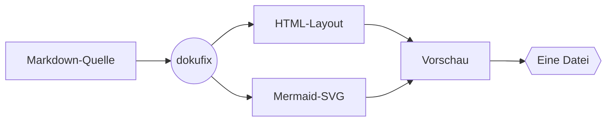
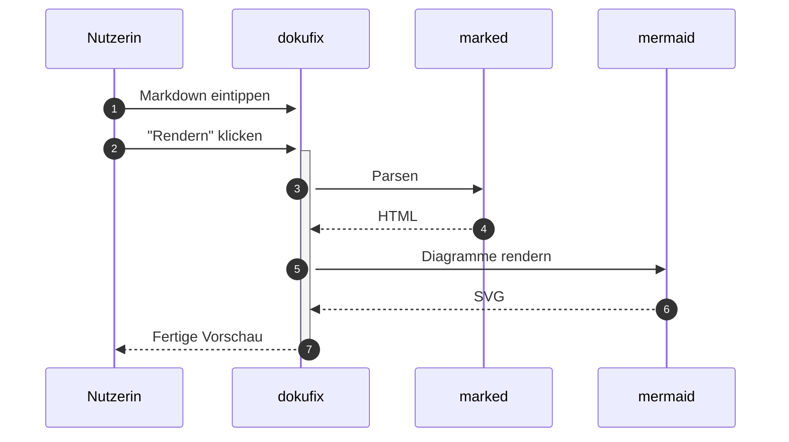
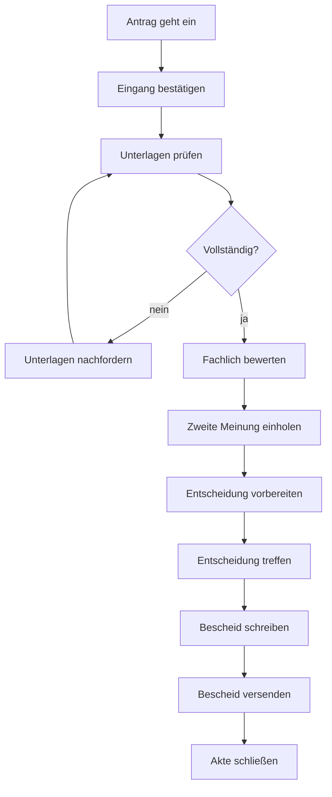
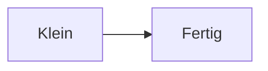

# Willkommen bei dokufix

Sie lesen gerade. Das hier ist der **Lesemodus** — keine Werkzeugleiste, keine Doppel-Ansicht, kein Chrome. Genau so kommt ein dokufix-Dokument beim Empfänger an: als ein Dokument, nicht als App.

Oben rechts gibt es einen einzigen kleinen Button: **„Editor ↩"**. Ein Klick — und Sie wechseln in die Bearbeitungsansicht und können diese Datei selbst verändern. Kein Tool installieren, kein Konto, keine Plattform dazwischen.

Manchmal sollen Empfänger gar nichts ändern können — bei einer veröffentlichten Richtlinie, einem Audit-Bericht, einer finalen Fassung. Dafür gibt es die **Auslieferung ohne Editor**: das Dokument bleibt lesbar, der Bearbeitungs-Modus fehlt komplett. Wird später doch eine Aktualisierung nötig, lässt sich der Inhalt jederzeit wieder in einen dokufix-Editor laden und weiterbearbeiten. Sie entscheiden bei jeder Auslieferung neu, ob das Dokument *gelesen* oder auch *fortgeschrieben* werden darf.

[[toc]]

## Was Sie in diesem Dokument sehen

- Überschriften, Listen, Tabellen
- *Kursiv*, **fett**, ~~durchgestrichen~~
- Inline-`Code` und Code-Blöcke
- Blockzitate und Hinweise
- Status-Chips
- Karten und Schrittlisten
- Tabellen mit Unterzeile, Filter und Suchfeld
- Bilder
- Fußnoten mit Vorschau
- **Mermaid- und BPMN-Diagramme**, BPMN auch ohne Koordinaten, jedes mit großer Ansicht
- eine Suche über das ganze Dokument

Im Lesemodus öffnet die Taste `/` eine Suche, die jede Stelle eines Begriffs mit einer Vorschau auflistet; ein Klick auf eine Stelle führt dorthin. Solange die Suche offen ist, steht jeder Treffer auch im Text gelb hinterlegt. Auch jede Zeile einer Tabelle ist eine Stelle; ihr Ergebnis beginnt mit „Tabelle:“, und eine Zeile, die ein Filter der Tabelle gerade ausblendet, ist mit „(ausgeblendet)“ markiert. Die Stellen stehen nach Abschnitten geordnet unter ihren Überschriften, und beim Blättern durch die Liste bleibt die Überschrift des Abschnitts oben stehen. Unter dem Suchfeld stehen zwei Schalter: „Groß- und Kleinschreibung beachten“ und „Leerzeichen, Bindestriche und Punkte ignorieren“; mit dem zweiten findet statuschip auch jeden Status-Chip. Ein Begriff braucht drei Buchstaben oder Ziffern; kürzer geht es mit einem anderen Zeichen wie # oder einem Emoji, und ae, oe, ue und ss werden immer gesucht, wie in Goethe. Das „ד oder Escape schließt sie; im Editor und in einer Datei mit Editor verlässt erst das nächste Escape den Lesemodus. Die Suche gibt es auch in den Fassungen „schlank“ und „kompakt“; dort öffnet `/` sie ebenso.

## Wie das hier zusammenspielt



Ein Klick auf ein Diagramm zeigt es groß über dem ganzen Fenster, eingepasst oder in 100, 150 und 200 %, und „Schließen“ oder ein zweiter Klick schließt es wieder, in jeder Fassung, auch in der offenen ohne Skript; wo ein Skript läuft, schließt es auch Escape, und `+` und `-` wechseln die Stufe.

## Eine Tabelle

| Feature | Status |
|---|---|
| Markdown rendern | ✅ |
| Mermaid rendern | ✅ |
| Metadaten-Kopf | ✅ |
| Fußnoten mit Vorschau | ✅ |
| Editor-Modus | 🚧 |
| Self-Save | 🚧 |
| Self-Replication | 🚧 |

### Lesehilfen im Detail

Bei breiteren Bildschirmen erscheint rechts eine schwebende Schiene mit allen Überschriften des Dokuments. Der gerade gelesene Abschnitt ist markiert; ein Klick springt direkt dorthin. Die Schiene blendet sich auf schmaleren Geräten aus — dort übernimmt das eingebettete Inhaltsverzeichnis oben.

## Status-Chips

Ein Code-Span, der mit einem Farbpunkt beginnt, wird zu einem Status-Chip: Aus `` `🟢 in Betrieb` `` wird `🟢 in Betrieb`. Es gibt fünf Farben: `🟢 in Betrieb`, `🟡 geplant`, `🔴 gestört`, `⚪ Übergangslösung` und `🔵 im Test`. Jede hat ein eigenes Zeichen vor dem Text, damit ein Status auch ohne Farbe erkennbar bleibt.

| System | Status |
|---|---|
| Bestellannahme | `🟢 in Betrieb` |
| Lagerverwaltung | `🟡 geplant` |
| Zahlungsschnittstelle | `🔴 gestört` |
| Altsystem Versand | `⚪ Übergangslösung` |
| Kundenportal | `🔵 im Test` |

### Kundenportal `🔵 im Test`

Ein Chip steht im Fließtext, in Tabellen, in Überschriften wie der hier, in **fettem Text: `🟡 geplant`** und in Verweisen: [`🟢 in Betrieb`](#status-chips). In einem Renderer, der dokufix nicht kennt, bleibt er ein Code-Span mit Farbpunkt.

## Hinweise

Ein Zitat, dessen erste Zeile nur eine Marke trägt, wird zum Hinweis. Fünf Marken gibt es: `[!NOTE]`, `[!TIP]`, `[!IMPORTANT]`, `[!WARNING]` und `[!CAUTION]`.

> [!NOTE]
> Geschrieben wird ein Hinweis wie ein Alert auf GitHub: die Marke in der ersten Zeile des Zitats, darunter der Text.

> [!TIP]
> Im Editor lässt sich jede Marke ausprobieren: eine andere einsetzen und neu rendern.

> [!IMPORTANT]
> Ein Hinweis nimmt auf, was ein Zitat aufnimmt:
> - mehrere Absätze und Aufzählungen
> - Code und Status-Chips wie `🔵 im Test`

> [!WARNING]
> Die Marke steht allein in der ersten Zeile. Folgt ihr in derselben Zeile Text, bleibt das Zitat ein Zitat.

> [!CAUTION]
> Ein Download überschreibt keine Datei: Der Browser legt jedes Mal eine neue an. Welche Fassung gilt, entscheidet, wer sie weitergibt.

## Karten

Eine Markierung über einer Aufzählung macht aus ihren Einträgen Karten. Der fette Text am Anfang eines Eintrags wird zum Titel der Karte; ein Eintrag ohne ihn wird eine Karte ohne Titel.

<!-- dokufix: cards -->
- **Mit Editor** Die Datei bleibt bearbeitbar. Wer sie bekommt, schreibt sie fort.
- **Offen** Ein reines Lesedokument ohne ein einziges Skript.
- **Schlank** Der Text steht lesbar in der Datei, die Diagramme sind gepackt.
- **Kompakt** Alles ist gepackt: die kleinste Datei.
- Welche passt, entscheiden Sie bei jedem Download neu.

Die Markierung ist ein Kommentar in der Zeile über der Liste: `<!-- dokufix: cards -->`. In einem Renderer, der HTML-Kommentare durchlässt, etwa auf GitHub, ist der Kommentar unsichtbar und die Liste eine Liste.

## Schrittliste

Dieselbe Art Markierung macht aus einer nummerierten Liste eine Schrittliste: `<!-- dokufix: steps -->`. Ein kursiver Anfang mit Doppelpunkt nennt, wer handelt.

<!-- dokufix: steps -->
1. *Autorin:* Den Text im Editor schreiben und rendern.
2. *Autorin:* Im Download-Menü die passende Auslieferung wählen.
3. *Empfänger:* Die Datei im Browser öffnen.
4. Lesen, oder weiterschreiben, wenn der Editor mitgeliefert wurde.

Eine Schrittliste darf mit einer anderen Zahl beginnen, etwa wenn sie eine Liste fortsetzt:

<!-- dokufix: steps -->
5. *Empfänger:* Die Datei ändern und wieder „Mit Editor“ herunterladen.[^version]
6. *Autorin:* Die neue Fassung öffnen und in der Versionsgeschichte vergleichen.

Eine Markierung, die nicht wirken kann, wird an ihrer Stelle zur Warnung, und die Liste bleibt eine Liste. Probieren Sie es im Editor: Schreiben Sie `crads` statt `cards`.

## Tabellen mit Filter

Eine Markierung über einer Tabelle nennt eine Spalte: `<!-- dokufix: facets Art -->`. Über der Tabelle steht dann für jeden Wert dieser Spalte ein Knopf. Wählen Sie einen, und die Tabelle zeigt nur die Zeilen mit diesem Wert; „Alle“ zeigt wieder alle. Das geht mit der Maus und mit den Pfeiltasten, und es braucht kein Skript: Der Filter arbeitet auch in der Nur-Lese-Fassung.

Eine zweite Markierung gibt derselben Tabelle ein Suchfeld: `<!-- dokufix: filter "Baustein suchen …" -->`. Wer etwas eintippt, sieht nur die Zeilen, in denen der Text vorkommt; die Zahl daneben sagt, wie viele das sind. Suchfeld und Knöpfe wirken zusammen. Das Suchfeld braucht ein Skript: Es steht hier, in der Datei „Mit Editor“ und in den Fassungen „schlank“ und „kompakt“. Die offene Fassung ohne Skript (`-nur-lesen.html`) zeigt die ganze Tabelle ohne Suchfeld, ebenso „schlank“, wenn der Browser keine Skripte ausführt, und auf Papier steht immer die ganze Tabelle.

<!-- dokufix: filter "Baustein suchen …" -->
<!-- dokufix: facets Art -->
| Baustein | Art | Geschrieben als |
|---|---|---|
| Hinweis<br>*fünf Marken* | Block | Zitat mit einer Marke in der ersten Zeile |
| Status-Chip<br>*fünf Farben* | Text | Code-Span mit Farbpunkt |
| Karten | Block | Markierung über einer Aufzählung |
| Schrittliste | Block | Markierung über einer nummerierten Liste |
| Fußnote<br>*mit Vorschau* | Text | Marke im Text, Erklärung am Ende |
| Unterzeile | Tabelle | kursiver Text nach einem Zeilenumbruch |
| Filter | Tabelle | Markierung über einer Tabelle |
| Suchfeld | Tabelle | Markierung über einer Tabelle, wirkt mit Skript |
| Diagramm | Block | Code-Block mit Mermaid-Text |

Die kleine zweite Zeile in der ersten Spalte ist eine **Unterzeile**: kursiver Text direkt nach einem Zeilenumbruch in der Zelle, geschrieben als `Hinweis<br>*fünf Marken*`.

Ein Suchfeld steht auch allein über einer Tabelle. Ohne Angabe hinter `filter` heißt es „Suchen …“:

<!-- dokufix: filter -->
| Taste | Wirkung |
|---|---|
| Strg + Eingabe | im Editor neu rendern[^tasten] |
| `/` | im Lesemodus die Suche öffnen |
| Esc | eines nach dem anderen schließen: die große Ansicht, die Suche, den Text im Suchfeld einer Tabelle, zuletzt den Lesemodus |
| `+` und `-` | in der großen Ansicht die nächste oder die vorige Stufe |
| Pfeiltasten | im Filter den nächsten Wert wählen |
| Tab | zum nächsten Knopf, Verweis oder Suchfeld |

Eine Tabelle, die breiter ist als die Lesespalte, rollt für sich seitwärts. Die Seite bleibt so breit wie das Fenster:

| Auslieferung | Dateiendung | Weiterbearbeitung | Versionsgeschichte | Skriptabhängigkeit | Diagrammdarstellung | Größenordnung | Verwendungszweck |
|---|---|---|---|---|---|---|---|
| Mit Editor | `.html` | uneingeschränkt | vollständig | Bibliotheken aus dem Netz | beim Öffnen gezeichnet | am größten | Zusammenarbeit |
| Offen | `-nur-lesen.html` | ausgeschlossen | letzter Stand | keine | eingebettet | groß | Veröffentlichung, Langzeitablage |
| Schlank | `-schlank.html` | ausgeschlossen | letzter Stand | für Diagramme, Suche und Suchfelder | gepackt | mittel | Versand |
| Kompakt | `-kompakt.html` | ausgeschlossen | letzter Stand | für alles | gepackt | am kleinsten | Versand über schmale Leitungen |

## Bilder


Foto: Daria Yakovleva (Pixabay), über [Wikimedia Commons](https://commons.wikimedia.org/wiki/File:Piece_of_chocolate_cake_on_a_white_plate_decorated_with_chocolate_sauce.jpg), Lizenz [CC0 1.0](https://creativecommons.org/publicdomain/zero/1.0/deed.de)

Ein Bild kommt in den Editor, indem Sie es einfügen, auf den Text ziehen oder über „+ Bild“ auswählen. dokufix verkleinert es bei Bedarf, legt es einmal in der Datei ab und verweist im Text mit `#asset-` und einer Prüfsumme darauf; ein Bild, das zweimal vorkommt, liegt trotzdem nur einmal in der Datei. In den Fassungen ohne Editor steht das Bild als Daten direkt im Dokument und braucht nichts von außen.

## Der Metadaten-Kopf

Ganz oben, über der Überschrift, sitzt ein zugeklappter Streifen **Metadaten**. Klicken Sie ihn auf: Titel, Version, Datum, Schlagworte und Freigabe stehen dort als Tabelle statt als Rohtext.

Solche Kopfdaten schreibt praktisch jedes Dokumentationswerkzeug an den Anfang einer Markdown-Datei[^header] — und ohne Unterstützung landen sie als sichtbarer Müll im Dokument: eine Trennlinie, darunter die Schlüssel als Fließtext. dokufix erkennt den Block und zeigt ihn als Panel.

Der Streifen klappt **ohne JavaScript** auf und zu. Er funktioniert damit auch in der ausgelieferten Nur-Lese-Fassung[^header], in der kein Skript mehr enthalten ist.

## Fußnoten

Fahren Sie mit der Maus über diese Fußnote[^vorschau] — der Text erscheint direkt an der Stelle, ohne dass Sie ans Dokumentende springen müssen. Wer mit der Tastatur navigiert, bekommt dieselbe Vorschau beim Fokussieren.

Klicken Sie stattdessen darauf, landen Sie unten bei der Fußnote: Sie ist dann hervorgehoben, und **genau der Rückwärtspfeil**, der Sie hierher zurückbringt, ist markiert. Das ist mehr wert, als es klingt — sobald eine Fußnote von mehreren Stellen referenziert wird[^header], stehen unten mehrere Pfeile nebeneinander, und ohne Markierung rät man, welcher der eigene ist.

## Sequenzdiagramm



## Prozessmodell (BPMN)

Ein Prozess, gezeichnet in einem BPMN-Werkzeug wie dem Camunda Modeler: Sie kopieren das XML samt Koordinaten in einen Block mit der Sprache `bpmn`. dokufix zeichnet ihn mit der Bibliothek von bpmn.io; ins Dokument kommt nur das fertige Bild, und unter jedem BPMN-Diagramm steht der Verweis darauf. Zwei Pools, Bahnen, Nachrichtenflüsse zwischen den Pools:

```bpmn
<?xml version="1.0" encoding="UTF-8"?>
<bpmn:definitions xmlns:bpmn="http://www.omg.org/spec/BPMN/20100524/MODEL" xmlns:bpmndi="http://www.omg.org/spec/BPMN/20100524/DI" xmlns:dc="http://www.omg.org/spec/DD/20100524/DC" xmlns:di="http://www.omg.org/spec/DD/20100524/DI" id="Definitionen" targetNamespace="http://example.org/dokufix">
  <bpmn:collaboration id="Zusammenarbeit">
    <bpmn:participant id="Leser" name="Leser" processRef="Prozess_Leser"/>
    <bpmn:participant id="Bib" name="Bibliothek" processRef="Prozess_Bib"/>
    <bpmn:messageFlow id="N1" sourceRef="L_Bestellen" targetRef="T_Start"/>
    <bpmn:messageFlow id="N2" sourceRef="F_Melden" targetRef="L_Bereit"/>
    <bpmn:messageFlow id="N3" sourceRef="T_Absage" targetRef="Leser"/>
  </bpmn:collaboration>
  <bpmn:process id="Prozess_Leser" isExecutable="false">
    <bpmn:startEvent id="L_Start" name="Buch fehlt"/>
    <bpmn:sendTask id="L_Bestellen" name="Fernleihe bestellen"/>
    <bpmn:intermediateCatchEvent id="L_Bereit" name="Abholbereit"><bpmn:messageEventDefinition id="L_Bereit_Def"/></bpmn:intermediateCatchEvent>
    <bpmn:endEvent id="L_Ende" name="Buch da"/>
    <bpmn:sequenceFlow id="F1" sourceRef="L_Start" targetRef="L_Bestellen"/>
    <bpmn:sequenceFlow id="F2" sourceRef="L_Bestellen" targetRef="L_Bereit"/>
    <bpmn:sequenceFlow id="F3" sourceRef="L_Bereit" targetRef="L_Ende"/>
  </bpmn:process>
  <bpmn:process id="Prozess_Bib" isExecutable="false">
    <bpmn:laneSet id="Prozess_Bib_Bahnen">
      <bpmn:lane id="Theke" name="Theke"><bpmn:flowNodeRef>T_Start</bpmn:flowNodeRef><bpmn:flowNodeRef>T_Pruefen</bpmn:flowNodeRef><bpmn:flowNodeRef>T_Verbund</bpmn:flowNodeRef><bpmn:flowNodeRef>T_Absage</bpmn:flowNodeRef></bpmn:lane>
      <bpmn:lane id="Fernleihe" name="Fernleihe"><bpmn:flowNodeRef>F_Bestellen</bpmn:flowNodeRef><bpmn:flowNodeRef>F_Melden</bpmn:flowNodeRef><bpmn:flowNodeRef>F_Ende</bpmn:flowNodeRef></bpmn:lane>
    </bpmn:laneSet>
    <bpmn:startEvent id="T_Start" name="Bestellung"><bpmn:messageEventDefinition id="T_Start_Def"/></bpmn:startEvent>
    <bpmn:userTask id="T_Pruefen" name="Bestellung prüfen"/>
    <bpmn:exclusiveGateway id="T_Verbund" name="Im Verbund?"/>
    <bpmn:endEvent id="T_Absage" name="Absage"><bpmn:messageEventDefinition id="T_Absage_Def"/></bpmn:endEvent>
    <bpmn:serviceTask id="F_Bestellen" name="Beim Partner bestellen"/>
    <bpmn:sendTask id="F_Melden" name="Abholung melden"/>
    <bpmn:endEvent id="F_Ende" name="Gemeldet"/>
    <bpmn:sequenceFlow id="F4" sourceRef="T_Start" targetRef="T_Pruefen"/>
    <bpmn:sequenceFlow id="F5" sourceRef="T_Pruefen" targetRef="T_Verbund"/>
    <bpmn:sequenceFlow id="F6" name="nein" sourceRef="T_Verbund" targetRef="T_Absage"/>
    <bpmn:sequenceFlow id="F7" name="ja" sourceRef="T_Verbund" targetRef="F_Bestellen"/>
    <bpmn:sequenceFlow id="F8" sourceRef="F_Bestellen" targetRef="F_Melden"/>
    <bpmn:sequenceFlow id="F9" sourceRef="F_Melden" targetRef="F_Ende"/>
  </bpmn:process>
  <bpmndi:BPMNDiagram id="Diagramm">
    <bpmndi:BPMNPlane id="Ebene" bpmnElement="Zusammenarbeit">
      <bpmndi:BPMNShape id="Leser_di" bpmnElement="Leser" isHorizontal="true"><dc:Bounds x="0" y="0" width="906" height="110"/></bpmndi:BPMNShape>
      <bpmndi:BPMNShape id="Bib_di" bpmnElement="Bib" isHorizontal="true"><dc:Bounds x="0" y="170" width="906" height="240"/></bpmndi:BPMNShape>
      <bpmndi:BPMNShape id="Theke_di" bpmnElement="Theke" isHorizontal="true"><dc:Bounds x="30" y="170" width="876" height="120"/></bpmndi:BPMNShape>
      <bpmndi:BPMNShape id="Fernleihe_di" bpmnElement="Fernleihe" isHorizontal="true"><dc:Bounds x="30" y="290" width="876" height="120"/></bpmndi:BPMNShape>
      <bpmndi:BPMNShape id="L_Start_di" bpmnElement="L_Start"><dc:Bounds x="62" y="37" width="36" height="36"/><bpmndi:BPMNLabel><dc:Bounds x="35" y="78" width="90" height="27"/></bpmndi:BPMNLabel></bpmndi:BPMNShape>
      <bpmndi:BPMNShape id="L_Bestellen_di" bpmnElement="L_Bestellen"><dc:Bounds x="148" y="15" width="100" height="80"/></bpmndi:BPMNShape>
      <bpmndi:BPMNShape id="L_Bereit_di" bpmnElement="L_Bereit"><dc:Bounds x="652" y="37" width="36" height="36"/><bpmndi:BPMNLabel><dc:Bounds x="625" y="5" width="90" height="27"/></bpmndi:BPMNLabel></bpmndi:BPMNShape>
      <bpmndi:BPMNShape id="L_Ende_di" bpmnElement="L_Ende"><dc:Bounds x="770" y="37" width="36" height="36"/><bpmndi:BPMNLabel><dc:Bounds x="743" y="78" width="90" height="27"/></bpmndi:BPMNLabel></bpmndi:BPMNShape>
      <bpmndi:BPMNShape id="T_Start_di" bpmnElement="T_Start"><dc:Bounds x="210" y="212" width="36" height="36"/><bpmndi:BPMNLabel><dc:Bounds x="183" y="253" width="90" height="27"/></bpmndi:BPMNLabel></bpmndi:BPMNShape>
      <bpmndi:BPMNShape id="T_Pruefen_di" bpmnElement="T_Pruefen"><dc:Bounds x="296" y="190" width="100" height="80"/></bpmndi:BPMNShape>
      <bpmndi:BPMNShape id="T_Verbund_di" bpmnElement="T_Verbund" isMarkerVisible="true"><dc:Bounds x="439" y="205" width="50" height="50"/><bpmndi:BPMNLabel><dc:Bounds x="419" y="173" width="90" height="27"/></bpmndi:BPMNLabel></bpmndi:BPMNShape>
      <bpmndi:BPMNShape id="T_Absage_di" bpmnElement="T_Absage"><dc:Bounds x="564" y="212" width="36" height="36"/><bpmndi:BPMNLabel><dc:Bounds x="537" y="253" width="90" height="27"/></bpmndi:BPMNLabel></bpmndi:BPMNShape>
      <bpmndi:BPMNShape id="F_Bestellen_di" bpmnElement="F_Bestellen"><dc:Bounds x="532" y="310" width="100" height="80"/></bpmndi:BPMNShape>
      <bpmndi:BPMNShape id="F_Melden_di" bpmnElement="F_Melden"><dc:Bounds x="650" y="310" width="100" height="80"/></bpmndi:BPMNShape>
      <bpmndi:BPMNShape id="F_Ende_di" bpmnElement="F_Ende"><dc:Bounds x="800" y="332" width="36" height="36"/><bpmndi:BPMNLabel><dc:Bounds x="773" y="373" width="90" height="27"/></bpmndi:BPMNLabel></bpmndi:BPMNShape>
      <bpmndi:BPMNEdge id="F1_di" bpmnElement="F1"><di:waypoint x="98" y="55"/><di:waypoint x="148" y="55"/></bpmndi:BPMNEdge>
      <bpmndi:BPMNEdge id="F2_di" bpmnElement="F2"><di:waypoint x="248" y="55"/><di:waypoint x="652" y="55"/></bpmndi:BPMNEdge>
      <bpmndi:BPMNEdge id="F3_di" bpmnElement="F3"><di:waypoint x="688" y="55"/><di:waypoint x="770" y="55"/></bpmndi:BPMNEdge>
      <bpmndi:BPMNEdge id="F4_di" bpmnElement="F4"><di:waypoint x="246" y="230"/><di:waypoint x="296" y="230"/></bpmndi:BPMNEdge>
      <bpmndi:BPMNEdge id="F5_di" bpmnElement="F5"><di:waypoint x="396" y="230"/><di:waypoint x="439" y="230"/></bpmndi:BPMNEdge>
      <bpmndi:BPMNEdge id="F6_di" bpmnElement="F6"><di:waypoint x="489" y="230"/><di:waypoint x="564" y="230"/><bpmndi:BPMNLabel><dc:Bounds x="513" y="213" width="28" height="14"/></bpmndi:BPMNLabel></bpmndi:BPMNEdge>
      <bpmndi:BPMNEdge id="F7_di" bpmnElement="F7"><di:waypoint x="464" y="255"/><di:waypoint x="464" y="350"/><di:waypoint x="532" y="350"/><bpmndi:BPMNLabel><dc:Bounds x="470" y="296" width="20" height="14"/></bpmndi:BPMNLabel></bpmndi:BPMNEdge>
      <bpmndi:BPMNEdge id="F8_di" bpmnElement="F8"><di:waypoint x="632" y="350"/><di:waypoint x="650" y="350"/></bpmndi:BPMNEdge>
      <bpmndi:BPMNEdge id="F9_di" bpmnElement="F9"><di:waypoint x="750" y="350"/><di:waypoint x="800" y="350"/></bpmndi:BPMNEdge>
      <bpmndi:BPMNEdge id="N1_di" bpmnElement="N1"><di:waypoint x="198" y="95"/><di:waypoint x="198" y="154"/><di:waypoint x="228" y="154"/><di:waypoint x="228" y="212"/></bpmndi:BPMNEdge>
      <bpmndi:BPMNEdge id="N2_di" bpmnElement="N2"><di:waypoint x="700" y="310"/><di:waypoint x="700" y="192"/><di:waypoint x="670" y="192"/><di:waypoint x="670" y="73"/></bpmndi:BPMNEdge>
      <bpmndi:BPMNEdge id="N3_di" bpmnElement="N3"><di:waypoint x="582" y="212"/><di:waypoint x="582" y="110"/></bpmndi:BPMNEdge>
    </bpmndi:BPMNPlane>
  </bpmndi:BPMNDiagram>
</bpmn:definitions>
```

## Prozessmodell ohne Koordinaten

BPMN-XML muss keine Koordinaten haben. Fehlt der Koordinatenteil, ordnet dokufix den Prozess selbst an: jede Bahn wird eine Reihe, Pfeile docken an den Symbolen an, Beschriftungen bekommen ihren Platz. Das XML bleibt, wie Sie es geschrieben haben; es bekommt nur die Koordinaten dazu. So genügt es, Bahnen, Schritte und Flüsse aufzuschreiben, und kein Pfeil endet im Leeren, weil jemand Koordinaten geraten hat.

Ein Pool mit drei Bahnen; die beiden Zweige hinter dem Gateway liegen in verschiedenen Bahnen:

```bpmn
<?xml version="1.0" encoding="UTF-8"?>
<bpmn:definitions xmlns:bpmn="http://www.omg.org/spec/BPMN/20100524/MODEL" id="Definitionen" targetNamespace="http://example.org/dokufix">
  <bpmn:collaboration id="Zusammenarbeit">
    <bpmn:participant id="Bibliothek" name="Vormerkung" processRef="Prozess_Vormerkung"/>
  </bpmn:collaboration>
  <bpmn:process id="Prozess_Vormerkung" isExecutable="false">
    <bpmn:laneSet id="Bahnen">
      <bpmn:lane id="Leserin" name="Leserin"><bpmn:flowNodeRef>V_Start</bpmn:flowNodeRef><bpmn:flowNodeRef>V_Abholen</bpmn:flowNodeRef><bpmn:flowNodeRef>V_Ende</bpmn:flowNodeRef></bpmn:lane>
      <bpmn:lane id="Theke" name="Theke"><bpmn:flowNodeRef>V_Aufnehmen</bpmn:flowNodeRef><bpmn:flowNodeRef>V_Frage</bpmn:flowNodeRef><bpmn:flowNodeRef>V_Fernleihe</bpmn:flowNodeRef><bpmn:flowNodeRef>V_Benachrichtigen</bpmn:flowNodeRef></bpmn:lane>
      <bpmn:lane id="Magazin" name="Magazin"><bpmn:flowNodeRef>V_Holen</bpmn:flowNodeRef></bpmn:lane>
    </bpmn:laneSet>
    <bpmn:startEvent id="V_Start" name="Buch gewünscht"/>
    <bpmn:userTask id="V_Aufnehmen" name="Vormerkung aufnehmen"/>
    <bpmn:exclusiveGateway id="V_Frage" name="Im Bestand?"/>
    <bpmn:task id="V_Holen" name="Buch aus dem Magazin holen"/>
    <bpmn:sendTask id="V_Fernleihe" name="Fernleihe bestellen"/>
    <bpmn:sendTask id="V_Benachrichtigen" name="Leserin benachrichtigen"/>
    <bpmn:manualTask id="V_Abholen" name="Buch abholen"/>
    <bpmn:endEvent id="V_Ende" name="Ausgeliehen"/>
    <bpmn:sequenceFlow id="V1" sourceRef="V_Start" targetRef="V_Aufnehmen"/>
    <bpmn:sequenceFlow id="V2" sourceRef="V_Aufnehmen" targetRef="V_Frage"/>
    <bpmn:sequenceFlow id="V3" sourceRef="V_Frage" targetRef="V_Holen" name="ja"/>
    <bpmn:sequenceFlow id="V4" sourceRef="V_Frage" targetRef="V_Fernleihe" name="nein"/>
    <bpmn:sequenceFlow id="V5" sourceRef="V_Holen" targetRef="V_Benachrichtigen"/>
    <bpmn:sequenceFlow id="V6" sourceRef="V_Fernleihe" targetRef="V_Benachrichtigen"/>
    <bpmn:sequenceFlow id="V7" sourceRef="V_Benachrichtigen" targetRef="V_Abholen"/>
    <bpmn:sequenceFlow id="V8" sourceRef="V_Abholen" targetRef="V_Ende"/>
  </bpmn:process>
</bpmn:definitions>
```

### Ohne Bahnen

Ohne Bahnen und ohne Pool steht alles in einer Reihe:

```bpmn
<?xml version="1.0" encoding="UTF-8"?>
<bpmn:definitions xmlns:bpmn="http://www.omg.org/spec/BPMN/20100524/MODEL" id="Definitionen" targetNamespace="http://example.org/dokufix">
  <bpmn:process id="Prozess_Rueckgabe" isExecutable="false">
    <bpmn:startEvent id="R_Start" name="Medium zurück"/>
    <bpmn:serviceTask id="R_Scannen" name="Etikett scannen"/>
    <bpmn:intermediateCatchEvent id="R_Warten" name="Zwei Tage"><bpmn:timerEventDefinition id="R_Warten_Def"/></bpmn:intermediateCatchEvent>
    <bpmn:task id="R_Regal" name="Zurück ins Regal"/>
    <bpmn:endEvent id="R_Ende" name="Wieder ausleihbar"/>
    <bpmn:sequenceFlow id="R1" sourceRef="R_Start" targetRef="R_Scannen"/>
    <bpmn:sequenceFlow id="R2" sourceRef="R_Scannen" targetRef="R_Warten"/>
    <bpmn:sequenceFlow id="R3" sourceRef="R_Warten" targetRef="R_Regal"/>
    <bpmn:sequenceFlow id="R4" sourceRef="R_Regal" targetRef="R_Ende"/>
  </bpmn:process>
</bpmn:definitions>
```

Alle Knoten einer Bahn stehen in einer Reihe. Parallele Zweige gehören deshalb in verschiedene Bahnen, sonst laufen sie hintereinander und kreuzen sich.

## Code-Block (kein Mermaid)

```javascript
function dokufix(md) {
  const html = marked.parse(md);
  return renderMermaidIn(html);
}
```

> **Träger für Inhalte.** Die HTML ist nur die aktuelle Hülle.

## Sonderfälle

Hier stehen Fälle, an denen sich ein Fehler zuerst zeigt. Vor jedem steht, was Sie sehen sollten.

Eine Fußnote in einer Karte und in einem Hinweis zeigt ihre Vorschau wie im Fließtext, ebenso die im fünften Schritt weiter oben.

<!-- dokufix: cards -->
- **Karte** mit einer Fußnote.[^ort]
- **Zweite Karte** ohne Fußnote.

> [!NOTE]
> Ein Hinweis mit derselben Fußnote.[^ort]

Ein Hinweis darf eine Überschrift, eine Liste und Code enthalten. Die Überschrift steht weder im Inhaltsverzeichnis noch in der Schiene.

> [!TIP]
> ### Überschrift im Hinweis
> - ein Punkt
> - noch ein Punkt
>
> ```text
> Code im Hinweis
> ```

Steht eine Tabelle zuletzt in einem Hinweis, folgt unter ihr kein zusätzlicher Abstand.

> [!IMPORTANT]
> | Medium | Leihfrist |
> |---|---|
> | Buch | 28 Tage |

Die Knöpfe über dieser Tabelle zeigen nur den Text der Chips. Die leere Zelle hat den Knopf „(leer)“, und „gestört“ mit seiner Unterzeile zählt als „gestört“.

<!-- dokufix: facets Status -->
| Dienst | Status |
|---|---|
| Ausleihe | `🟢 in Betrieb` |
| Rückgabe | `🔴 gestört`<br>*seit Montag* |
| Fernleihe | `🟢 in Betrieb` |
| Archiv | |
| Kasse | `🔴 gestört` |

Diese breite Tabelle hat Suchfeld, Knöpfe und eine Fußnote in einer Zelle; „Ja/Nein“ mit Unterzeile zählt als „Ja/Nein“. Rollen Sie die Tabelle zur Seite: Suchfeld und Knöpfe bleiben stehen.

<!-- dokufix: filter "Feld suchen …" -->
<!-- dokufix: facets Pflicht -->
| Feld | Pflicht | Formularseite | Beschreibung_für_die_Ablage | Prüfung_bei_der_Eingabe | Herkunft_des_Wertes | Bemerkung |
|---|---|---|---|---|---|---|
| Name[^feld] | Ja/Nein<br>*je eines* | Anmeldung | Vor- und Nachname getrennt | nicht leer | Formular | keine |
| Telefon | Nein | Anmeldung | mit Vorwahl | Ziffern und Leerzeichen | Formular | keine |
| Ausweis | Ja/Nein | Theke | Nummer auf der Karte | sieben Ziffern | Theke | wird geprüft |

Ein Titel mit Doppelpunkt dahinter und einer mit Zeilenumbruch danach sehen aus wie jeder andere Kartentitel, ohne Doppelpunkt. Eine Karte darf eine Liste enthalten.

<!-- dokufix: cards -->
- **Theke**: Mit Beratung, zu den Öffnungszeiten.
- **Automat**\
  Ohne Wartezeit, rund um die Uhr.
- **Rückgabe** Zwei Wege:
  - am Automaten
  - an der Theke

Diese Schrittliste beginnt mit 3. „Website“ steht fett als Rolle über dem Schritt, „Nie“ bleibt ein betontes Wort im Text.

<!-- dokufix: steps -->
3. ***Website:*** Das Formular absenden.
4. *Nie* ohne Backup starten.

Eine Markierung in einem Listeneintrag wirkt dort: Der Eintrag enthält Karten.

- Ausleihe an zwei Orten:

  <!-- dokufix: cards -->
  - **Theke** mit Beratung
  - **Automat** ohne Wartezeit

Dieselbe Fußnote wie in der Tabelle der Tasten, hier im Fließtext: Unten stehen bei ihr zwei Rückwärtspfeile.[^tasten]

Ein BPMN-Prozess ohne Pool und ohne Bahnen, mit einem Zeit-Startereignis, Aufgabenarten, die im Prozessmodell oben fehlen, und einer Aufrufaktivität. Auch unter ihm steht „Gezeichnet mit bpmn-js“.

```bpmn
<?xml version="1.0" encoding="UTF-8"?>
<bpmn:definitions xmlns:bpmn="http://www.omg.org/spec/BPMN/20100524/MODEL" xmlns:bpmndi="http://www.omg.org/spec/BPMN/20100524/DI" xmlns:dc="http://www.omg.org/spec/DD/20100524/DC" xmlns:di="http://www.omg.org/spec/DD/20100524/DI" id="Definitionen" targetNamespace="http://example.org/dokufix">
  <bpmn:process id="Prozess_Abend" isExecutable="false">
    <bpmn:startEvent id="A_Start" name="Jeden Abend"><bpmn:timerEventDefinition id="A_Start_Def"/></bpmn:startEvent>
    <bpmn:manualTask id="A_Kasse" name="Kasse zählen"/>
    <bpmn:scriptTask id="A_Bericht" name="Bericht erzeugen"/>
    <bpmn:businessRuleTask id="A_Regeln" name="Mahnstufe setzen"/>
    <bpmn:callActivity id="A_Archiv" name="Archivieren"/>
    <bpmn:endEvent id="A_Ende" name="Feierabend"/>
    <bpmn:sequenceFlow id="A1" sourceRef="A_Start" targetRef="A_Kasse"/>
    <bpmn:sequenceFlow id="A2" sourceRef="A_Kasse" targetRef="A_Bericht"/>
    <bpmn:sequenceFlow id="A3" sourceRef="A_Bericht" targetRef="A_Regeln"/>
    <bpmn:sequenceFlow id="A4" sourceRef="A_Regeln" targetRef="A_Archiv"/>
    <bpmn:sequenceFlow id="A5" sourceRef="A_Archiv" targetRef="A_Ende"/>
  </bpmn:process>
  <bpmndi:BPMNDiagram id="Diagramm">
    <bpmndi:BPMNPlane id="Ebene" bpmnElement="Prozess_Abend">
      <bpmndi:BPMNShape id="A_Start_di" bpmnElement="A_Start"><dc:Bounds x="32" y="42" width="36" height="36"/><bpmndi:BPMNLabel><dc:Bounds x="5" y="83" width="90" height="27"/></bpmndi:BPMNLabel></bpmndi:BPMNShape>
      <bpmndi:BPMNShape id="A_Kasse_di" bpmnElement="A_Kasse"><dc:Bounds x="120" y="20" width="100" height="80"/></bpmndi:BPMNShape>
      <bpmndi:BPMNShape id="A_Bericht_di" bpmnElement="A_Bericht"><dc:Bounds x="240" y="20" width="100" height="80"/></bpmndi:BPMNShape>
      <bpmndi:BPMNShape id="A_Regeln_di" bpmnElement="A_Regeln"><dc:Bounds x="360" y="20" width="100" height="80"/></bpmndi:BPMNShape>
      <bpmndi:BPMNShape id="A_Archiv_di" bpmnElement="A_Archiv"><dc:Bounds x="480" y="20" width="100" height="80"/></bpmndi:BPMNShape>
      <bpmndi:BPMNShape id="A_Ende_di" bpmnElement="A_Ende"><dc:Bounds x="632" y="42" width="36" height="36"/><bpmndi:BPMNLabel><dc:Bounds x="605" y="83" width="90" height="27"/></bpmndi:BPMNLabel></bpmndi:BPMNShape>
      <bpmndi:BPMNEdge id="A1_di" bpmnElement="A1"><di:waypoint x="68" y="60"/><di:waypoint x="120" y="60"/></bpmndi:BPMNEdge>
      <bpmndi:BPMNEdge id="A2_di" bpmnElement="A2"><di:waypoint x="220" y="60"/><di:waypoint x="240" y="60"/></bpmndi:BPMNEdge>
      <bpmndi:BPMNEdge id="A3_di" bpmnElement="A3"><di:waypoint x="340" y="60"/><di:waypoint x="360" y="60"/></bpmndi:BPMNEdge>
      <bpmndi:BPMNEdge id="A4_di" bpmnElement="A4"><di:waypoint x="460" y="60"/><di:waypoint x="480" y="60"/></bpmndi:BPMNEdge>
      <bpmndi:BPMNEdge id="A5_di" bpmnElement="A5"><di:waypoint x="580" y="60"/><di:waypoint x="632" y="60"/></bpmndi:BPMNEdge>
    </bpmndi:BPMNPlane>
  </bpmndi:BPMNDiagram>
</bpmn:definitions>
```


### Große Ansicht

Ein Diagramm, das in der Spalte höher ist als das Fenster. Klicken Sie weit unten darauf: Es öffnet sich groß, und die Seite dahinter springt nicht. „Einpassen“ zeigt es ganz. Nach „Schließen“ stehen Sie an derselben Stelle wie vor dem Klick.



Ein kleines Diagramm: „Einpassen“ vergrößert es höchstens auf das Anderthalbfache, „100 %“ zeigt es so groß, wie es gezeichnet ist. Schließen Sie es bei „150 %“ und öffnen Sie es wieder: Es steht noch bei „150 %“, bis das Dokument neu gerendert wird.



Solange ein Diagramm groß offen ist, öffnet `/` keine Suche, und Escape schließt zuerst die große Ansicht. Ist die Suche schon offen, schließt das erste Escape die große Ansicht, das zweite die Suche.

### Suche

Öffnen Sie mit `/` die Suche und probieren Sie diese Fälle:

- Ein Wort, das eine Hervorhebung teilt, ist ein Treffer: Leucht*turm*wärter. Suchen Sie danach; der Treffer ist am Stück gelb hinterlegt.
- Mit dem Schalter „Leerzeichen, Bindestriche und Punkte ignorieren“ findet derselbe Begriff auch Leucht-Turm-Wärter in dieser Zeile. Ohne den Schalter findet er nur die Zeile davor.
- Ein Begriff aus einer Fußnote ist ein Treffer bei der Fußnote unten, nicht bei ihrem Zeichen hier: Suchen Sie nach dem zweiten Wort der Fußnote.[^suche]
- Das Wort, das ein Status-Chip für Screenreader trägt, ist kein Treffer: Die Suche nach blau findet nur diese Zeile, nicht den Chip `🔵 im Test` in ihr.
- Was vor der ersten Überschrift der Ebene 2 steht, bildet eine eigene Gruppe mit dem Titel des Dokuments: Die Suche nach Lesemodus beginnt mit „Willkommen bei dokufix“.
- Eine Überschrift in einem Hinweis zählt zur Gruppe, in der der Hinweis steht: „Überschrift im Hinweis“ erscheint unter „Sonderfälle“.
- Ein Wort, das nur in einer Tabelle steht, ist ein Treffer in seiner Zeile: Suchen Sie nach dem Falter in der ersten Tabelle darunter. Das Ergebnis lautet „Tabelle:“ und das Wort; ein Klick rollt zur Zeile, und das Wort ist dort gelb hinterlegt.
- Auch die Kopfzeile ist eine Zeile: Die Suche nach dem Wort über der zweiten Spalte der zweiten Tabelle findet nur sie.
- Der Name des ersten Falters der zweiten Tabelle steckt auch in seiner Futterpflanze: Die Suche nach seinen ersten sechs Buchstaben findet die Zeile einmal, mit zwei Treffern, beide gelb.
- Mit dem Schalter „Leerzeichen, Bindestriche und Punkte ignorieren“ findet der zweite Falter der zweiten Tabelle, ohne Leerzeichen gefolgt von seiner Futterpflanze, seine Zeile; gelb sind beide Zellen, jede für sich.
- In einer Zelle ist das Wort eines Status-Chips ebenso kein Treffer: Die Suche nach grün findet nur diese Zeile, nicht den Chip `🟢 gesehen` in der zweiten Tabelle. Eine Fußnote zählt bei ihrer Erklärung unten, nicht bei ihrem Zeichen in der Zelle: Die Suche nach Alpen findet die Fußnote und diese Zeile, nicht die Tabelle.
- Eine Zeile, die ein Filter ausblendet, steht in der Liste mit „(ausgeblendet)“: Wählen Sie oben in „Tabellen mit Filter“ den Knopf „Text“ und suchen Sie nach Karten. Ein Klick auf die Zeile der Tabelle rollt zu den Knöpfen, und der Filter bleibt, wie er ist. Wählen Sie dort „Alle“, während die Suche offen ist: Die Marke verschwindet, und ein Klick rollt zur Zeile.
- Ebenso beim Suchfeld der Tabelle mit den Tasten: Tippen Sie dort Pfeiltasten und suchen Sie nach rendern. Die Zeile mit Strg + Eingabe ist ausgeblendet, ein Klick auf sie rollt zum Suchfeld, und sein Text bleibt.
- Was nur in einem Diagramm, einem Code-Block oder im Metadaten-Kopf steht, findet die Suche noch nicht.

| Nur in dieser Tabelle |
|---|
| Zitronenfalter |

| Wanderer | Raupenkost | Flugzeit | Beobachtet |
|---|---|---|---|
| Distelfalter | Disteln, Brennnesseln | Mai bis Oktober[^falter] | `🔵 im Test` |
| Admiral | Brennnesseln | Juni bis Oktober | `🟢 gesehen` |

### BPMN ohne Koordinaten: Pool ohne Bahnen

Ein BPMN-Prozess ohne Koordinaten mit Sonderfällen: ein Pool ohne Bahnen; XML ohne Präfix, mit einem Kommentar nach dem Schluss-Tag; ids, die wie Mermaids Schlüsselwörter heißen (`end`, `subgraph`, `graph`); zwei Flüsse zwischen denselben beiden Knoten, die zwei eigene Wege bekommen; eine Notiz mit ihrer Verbindung, die dokufix nicht anordnet und weglässt. Sie sollten einen Pool „Verlängerung“ sehen, darin fünf Symbole und fünf Pfeile, „ja“ und „nein“ auf getrennten Wegen, und keine Notiz.

```bpmn
<?xml version="1.0" encoding="UTF-8"?>
<definitions xmlns="http://www.omg.org/spec/BPMN/20100524/MODEL" id="Definitionen" targetNamespace="http://example.org/dokufix">
  <collaboration id="graph">
    <participant id="subgraph" name="Verlängerung" processRef="Process_1"/>
  </collaboration>
  <process id="Process_1" isExecutable="false">
    <startEvent id="start" name="Leserin fragt"/>
    <exclusiveGateway id="Flow_1" name="Vorgemerkt?"/>
    <task id="style" name="Frist verlängern"/>
    <task id="click" name="Bescheid geben"/>
    <endEvent id="end" name="Erledigt"/>
    <textAnnotation id="Notiz"><text>Höchstens zweimal</text></textAnnotation>
    <association id="Zur_Notiz" sourceRef="style" targetRef="Notiz"/>
    <sequenceFlow id="S1" sourceRef="start" targetRef="Flow_1"/>
    <sequenceFlow id="S2" sourceRef="Flow_1" targetRef="style" name="nein"/>
    <sequenceFlow id="S3" sourceRef="Flow_1" targetRef="style" name="ja, aber kurz"/>
    <sequenceFlow id="S4" sourceRef="style" targetRef="click"/>
    <sequenceFlow id="S5" sourceRef="click" targetRef="end"/>
  </process>
</definitions>
<!-- Ende des Modells -->
```

### BPMN ohne Koordinaten: leere Bahn

Bahnen ohne Pool, eine davon leer, mit einem angehefteten Ereignis und einem Teilprozess, dessen Inhalt dokufix nicht anordnet: Sie sollten drei Bahnen „Theke“, „Magazin“ und „Werkstatt“ sehen, die dritte leer, darin vier Symbole und drei Pfeile; der Teilprozess „Einarbeiten“ steht als ein Symbol, das angeheftete Ereignis und sein Pfeil fehlen.

```bpmn
<?xml version="1.0" encoding="UTF-8"?>
<bpmn:definitions xmlns:bpmn="http://www.omg.org/spec/BPMN/20100524/MODEL" id="Definitionen" targetNamespace="http://example.org/dokufix">
  <bpmn:process id="Prozess_Neu" isExecutable="false">
    <bpmn:laneSet id="Bahnen">
      <bpmn:lane id="N_Theke" name="Theke"><bpmn:flowNodeRef>N_Start</bpmn:flowNodeRef><bpmn:flowNodeRef>N_Pruefen</bpmn:flowNodeRef></bpmn:lane>
      <bpmn:lane id="N_Magazin" name="Magazin"><bpmn:flowNodeRef>N_Einarbeiten</bpmn:flowNodeRef><bpmn:flowNodeRef>N_Ende</bpmn:flowNodeRef><bpmn:flowNodeRef>N_Frist</bpmn:flowNodeRef></bpmn:lane>
      <bpmn:lane id="N_Werkstatt" name="Werkstatt"/>
    </bpmn:laneSet>
    <bpmn:startEvent id="N_Start" name="Neues Buch"/>
    <bpmn:task id="N_Pruefen" name="Lieferung prüfen"/>
    <bpmn:boundaryEvent id="N_Frist" name="Eine Woche" attachedToRef="N_Pruefen"><bpmn:timerEventDefinition id="N_Frist_Def"/></bpmn:boundaryEvent>
    <bpmn:subProcess id="N_Einarbeiten" name="Einarbeiten">
      <bpmn:startEvent id="N_E_Start"/>
      <bpmn:task id="N_E_Stempeln" name="Stempeln"/>
      <bpmn:sequenceFlow id="N_E1" sourceRef="N_E_Start" targetRef="N_E_Stempeln"/>
    </bpmn:subProcess>
    <bpmn:endEvent id="N_Ende" name="Im Regal"/>
    <bpmn:sequenceFlow id="N1" sourceRef="N_Start" targetRef="N_Pruefen"/>
    <bpmn:sequenceFlow id="N2" sourceRef="N_Pruefen" targetRef="N_Einarbeiten"/>
    <bpmn:sequenceFlow id="N3" sourceRef="N_Einarbeiten" targetRef="N_Ende"/>
    <bpmn:sequenceFlow id="N4" sourceRef="N_Frist" targetRef="N_Ende"/>
  </bpmn:process>
</bpmn:definitions>
```

---

Probieren Sie es aus: Klicken Sie oben rechts auf **„Editor ↩"**, ändern Sie diesen Text — und rendern Sie ihn anschließend neu. Die Datei, die Sie gerade lesen, ist gleichzeitig der Editor.[^selbstbezug]

[^selbstbezug]: Das ist kein Bug, das ist die These. dokufix verwischt die Grenze zwischen *Werkzeug* und *Werkstück* — die HTML ist beides gleichzeitig.

[^header]: YAML zwischen zwei `---`-Zeilen, ganz am Anfang der Datei; JSON funktioniert ebenso. dokufix liest eine bewusst kleine Teilmenge von YAML — was darüber hinausgeht, zeigt es unverändert im Original an, statt es stillschweigend zu verschlucken. Diese Fußnote wird absichtlich von mehreren Stellen aus referenziert: unten sehen Sie deshalb mehrere Rückwärtspfeile.

[^version]: Jede Speicherung „Mit Editor“ wird eine neue Version mit Datum und Beschreibung, zuletzt `🟢 gespeichert`. Das Abzeichen `v1`, `v2` … in der Werkzeugleiste öffnet die Liste aller Versionen.

[^tasten]: Auf dem Mac ist es Cmd + Eingabe. Gerendert wird auch über den Knopf „Rendern“ in der Werkzeugleiste; erst danach zeigen Vorschau, Inhaltsverzeichnis und Schiene den neuen Stand.

[^ort]: Dieselbe Fußnote steht in einer Karte und in einem Hinweis.

[^suche]: Ein Morgenrot steht nur in dieser Fußnote.

[^falter]: Er wandert jedes Jahr über die Alpen.

[^feld]: Diese Fußnote steht in einer Tabelle mit Suchfeld und Knöpfen.

[^vorschau]: Die Vorschau ist reines CSS — kein Skript. Deshalb funktioniert sie auch in der Nur-Lese-Auslieferung. Ein Klick auf die Marke hält die Vorschau offen; ein Klick irgendwo ins Dokument schließt sie wieder.
