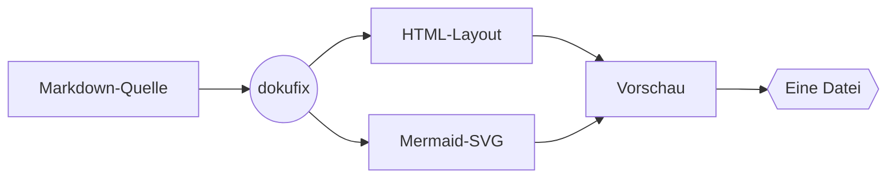
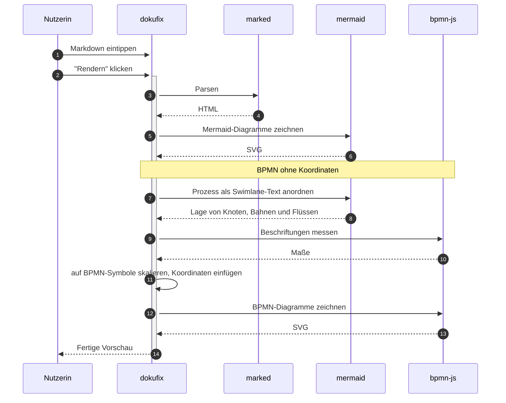
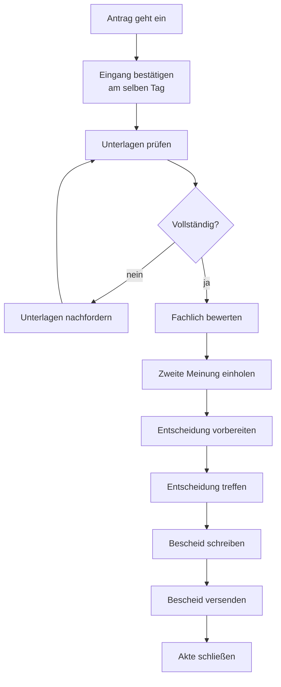
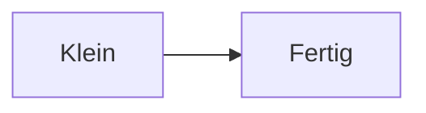
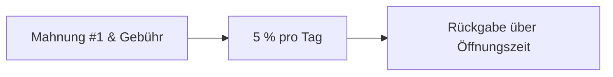

# Willkommen bei dokufix

Sie lesen gerade. Das hier ist der **Lesemodus** — keine Werkzeugleiste, keine Doppel-Ansicht, kein Chrome. Genau so kommt ein dokufix-Dokument beim Empfänger an: als ein Dokument, nicht als App.

Oben rechts gibt es einen einzigen kleinen Button: **„Editor ↩"**. Ein Klick — und Sie wechseln in die Bearbeitungsansicht und können diese Datei selbst verändern. Kein Tool installieren, kein Konto, keine Plattform dazwischen.

Manchmal sollen Empfänger gar nichts ändern können — bei einer veröffentlichten Richtlinie, einem Audit-Bericht, einer finalen Fassung. Dafür gibt es die **Auslieferung ohne Editor**: das Dokument bleibt lesbar, der Bearbeitungs-Modus fehlt komplett. Wird später doch eine Aktualisierung nötig, lässt sich der Inhalt jederzeit wieder in einen dokufix-Editor laden und weiterbearbeiten. Sie entscheiden bei jeder Auslieferung neu, ob das Dokument *gelesen* oder auch *fortgeschrieben* werden darf.

[[toc]]

## Was Sie in diesem Dokument sehen

- Überschriften, Listen, Tabellen
- *Kursiv*, **fett**, ~~durchgestrichen~~
- Inline-`Code` und Code-Blöcke
- Blockzitate und Hinweise
- Status-Chips
- Karten und Schrittlisten
- Tabellen mit Unterzeile, Filter und Suchfeld
- Bilder
- Fußnoten mit Vorschau
- **Mermaid- und BPMN-Diagramme**, BPMN auch ohne Koordinaten, jedes mit großer Ansicht und zum Herunterladen
- eine Suche über das ganze Dokument

Im Lesemodus öffnet die Taste `/` eine Suche, ebenso ein Klick auf die Lupe oben rechts; die Suche listet jede Stelle eines Begriffs mit einer Vorschau auf; ein Klick auf eine Stelle führt dorthin. Solange die Suche offen ist, steht jeder Treffer auch im Text gelb hinterlegt. Auch jede Zeile einer Tabelle ist eine Stelle; ihr Ergebnis beginnt mit „Tabelle:“, und eine Zeile, die ein Filter der Tabelle gerade ausblendet, ist mit „(ausgeblendet)“ markiert. Die Stellen stehen nach Abschnitten geordnet unter ihren Überschriften, und beim Blättern durch die Liste bleibt die Überschrift des Abschnitts oben stehen. Unter dem Suchfeld stehen zwei Schalter: „Groß- und Kleinschreibung beachten“ und „Leerzeichen, Bindestriche und Punkte ignorieren“; mit dem zweiten findet statuschip auch jeden Status-Chip. Ein Begriff braucht drei Buchstaben oder Ziffern; kürzer geht es mit einem anderen Zeichen wie # oder einem Emoji, und ae, oe, ue und ss werden immer gesucht, wie in Goethe. Das „ד oder Escape schließt sie; im Editor und in einer Datei mit Editor verlässt erst das nächste Escape den Lesemodus. Die Suche gibt es auch in den Fassungen „schlank“ und „kompakt“; dort öffnen `/` und die Lupe sie ebenso.

## Wie das hier zusammenspielt



Ein Klick auf ein Diagramm zeigt es groß über dem ganzen Fenster, eingepasst oder in 100, 150 und 200 %, und „Schließen“ oder ein zweiter Klick schließt es wieder, in jeder Fassung, auch in der offenen ohne Skript; wo ein Skript läuft, schließt es auch Escape, und `+` und `-` wechseln die Stufe. Ein BPMN-Diagramm zeigt die große Ansicht im Editor und in der Datei mit Editor im Viewer von bpmn.io: Strg + Mausrad zoomt, Ziehen verschiebt, auf dem Handy verschiebt ein Finger und zwei Finger zoomen, das Logo von bpmn.io steht unten rechts, und ein Klick auf das Diagramm schließt es dort nicht.

Unter jedem Diagramm stehen zwei kleine Knöpfe zum Herunterladen. Der erste gibt die Quelle: `.mmd`, den Mermaid-Text, wie er im Block steht, für einen Mermaid-Editor, oder `.bpmn`, das XML, wie es gezeichnet wurde, samt Koordinaten, für ein BPMN-Werkzeug wie den Camunda Modeler. Er geht in jeder Fassung, auch ohne Skript. Der zweite, `.svg`, gibt das Bild, das Sie sehen, für ein anderes Dokument; ihn gibt es, wo ein Skript läuft: im Editor, in der Datei mit Editor und in den Fassungen „schlank“ und „kompakt“. Die Dateien heißen nach der Überschrift über dem Diagramm.

## Eine Tabelle

| Feature | Status |
|---|---|
| Markdown rendern | ✅ |
| Mermaid rendern | ✅ |
| Metadaten-Kopf | ✅ |
| Fußnoten mit Vorschau | ✅ |
| Editor-Modus | 🚧 |
| Self-Save | 🚧 |
| Self-Replication | 🚧 |

### Lesehilfen im Detail

Bei breiteren Bildschirmen erscheint rechts eine schwebende Schiene mit allen Überschriften des Dokuments. Der gerade gelesene Abschnitt ist markiert; ein Klick springt direkt dorthin. Die Schiene blendet sich auf schmaleren Geräten aus — dort übernimmt das eingebettete Inhaltsverzeichnis oben.

## Status-Chips

Ein Code-Span, der mit einem Farbpunkt beginnt, wird zu einem Status-Chip: Aus `` `🟢 in Betrieb` `` wird `🟢 in Betrieb`. Es gibt fünf Farben: `🟢 in Betrieb`, `🟡 geplant`, `🔴 gestört`, `⚪ Übergangslösung` und `🔵 im Test`. Jede hat ein eigenes Zeichen vor dem Text, damit ein Status auch ohne Farbe erkennbar bleibt.

| System | Status |
|---|---|
| Bestellannahme | `🟢 in Betrieb` |
| Lagerverwaltung | `🟡 geplant` |
| Zahlungsschnittstelle | `🔴 gestört` |
| Altsystem Versand | `⚪ Übergangslösung` |
| Kundenportal | `🔵 im Test` |

### Kundenportal `🔵 im Test`

Ein Chip steht im Fließtext, in Tabellen, in Überschriften wie der hier, in **fettem Text: `🟡 geplant`** und in Verweisen: [`🟢 in Betrieb`](#status-chips). In einem Renderer, der dokufix nicht kennt, bleibt er ein Code-Span mit Farbpunkt.

## Hinweise

Ein Zitat, dessen erste Zeile nur eine Marke trägt, wird zum Hinweis. Fünf Marken gibt es: `[!NOTE]`, `[!TIP]`, `[!IMPORTANT]`, `[!WARNING]` und `[!CAUTION]`.

> [!NOTE]
> Geschrieben wird ein Hinweis wie ein Alert auf GitHub: die Marke in der ersten Zeile des Zitats, darunter der Text.

> [!TIP]
> Im Editor lässt sich jede Marke ausprobieren: eine andere einsetzen und neu rendern.

> [!IMPORTANT]
> Ein Hinweis nimmt auf, was ein Zitat aufnimmt:
> - mehrere Absätze und Aufzählungen
> - Code und Status-Chips wie `🔵 im Test`

> [!WARNING]
> Die Marke steht allein in der ersten Zeile. Folgt ihr in derselben Zeile Text, bleibt das Zitat ein Zitat.

> [!CAUTION]
> Ein Download überschreibt keine Datei: Der Browser legt jedes Mal eine neue an. Welche Fassung gilt, entscheidet, wer sie weitergibt.

## Karten

Eine Markierung über einer Aufzählung macht aus ihren Einträgen Karten. Der fette Text am Anfang eines Eintrags wird zum Titel der Karte; ein Eintrag ohne ihn wird eine Karte ohne Titel.

<!-- dokufix: cards -->
- **Mit Editor** Die Datei bleibt bearbeitbar. Wer sie bekommt, schreibt sie fort.
- **Offen** Ein reines Lesedokument ohne ein einziges Skript.
- **Schlank** Der Text steht lesbar in der Datei, die Diagramme sind gepackt.
- **Kompakt** Alles ist gepackt: die kleinste Datei.
- Welche passt, entscheiden Sie bei jedem Download neu.

Die Markierung ist ein Kommentar in der Zeile über der Liste: `<!-- dokufix: cards -->`. In einem Renderer, der HTML-Kommentare durchlässt, etwa auf GitHub, ist der Kommentar unsichtbar und die Liste eine Liste.

## Schrittliste

Dieselbe Art Markierung macht aus einer nummerierten Liste eine Schrittliste: `<!-- dokufix: steps -->`. Ein kursiver Anfang mit Doppelpunkt nennt, wer handelt.

<!-- dokufix: steps -->
1. *Autorin:* Den Text im Editor schreiben und rendern.
2. *Autorin:* Im Download-Menü die passende Auslieferung wählen.
3. *Empfänger:* Die Datei im Browser öffnen.
4. Lesen, oder weiterschreiben, wenn der Editor mitgeliefert wurde.

Eine Schrittliste darf mit einer anderen Zahl beginnen, etwa wenn sie eine Liste fortsetzt:

<!-- dokufix: steps -->
5. *Empfänger:* Die Datei ändern und wieder „Mit Editor“ herunterladen.[^version]
6. *Autorin:* Die neue Fassung öffnen und in der Versionsgeschichte vergleichen.

Eine Markierung, die nicht wirken kann, wird an ihrer Stelle zur Warnung, und die Liste bleibt eine Liste. Probieren Sie es im Editor: Schreiben Sie `crads` statt `cards`.

## Tabellen mit Filter

Eine Markierung über einer Tabelle nennt eine Spalte: `<!-- dokufix: facets Art -->`. Über der Tabelle steht dann für jeden Wert dieser Spalte ein Knopf. Wählen Sie einen, und die Tabelle zeigt nur die Zeilen mit diesem Wert; „Alle“ zeigt wieder alle. Das geht mit der Maus und mit den Pfeiltasten, und es braucht kein Skript: Der Filter arbeitet auch in der Nur-Lese-Fassung.

Eine zweite Markierung gibt derselben Tabelle ein Suchfeld: `<!-- dokufix: filter "Baustein suchen …" -->`. Wer etwas eintippt, sieht nur die Zeilen, in denen der Text vorkommt; die Zahl daneben sagt, wie viele das sind. Suchfeld und Knöpfe wirken zusammen. Das Suchfeld braucht ein Skript: Es steht hier, in der Datei „Mit Editor“ und in den Fassungen „schlank“ und „kompakt“. Die offene Fassung ohne Skript (`-nur-lesen.html`) zeigt die ganze Tabelle ohne Suchfeld, ebenso „schlank“, wenn der Browser keine Skripte ausführt, und auf Papier steht immer die ganze Tabelle.

<!-- dokufix: filter "Baustein suchen …" -->
<!-- dokufix: facets Art -->
| Baustein | Art | Geschrieben als |
|---|---|---|
| Hinweis<br>*fünf Marken* | Block | Zitat mit einer Marke in der ersten Zeile |
| Status-Chip<br>*fünf Farben* | Text | Code-Span mit Farbpunkt |
| Karten | Block | Markierung über einer Aufzählung |
| Schrittliste | Block | Markierung über einer nummerierten Liste |
| Fußnote<br>*mit Vorschau* | Text | Marke im Text, Erklärung am Ende |
| Unterzeile | Tabelle | kursiver Text nach einem Zeilenumbruch |
| Filter | Tabelle | Markierung über einer Tabelle |
| Suchfeld | Tabelle | Markierung über einer Tabelle, wirkt mit Skript |
| Diagramm | Block | Code-Block mit Mermaid-Text |

Die kleine zweite Zeile in der ersten Spalte ist eine **Unterzeile**: kursiver Text direkt nach einem Zeilenumbruch in der Zelle, geschrieben als `Hinweis<br>*fünf Marken*`.

Ein Suchfeld steht auch allein über einer Tabelle. Ohne Angabe hinter `filter` heißt es „Suchen …“:

<!-- dokufix: filter -->
| Taste | Wirkung |
|---|---|
| Strg + Eingabe | im Editor neu rendern[^tasten] |
| `/` | im Lesemodus die Suche öffnen, wie die Lupe oben rechts |
| Esc | eines nach dem anderen schließen: die große Ansicht, die Suche, den Text im Suchfeld einer Tabelle, zuletzt den Lesemodus |
| `+` und `-` | in der großen Ansicht die nächste oder die vorige Stufe |
| Pfeiltasten | im Filter den nächsten Wert wählen |
| Tab | zum nächsten Knopf, Verweis oder Suchfeld |

Eine Tabelle, die breiter ist als die Lesespalte, rollt für sich seitwärts. Die Seite bleibt so breit wie das Fenster:

| Auslieferung | Dateiendung | Weiterbearbeitung | Versionsgeschichte | Skriptabhängigkeit | Diagrammdarstellung | Größenordnung | Verwendungszweck |
|---|---|---|---|---|---|---|---|
| Mit Editor | `.html` | uneingeschränkt | vollständig | Bibliotheken aus dem Netz | beim Öffnen gezeichnet | am größten | Zusammenarbeit |
| Offen | `-nur-lesen.html` | ausgeschlossen | letzter Stand | keine | eingebettet | groß | Veröffentlichung, Langzeitablage |
| Schlank | `-schlank.html` | ausgeschlossen | letzter Stand | für Diagramme, Suche und Suchfelder | gepackt | mittel | Versand |
| Kompakt | `-kompakt.html` | ausgeschlossen | letzter Stand | für alles | gepackt | am kleinsten | Versand über schmale Leitungen |

## Bilder


Foto: Daria Yakovleva (Pixabay), über [Wikimedia Commons](https://commons.wikimedia.org/wiki/File:Piece_of_chocolate_cake_on_a_white_plate_decorated_with_chocolate_sauce.jpg), Lizenz [CC0 1.0](https://creativecommons.org/publicdomain/zero/1.0/deed.de)

Ein Bild kommt in den Editor, indem Sie es einfügen, auf den Text ziehen oder über „+ Bild“ auswählen. dokufix verkleinert es bei Bedarf, legt es einmal in der Datei ab und verweist im Text mit `#asset-` und einer Prüfsumme darauf; ein Bild, das zweimal vorkommt, liegt trotzdem nur einmal in der Datei. In den Fassungen ohne Editor steht das Bild als Daten direkt im Dokument und braucht nichts von außen.

## Der Metadaten-Kopf

Ganz oben, über der Überschrift, sitzt ein zugeklappter Streifen **Metadaten**. Klicken Sie ihn auf: Titel, Version, Datum, Schlagworte und Freigabe stehen dort als Tabelle statt als Rohtext.

Solche Kopfdaten schreibt praktisch jedes Dokumentationswerkzeug an den Anfang einer Markdown-Datei[^header] — und ohne Unterstützung landen sie als sichtbarer Müll im Dokument: eine Trennlinie, darunter die Schlüssel als Fließtext. dokufix erkennt den Block und zeigt ihn als Panel.

Der Streifen klappt **ohne JavaScript** auf und zu. Er funktioniert damit auch in der ausgelieferten Nur-Lese-Fassung[^header], in der kein Skript mehr enthalten ist.

## Fußnoten

Fahren Sie mit der Maus über diese Fußnote[^vorschau] — der Text erscheint direkt an der Stelle, ohne dass Sie ans Dokumentende springen müssen. Wer mit der Tastatur navigiert, bekommt dieselbe Vorschau beim Fokussieren.

Klicken Sie stattdessen darauf, landen Sie unten bei der Fußnote: Sie ist dann hervorgehoben, und **genau der Rückwärtspfeil**, der Sie hierher zurückbringt, ist markiert. Das ist mehr wert, als es klingt — sobald eine Fußnote von mehreren Stellen referenziert wird[^header], stehen unten mehrere Pfeile nebeneinander, und ohne Markierung rät man, welcher der eigene ist.

## Sequenzdiagramm



## Prozessmodell (BPMN)

Ein Prozess, gezeichnet in einem BPMN-Werkzeug wie dem Camunda Modeler: Sie kopieren das XML samt Koordinaten in einen Block mit der Sprache `bpmn`. dokufix zeichnet ihn mit der Bibliothek von bpmn.io; ins Dokument kommt nur das fertige Bild, und unter jedem BPMN-Diagramm steht der Verweis darauf. Zwei Pools, Bahnen, Nachrichtenflüsse zwischen den Pools:

```bpmn
<?xml version="1.0" encoding="UTF-8"?>
<bpmn:definitions xmlns:bpmn="http://www.omg.org/spec/BPMN/20100524/MODEL" xmlns:bpmndi="http://www.omg.org/spec/BPMN/20100524/DI" xmlns:dc="http://www.omg.org/spec/DD/20100524/DC" xmlns:di="http://www.omg.org/spec/DD/20100524/DI" id="Definitionen" targetNamespace="http://example.org/dokufix">
  <bpmn:collaboration id="Zusammenarbeit">
    <bpmn:participant id="Leser" name="Leser" processRef="Prozess_Leser"/>
    <bpmn:participant id="Bib" name="Bibliothek" processRef="Prozess_Bib"/>
    <bpmn:messageFlow id="N1" sourceRef="L_Bestellen" targetRef="T_Start"/>
    <bpmn:messageFlow id="N2" sourceRef="F_Melden" targetRef="L_Bereit"/>
    <bpmn:messageFlow id="N3" sourceRef="T_Absage" targetRef="Leser"/>
  </bpmn:collaboration>
  <bpmn:process id="Prozess_Leser" isExecutable="false">
    <bpmn:startEvent id="L_Start" name="Buch fehlt"/>
    <bpmn:sendTask id="L_Bestellen" name="Fernleihe bestellen"/>
    <bpmn:intermediateCatchEvent id="L_Bereit" name="Abholbereit"><bpmn:messageEventDefinition id="L_Bereit_Def"/></bpmn:intermediateCatchEvent>
    <bpmn:endEvent id="L_Ende" name="Buch da"/>
    <bpmn:sequenceFlow id="F1" sourceRef="L_Start" targetRef="L_Bestellen"/>
    <bpmn:sequenceFlow id="F2" sourceRef="L_Bestellen" targetRef="L_Bereit"/>
    <bpmn:sequenceFlow id="F3" sourceRef="L_Bereit" targetRef="L_Ende"/>
  </bpmn:process>
  <bpmn:process id="Prozess_Bib" isExecutable="false">
    <bpmn:laneSet id="Prozess_Bib_Bahnen">
      <bpmn:lane id="Theke" name="Theke"><bpmn:flowNodeRef>T_Start</bpmn:flowNodeRef><bpmn:flowNodeRef>T_Pruefen</bpmn:flowNodeRef><bpmn:flowNodeRef>T_Verbund</bpmn:flowNodeRef><bpmn:flowNodeRef>T_Absage</bpmn:flowNodeRef></bpmn:lane>
      <bpmn:lane id="Fernleihe" name="Fernleihe"><bpmn:flowNodeRef>F_Bestellen</bpmn:flowNodeRef><bpmn:flowNodeRef>F_Melden</bpmn:flowNodeRef><bpmn:flowNodeRef>F_Ende</bpmn:flowNodeRef></bpmn:lane>
    </bpmn:laneSet>
    <bpmn:startEvent id="T_Start" name="Bestellung"><bpmn:messageEventDefinition id="T_Start_Def"/></bpmn:startEvent>
    <bpmn:userTask id="T_Pruefen" name="Bestellung prüfen"/>
    <bpmn:exclusiveGateway id="T_Verbund" name="Im Verbund?"/>
    <bpmn:endEvent id="T_Absage" name="Absage"><bpmn:messageEventDefinition id="T_Absage_Def"/></bpmn:endEvent>
    <bpmn:serviceTask id="F_Bestellen" name="Beim Partner bestellen"/>
    <bpmn:sendTask id="F_Melden" name="Abholung melden"/>
    <bpmn:endEvent id="F_Ende" name="Gemeldet"/>
    <bpmn:sequenceFlow id="F4" sourceRef="T_Start" targetRef="T_Pruefen"/>
    <bpmn:sequenceFlow id="F5" sourceRef="T_Pruefen" targetRef="T_Verbund"/>
    <bpmn:sequenceFlow id="F6" name="nein" sourceRef="T_Verbund" targetRef="T_Absage"/>
    <bpmn:sequenceFlow id="F7" name="ja" sourceRef="T_Verbund" targetRef="F_Bestellen"/>
    <bpmn:sequenceFlow id="F8" sourceRef="F_Bestellen" targetRef="F_Melden"/>
    <bpmn:sequenceFlow id="F9" sourceRef="F_Melden" targetRef="F_Ende"/>
  </bpmn:process>
  <bpmndi:BPMNDiagram id="Diagramm">
    <bpmndi:BPMNPlane id="Ebene" bpmnElement="Zusammenarbeit">
      <bpmndi:BPMNShape id="Leser_di" bpmnElement="Leser" isHorizontal="true"><dc:Bounds x="0" y="0" width="906" height="110"/></bpmndi:BPMNShape>
      <bpmndi:BPMNShape id="Bib_di" bpmnElement="Bib" isHorizontal="true"><dc:Bounds x="0" y="170" width="906" height="240"/></bpmndi:BPMNShape>
      <bpmndi:BPMNShape id="Theke_di" bpmnElement="Theke" isHorizontal="true"><dc:Bounds x="30" y="170" width="876" height="120"/></bpmndi:BPMNShape>
      <bpmndi:BPMNShape id="Fernleihe_di" bpmnElement="Fernleihe" isHorizontal="true"><dc:Bounds x="30" y="290" width="876" height="120"/></bpmndi:BPMNShape>
      <bpmndi:BPMNShape id="L_Start_di" bpmnElement="L_Start"><dc:Bounds x="62" y="37" width="36" height="36"/><bpmndi:BPMNLabel><dc:Bounds x="35" y="78" width="90" height="27"/></bpmndi:BPMNLabel></bpmndi:BPMNShape>
      <bpmndi:BPMNShape id="L_Bestellen_di" bpmnElement="L_Bestellen"><dc:Bounds x="148" y="15" width="100" height="80"/></bpmndi:BPMNShape>
      <bpmndi:BPMNShape id="L_Bereit_di" bpmnElement="L_Bereit"><dc:Bounds x="652" y="37" width="36" height="36"/><bpmndi:BPMNLabel><dc:Bounds x="625" y="5" width="90" height="27"/></bpmndi:BPMNLabel></bpmndi:BPMNShape>
      <bpmndi:BPMNShape id="L_Ende_di" bpmnElement="L_Ende"><dc:Bounds x="770" y="37" width="36" height="36"/><bpmndi:BPMNLabel><dc:Bounds x="743" y="78" width="90" height="27"/></bpmndi:BPMNLabel></bpmndi:BPMNShape>
      <bpmndi:BPMNShape id="T_Start_di" bpmnElement="T_Start"><dc:Bounds x="210" y="212" width="36" height="36"/><bpmndi:BPMNLabel><dc:Bounds x="183" y="253" width="90" height="27"/></bpmndi:BPMNLabel></bpmndi:BPMNShape>
      <bpmndi:BPMNShape id="T_Pruefen_di" bpmnElement="T_Pruefen"><dc:Bounds x="296" y="190" width="100" height="80"/></bpmndi:BPMNShape>
      <bpmndi:BPMNShape id="T_Verbund_di" bpmnElement="T_Verbund" isMarkerVisible="true"><dc:Bounds x="439" y="205" width="50" height="50"/><bpmndi:BPMNLabel><dc:Bounds x="419" y="173" width="90" height="27"/></bpmndi:BPMNLabel></bpmndi:BPMNShape>
      <bpmndi:BPMNShape id="T_Absage_di" bpmnElement="T_Absage"><dc:Bounds x="564" y="212" width="36" height="36"/><bpmndi:BPMNLabel><dc:Bounds x="537" y="253" width="90" height="27"/></bpmndi:BPMNLabel></bpmndi:BPMNShape>
      <bpmndi:BPMNShape id="F_Bestellen_di" bpmnElement="F_Bestellen"><dc:Bounds x="532" y="310" width="100" height="80"/></bpmndi:BPMNShape>
      <bpmndi:BPMNShape id="F_Melden_di" bpmnElement="F_Melden"><dc:Bounds x="650" y="310" width="100" height="80"/></bpmndi:BPMNShape>
      <bpmndi:BPMNShape id="F_Ende_di" bpmnElement="F_Ende"><dc:Bounds x="800" y="332" width="36" height="36"/><bpmndi:BPMNLabel><dc:Bounds x="773" y="373" width="90" height="27"/></bpmndi:BPMNLabel></bpmndi:BPMNShape>
      <bpmndi:BPMNEdge id="F1_di" bpmnElement="F1"><di:waypoint x="98" y="55"/><di:waypoint x="148" y="55"/></bpmndi:BPMNEdge>
      <bpmndi:BPMNEdge id="F2_di" bpmnElement="F2"><di:waypoint x="248" y="55"/><di:waypoint x="652" y="55"/></bpmndi:BPMNEdge>
      <bpmndi:BPMNEdge id="F3_di" bpmnElement="F3"><di:waypoint x="688" y="55"/><di:waypoint x="770" y="55"/></bpmndi:BPMNEdge>
      <bpmndi:BPMNEdge id="F4_di" bpmnElement="F4"><di:waypoint x="246" y="230"/><di:waypoint x="296" y="230"/></bpmndi:BPMNEdge>
      <bpmndi:BPMNEdge id="F5_di" bpmnElement="F5"><di:waypoint x="396" y="230"/><di:waypoint x="439" y="230"/></bpmndi:BPMNEdge>
      <bpmndi:BPMNEdge id="F6_di" bpmnElement="F6"><di:waypoint x="489" y="230"/><di:waypoint x="564" y="230"/><bpmndi:BPMNLabel><dc:Bounds x="513" y="213" width="28" height="14"/></bpmndi:BPMNLabel></bpmndi:BPMNEdge>
      <bpmndi:BPMNEdge id="F7_di" bpmnElement="F7"><di:waypoint x="464" y="255"/><di:waypoint x="464" y="350"/><di:waypoint x="532" y="350"/><bpmndi:BPMNLabel><dc:Bounds x="470" y="296" width="20" height="14"/></bpmndi:BPMNLabel></bpmndi:BPMNEdge>
      <bpmndi:BPMNEdge id="F8_di" bpmnElement="F8"><di:waypoint x="632" y="350"/><di:waypoint x="650" y="350"/></bpmndi:BPMNEdge>
      <bpmndi:BPMNEdge id="F9_di" bpmnElement="F9"><di:waypoint x="750" y="350"/><di:waypoint x="800" y="350"/></bpmndi:BPMNEdge>
      <bpmndi:BPMNEdge id="N1_di" bpmnElement="N1"><di:waypoint x="198" y="95"/><di:waypoint x="198" y="154"/><di:waypoint x="228" y="154"/><di:waypoint x="228" y="212"/></bpmndi:BPMNEdge>
      <bpmndi:BPMNEdge id="N2_di" bpmnElement="N2"><di:waypoint x="700" y="310"/><di:waypoint x="700" y="192"/><di:waypoint x="670" y="192"/><di:waypoint x="670" y="73"/></bpmndi:BPMNEdge>
      <bpmndi:BPMNEdge id="N3_di" bpmnElement="N3"><di:waypoint x="582" y="212"/><di:waypoint x="582" y="110"/></bpmndi:BPMNEdge>
    </bpmndi:BPMNPlane>
  </bpmndi:BPMNDiagram>
</bpmn:definitions>
```

## Prozessmodell ohne Koordinaten

BPMN-XML muss keine Koordinaten haben. Fehlt der Koordinatenteil, ordnet dokufix den Prozess selbst an: jede Bahn wird eine Reihe, Pfeile docken an den Symbolen an, Beschriftungen bekommen ihren Platz. Das XML bleibt, wie Sie es geschrieben haben; es bekommt nur die Koordinaten dazu. So genügt es, Bahnen, Schritte und Flüsse aufzuschreiben, und kein Pfeil endet im Leeren, weil jemand Koordinaten geraten hat.

Ein Pool mit drei Bahnen; die beiden Zweige hinter dem Gateway liegen in verschiedenen Bahnen:

```bpmn
<?xml version="1.0" encoding="UTF-8"?>
<bpmn:definitions xmlns:bpmn="http://www.omg.org/spec/BPMN/20100524/MODEL" id="Definitionen" targetNamespace="http://example.org/dokufix">
  <bpmn:collaboration id="Zusammenarbeit">
    <bpmn:participant id="Bibliothek" name="Vormerkung" processRef="Prozess_Vormerkung"/>
  </bpmn:collaboration>
  <bpmn:process id="Prozess_Vormerkung" isExecutable="false">
    <bpmn:laneSet id="Bahnen">
      <bpmn:lane id="Leserin" name="Leserin"><bpmn:flowNodeRef>V_Start</bpmn:flowNodeRef><bpmn:flowNodeRef>V_Abholen</bpmn:flowNodeRef><bpmn:flowNodeRef>V_Ende</bpmn:flowNodeRef></bpmn:lane>
      <bpmn:lane id="Theke" name="Theke"><bpmn:flowNodeRef>V_Aufnehmen</bpmn:flowNodeRef><bpmn:flowNodeRef>V_Frage</bpmn:flowNodeRef><bpmn:flowNodeRef>V_Fernleihe</bpmn:flowNodeRef><bpmn:flowNodeRef>V_Benachrichtigen</bpmn:flowNodeRef></bpmn:lane>
      <bpmn:lane id="Magazin" name="Magazin"><bpmn:flowNodeRef>V_Holen</bpmn:flowNodeRef></bpmn:lane>
    </bpmn:laneSet>
    <bpmn:startEvent id="V_Start" name="Buch gewünscht"/>
    <bpmn:userTask id="V_Aufnehmen" name="Vormerkung aufnehmen"/>
    <bpmn:exclusiveGateway id="V_Frage" name="Im Bestand?"/>
    <bpmn:task id="V_Holen" name="Buch aus dem Magazin holen"/>
    <bpmn:sendTask id="V_Fernleihe" name="Fernleihe bestellen"/>
    <bpmn:sendTask id="V_Benachrichtigen" name="Leserin benachrichtigen"/>
    <bpmn:manualTask id="V_Abholen" name="Buch abholen"/>
    <bpmn:endEvent id="V_Ende" name="Ausgeliehen"/>
    <bpmn:sequenceFlow id="V1" sourceRef="V_Start" targetRef="V_Aufnehmen"/>
    <bpmn:sequenceFlow id="V2" sourceRef="V_Aufnehmen" targetRef="V_Frage"/>
    <bpmn:sequenceFlow id="V3" sourceRef="V_Frage" targetRef="V_Holen" name="ja"/>
    <bpmn:sequenceFlow id="V4" sourceRef="V_Frage" targetRef="V_Fernleihe" name="nein"/>
    <bpmn:sequenceFlow id="V5" sourceRef="V_Holen" targetRef="V_Benachrichtigen"/>
    <bpmn:sequenceFlow id="V6" sourceRef="V_Fernleihe" targetRef="V_Benachrichtigen"/>
    <bpmn:sequenceFlow id="V7" sourceRef="V_Benachrichtigen" targetRef="V_Abholen"/>
    <bpmn:sequenceFlow id="V8" sourceRef="V_Abholen" targetRef="V_Ende"/>
  </bpmn:process>
</bpmn:definitions>
```

### Ohne Bahnen

Ohne Bahnen und ohne Pool steht alles in einer Reihe:

```bpmn
<?xml version="1.0" encoding="UTF-8"?>
<bpmn:definitions xmlns:bpmn="http://www.omg.org/spec/BPMN/20100524/MODEL" id="Definitionen" targetNamespace="http://example.org/dokufix">
  <bpmn:process id="Prozess_Rueckgabe" isExecutable="false">
    <bpmn:startEvent id="R_Start" name="Medium zurück"/>
    <bpmn:serviceTask id="R_Scannen" name="Etikett scannen"/>
    <bpmn:intermediateCatchEvent id="R_Warten" name="Zwei Tage"><bpmn:timerEventDefinition id="R_Warten_Def"/></bpmn:intermediateCatchEvent>
    <bpmn:task id="R_Regal" name="Zurück ins Regal"/>
    <bpmn:endEvent id="R_Ende" name="Wieder ausleihbar"/>
    <bpmn:sequenceFlow id="R1" sourceRef="R_Start" targetRef="R_Scannen"/>
    <bpmn:sequenceFlow id="R2" sourceRef="R_Scannen" targetRef="R_Warten"/>
    <bpmn:sequenceFlow id="R3" sourceRef="R_Warten" targetRef="R_Regal"/>
    <bpmn:sequenceFlow id="R4" sourceRef="R_Regal" targetRef="R_Ende"/>
  </bpmn:process>
</bpmn:definitions>
```

Alle Knoten einer Bahn stehen in einer Reihe. Parallele Zweige gehören deshalb in verschiedene Bahnen, sonst laufen sie hintereinander und kreuzen sich.

### Mit Schleife

Ein Pfeil zurück zu einem früheren Schritt derselben Bahn, eine Schleife, läuft um die Reihe herum, oberhalb oder unterhalb der Symbole, und dockt oben oder unten an:

```bpmn
<?xml version="1.0" encoding="UTF-8"?>
<bpmn:definitions xmlns:bpmn="http://www.omg.org/spec/BPMN/20100524/MODEL" id="Definitionen" targetNamespace="http://example.org/dokufix">
  <bpmn:collaboration id="Zusammenarbeit">
    <bpmn:participant id="Buchpflege" name="Reparatur" processRef="Prozess_Reparatur"/>
  </bpmn:collaboration>
  <bpmn:process id="Prozess_Reparatur" isExecutable="false">
    <bpmn:laneSet id="Bahnen">
      <bpmn:lane id="B_Theke" name="Theke"><bpmn:flowNodeRef>B_Start</bpmn:flowNodeRef><bpmn:flowNodeRef>B_Ausgeben</bpmn:flowNodeRef><bpmn:flowNodeRef>B_Ende</bpmn:flowNodeRef></bpmn:lane>
      <bpmn:lane id="B_Werkstatt" name="Werkstatt"><bpmn:flowNodeRef>B_Ansehen</bpmn:flowNodeRef><bpmn:flowNodeRef>B_Kleben</bpmn:flowNodeRef><bpmn:flowNodeRef>B_Pressen</bpmn:flowNodeRef><bpmn:flowNodeRef>B_Frage</bpmn:flowNodeRef></bpmn:lane>
    </bpmn:laneSet>
    <bpmn:startEvent id="B_Start" name="Buch beschädigt"/>
    <bpmn:task id="B_Ansehen" name="Schaden ansehen"/>
    <bpmn:task id="B_Kleben" name="Rücken kleben"/>
    <bpmn:task id="B_Pressen" name="Über Nacht pressen"/>
    <bpmn:exclusiveGateway id="B_Frage" name="Hält es?"/>
    <bpmn:task id="B_Ausgeben" name="Wieder ausgeben"/>
    <bpmn:endEvent id="B_Ende" name="Im Regal"/>
    <bpmn:sequenceFlow id="B1" sourceRef="B_Start" targetRef="B_Ansehen"/>
    <bpmn:sequenceFlow id="B2" sourceRef="B_Ansehen" targetRef="B_Kleben"/>
    <bpmn:sequenceFlow id="B3" sourceRef="B_Kleben" targetRef="B_Pressen"/>
    <bpmn:sequenceFlow id="B4" sourceRef="B_Pressen" targetRef="B_Frage"/>
    <bpmn:sequenceFlow id="B5" sourceRef="B_Frage" targetRef="B_Ausgeben" name="ja"/>
    <bpmn:sequenceFlow id="B6" sourceRef="B_Frage" targetRef="B_Ansehen" name="nein"/>
    <bpmn:sequenceFlow id="B7" sourceRef="B_Ausgeben" targetRef="B_Ende"/>
  </bpmn:process>
</bpmn:definitions>
```

### Mehrere Pools

Wer mit wem Nachrichten tauscht, steht in Pools: jeder Beteiligte bekommt einen, untereinander, und die Nachrichten laufen gestrichelt senkrecht von Pool zu Pool. Sie sollten drei Pools sehen, „Leserin“, „Bibliothek“ mit den Bahnen „Theke“ und „Fernleihe“, und „Partnerbibliothek“, dazu vier Nachrichtenflüsse mit ihren Namen:

```bpmn
<?xml version="1.0" encoding="UTF-8"?>
<bpmn:definitions xmlns:bpmn="http://www.omg.org/spec/BPMN/20100524/MODEL" id="Definitionen" targetNamespace="http://example.org/dokufix">
  <bpmn:collaboration id="Zusammenarbeit">
    <bpmn:participant id="Leserin" name="Leserin" processRef="Prozess_Leserin"/>
    <bpmn:participant id="Bibliothek" name="Bibliothek" processRef="Prozess_Bibliothek"/>
    <bpmn:participant id="Partner" name="Partnerbibliothek" processRef="Prozess_Partner"/>
    <bpmn:messageFlow id="N_Wunsch" name="Fernleihwunsch" sourceRef="L_Bestellen" targetRef="B_Eingang"/>
    <bpmn:messageFlow id="N_Anfrage" name="Anfrage" sourceRef="B_Anfragen" targetRef="P_Eingang"/>
    <bpmn:messageFlow id="N_Buch" name="Buch" sourceRef="P_Senden" targetRef="B_Buch"/>
    <bpmn:messageFlow id="N_Bereit" name="Bereitgelegt" sourceRef="B_Melden" targetRef="L_Bereit"/>
  </bpmn:collaboration>
  <bpmn:process id="Prozess_Leserin" isExecutable="false">
    <bpmn:startEvent id="L_Start" name="Buch fehlt"/>
    <bpmn:sendTask id="L_Bestellen" name="Fernleihe bestellen"/>
    <bpmn:intermediateCatchEvent id="L_Bereit" name="Liegt bereit"><bpmn:messageEventDefinition id="L_Bereit_Def"/></bpmn:intermediateCatchEvent>
    <bpmn:endEvent id="L_Ende" name="Buch abgeholt"/>
    <bpmn:sequenceFlow id="L1" sourceRef="L_Start" targetRef="L_Bestellen"/>
    <bpmn:sequenceFlow id="L2" sourceRef="L_Bestellen" targetRef="L_Bereit"/>
    <bpmn:sequenceFlow id="L3" sourceRef="L_Bereit" targetRef="L_Ende"/>
  </bpmn:process>
  <bpmn:process id="Prozess_Bibliothek" isExecutable="false">
    <bpmn:laneSet id="Bahnen_Bibliothek">
      <bpmn:lane id="B_Theke" name="Theke"><bpmn:flowNodeRef>B_Eingang</bpmn:flowNodeRef><bpmn:flowNodeRef>B_Melden</bpmn:flowNodeRef><bpmn:flowNodeRef>B_Ende</bpmn:flowNodeRef></bpmn:lane>
      <bpmn:lane id="B_Fernleihe" name="Fernleihe"><bpmn:flowNodeRef>B_Anfragen</bpmn:flowNodeRef><bpmn:flowNodeRef>B_Buch</bpmn:flowNodeRef></bpmn:lane>
    </bpmn:laneSet>
    <bpmn:startEvent id="B_Eingang" name="Wunsch da"><bpmn:messageEventDefinition id="B_Eingang_Def"/></bpmn:startEvent>
    <bpmn:sendTask id="B_Anfragen" name="Partner anfragen"/>
    <bpmn:intermediateCatchEvent id="B_Buch" name="Buch da"><bpmn:messageEventDefinition id="B_Buch_Def"/></bpmn:intermediateCatchEvent>
    <bpmn:sendTask id="B_Melden" name="Leserin benachrichtigen"/>
    <bpmn:endEvent id="B_Ende" name="Erledigt"/>
    <bpmn:sequenceFlow id="B1" sourceRef="B_Eingang" targetRef="B_Anfragen"/>
    <bpmn:sequenceFlow id="B2" sourceRef="B_Anfragen" targetRef="B_Buch"/>
    <bpmn:sequenceFlow id="B3" sourceRef="B_Buch" targetRef="B_Melden"/>
    <bpmn:sequenceFlow id="B4" sourceRef="B_Melden" targetRef="B_Ende"/>
  </bpmn:process>
  <bpmn:process id="Prozess_Partner" isExecutable="false">
    <bpmn:startEvent id="P_Eingang" name="Anfrage da"><bpmn:messageEventDefinition id="P_Eingang_Def"/></bpmn:startEvent>
    <bpmn:task id="P_Suchen" name="Buch heraussuchen"/>
    <bpmn:sendTask id="P_Senden" name="Buch schicken"/>
    <bpmn:endEvent id="P_Ende" name="Verschickt"/>
    <bpmn:sequenceFlow id="P1" sourceRef="P_Eingang" targetRef="P_Suchen"/>
    <bpmn:sequenceFlow id="P2" sourceRef="P_Suchen" targetRef="P_Senden"/>
    <bpmn:sequenceFlow id="P3" sourceRef="P_Senden" targetRef="P_Ende"/>
  </bpmn:process>
</bpmn:definitions>
```

## Code-Block (kein Mermaid)

```javascript
function dokufix(md) {
  const html = marked.parse(md);
  return renderMermaidIn(html);
}

// Diese Zeile ist länger als die Spalte: Sie bricht um, ihre Fortsetzung steht ohne eigene Nummer unter ihrem Text, und nichts rollt seitlich.
```

Jede Zeile trägt ihre Nummer, auch die leere Zeile 5; die Nummern werden weder markiert noch kopiert noch gefunden. Die Schaltfläche oben rechts kopiert den Code, wie er geschrieben ist, und zeigt zwei Sekunden lang ein Häkchen; in der offenen Fassung ohne Skript (`-nur-lesen.html`) fehlt sie, Nummern und Umbruch bleiben.

> **Träger für Inhalte.** Die HTML ist nur die aktuelle Hülle.

## Sonderfälle

Hier stehen Fälle, an denen sich ein Fehler zuerst zeigt. Vor jedem steht, was Sie sehen sollten.

Eine Fußnote in einer Karte und in einem Hinweis zeigt ihre Vorschau wie im Fließtext, ebenso die im fünften Schritt weiter oben.

<!-- dokufix: cards -->
- **Karte** mit einer Fußnote.[^ort]
- **Zweite Karte** ohne Fußnote.

> [!NOTE]
> Ein Hinweis mit derselben Fußnote.[^ort]

Ein Hinweis darf eine Überschrift, eine Liste und Code enthalten. Die Überschrift steht weder im Inhaltsverzeichnis noch in der Schiene.

> [!TIP]
> ### Überschrift im Hinweis
> - ein Punkt
> - noch ein Punkt
>
> ```text
> Code im Hinweis
> ```

Steht eine Tabelle zuletzt in einem Hinweis, folgt unter ihr kein zusätzlicher Abstand.

> [!IMPORTANT]
> | Medium | Leihfrist |
> |---|---|
> | Buch | 28 Tage |

Die Knöpfe über dieser Tabelle zeigen nur den Text der Chips. Die leere Zelle hat den Knopf „(leer)“, und „gestört“ mit seiner Unterzeile zählt als „gestört“.

<!-- dokufix: facets Status -->
| Dienst | Status |
|---|---|
| Ausleihe | `🟢 in Betrieb` |
| Rückgabe | `🔴 gestört`<br>*seit Montag* |
| Fernleihe | `🟢 in Betrieb` |
| Archiv | |
| Kasse | `🔴 gestört` |

Diese breite Tabelle hat Suchfeld, Knöpfe und eine Fußnote in einer Zelle; „Ja/Nein“ mit Unterzeile zählt als „Ja/Nein“. Rollen Sie die Tabelle zur Seite: Suchfeld und Knöpfe bleiben stehen.

<!-- dokufix: filter "Feld suchen …" -->
<!-- dokufix: facets Pflicht -->
| Feld | Pflicht | Formularseite | Beschreibung_für_die_Ablage | Prüfung_bei_der_Eingabe | Herkunft_des_Wertes | Bemerkung |
|---|---|---|---|---|---|---|
| Name[^feld] | Ja/Nein<br>*je eines* | Anmeldung | Vor- und Nachname getrennt | nicht leer | Formular | keine |
| Telefon | Nein | Anmeldung | mit Vorwahl | Ziffern und Leerzeichen | Formular | keine |
| Ausweis | Ja/Nein | Theke | Nummer auf der Karte | sieben Ziffern | Theke | wird geprüft |

Ein Titel mit Doppelpunkt dahinter und einer mit Zeilenumbruch danach sehen aus wie jeder andere Kartentitel, ohne Doppelpunkt. Eine Karte darf eine Liste enthalten.

<!-- dokufix: cards -->
- **Theke**: Mit Beratung, zu den Öffnungszeiten.
- **Automat**\
  Ohne Wartezeit, rund um die Uhr.
- **Rückgabe** Zwei Wege:
  - am Automaten
  - an der Theke

Diese Schrittliste beginnt mit 3. „Website“ steht fett als Rolle über dem Schritt, „Nie“ bleibt ein betontes Wort im Text.

<!-- dokufix: steps -->
3. ***Website:*** Das Formular absenden.
4. *Nie* ohne Backup starten.

Eine Markierung in einem Listeneintrag wirkt dort: Der Eintrag enthält Karten.

- Ausleihe an zwei Orten:

  <!-- dokufix: cards -->
  - **Theke** mit Beratung
  - **Automat** ohne Wartezeit

Dieselbe Fußnote wie in der Tabelle der Tasten, hier im Fließtext: Unten stehen bei ihr zwei Rückwärtspfeile.[^tasten]

Ein BPMN-Prozess ohne Pool und ohne Bahnen, mit einem Zeit-Startereignis, Aufgabenarten, die im Prozessmodell oben fehlen, und einer Aufrufaktivität. Auch unter ihm steht „Gezeichnet mit bpmn-js“.

```bpmn
<?xml version="1.0" encoding="UTF-8"?>
<bpmn:definitions xmlns:bpmn="http://www.omg.org/spec/BPMN/20100524/MODEL" xmlns:bpmndi="http://www.omg.org/spec/BPMN/20100524/DI" xmlns:dc="http://www.omg.org/spec/DD/20100524/DC" xmlns:di="http://www.omg.org/spec/DD/20100524/DI" id="Definitionen" targetNamespace="http://example.org/dokufix">
  <bpmn:process id="Prozess_Abend" isExecutable="false">
    <bpmn:startEvent id="A_Start" name="Jeden Abend"><bpmn:timerEventDefinition id="A_Start_Def"/></bpmn:startEvent>
    <bpmn:manualTask id="A_Kasse" name="Kasse zählen"/>
    <bpmn:scriptTask id="A_Bericht" name="Ausleih-Statistik erzeugen"/>
    <bpmn:businessRuleTask id="A_Regeln" name="Mahnstufe setzen"/>
    <bpmn:callActivity id="A_Archiv" name="Archivieren"/>
    <bpmn:endEvent id="A_Ende" name="Feierabend"/>
    <bpmn:sequenceFlow id="A1" sourceRef="A_Start" targetRef="A_Kasse"/>
    <bpmn:sequenceFlow id="A2" sourceRef="A_Kasse" targetRef="A_Bericht"/>
    <bpmn:sequenceFlow id="A3" sourceRef="A_Bericht" targetRef="A_Regeln"/>
    <bpmn:sequenceFlow id="A4" sourceRef="A_Regeln" targetRef="A_Archiv"/>
    <bpmn:sequenceFlow id="A5" sourceRef="A_Archiv" targetRef="A_Ende"/>
  </bpmn:process>
  <bpmndi:BPMNDiagram id="Diagramm">
    <bpmndi:BPMNPlane id="Ebene" bpmnElement="Prozess_Abend">
      <bpmndi:BPMNShape id="A_Start_di" bpmnElement="A_Start"><dc:Bounds x="32" y="42" width="36" height="36"/><bpmndi:BPMNLabel><dc:Bounds x="5" y="83" width="90" height="27"/></bpmndi:BPMNLabel></bpmndi:BPMNShape>
      <bpmndi:BPMNShape id="A_Kasse_di" bpmnElement="A_Kasse"><dc:Bounds x="120" y="20" width="100" height="80"/></bpmndi:BPMNShape>
      <bpmndi:BPMNShape id="A_Bericht_di" bpmnElement="A_Bericht"><dc:Bounds x="240" y="20" width="100" height="80"/></bpmndi:BPMNShape>
      <bpmndi:BPMNShape id="A_Regeln_di" bpmnElement="A_Regeln"><dc:Bounds x="360" y="20" width="100" height="80"/></bpmndi:BPMNShape>
      <bpmndi:BPMNShape id="A_Archiv_di" bpmnElement="A_Archiv"><dc:Bounds x="480" y="20" width="100" height="80"/></bpmndi:BPMNShape>
      <bpmndi:BPMNShape id="A_Ende_di" bpmnElement="A_Ende"><dc:Bounds x="632" y="42" width="36" height="36"/><bpmndi:BPMNLabel><dc:Bounds x="605" y="83" width="90" height="27"/></bpmndi:BPMNLabel></bpmndi:BPMNShape>
      <bpmndi:BPMNEdge id="A1_di" bpmnElement="A1"><di:waypoint x="68" y="60"/><di:waypoint x="120" y="60"/></bpmndi:BPMNEdge>
      <bpmndi:BPMNEdge id="A2_di" bpmnElement="A2"><di:waypoint x="220" y="60"/><di:waypoint x="240" y="60"/></bpmndi:BPMNEdge>
      <bpmndi:BPMNEdge id="A3_di" bpmnElement="A3"><di:waypoint x="340" y="60"/><di:waypoint x="360" y="60"/></bpmndi:BPMNEdge>
      <bpmndi:BPMNEdge id="A4_di" bpmnElement="A4"><di:waypoint x="460" y="60"/><di:waypoint x="480" y="60"/></bpmndi:BPMNEdge>
      <bpmndi:BPMNEdge id="A5_di" bpmnElement="A5"><di:waypoint x="580" y="60"/><di:waypoint x="632" y="60"/></bpmndi:BPMNEdge>
    </bpmndi:BPMNPlane>
  </bpmndi:BPMNDiagram>
</bpmn:definitions>
```


### Große Ansicht

Ein Diagramm, das in der Spalte höher ist als das Fenster. Klicken Sie weit unten darauf: Es öffnet sich groß, und die Seite dahinter springt nicht. „Einpassen“ zeigt es ganz. Nach „Schließen“ stehen Sie an derselben Stelle wie vor dem Klick.



Ein kleines Diagramm: „Einpassen“ vergrößert es höchstens auf das Anderthalbfache, „100 %“ zeigt es so groß, wie es gezeichnet ist. Schließen Sie es bei „150 %“ und öffnen Sie es wieder: Es steht noch bei „150 %“, bis das Dokument neu gerendert wird.



Solange ein Diagramm groß offen ist, öffnet `/` keine Suche, und Escape schließt zuerst die große Ansicht. Ist die Suche schon offen, schließt das erste Escape die große Ansicht, das zweite die Suche.

Die beiden Diagramme oben stehen unter derselben Überschrift. Ihre Knöpfe zum Herunterladen liegen unter ihnen, außerhalb der großen Ansicht, und ihre Dateien heißen verschieden: `Große-Ansicht.mmd` und `Große-Ansicht-2.mmd`, die Bilder ebenso.

### Herunterladen: Gebühr 5 %/Tag?

Ein Titel mit Zeichen, die ein Dateiname nicht trägt: Die Dateien dieses Diagramms heißen `Herunterladen--Gebühr-5---Tag-.mmd` und `.svg`. Sein Text enthält `#`, `%`, `&`, Anführungszeichen, spitze Klammern und Umlaute; die heruntergeladene Datei `.mmd` enthält ihn Zeichen für Zeichen, wie er hier im Block steht.



### Suche

Öffnen Sie mit `/` die Suche und probieren Sie diese Fälle:

- Die Lupe oben rechts öffnet die Suche ebenso, bei jeder Fensterbreite an derselben Stelle: im Editor und in der Fassung mit Editor links neben „Editor ↩“, in „schlank“ und „kompakt“ in der Ecke, auch wenn rechts das Inhaltsverzeichnis steht. Ein zweiter Klick bei offener Suche schließt sie nicht; Ihr Begriff bleibt stehen.
- Auf einem schmalen Bildschirm, bis 820 px Breite, klappt ein Tipp auf ein Ergebnis die Suche zu einer Leiste am unteren Rand zusammen, und die Stelle steht frei darüber: „Stelle 2 von 7“, ‹ und › zur vorigen und zur nächsten Stelle, „Liste“ zurück zu Begriff und Ergebnissen, × schließt die Suche. Probieren Sie es in einem schmalen Fenster mit dem Begriff „Tabelle“: Auf der ersten Stelle ist ‹ ausgegraut, auf der letzten ›; „Liste“ zeigt die Liste, wo Sie sie verlassen haben; `/` oder die Lupe bringen sie ebenso zurück, mit dem Fokus im Suchfeld; Escape schließt die Suche auch zugeklappt. Ändern Sie, während die Leiste steht, den Filter einer Tabelle: Die Nummer folgt der Stelle; ist die Stelle aus der Liste verschwunden, steht dort nur noch die Zahl der Stellen, und › beginnt bei der ersten. Ziehen Sie das Fenster breiter als 820 px, kommt die ganze Liste zurück; im breiten Fenster bleibt die Liste nach einem Klick offen.
- Ein Wort, das eine Hervorhebung teilt, ist ein Treffer: Leucht*turm*wärter. Suchen Sie danach; der Treffer ist am Stück gelb hinterlegt.
- Mit dem Schalter „Leerzeichen, Bindestriche und Punkte ignorieren“ findet derselbe Begriff auch Leucht-Turm-Wärter in dieser Zeile. Ohne den Schalter findet er nur die Zeile davor.
- Ein Leerzeichen am Rand des Begriffs ist eine Wortgrenze: Suchen Sie nach „Klick “ mit einem Leerzeichen dahinter. Die Suche findet in dieser Zeile Klick vor einem Leerzeichen, vor einem Punkt, hinter ⚠️ und am Ende der Zeile, auch das Ende von Doppelklick., aber nicht Klicken. Ein Leerzeichen davor, „ Klick“, findet keinen Doppelklick, wohl aber Klicken und ⚠️Klick. Mit dem Schalter „Leerzeichen, Bindestriche und Punkte ignorieren“ zählt der Rand nicht mehr, und beide finden alles wieder. Ebenso im Suchfeld der ersten Tabelle mit Filter: „zeile“ behält zwei Zeilen, „ zeile “ mit Leerzeichen davor und dahinter nur die mit „ersten Zeile“, nicht die Unterzeile. Zuletzt ein Klick
- Ein Begriff aus einer Fußnote ist ein Treffer bei der Fußnote unten, nicht bei ihrem Zeichen hier: Suchen Sie nach dem zweiten Wort der Fußnote.[^suche]
- Das Wort, das ein Status-Chip für Screenreader trägt, ist kein Treffer: Die Suche nach blau findet nur diese Zeile, nicht den Chip `🔵 im Test` in ihr.
- Was vor der ersten Überschrift der Ebene 2 steht, bildet eine eigene Gruppe mit dem Titel des Dokuments: Die Suche nach Lesemodus beginnt mit „Willkommen bei dokufix“.
- Eine Überschrift in einem Hinweis zählt zur Gruppe, in der der Hinweis steht: „Überschrift im Hinweis“ erscheint unter „Sonderfälle“.
- Vor jedem Ergebnis aus einer Tabelle, einem Diagramm oder einem Code-Block steht ein kleines Symbol in eigener Farbe: grün für „Tabelle:“, blau für „BPMN-Diagramm:“, lila für „Mermaid-Diagramm:“, orange für „Code:“. „Metadaten:“ bleibt grau, ohne Symbol.
- Ein Wort, das nur in einer Tabelle steht, ist ein Treffer in seiner Zeile: Suchen Sie nach dem Falter in der ersten Tabelle darunter. Das Ergebnis lautet „Tabelle:“ und das Wort; ein Klick rollt zur Zeile, und das Wort ist dort gelb hinterlegt.
- Auch die Kopfzeile ist eine Zeile: Die Suche nach dem Wort über der zweiten Spalte der zweiten Tabelle findet nur sie.
- Der Name des ersten Falters der zweiten Tabelle steckt auch in seiner Futterpflanze: Die Suche nach seinen ersten sechs Buchstaben findet die Zeile einmal, mit zwei Treffern, beide gelb.
- Mit dem Schalter „Leerzeichen, Bindestriche und Punkte ignorieren“ findet der zweite Falter der zweiten Tabelle, ohne Leerzeichen gefolgt von seiner Futterpflanze, seine Zeile; gelb sind beide Zellen, jede für sich.
- In einer Zelle ist das Wort eines Status-Chips ebenso kein Treffer: Die Suche nach grün findet nur diese Zeile, nicht den Chip `🟢 gesehen` in der zweiten Tabelle. Eine Fußnote zählt bei ihrer Erklärung unten, nicht bei ihrem Zeichen in der Zelle: Die Suche nach Alpen findet die Fußnote und diese Zeile, nicht die Tabelle.
- Eine Zeile, die ein Filter ausblendet, steht in der Liste mit „(ausgeblendet)“: Wählen Sie oben in „Tabellen mit Filter“ den Knopf „Text“ und suchen Sie nach Karten. Ein Klick auf die Zeile der Tabelle rollt zu den Knöpfen, und der Filter bleibt, wie er ist. Wählen Sie dort „Alle“, während die Suche offen ist: Die Marke verschwindet, und ein Klick rollt zur Zeile.
- Ebenso beim Suchfeld der Tabelle mit den Tasten: Tippen Sie dort Pfeiltasten und suchen Sie nach rendern. Die Zeile mit Strg + Eingabe ist ausgeblendet, ein Klick auf sie rollt zum Suchfeld, und sein Text bleibt.
- Ein Diagramm ist eine Stelle, sein Text die Beschriftungen, die Sie sehen: Die Suche nach Abholbereit findet diese Zeile und das BPMN-Diagramm unter „Prozessmodell (BPMN)“. Das Ergebnis lautet „BPMN-Diagramm:“ und die Beschriftungen um den Treffer; die Treffer im Diagramm sind gelb hinterlegt wie im Text, und ein Klick rollt den ersten in die Mitte des Fensters.
- Ebenso ein Mermaid-Diagramm: Die Suche nach nachfordern findet diese Zeile und das hohe Diagramm unter „Große Ansicht“, als „Mermaid-Diagramm:“. Der Treffer steht weit unten im Diagramm, gelb hinterlegt; ein Klick bringt ihn in die Mitte des Fensters.
- Die große Ansicht eines Diagramms behält die gelben Treffer. Nur die große Ansicht eines BPMN-Diagramms im Editor und in der Fassung mit Editor, in der Sie ziehen und zoomen, zeigt keine Markierung; das ist gewollt.
- Eine Beschriftung, die über zwei Zeilen gezeichnet ist, ist ein Treffer am Stück: Die Suche nach „Fernleihe bestellen“ findet auch ohne den Schalter „Leerzeichen, Bindestriche und Punkte ignorieren“ beide BPMN-Diagramme oben; im ersten steht die Aufgabe über zwei Zeilen, und gelb ist jede Zeile für sich.
- Bricht das BPMN-Diagramm eine Beschriftung nach einem Bindestrich um, findet die Suche das ganze Wort: Unter „Sonderfälle“ steht im Diagramm mit „Feierabend“ die Aufgabe Ausleih-Statistik über zwei Zeilen, „Ausleih-“ oben, und die Suche nach Ausleih-Statistik findet sie ohne den Schalter.
- Ein Zeilenumbruch in einer Mermaid-Beschriftung ist ein Leerzeichen: Im hohen Diagramm unter „Große Ansicht“ steht „Eingang bestätigen“ über „am selben Tag“, und die Suche nach „bestätigen am selben“ findet beide Zeilen als eine Wendung; gelb ist jede Zeile für sich.
- Ein Treffer zählt, was Sie sehen: Das Sequenzdiagramm zeichnet jede Beteiligte oben und unten, die Suche nach Nutzerin findet es deshalb mit zwei Treffern, dazu diese Zeile. Gelb sind beide Zeichnungen, oben und unten.
- Ein Treffer über zwei Beschriftungen ist in jeder für sich gelb: Im Diagramm unter „Mit Schleife“ folgt auf die Aufgabe „Rücken kleben“ die Aufgabe „Über Nacht pressen“. Die Suche nach „Rücken kleben Über Nacht“ findet das Diagramm; gelb sind „Rücken kleben“ und „Über Nacht“, jede in ihrer Aufgabe, und nichts dazwischen.
- Was nur in der Quelle eines Diagramms steht, ist kein Treffer: Der Teilprozess „Einarbeiten“ im letzten Diagramm enthält eine Aufgabe Stempeln, die nicht gezeichnet ist; die Suche nach ihr findet nur diese Zeile, ebenso die Suche nach dem Namen des Prozesses, Prozess_Neu.
- Der Rahmen eines Diagramms gehört nicht zu ihm: Die Suche nach Einpassen oder Gezeichnet findet kein Diagramm, obwohl die große Ansicht und die Zeile unter einem BPMN-Diagramm diese Wörter zeigen.
- Der Metadaten-Kopf ganz oben ist eine Stelle, auch zugeklappt: Die Suche nach dem Namen der Autorin, den er nennt, findet nur ihn, als „Metadaten:“ in der ersten Gruppe. Ein Klick klappt ihn auf und rollt zum Namen, der gelb hinterlegt ist; der Kopf bleibt offen.
- Auch ein Schlüssel des Kopfs ist ein Treffer: Die Suche nach gueltig_bis findet den Kopf und diese Zeile.
- Die Beschriftung des Kopfs gehört nicht zu ihm: Die Suche nach Metadaten findet ihn nicht. Den Titel, den die Zeile neben der Beschriftung wiederholt, zählt der Kopf einmal: Die Suche nach „Willkommen bei dokufix“ findet ihn mit einem Treffer.
- Ein Code-Block ist eine Stelle: Die Suche nach der Funktion, die der Block unter „Code-Block (kein Mermaid)“ in seiner dritten Zeile aufruft, findet nur ihn, als „Code:“. Ein Klick rollt den Treffer in die Mitte des Fensters; er ist gelb hinterlegt, in dunkler Schrift lesbar.
- Ein Code-Block in einem Listenpunkt ist eine Stelle für sich und kein Text des Punkts: Die Suche nach dem ersten Wort im Block hier findet nur den Block, als „Code:“.
  ```text
  Rückbuchungsbeleg ausdrucken
  ```

| Nur in dieser Tabelle |
|---|
| Zitronenfalter |

| Wanderer | Raupenkost | Flugzeit | Beobachtet |
|---|---|---|---|
| Distelfalter | Disteln, Brennnesseln | Mai bis Oktober[^falter] | `🔵 im Test` |
| Admiral | Brennnesseln | Juni bis Oktober | `🟢 gesehen` |

### BPMN ohne Koordinaten: Pool ohne Bahnen

Ein BPMN-Prozess ohne Koordinaten mit Sonderfällen: ein Pool ohne Bahnen; XML ohne Präfix, mit einem Kommentar nach dem Schluss-Tag; ids, die wie Mermaids Schlüsselwörter heißen (`end`, `subgraph`, `graph`); zwei Flüsse zwischen denselben beiden Knoten, die zwei eigene Wege bekommen; eine Notiz an einer Aufgabe. Sie sollten einen Pool „Verlängerung“ sehen, darin fünf Symbole und fünf Pfeile, „ja“ und „nein“ auf getrennten Wegen, und neben „Frist verlängern“ die Notiz „Höchstens zweimal“, gepunktet mit ihr verbunden.

```bpmn
<?xml version="1.0" encoding="UTF-8"?>
<definitions xmlns="http://www.omg.org/spec/BPMN/20100524/MODEL" id="Definitionen" targetNamespace="http://example.org/dokufix">
  <collaboration id="graph">
    <participant id="subgraph" name="Verlängerung" processRef="Process_1"/>
  </collaboration>
  <process id="Process_1" isExecutable="false">
    <startEvent id="start" name="Leserin fragt"/>
    <exclusiveGateway id="Flow_1" name="Vorgemerkt?"/>
    <task id="style" name="Frist verlängern"/>
    <task id="click" name="Bescheid geben"/>
    <endEvent id="end" name="Erledigt"/>
    <textAnnotation id="Notiz"><text>Höchstens zweimal</text></textAnnotation>
    <association id="Zur_Notiz" sourceRef="style" targetRef="Notiz"/>
    <sequenceFlow id="S1" sourceRef="start" targetRef="Flow_1"/>
    <sequenceFlow id="S2" sourceRef="Flow_1" targetRef="style" name="nein"/>
    <sequenceFlow id="S3" sourceRef="Flow_1" targetRef="style" name="ja, aber kurz"/>
    <sequenceFlow id="S4" sourceRef="style" targetRef="click"/>
    <sequenceFlow id="S5" sourceRef="click" targetRef="end"/>
  </process>
</definitions>
<!-- Ende des Modells -->
```

### BPMN ohne Koordinaten: leere Bahn

Bahnen ohne Pool, eine davon leer, mit einem angehefteten Ereignis und einem Teilprozess, dessen Inhalt dokufix nicht anordnet: Sie sollten drei Bahnen „Theke“, „Magazin“ und „Werkstatt“ sehen, die dritte leer, darin fünf Symbole und vier Pfeile; der Teilprozess „Einarbeiten“ steht als ein Symbol, das Zeit-Ereignis „Eine Woche“ sitzt auf der Unterkante von „Lieferung prüfen“, sein Pfeil führt nach unten und zu „Im Regal“.

```bpmn
<?xml version="1.0" encoding="UTF-8"?>
<bpmn:definitions xmlns:bpmn="http://www.omg.org/spec/BPMN/20100524/MODEL" id="Definitionen" targetNamespace="http://example.org/dokufix">
  <bpmn:process id="Prozess_Neu" isExecutable="false">
    <bpmn:laneSet id="Bahnen">
      <bpmn:lane id="N_Theke" name="Theke"><bpmn:flowNodeRef>N_Start</bpmn:flowNodeRef><bpmn:flowNodeRef>N_Pruefen</bpmn:flowNodeRef></bpmn:lane>
      <bpmn:lane id="N_Magazin" name="Magazin"><bpmn:flowNodeRef>N_Einarbeiten</bpmn:flowNodeRef><bpmn:flowNodeRef>N_Ende</bpmn:flowNodeRef><bpmn:flowNodeRef>N_Frist</bpmn:flowNodeRef></bpmn:lane>
      <bpmn:lane id="N_Werkstatt" name="Werkstatt"/>
    </bpmn:laneSet>
    <bpmn:startEvent id="N_Start" name="Neues Buch"/>
    <bpmn:task id="N_Pruefen" name="Lieferung prüfen"/>
    <bpmn:boundaryEvent id="N_Frist" name="Eine Woche" attachedToRef="N_Pruefen"><bpmn:timerEventDefinition id="N_Frist_Def"/></bpmn:boundaryEvent>
    <bpmn:subProcess id="N_Einarbeiten" name="Einarbeiten">
      <bpmn:startEvent id="N_E_Start"/>
      <bpmn:task id="N_E_Stempeln" name="Stempeln"/>
      <bpmn:sequenceFlow id="N_E1" sourceRef="N_E_Start" targetRef="N_E_Stempeln"/>
      <bpmn:endEvent id="N_E_Ende"/>
      <bpmn:sequenceFlow id="N_E2" sourceRef="N_E_Stempeln" targetRef="N_E_Ende"/>
    </bpmn:subProcess>
    <bpmn:endEvent id="N_Ende" name="Im Regal"/>
    <bpmn:sequenceFlow id="N1" sourceRef="N_Start" targetRef="N_Pruefen"/>
    <bpmn:sequenceFlow id="N2" sourceRef="N_Pruefen" targetRef="N_Einarbeiten"/>
    <bpmn:sequenceFlow id="N3" sourceRef="N_Einarbeiten" targetRef="N_Ende"/>
    <bpmn:sequenceFlow id="N4" sourceRef="N_Frist" targetRef="N_Ende"/>
  </bpmn:process>
</bpmn:definitions>
```

### BPMN ohne Koordinaten: angeheftete Ereignisse

Ereignisse auf dem Rand einer Aufgabe: Sie sollten an „Ware liefern“ zwei Ereignisse nebeneinander auf der Unterkante sehen, die Zeit „Drei Tage“ unterbrechend (durchgezogener Doppelkreis) und die Eskalation „Rückfrage“ nicht unterbrechend (gestrichelt), jedes mit einem Pfeil nach unten und dann nach rechts in eine eigene Reihe; am Teilprozess „Lieferung prüfen“ den Fehler „Schaden“ rechts neben dem Plus-Zeichen, das frei bleibt; am Dienst „Sendung buchen“ den Fehler „Kein Netz“ mit einem Pfeil nach unten und zurück in dieselbe Aufgabe.

```bpmn
<?xml version="1.0" encoding="UTF-8"?>
<bpmn:definitions xmlns:bpmn="http://www.omg.org/spec/BPMN/20100524/MODEL" id="Definitionen_Angeheftet" targetNamespace="http://example.org/dokufix">
  <bpmn:process id="Prozess_Angeheftet" isExecutable="false">
    <bpmn:startEvent id="A_Start" name="Bestellung da"/>
    <bpmn:serviceTask id="A_Buchen" name="Sendung buchen"/>
    <bpmn:boundaryEvent id="A_Netz" name="Kein Netz" attachedToRef="A_Buchen"><bpmn:errorEventDefinition id="A_Netz_D"/></bpmn:boundaryEvent>
    <bpmn:task id="A_Liefern" name="Ware liefern"/>
    <bpmn:boundaryEvent id="A_Frist" name="Drei Tage" attachedToRef="A_Liefern"><bpmn:timerEventDefinition id="A_Frist_D"/></bpmn:boundaryEvent>
    <bpmn:boundaryEvent id="A_Frage" name="Rückfrage" cancelActivity="false" attachedToRef="A_Liefern"><bpmn:escalationEventDefinition id="A_Frage_D"/></bpmn:boundaryEvent>
    <bpmn:subProcess id="A_Pruefen" name="Lieferung prüfen">
      <bpmn:startEvent id="A_P_Start"/>
      <bpmn:endEvent id="A_P_Ende"/>
      <bpmn:sequenceFlow id="A_P1" sourceRef="A_P_Start" targetRef="A_P_Ende"/>
    </bpmn:subProcess>
    <bpmn:boundaryEvent id="A_Schaden" name="Schaden" attachedToRef="A_Pruefen"><bpmn:errorEventDefinition id="A_Schaden_D"/></bpmn:boundaryEvent>
    <bpmn:task id="A_Rechnung" name="Rechnung stellen"/>
    <bpmn:endEvent id="A_Ende" name="Geliefert"/>
    <bpmn:task id="A_Mahnen" name="Lieferanten mahnen"/>
    <bpmn:endEvent id="A_Gemahnt" name="Gemahnt"/>
    <bpmn:task id="A_Antworten" name="Rückfrage beantworten"/>
    <bpmn:endEvent id="A_Beantwortet" name="Beantwortet"/>
    <bpmn:task id="A_Reklamieren" name="Schaden reklamieren"/>
    <bpmn:endEvent id="A_Reklamiert" name="Reklamiert"/>
    <bpmn:sequenceFlow id="A1" sourceRef="A_Start" targetRef="A_Buchen"/>
    <bpmn:sequenceFlow id="A2" sourceRef="A_Buchen" targetRef="A_Liefern"/>
    <bpmn:sequenceFlow id="A3" sourceRef="A_Liefern" targetRef="A_Pruefen"/>
    <bpmn:sequenceFlow id="A4" sourceRef="A_Pruefen" targetRef="A_Rechnung"/>
    <bpmn:sequenceFlow id="A5" sourceRef="A_Rechnung" targetRef="A_Ende"/>
    <bpmn:sequenceFlow id="A6" name="erneut" sourceRef="A_Netz" targetRef="A_Buchen"/>
    <bpmn:sequenceFlow id="A7" sourceRef="A_Frist" targetRef="A_Mahnen"/>
    <bpmn:sequenceFlow id="A8" sourceRef="A_Mahnen" targetRef="A_Gemahnt"/>
    <bpmn:sequenceFlow id="A9" sourceRef="A_Frage" targetRef="A_Antworten"/>
    <bpmn:sequenceFlow id="A10" sourceRef="A_Antworten" targetRef="A_Beantwortet"/>
    <bpmn:sequenceFlow id="A11" sourceRef="A_Schaden" targetRef="A_Reklamieren"/>
    <bpmn:sequenceFlow id="A12" sourceRef="A_Reklamieren" targetRef="A_Reklamiert"/>
  </bpmn:process>
</bpmn:definitions>
```

### BPMN ohne Koordinaten: angeheftete Ereignisse über Bahnen

Ein Ausnahmepfad in eine andere Bahn: Sie sollten an „Gerät reparieren“ zwei Ereignisse sehen; der Pfad des Fehlers „Ersatzteil fehlt“ führt nach unten in die Bahn „Lager“, der Pfad der Zeit „Zwei Stunden“ (gestrichelt, nicht unterbrechend) nach oben in die Bahn „Meister“, wo „Beim Gesellen nachfragen“ in einer eigenen Reihe unter „Reparatur freigeben“ steht, auf der Seite zur Bahn „Geselle“.

```bpmn
<?xml version="1.0" encoding="UTF-8"?>
<bpmn:definitions xmlns:bpmn="http://www.omg.org/spec/BPMN/20100524/MODEL" id="Definitionen_Bahnen" targetNamespace="http://example.org/dokufix">
  <bpmn:collaboration id="W_Zusammenarbeit"><bpmn:participant id="W_Pool" name="Werkstatt" processRef="W_Prozess"/></bpmn:collaboration>
  <bpmn:process id="W_Prozess" isExecutable="false">
    <bpmn:laneSet id="W_Bahnen">
      <bpmn:lane id="W_Meister" name="Meister"><bpmn:flowNodeRef>W_Freigeben</bpmn:flowNodeRef><bpmn:flowNodeRef>W_Fertig</bpmn:flowNodeRef><bpmn:flowNodeRef>W_Nachfragen</bpmn:flowNodeRef><bpmn:flowNodeRef>W_Gefragt</bpmn:flowNodeRef></bpmn:lane>
      <bpmn:lane id="W_Geselle" name="Geselle"><bpmn:flowNodeRef>W_Start</bpmn:flowNodeRef><bpmn:flowNodeRef>W_Reparieren</bpmn:flowNodeRef><bpmn:flowNodeRef>W_Teil</bpmn:flowNodeRef><bpmn:flowNodeRef>W_Dauer</bpmn:flowNodeRef><bpmn:flowNodeRef>W_Testen</bpmn:flowNodeRef></bpmn:lane>
      <bpmn:lane id="W_Lager" name="Lager"><bpmn:flowNodeRef>W_Bestellen</bpmn:flowNodeRef><bpmn:flowNodeRef>W_Bestellt</bpmn:flowNodeRef></bpmn:lane>
    </bpmn:laneSet>
    <bpmn:startEvent id="W_Start" name="Auftrag"/>
    <bpmn:task id="W_Reparieren" name="Gerät reparieren"/>
    <bpmn:boundaryEvent id="W_Teil" name="Ersatzteil fehlt" attachedToRef="W_Reparieren"><bpmn:errorEventDefinition id="W_Teil_D"/></bpmn:boundaryEvent>
    <bpmn:boundaryEvent id="W_Dauer" name="Zwei Stunden" cancelActivity="false" attachedToRef="W_Reparieren"><bpmn:timerEventDefinition id="W_Dauer_D"/></bpmn:boundaryEvent>
    <bpmn:task id="W_Testen" name="Gerät testen"/>
    <bpmn:task id="W_Freigeben" name="Reparatur freigeben"/>
    <bpmn:endEvent id="W_Fertig" name="Fertig"/>
    <bpmn:task id="W_Bestellen" name="Ersatzteil bestellen"/>
    <bpmn:endEvent id="W_Bestellt" name="Bestellt"/>
    <bpmn:task id="W_Nachfragen" name="Beim Gesellen nachfragen"/>
    <bpmn:endEvent id="W_Gefragt" name="Nachgefragt"/>
    <bpmn:sequenceFlow id="W1" sourceRef="W_Start" targetRef="W_Reparieren"/>
    <bpmn:sequenceFlow id="W2" sourceRef="W_Reparieren" targetRef="W_Testen"/>
    <bpmn:sequenceFlow id="W3" sourceRef="W_Testen" targetRef="W_Freigeben"/>
    <bpmn:sequenceFlow id="W4" sourceRef="W_Freigeben" targetRef="W_Fertig"/>
    <bpmn:sequenceFlow id="W5" sourceRef="W_Teil" targetRef="W_Bestellen"/>
    <bpmn:sequenceFlow id="W6" sourceRef="W_Bestellen" targetRef="W_Bestellt"/>
    <bpmn:sequenceFlow id="W7" sourceRef="W_Dauer" targetRef="W_Nachfragen"/>
    <bpmn:sequenceFlow id="W8" sourceRef="W_Nachfragen" targetRef="W_Gefragt"/>
  </bpmn:process>
</bpmn:definitions>
```

### BPMN ohne Koordinaten: Notizen

Notizen neben dem, was sie kommentieren, jede gepunktet mit ihrem Ziel verbunden, die Linie möglichst auf die Klammer: Sie sollten zwei Notizen an „Fehler suchen und beheben“ sehen („Mit dem Diagnosegerät“, „Probefahrt nicht vergessen“), eine am Ereignis „Ein Tag“ („Ab Annahme gerechnet“), eine am Pfeil „behoben“ („Mit Protokoll der Messwerte“), eine am Nachrichtenfluss „Auftrag“ („Schriftlich, mit Unterschrift“) und rechts neben den Pools „Werkstatt“ und „Versicherung“ je eine („Meisterbetrieb seit 1987“, „Nur bei Unfallschäden“). Eine Notiz ohne Text und eine ohne Verbindung („Werkstattordnung, Stand 2026“) lässt dokufix weg; die Konsole nennt beide.

```bpmn
<?xml version="1.0" encoding="UTF-8"?>
<bpmn:definitions xmlns:bpmn="http://www.omg.org/spec/BPMN/20100524/MODEL" id="Definitionen_Notizen" targetNamespace="http://example.org/dokufix">
  <bpmn:collaboration id="N_Zusammenarbeit">
    <bpmn:participant id="N_Kundin" name="Kundin" processRef="N_Kundin_Prozess"/>
    <bpmn:participant id="N_Werkstatt" name="Werkstatt" processRef="N_Werkstatt_Prozess"/>
    <bpmn:participant id="N_Versicherung" name="Versicherung"/>
    <bpmn:messageFlow id="N_Auftrag" name="Auftrag" sourceRef="N_Bringen" targetRef="N_Annehmen"/>
    <bpmn:messageFlow id="N_Rechnung" name="Rechnung" sourceRef="N_Abrechnen" targetRef="N_Bezahlen"/>
    <bpmn:messageFlow id="N_Meldung" sourceRef="N_Abrechnen" targetRef="N_Versicherung"/>
    <bpmn:textAnnotation id="N_Notiz_Pool"><bpmn:text>Meisterbetrieb seit 1987</bpmn:text></bpmn:textAnnotation>
    <bpmn:association id="N_Zur_Pool" sourceRef="N_Werkstatt" targetRef="N_Notiz_Pool"/>
    <bpmn:textAnnotation id="N_Notiz_Box"><bpmn:text>Nur bei Unfallschäden</bpmn:text></bpmn:textAnnotation>
    <bpmn:association id="N_Zur_Box" sourceRef="N_Notiz_Box" targetRef="N_Versicherung"/>
    <bpmn:textAnnotation id="N_Notiz_Auftrag"><bpmn:text>Schriftlich, mit Unterschrift</bpmn:text></bpmn:textAnnotation>
    <bpmn:association id="N_Zum_Auftrag" sourceRef="N_Auftrag" targetRef="N_Notiz_Auftrag"/>
  </bpmn:collaboration>
  <bpmn:process id="N_Kundin_Prozess" isExecutable="false">
    <bpmn:startEvent id="N_Start" name="Auto macht Geräusche"/>
    <bpmn:task id="N_Bringen" name="Auto bringen"/>
    <bpmn:task id="N_Bezahlen" name="Rechnung bezahlen"/>
    <bpmn:endEvent id="N_Ende" name="Auto zurück"/>
    <bpmn:sequenceFlow id="N_K1" sourceRef="N_Start" targetRef="N_Bringen"/>
    <bpmn:sequenceFlow id="N_K2" sourceRef="N_Bringen" targetRef="N_Bezahlen"/>
    <bpmn:sequenceFlow id="N_K3" sourceRef="N_Bezahlen" targetRef="N_Ende"/>
  </bpmn:process>
  <bpmn:process id="N_Werkstatt_Prozess" isExecutable="false">
    <bpmn:laneSet id="N_Bahnen">
      <bpmn:lane id="N_Annahme" name="Annahme"><bpmn:flowNodeRef>N_Annehmen</bpmn:flowNodeRef><bpmn:flowNodeRef>N_Abrechnen</bpmn:flowNodeRef><bpmn:flowNodeRef>N_Fertig</bpmn:flowNodeRef></bpmn:lane>
      <bpmn:lane id="N_Technik" name="Technik"><bpmn:flowNodeRef>N_Pruefen</bpmn:flowNodeRef><bpmn:flowNodeRef>N_Frist</bpmn:flowNodeRef><bpmn:flowNodeRef>N_Melden</bpmn:flowNodeRef><bpmn:flowNodeRef>N_Gemeldet</bpmn:flowNodeRef></bpmn:lane>
    </bpmn:laneSet>
    <bpmn:startEvent id="N_Annehmen" name="Auftrag da"><bpmn:messageEventDefinition id="N_Annehmen_D"/></bpmn:startEvent>
    <bpmn:task id="N_Pruefen" name="Fehler suchen und beheben"/>
    <bpmn:boundaryEvent id="N_Frist" name="Ein Tag" cancelActivity="false" attachedToRef="N_Pruefen"><bpmn:timerEventDefinition id="N_Frist_D"/></bpmn:boundaryEvent>
    <bpmn:task id="N_Melden" name="Kundin anrufen"/>
    <bpmn:endEvent id="N_Gemeldet" name="Angerufen"/>
    <bpmn:task id="N_Abrechnen" name="Abrechnen"/>
    <bpmn:endEvent id="N_Fertig" name="Erledigt"/>
    <bpmn:sequenceFlow id="N_W1" sourceRef="N_Annehmen" targetRef="N_Pruefen"/>
    <bpmn:sequenceFlow id="N_W2" sourceRef="N_Pruefen" targetRef="N_Abrechnen" name="behoben"/>
    <bpmn:sequenceFlow id="N_W3" sourceRef="N_Abrechnen" targetRef="N_Fertig"/>
    <bpmn:sequenceFlow id="N_W4" sourceRef="N_Frist" targetRef="N_Melden"/>
    <bpmn:sequenceFlow id="N_W5" sourceRef="N_Melden" targetRef="N_Gemeldet"/>
    <bpmn:textAnnotation id="N_Notiz_Pruefen"><bpmn:text>Mit dem Diagnosegerät</bpmn:text></bpmn:textAnnotation>
    <bpmn:association id="N_Zum_Pruefen" sourceRef="N_Pruefen" targetRef="N_Notiz_Pruefen"/>
    <bpmn:textAnnotation id="N_Notiz_Probe"><bpmn:text>Probefahrt nicht vergessen</bpmn:text></bpmn:textAnnotation>
    <bpmn:association id="N_Zur_Probe" sourceRef="N_Notiz_Probe" targetRef="N_Pruefen"/>
    <bpmn:textAnnotation id="N_Notiz_Frist"><bpmn:text>Ab Annahme gerechnet</bpmn:text></bpmn:textAnnotation>
    <bpmn:association id="N_Zur_Frist" sourceRef="N_Frist" targetRef="N_Notiz_Frist"/>
    <bpmn:textAnnotation id="N_Notiz_Fluss"><bpmn:text>Mit Protokoll der Messwerte</bpmn:text></bpmn:textAnnotation>
    <bpmn:association id="N_Zum_Fluss" sourceRef="N_W2" targetRef="N_Notiz_Fluss"/>
    <bpmn:textAnnotation id="N_Notiz_Leer"/>
    <bpmn:association id="N_Zur_Leeren" sourceRef="N_Abrechnen" targetRef="N_Notiz_Leer"/>
    <bpmn:textAnnotation id="N_Notiz_Allein"><bpmn:text>Werkstattordnung, Stand 2026</bpmn:text></bpmn:textAnnotation>
  </bpmn:process>
</bpmn:definitions>
```

### BPMN ohne Koordinaten: zwei Schleifen in einer Reihe

Zwei Rückflüsse in einer Bahn, einer um den anderen herum: Sie sollten beide oberhalb der Reihe laufen sehen, jeden auf einer eigenen Höhe, den kürzeren innen, und keinen Pfeil auf den Kanten der Aufgaben oder durch eine Raute.

```bpmn
<?xml version="1.0" encoding="UTF-8"?>
<bpmn:definitions xmlns:bpmn="http://www.omg.org/spec/BPMN/20100524/MODEL" id="Definitionen" targetNamespace="http://example.org/dokufix">
  <bpmn:collaboration id="Zusammenarbeit">
    <bpmn:participant id="Erwerbung" name="Anschaffungswunsch" processRef="Prozess_Erwerbung"/>
  </bpmn:collaboration>
  <bpmn:process id="Prozess_Erwerbung" isExecutable="false">
    <bpmn:laneSet id="Bahnen">
      <bpmn:lane id="Z_Erwerbung" name="Erwerbung"><bpmn:flowNodeRef>Z_Start</bpmn:flowNodeRef><bpmn:flowNodeRef>Z_Aufnehmen</bpmn:flowNodeRef><bpmn:flowNodeRef>Z_Suchen</bpmn:flowNodeRef><bpmn:flowNodeRef>Z_Gefunden</bpmn:flowNodeRef><bpmn:flowNodeRef>Z_Preis</bpmn:flowNodeRef><bpmn:flowNodeRef>Z_Frei</bpmn:flowNodeRef><bpmn:flowNodeRef>Z_Bestellen</bpmn:flowNodeRef><bpmn:flowNodeRef>Z_Ende</bpmn:flowNodeRef></bpmn:lane>
      <bpmn:lane id="Z_Leserin" name="Leserin"><bpmn:flowNodeRef>Z_Absage</bpmn:flowNodeRef><bpmn:flowNodeRef>Z_Abgesagt</bpmn:flowNodeRef></bpmn:lane>
    </bpmn:laneSet>
    <bpmn:startEvent id="Z_Start" name="Wunsch eingegangen"/>
    <bpmn:task id="Z_Aufnehmen" name="Wunsch aufnehmen"/>
    <bpmn:task id="Z_Suchen" name="Titel suchen"/>
    <bpmn:exclusiveGateway id="Z_Gefunden" name="Gefunden?"/>
    <bpmn:task id="Z_Preis" name="Preis prüfen"/>
    <bpmn:exclusiveGateway id="Z_Frei" name="Freigegeben?"/>
    <bpmn:task id="Z_Bestellen" name="Bestellen"/>
    <bpmn:endEvent id="Z_Ende" name="Bestellt"/>
    <bpmn:sendTask id="Z_Absage" name="Absage schreiben"/>
    <bpmn:endEvent id="Z_Abgesagt" name="Abgesagt"/>
    <bpmn:sequenceFlow id="Z1" sourceRef="Z_Start" targetRef="Z_Aufnehmen"/>
    <bpmn:sequenceFlow id="Z2" sourceRef="Z_Aufnehmen" targetRef="Z_Suchen"/>
    <bpmn:sequenceFlow id="Z3" sourceRef="Z_Suchen" targetRef="Z_Gefunden"/>
    <bpmn:sequenceFlow id="Z4" sourceRef="Z_Gefunden" targetRef="Z_Preis" name="ja"/>
    <bpmn:sequenceFlow id="Z5" sourceRef="Z_Gefunden" targetRef="Z_Suchen" name="nein"/>
    <bpmn:sequenceFlow id="Z10" sourceRef="Z_Gefunden" targetRef="Z_Absage" name="vergriffen"/>
    <bpmn:sequenceFlow id="Z6" sourceRef="Z_Preis" targetRef="Z_Frei"/>
    <bpmn:sequenceFlow id="Z7" sourceRef="Z_Frei" targetRef="Z_Bestellen" name="ja"/>
    <bpmn:sequenceFlow id="Z8" sourceRef="Z_Frei" targetRef="Z_Aufnehmen" name="nein"/>
    <bpmn:sequenceFlow id="Z9" sourceRef="Z_Bestellen" targetRef="Z_Ende"/>
    <bpmn:sequenceFlow id="Z11" sourceRef="Z_Absage" targetRef="Z_Abgesagt"/>
  </bpmn:process>
</bpmn:definitions>
```

### BPMN ohne Koordinaten: Schleife in der mittleren Bahn

Ein Rückfluss in der mittleren von drei Bahnen: Sie sollten ihn innerhalb seiner Bahn „Theke“ sehen, mit Abstand zu ihren Rändern; fehlt der Platz, wird die Bahn höher, und nichts ragt in die Nachbarbahn.

```bpmn
<?xml version="1.0" encoding="UTF-8"?>
<bpmn:definitions xmlns:bpmn="http://www.omg.org/spec/BPMN/20100524/MODEL" id="Definitionen" targetNamespace="http://example.org/dokufix">
  <bpmn:collaboration id="Zusammenarbeit">
    <bpmn:participant id="Fernleihe" name="Fernleihe" processRef="Prozess_Fernleihe"/>
  </bpmn:collaboration>
  <bpmn:process id="Prozess_Fernleihe" isExecutable="false">
    <bpmn:laneSet id="Bahnen">
      <bpmn:lane id="F_Leserin" name="Leserin"><bpmn:flowNodeRef>F_Start</bpmn:flowNodeRef><bpmn:flowNodeRef>F_Abholen</bpmn:flowNodeRef></bpmn:lane>
      <bpmn:lane id="F_Theke" name="Theke"><bpmn:flowNodeRef>F_Aufnehmen</bpmn:flowNodeRef><bpmn:flowNodeRef>F_Pruefen</bpmn:flowNodeRef><bpmn:flowNodeRef>F_Frage</bpmn:flowNodeRef></bpmn:lane>
      <bpmn:lane id="F_Leihverkehr" name="Leihverkehr"><bpmn:flowNodeRef>F_Senden</bpmn:flowNodeRef><bpmn:flowNodeRef>F_Ende</bpmn:flowNodeRef></bpmn:lane>
    </bpmn:laneSet>
    <bpmn:startEvent id="F_Start" name="Titel fehlt"/>
    <bpmn:task id="F_Aufnehmen" name="Bestellung aufnehmen"/>
    <bpmn:task id="F_Pruefen" name="Angaben prüfen"/>
    <bpmn:exclusiveGateway id="F_Frage" name="Angaben vollständig?"/>
    <bpmn:sendTask id="F_Senden" name="An den Leihverkehr senden"/>
    <bpmn:manualTask id="F_Abholen" name="Buch abholen"/>
    <bpmn:endEvent id="F_Ende" name="Bestellt"/>
    <bpmn:sequenceFlow id="F1" sourceRef="F_Start" targetRef="F_Aufnehmen"/>
    <bpmn:sequenceFlow id="F2" sourceRef="F_Aufnehmen" targetRef="F_Pruefen"/>
    <bpmn:sequenceFlow id="F3" sourceRef="F_Pruefen" targetRef="F_Frage"/>
    <bpmn:sequenceFlow id="F4" sourceRef="F_Frage" targetRef="F_Aufnehmen" name="nein"/>
    <bpmn:sequenceFlow id="F5" sourceRef="F_Frage" targetRef="F_Senden" name="ja"/>
    <bpmn:sequenceFlow id="F6" sourceRef="F_Senden" targetRef="F_Abholen"/>
    <bpmn:sequenceFlow id="F7" sourceRef="F_Abholen" targetRef="F_Ende"/>
  </bpmn:process>
</bpmn:definitions>
```

### BPMN ohne Koordinaten: Pool ohne Prozess daneben

Zwei Pools mit Prozess und einer ohne, eine Black Box: dokufix zeichnet den „Verlag“ als schmalen Rahmen ohne Bahnen, an seinem Platz in der Reihenfolge der Teilnehmer, hier zwischen „Leser“ und „Bibliothek“. Nachrichtenflüsse an ihm laufen senkrecht bis an seinen Rand, „Nachdruck“ hin und „Lieferung“ zurück; „Rechnung“ läuft vom Rahmen des Verlags an den Rahmen des Lesers, von Pool zu Pool; „Bestellung“ kreuzt den Verlag auf dem Weg vom Leser zur Bibliothek. Einen Nachrichtenfluss innerhalb eines Pools lässt dokufix weg. Sie sollten drei Pools sehen, „Leser“, „Verlag“ und „Bibliothek“, und vier Nachrichtenflüsse, keine „Notiz“.

```bpmn
<?xml version="1.0" encoding="UTF-8"?>
<bpmn:definitions xmlns:bpmn="http://www.omg.org/spec/BPMN/20100524/MODEL" id="Definitionen" targetNamespace="http://example.org/dokufix">
  <bpmn:collaboration id="Zusammenarbeit">
    <bpmn:participant id="Leser" name="Leser" processRef="Prozess_Leser"/>
    <bpmn:participant id="Verlag" name="Verlag"/>
    <bpmn:participant id="Bib" name="Bibliothek" processRef="Prozess_Bib"/>
    <bpmn:messageFlow id="V_Bestellung" name="Bestellung" sourceRef="V_Bestellen" targetRef="V_Eingang"/>
    <bpmn:messageFlow id="V_Nachdruck" name="Nachdruck" sourceRef="V_Pruefen" targetRef="Verlag"/>
    <bpmn:messageFlow id="V_Lieferung" name="Lieferung" sourceRef="Verlag" targetRef="V_Erhalten"/>
    <bpmn:messageFlow id="V_Rechnung" name="Rechnung" sourceRef="Verlag" targetRef="Leser"/>
    <bpmn:messageFlow id="V_Intern" name="Notiz" sourceRef="V_Eingang" targetRef="V_Pruefen"/>
  </bpmn:collaboration>
  <bpmn:process id="Prozess_Leser" isExecutable="false">
    <bpmn:startEvent id="V_Start" name="Buch gesucht"/>
    <bpmn:sendTask id="V_Bestellen" name="Buch bestellen"/>
    <bpmn:endEvent id="V_Ende" name="Bestellt"/>
    <bpmn:sequenceFlow id="V1" sourceRef="V_Start" targetRef="V_Bestellen"/>
    <bpmn:sequenceFlow id="V2" sourceRef="V_Bestellen" targetRef="V_Ende"/>
  </bpmn:process>
  <bpmn:process id="Prozess_Bib" isExecutable="false">
    <bpmn:startEvent id="V_Eingang" name="Bestellung da"><bpmn:messageEventDefinition id="V_Eingang_Def"/></bpmn:startEvent>
    <bpmn:task id="V_Pruefen" name="Bestand prüfen"/>
    <bpmn:intermediateCatchEvent id="V_Erhalten" name="Nachdruck da"><bpmn:messageEventDefinition id="V_Erhalten_Def"/></bpmn:intermediateCatchEvent>
    <bpmn:endEvent id="V_Fertig" name="Geprüft"/>
    <bpmn:sequenceFlow id="V3" sourceRef="V_Eingang" targetRef="V_Pruefen"/>
    <bpmn:sequenceFlow id="V4" sourceRef="V_Pruefen" targetRef="V_Erhalten"/>
    <bpmn:sequenceFlow id="V5" sourceRef="V_Erhalten" targetRef="V_Fertig"/>
  </bpmn:process>
</bpmn:definitions>
```

### BPMN ohne Koordinaten: zwei Prozesse ohne Zusammenarbeit

Zwei Prozesse ohne Pools: dokufix zeichnet jeden als Pool, untereinander, „Ausleihe“ mit seinem Namen, der zweite ohne. Im heruntergeladenen XML steht die Zusammenarbeit, die dokufix dafür einfügt; sonst ist es Ihr XML.

```bpmn
<?xml version="1.0" encoding="UTF-8"?>
<bpmn:definitions xmlns:bpmn="http://www.omg.org/spec/BPMN/20100524/MODEL" id="Definitionen" targetNamespace="http://example.org/dokufix">
  <bpmn:process id="Prozess_Ausleihe" name="Ausleihe" isExecutable="false">
    <bpmn:startEvent id="A_Start" name="Buch gewünscht"/>
    <bpmn:task id="A_Verbuchen" name="Ausleihe verbuchen"/>
    <bpmn:endEvent id="A_Ende" name="Ausgeliehen"/>
    <bpmn:sequenceFlow id="A1" sourceRef="A_Start" targetRef="A_Verbuchen"/>
    <bpmn:sequenceFlow id="A2" sourceRef="A_Verbuchen" targetRef="A_Ende"/>
  </bpmn:process>
  <bpmn:process id="Prozess_Mahnung" isExecutable="false">
    <bpmn:startEvent id="M_Start" name="Frist um"/>
    <bpmn:task id="M_Mahnen" name="Mahnung schicken"/>
    <bpmn:endEvent id="M_Ende" name="Gemahnt"/>
    <bpmn:sequenceFlow id="M1" sourceRef="M_Start" targetRef="M_Mahnen"/>
    <bpmn:sequenceFlow id="M2" sourceRef="M_Mahnen" targetRef="M_Ende"/>
  </bpmn:process>
</bpmn:definitions>
```

---

Probieren Sie es aus: Klicken Sie oben rechts auf **„Editor ↩"**, ändern Sie diesen Text — und rendern Sie ihn anschließend neu. Die Datei, die Sie gerade lesen, ist gleichzeitig der Editor.[^selbstbezug]

[^selbstbezug]: Das ist kein Bug, das ist die These. dokufix verwischt die Grenze zwischen *Werkzeug* und *Werkstück* — die HTML ist beides gleichzeitig.

[^header]: YAML zwischen zwei `---`-Zeilen, ganz am Anfang der Datei; JSON funktioniert ebenso. dokufix liest eine bewusst kleine Teilmenge von YAML — was darüber hinausgeht, zeigt es unverändert im Original an, statt es stillschweigend zu verschlucken. Diese Fußnote wird absichtlich von mehreren Stellen aus referenziert: unten sehen Sie deshalb mehrere Rückwärtspfeile.

[^version]: Jede Speicherung „Mit Editor“ wird eine neue Version mit Datum und Beschreibung, zuletzt `🟢 gespeichert`. Das Abzeichen `v1`, `v2` … in der Werkzeugleiste öffnet die Liste aller Versionen.

[^tasten]: Auf dem Mac ist es Cmd + Eingabe. Gerendert wird auch über den Knopf „Rendern“ in der Werkzeugleiste; erst danach zeigen Vorschau, Inhaltsverzeichnis und Schiene den neuen Stand.

[^ort]: Dieselbe Fußnote steht in einer Karte und in einem Hinweis.

[^suche]: Ein Morgenrot steht nur in dieser Fußnote.

[^falter]: Er wandert jedes Jahr über die Alpen.

[^feld]: Diese Fußnote steht in einer Tabelle mit Suchfeld und Knöpfen.

[^vorschau]: Die Vorschau ist reines CSS — kein Skript. Deshalb funktioniert sie auch in der Nur-Lese-Auslieferung. Ein Klick auf die Marke hält die Vorschau offen; ein Klick irgendwo ins Dokument schließt sie wieder.
