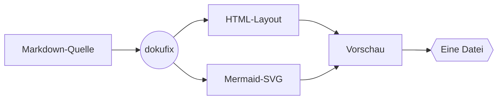
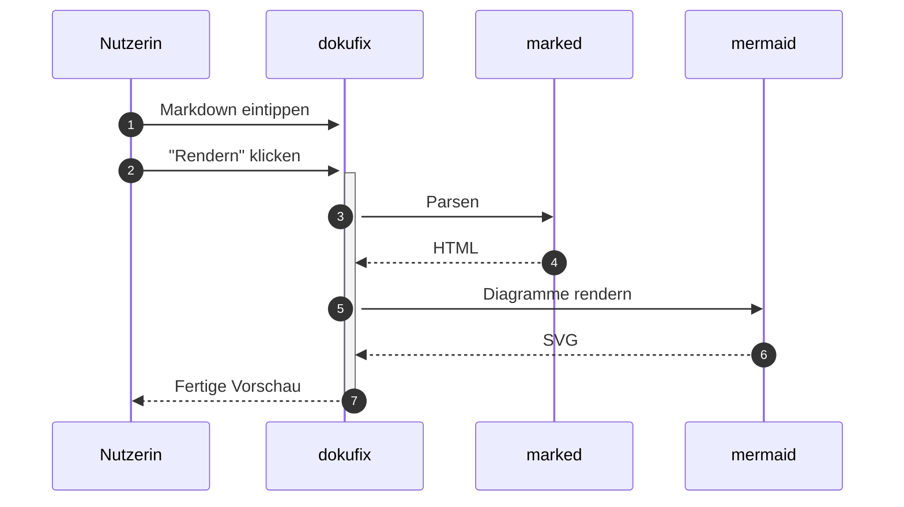

# Willkommen bei dokufix

Sie lesen gerade. Das hier ist der **Lesemodus** — keine Werkzeugleiste, keine Doppel-Ansicht, kein Chrome. Genau so kommt ein dokufix-Dokument beim Empfänger an: als ein Dokument, nicht als App.

Oben rechts gibt es einen einzigen kleinen Button: **„Editor ↩"**. Ein Klick — und Sie wechseln in die Bearbeitungsansicht und können diese Datei selbst verändern. Kein Tool installieren, kein Konto, keine Plattform dazwischen.

Manchmal sollen Empfänger gar nichts ändern können — bei einer veröffentlichten Richtlinie, einem Audit-Bericht, einer finalen Fassung. Dafür gibt es die **Auslieferung ohne Editor**: das Dokument bleibt lesbar, der Bearbeitungs-Modus fehlt komplett. Wird später doch eine Aktualisierung nötig, lässt sich der Inhalt jederzeit wieder in einen dokufix-Editor laden und weiterbearbeiten. Sie entscheiden bei jeder Auslieferung neu, ob das Dokument *gelesen* oder auch *fortgeschrieben* werden darf.

[[toc]]

## Was Sie in diesem Dokument sehen

- Überschriften, Listen, Tabellen
- *Kursiv*, **fett**, ~~durchgestrichen~~
- Inline-`Code` und Code-Blöcke
- Blockzitate
- Status-Chips
- **Mermaid-Diagramme**

## Wie das hier zusammenspielt



## Eine Tabelle

| Feature | Status |
|---|---|
| Markdown rendern | ✅ |
| Mermaid rendern | ✅ |
| Metadaten-Kopf | ✅ |
| Fußnoten mit Vorschau | ✅ |
| Editor-Modus | 🚧 |
| Self-Save | 🚧 |
| Self-Replication | 🚧 |

### Lesehilfen im Detail

Bei breiteren Bildschirmen erscheint rechts eine schwebende Schiene mit allen Überschriften des Dokuments. Der gerade gelesene Abschnitt ist markiert; ein Klick springt direkt dorthin. Die Schiene blendet sich auf schmaleren Geräten aus — dort übernimmt das eingebettete Inhaltsverzeichnis oben.

## Status-Chips

Ein Code-Span, der mit einem Farbpunkt beginnt, wird zu einem Status-Chip: Aus `` `🟢 in Betrieb` `` wird `🟢 in Betrieb`. Es gibt fünf Farben: `🟢 in Betrieb`, `🟡 geplant`, `🔴 gestört`, `⚪ Übergangslösung` und `🔵 im Test`. Jede hat ein eigenes Zeichen vor dem Text, damit ein Status auch ohne Farbe erkennbar bleibt.

| System | Status |
|---|---|
| Bestellannahme | `🟢 in Betrieb` |
| Lagerverwaltung | `🟡 geplant` |
| Zahlungsschnittstelle | `🔴 gestört` |
| Altsystem Versand | `⚪ Übergangslösung` |
| Kundenportal | `🔵 im Test` |

### Kundenportal `🔵 im Test`

Ein Chip steht im Fließtext, in Tabellen, in Überschriften wie der hier, in **fettem Text: `🟡 geplant`** und in Verweisen: [`🟢 in Betrieb`](#status-chips). In einem Renderer, der dokufix nicht kennt, bleibt er ein Code-Span mit Farbpunkt.

## Der Metadaten-Kopf

Ganz oben, über der Überschrift, sitzt ein zugeklappter Streifen **Metadaten**. Klicken Sie ihn auf: Titel, Version, Datum, Schlagworte und Freigabe stehen dort als Tabelle statt als Rohtext.

Solche Kopfdaten schreibt praktisch jedes Dokumentationswerkzeug an den Anfang einer Markdown-Datei[^header] — und ohne Unterstützung landen sie als sichtbarer Müll im Dokument: eine Trennlinie, darunter die Schlüssel als Fließtext. dokufix erkennt den Block und zeigt ihn als Panel.

Der Streifen klappt **ohne JavaScript** auf und zu. Er funktioniert damit auch in der ausgelieferten Nur-Lese-Fassung[^header], in der kein Skript mehr enthalten ist.

## Fußnoten

Fahren Sie mit der Maus über diese Fußnote[^vorschau] — der Text erscheint direkt an der Stelle, ohne dass Sie ans Dokumentende springen müssen. Wer mit der Tastatur navigiert, bekommt dieselbe Vorschau beim Fokussieren.

Klicken Sie stattdessen darauf, landen Sie unten bei der Fußnote: Sie ist dann hervorgehoben, und **genau der Rückwärtspfeil**, der Sie hierher zurückbringt, ist markiert. Das ist mehr wert, als es klingt — sobald eine Fußnote von mehreren Stellen referenziert wird[^header], stehen unten mehrere Pfeile nebeneinander, und ohne Markierung rät man, welcher der eigene ist.

## Sequenzdiagramm



## Code-Block (kein Mermaid)

```javascript
function dokufix(md) {
  const html = marked.parse(md);
  return renderMermaidIn(html);
}
```

> **Träger für Inhalte.** Die HTML ist nur die aktuelle Hülle.

---

Probieren Sie es aus: Klicken Sie oben rechts auf **„Editor ↩"**, ändern Sie diesen Text — und rendern Sie ihn anschließend neu. Die Datei, die Sie gerade lesen, ist gleichzeitig der Editor.[^selbstbezug]

[^selbstbezug]: Das ist kein Bug, das ist die These. dokufix verwischt die Grenze zwischen *Werkzeug* und *Werkstück* — die HTML ist beides gleichzeitig.

[^header]: YAML zwischen zwei `---`-Zeilen, ganz am Anfang der Datei; JSON funktioniert ebenso. dokufix liest eine bewusst kleine Teilmenge von YAML — was darüber hinausgeht, zeigt es unverändert im Original an, statt es stillschweigend zu verschlucken. Diese Fußnote wird absichtlich von mehreren Stellen aus referenziert: unten sehen Sie deshalb mehrere Rückwärtspfeile.

[^vorschau]: Die Vorschau ist reines CSS — kein Skript. Deshalb funktioniert sie auch in der Nur-Lese-Auslieferung. Ein Klick auf die Marke hält die Vorschau offen; ein Klick irgendwo ins Dokument schließt sie wieder.
