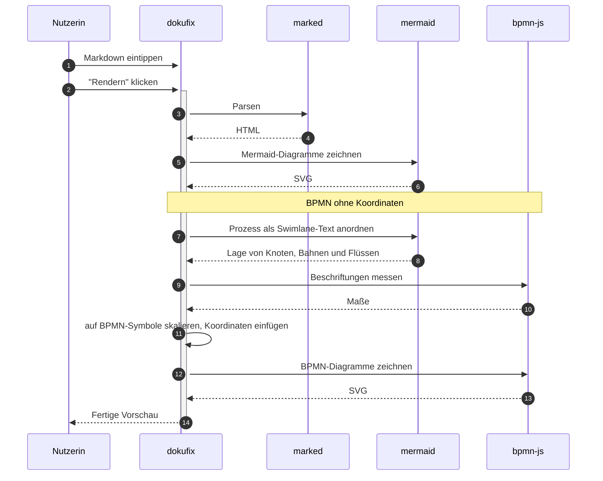

# dokufix auf einen Blick

Sie lesen gerade. Das hier ist der **Lesemodus** — keine Werkzeugleiste, keine Doppel-Ansicht. Genau so kommt ein dokufix-Dokument beim Empfänger an: als ein Dokument, nicht als App.

Oben rechts gibt es einen einzigen kleinen Button: **„Editor ↩"**. Ein Klick — und Sie bearbeiten diese Datei selbst. Kein Tool installieren, kein Konto, keine Plattform dazwischen.

Beim Herunterladen entscheiden Sie jedes Mal neu: **mit Editor**, dann schreibt der Empfänger das Dokument fort, oder **ohne Editor**, dann kann er es nur lesen — etwa eine veröffentlichte Richtlinie oder eine finale Fassung.

[[toc]]

## Der Metadaten-Kopf

Ganz oben, über der Überschrift, sitzt ein zugeklappter Streifen **Metadaten**. Klicken Sie ihn auf: Titel, Version, Datum, Schlagworte und Freigabe stehen dort als Tabelle. Geschrieben sind sie als YAML-Block am Anfang der Datei, wie ihn viele Dokumentationswerkzeuge kennen.

## Eine Tabelle

| Was | Wie geschrieben |
|---|---|
| Überschriften, Listen, Tabellen | Markdown |
| *Kursiv*, **fett**, `Code` | Markdown |
| Diagramme | Code-Block mit `mermaid` oder `bpmn` |
| Bilder | eingefügt im Editor |

## Status-Chips

Ein Code-Span, der mit einem Farbpunkt beginnt, wird zu einem Status-Chip: `🟢 in Betrieb`, `🟡 geplant`, `🔴 gestört`, `⚪ Übergangslösung` und `🔵 im Test`. Jede Farbe hat ein eigenes Zeichen vor dem Text, damit der Status auch ohne Farbe erkennbar bleibt.

## Hinweise

> [!TIP]
> Ein Zitat, dessen erste Zeile nur eine Marke wie `[!TIP]` trägt, wird zum Hinweis — geschrieben wie ein Alert auf GitHub.

> [!WARNING]
> Ein Download überschreibt keine Datei: Der Browser legt jedes Mal eine neue an. Welche Fassung gilt, entscheidet, wer sie weitergibt.

## Karten

<!-- dokufix: cards -->
- **Mit Editor** Die Datei bleibt bearbeitbar. Wer sie bekommt, schreibt sie fort.
- **Offen** Ein reines Lesedokument ohne ein einziges Skript.
- **Schlank** Der Text steht lesbar in der Datei, die Diagramme sind gepackt.
- **Kompakt** Alles ist gepackt: die kleinste Datei.

Die Markierung `<!-- dokufix: cards -->` über einer Aufzählung macht aus ihren Einträgen Karten. Auf GitHub bleibt sie unsichtbar, und die Liste ist eine Liste.

## Schrittliste

<!-- dokufix: steps -->
1. *Autorin:* Den Text im Editor schreiben.
2. *Autorin:* Im Download-Menü die passende Auslieferung wählen.
3. *Empfänger:* Die Datei im Browser öffnen und lesen.

## Tabelle mit Filter

Die Knöpfe über der Tabelle zeigen nur die Zeilen mit einem Wert der Spalte „Art“; das Suchfeld nur die Zeilen, in denen ein Text vorkommt.

<!-- dokufix: filter "Baustein suchen …" -->
<!-- dokufix: facets Art -->
| Baustein | Art | Geschrieben als |
|---|---|---|
| Hinweis | Block | Zitat mit einer Marke in der ersten Zeile |
| Status-Chip | Text | Code-Span mit Farbpunkt |
| Karten | Block | Markierung über einer Aufzählung |
| Schrittliste | Block | Markierung über einer nummerierten Liste |
| Fußnote | Text | Marke im Text, Erklärung am Ende |
| Filter | Tabelle | Markierung über einer Tabelle |

## Bilder


Foto: Daria Yakovleva (Pixabay), über [Wikimedia Commons](https://commons.wikimedia.org/wiki/File:Piece_of_chocolate_cake_on_a_white_plate_decorated_with_chocolate_sauce.jpg), Lizenz [CC0 1.0](https://creativecommons.org/publicdomain/zero/1.0/deed.de)

Ein Bild liegt einmal in der Datei und braucht nichts von außen.

## Fußnoten

Fahren Sie mit der Maus über diese Fußnote[^vorschau] — der Text erscheint direkt an der Stelle, ohne dass Sie ans Dokumentende springen müssen.

## Ein Sequenzdiagramm



## Ein Prozessmodell

BPMN-XML ohne Koordinaten genügt: Bahnen, Schritte und Flüsse aufschreiben, dokufix ordnet den Prozess selbst an. Ein Klick auf ein Diagramm zeigt es groß über dem ganzen Fenster; die Knöpfe darunter laden die Quelle und das Bild herunter.

```bpmn
<?xml version="1.0" encoding="UTF-8"?>
<bpmn:definitions xmlns:bpmn="http://www.omg.org/spec/BPMN/20100524/MODEL" id="Definitionen" targetNamespace="http://example.org/dokufix">
  <bpmn:collaboration id="Zusammenarbeit">
    <bpmn:participant id="Bibliothek" name="Vormerkung" processRef="Prozess_Vormerkung"/>
  </bpmn:collaboration>
  <bpmn:process id="Prozess_Vormerkung" isExecutable="false">
    <bpmn:laneSet id="Bahnen">
      <bpmn:lane id="Leserin" name="Leserin"><bpmn:flowNodeRef>V_Start</bpmn:flowNodeRef><bpmn:flowNodeRef>V_Abholen</bpmn:flowNodeRef><bpmn:flowNodeRef>V_Ende</bpmn:flowNodeRef></bpmn:lane>
      <bpmn:lane id="Theke" name="Theke"><bpmn:flowNodeRef>V_Aufnehmen</bpmn:flowNodeRef><bpmn:flowNodeRef>V_Frage</bpmn:flowNodeRef><bpmn:flowNodeRef>V_Fernleihe</bpmn:flowNodeRef><bpmn:flowNodeRef>V_Benachrichtigen</bpmn:flowNodeRef></bpmn:lane>
      <bpmn:lane id="Magazin" name="Magazin"><bpmn:flowNodeRef>V_Holen</bpmn:flowNodeRef></bpmn:lane>
    </bpmn:laneSet>
    <bpmn:startEvent id="V_Start" name="Buch gewünscht"/>
    <bpmn:userTask id="V_Aufnehmen" name="Vormerkung aufnehmen"/>
    <bpmn:exclusiveGateway id="V_Frage" name="Im Bestand?"/>
    <bpmn:task id="V_Holen" name="Buch aus dem Magazin holen"/>
    <bpmn:sendTask id="V_Fernleihe" name="Fernleihe bestellen"/>
    <bpmn:sendTask id="V_Benachrichtigen" name="Leserin benachrichtigen"/>
    <bpmn:manualTask id="V_Abholen" name="Buch abholen"/>
    <bpmn:endEvent id="V_Ende" name="Ausgeliehen"/>
    <bpmn:sequenceFlow id="V1" sourceRef="V_Start" targetRef="V_Aufnehmen"/>
    <bpmn:sequenceFlow id="V2" sourceRef="V_Aufnehmen" targetRef="V_Frage"/>
    <bpmn:sequenceFlow id="V3" sourceRef="V_Frage" targetRef="V_Holen" name="ja"/>
    <bpmn:sequenceFlow id="V4" sourceRef="V_Frage" targetRef="V_Fernleihe" name="nein"/>
    <bpmn:sequenceFlow id="V5" sourceRef="V_Holen" targetRef="V_Benachrichtigen"/>
    <bpmn:sequenceFlow id="V6" sourceRef="V_Fernleihe" targetRef="V_Benachrichtigen"/>
    <bpmn:sequenceFlow id="V7" sourceRef="V_Benachrichtigen" targetRef="V_Abholen"/>
    <bpmn:sequenceFlow id="V8" sourceRef="V_Abholen" targetRef="V_Ende"/>
  </bpmn:process>
</bpmn:definitions>
```

## Suche

Die Taste `/` öffnet eine Suche über das ganze Dokument, Tabellen und Diagramme eingeschlossen; ein Klick auf einen Treffer führt dorthin.

---

Probieren Sie es aus: Klicken Sie oben rechts auf **„Editor ↩"**, ändern Sie diesen Text und rendern Sie ihn neu. Die Datei, die Sie gerade lesen, ist gleichzeitig der Editor.

[^vorschau]: Die Vorschau ist reines CSS — kein Skript. Deshalb funktioniert sie auch in der Nur-Lese-Auslieferung.
