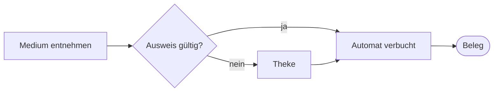
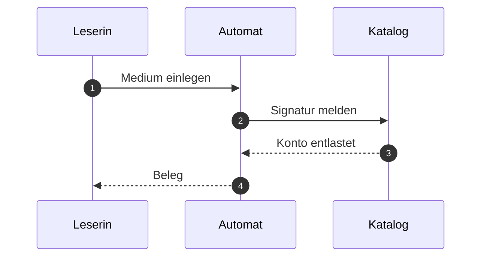

# Referenzdokument Stadtbibliothek

Dieses Dokument ist erfunden. Es dient nur dazu, alle vier Auslieferungen von dokufix mit **demselben Inhalt** zu bauen und Bild für Bild zu vergleichen. Die Ausleihe einer fiktiven Stadtbibliothek liefert den Stoff[^quelle]; fachlich stimmt daran nichts.

Es enthält jedes Element, für das dokufix eine Formatierung mitbringt: *kursiv*, **fett**, ~~durchgestrichen~~, `Inline-Code`, einen [Verweis](https://example.org/bibliothek) und eine Fußnote mit längerem Text[^lang].

[[toc]]

## Ausleihe

Wer ein Medium ausleiht, zeigt den Ausweis vor und nennt die Signatur. Die Frist beträgt vier Wochen[^quelle] und lässt sich zweimal verlängern.

### Voraussetzungen

- gültiger Bibliotheksausweis
- kein offenes Entgelt über 10 Euro
- höchstens 20 Medien gleichzeitig
  - davon höchstens 5 Spiele
  - davon höchstens 2 Geräte

### Ablauf

1. Medium am Regal entnehmen
2. Ausweis am Automaten scannen
3. Medium auf die Ablage legen
4. Beleg mitnehmen



#### Sonderfall Fernleihe

Medien aus anderen Häusern kommen über die Fernleihe. Die Frist setzt das gebende Haus[^quelle], nicht die Stadtbibliothek.

## Fristen und Entgelte

| Medium | Frist | Verlängerung | Entgelt je Woche Verzug |
|---|---|---|---|
| Buch | 28 Tage | zweimal | 1,00 € |
| Zeitschrift | 14 Tage | einmal | 0,50 € |
| Spiel | 14 Tage | keine | 2,00 € |
| Gerät | 7 Tage | keine | 5,00 € |

> **Merksatz.** Eine Verlängerung zählt ab dem Tag, an dem sie beantragt wird, nicht ab dem Ende der alten Frist.
>
> Das gilt auch für die Fernleihe.

### Abbildungen

Ein eingebettetes Bild, als `data:`-URI direkt im Quelltext:


Ein Verweis auf ein Bild, das im Speicher fehlt:


## Rückgabe

Die Rückgabe läuft über den Automaten im Eingang oder über die Klappe an der Außenwand.



### Schnittstelle des Automaten

Der Automat meldet jede Rückgabe als eine Zeile:

```json
{
  "signatur": "Gb 412/7",
  "zeitpunkt": "2026-10-02T09:30:00+02:00",
  "zustand": "in Ordnung"
}
```

## Status

Ein Status steht als Code-Spanne, die mit einem Farbpunkt, einem Leerzeichen und einem Text beginnt. Der Automat im Eingang ist `🟢 in Betrieb`, die Klappe an der Außenwand `🟡 gestört`, der Automat im Lesesaal `🔴 außer Betrieb`, der im Magazin `⚪ geplant` und der an der Theke `🔵 im Test`.[^status]

Derselbe Text in zwei Farben: `🟢 Test` neben `🔴 Test`, `⚪ x` neben `🔵 x`. Gewöhnlicher Code bleibt Code: `x`, `x 🟢`, `🟢` und `🟢x`.

| Gerät | Standort | Status |
|---|---|---|
| Automat 1 | Eingang | `🟢 in Betrieb` |
| Automat 2 | Lesesaal | `🔴 außer Betrieb` |
| Klappe | Außenwand | `🟡 gestört` |
| Automat 3 | Magazin | `⚪ geplant` |
| Automat 4 | Theke | `🔵 im Test` |

- in einer Liste: `🟢 in Betrieb`
- in einem Verweis: [`🔵 im Test`](https://example.org/automat)
- fett: **`🔴 außer Betrieb`**

Im Codeblock bleibt die Zeile, wie sie ist:

```text
🟢 in Betrieb
```

### Automat im Eingang `🟢 in Betrieb`

Eine Überschrift mit einem Status.

### `⚪️ geplant`

Eine Überschrift, die nur aus einem Status besteht; ihr Farbpunkt trägt einen Variantenselektor.

## Hinweise

Fünf Arten von Hinweisen, geschrieben wie die Alerts von GitHub: ein Zitat, dessen erste Zeile nur die Marke trägt.

> [!NOTE]
> Der Automat druckt den Beleg auf Wunsch ein zweites Mal. Maßgeblich ist das **Konto**, nicht der Beleg. Der Belegdrucker ist `🟢 in Betrieb`.

> [!TIP]
> Wer die Frist im Kalender führt, trägt den Tag der Verlängerung ein, nicht das Ende der alten Frist.

### Vor der Rückgabe

> [!IMPORTANT]
> ### Geräte vollständig abgeben
>
> Zu einem Gerät gehören Netzteil, Hülle und Anleitung. Fehlt ein Teil, bleibt das Konto belastet.

### Nach der Rückgabe

> [!WARNING]
> - Die Klappe an der Außenwand nimmt keine Geräte an.
> - Ist die Klappe voll, bleibt das Medium ausgeliehen.

> [!CAUTION]
> Beschädigte Akkus gehören nicht in den Automaten, sondern an die Theke.

## Karten

Ein Kommentar, der mit `dokufix:` beginnt, macht aus dem Block direkt danach einen Baustein. Vor einer Aufzählung macht `cards` aus jedem Eintrag eine Karte; der fette Text am Anfang ist ihr Titel.

<!-- dokufix: cards -->
- **Selbstverbuchung** Am Automaten im Eingang, ohne Wartezeit. Der Automat ist `🟢 in Betrieb`.
- **Theke** Mit Beratung, zu den Öffnungszeiten.
- **Fernleihe**  
  Über das Formular; die Frist setzt das gebende Haus.
- Vorab **fett** mittendrin: eine Karte ohne Titel.

Eine Aufzählung mit Leerzeilen zwischen den Einträgen, und eine Leerzeile zwischen Markierung und Liste:

<!-- dokufix: cards -->

- **Lesesaal** Ruhig, mit einer Steckdose an jedem Platz.

- **Gruppenraum** Für bis zu sechs Personen.

  Die Buchung läuft über die Theke.

## Schritte

Vor einer nummerierten Liste macht `steps` aus den Einträgen Schritte. Ein kursiver Anfang mit Doppelpunkt nennt, wer handelt.

<!-- dokufix: steps -->
1. *Leserin:* Medium auf die Ablage legen.
2. *Automat:* Signatur lesen und das Konto entlasten.[^automat]
3. *Nie* ein Medium ohne Beleg zurücklassen.
4. Beleg mitnehmen.

Zum Vergleich dieselbe Fußnote in einer nummerierten Liste ohne Markierung:

1. Signatur lesen und das Konto entlasten.[^automat]
2. Beleg mitnehmen.

Eine Liste, die mit 3 beginnt, zählt ab 3; ihre Einträge sind durch Leerzeilen getrennt:

<!-- dokufix: steps -->
3. *Katalog:* Vormerkung prüfen.

4. Medium in das Abholregal stellen.

### Zwei Markierungen vor einem Block

Jede wirkt für sich auf denselben Block: `cards` macht die Aufzählung zu Karten, `steps` wird zur Warnung.

<!-- dokufix: cards -->
<!-- dokufix: steps -->
- **Erste Karte** Die Markierung `cards` wirkt.
- **Zweite Karte** Die Markierung `steps` erwartet eine nummerierte Liste.

### Markierungen ohne Wirkung

Ein unbekannter Name:

<!-- dokufix: crads -->
- Diese Aufzählung bleibt eine Aufzählung.
- Die Warnung steht über ihr.

Der falsche Block, einmal eine Aufzählung und einmal eine Tabelle:

<!-- dokufix: steps -->
- eine Aufzählung, keine nummerierte Liste

<!-- dokufix: cards -->
| Raum | Plätze |
|---|---|
| Lesesaal | 40 |
| Gruppenraum | 6 |

Ein Absatz zwischen Markierung und Liste:

<!-- dokufix: cards -->
Dieser Absatz steht dazwischen.

- Auch diese Aufzählung bleibt eine Aufzählung.

Etwas hinter dem Namen, das die Markierung nicht kennt, ein Name mit Bindestrich und eine Markierung ohne Namen:

<!-- dokufix: cards zwei -->
- erster Eintrag

<!-- dokufix: side-note wichtig -->
- zweiter Eintrag

<!-- dokufix: -->
- dritter Eintrag

Eine Markierung mitten in einem Absatz <!-- dokufix: steps --> hat keinen Block hinter sich; ihre Warnung steht hinter dem Absatz.

Die Markierungen danach wirken weiter:

<!-- dokufix: steps -->
1. Dieser Schritt steht hinter allen Warnungen dieses Abschnitts.

### Was keine Markierung ist

Als Code bleibt die Markierung Text: `<!-- dokufix: cards -->`, auch im Codeblock:

```markdown
<!-- dokufix: steps -->
1. Erster Schritt
```

Ein anderer Kommentar bleibt, was er ist, und die Liste hinter ihm eine Liste:

<!-- Notiz der Redaktion: vor der Freigabe prüfen -->
- ein gewöhnlicher Eintrag

---

## Schluss

Mehr steht hier nicht. Das Dokument endet mit den Fußnoten und, in den Auslieferungen ohne Editor, mit der Exportzeile.[^hinweis]

[^quelle]: Benutzungsordnung der fiktiven Stadtbibliothek, Abschnitt 4. Diese Fußnote wird absichtlich an drei Stellen zitiert, damit unten drei Rückwärtspfeile stehen.

[^lang]: Eine längere Fußnote mit `Code`, *Hervorhebung* und genug Text, dass die Vorschau umbrechen muss: Die Bibliothek führt für jedes Medium eine Signatur, einen Standort und einen Zustand; alle drei Angaben erscheinen auf dem Beleg, den der Automat bei Ausleihe und Rückgabe druckt.

[^automat]: Der Automat liest die Signatur vom Etikett des Mediums. Die Fußnote wird in einem Schritt und gleich darunter in einer gewöhnlichen nummerierten Liste zitiert.

[^status]: Auch in einer Fußnote steht ein Status: `🟡 gestört` heißt, dass die Theke aushilft.

[^hinweis]: Die Exportzeile trägt Datum und Uhrzeit; der Vergleichslauf gibt die Uhrzeit deshalb vor.
