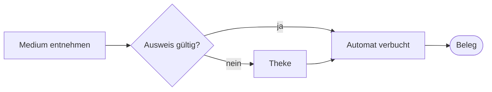
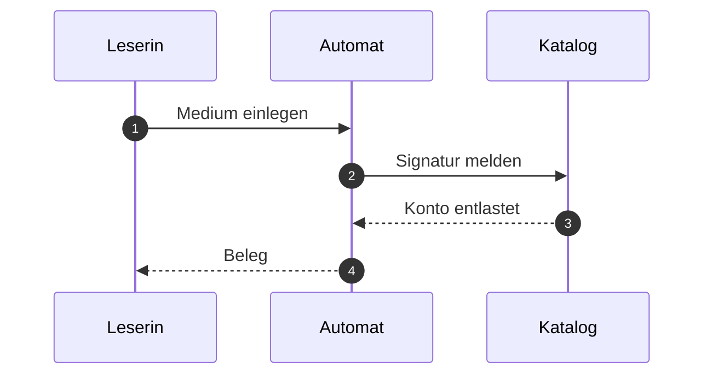

# Referenzdokument Stadtbibliothek

Dieses Dokument ist erfunden. Es dient nur dazu, alle vier Auslieferungen von dokufix mit **demselben Inhalt** zu bauen und Bild für Bild zu vergleichen. Die Ausleihe einer fiktiven Stadtbibliothek liefert den Stoff[^quelle]; fachlich stimmt daran nichts.

Es enthält jedes Element, für das dokufix eine Formatierung mitbringt: *kursiv*, **fett**, ~~durchgestrichen~~, `Inline-Code`, einen [Verweis](https://example.org/bibliothek) und eine Fußnote mit längerem Text[^lang].

[[toc]]

## Ausleihe

Wer ein Medium ausleiht, zeigt den Ausweis vor und nennt die Signatur. Die Frist beträgt vier Wochen[^quelle] und lässt sich zweimal verlängern.

### Voraussetzungen

- gültiger Bibliotheksausweis
- kein offenes Entgelt über 10 Euro
- höchstens 20 Medien gleichzeitig
  - davon höchstens 5 Spiele
  - davon höchstens 2 Geräte

### Ablauf

1. Medium am Regal entnehmen
2. Ausweis am Automaten scannen
3. Medium auf die Ablage legen
4. Beleg mitnehmen



#### Sonderfall Fernleihe

Medien aus anderen Häusern kommen über die Fernleihe. Die Frist setzt das gebende Haus[^quelle], nicht die Stadtbibliothek.

## Fristen und Entgelte

| Medium | Frist | Verlängerung | Entgelt je Woche Verzug |
|---|---|---|---|
| Buch | 28 Tage | zweimal | 1,00 € |
| Zeitschrift | 14 Tage | einmal | 0,50 € |
| Spiel | 14 Tage | keine | 2,00 € |
| Gerät | 7 Tage | keine | 5,00 € |

> **Merksatz.** Eine Verlängerung zählt ab dem Tag, an dem sie beantragt wird, nicht ab dem Ende der alten Frist.
>
> Das gilt auch für die Fernleihe.

### Abbildungen

Ein eingebettetes Bild, als `data:`-URI direkt im Quelltext:


Ein Verweis auf ein Bild, das im Speicher fehlt:


## Rückgabe

Die Rückgabe läuft über den Automaten im Eingang oder über die Klappe an der Außenwand.



### Schnittstelle des Automaten

Der Automat meldet jede Rückgabe als eine Zeile:

```json
{
  "signatur": "Gb 412/7",
  "zeitpunkt": "2026-10-02T09:30:00+02:00",
  "zustand": "in Ordnung"
}
```

## Status

Ein Status steht als Code-Spanne, die mit einem Farbpunkt, einem Leerzeichen und einem Text beginnt. Der Automat im Eingang ist `🟢 in Betrieb`, die Klappe an der Außenwand `🟡 gestört`, der Automat im Lesesaal `🔴 außer Betrieb`, der im Magazin `⚪ geplant` und der an der Theke `🔵 im Test`.[^status]

Derselbe Text in zwei Farben: `🟢 Test` neben `🔴 Test`, `⚪ x` neben `🔵 x`. Gewöhnlicher Code bleibt Code: `x`, `x 🟢`, `🟢` und `🟢x`.

| Gerät | Standort | Status |
|---|---|---|
| Automat 1 | Eingang | `🟢 in Betrieb` |
| Automat 2 | Lesesaal | `🔴 außer Betrieb` |
| Klappe | Außenwand | `🟡 gestört` |
| Automat 3 | Magazin | `⚪ geplant` |
| Automat 4 | Theke | `🔵 im Test` |

- in einer Liste: `🟢 in Betrieb`
- in einem Verweis: [`🔵 im Test`](https://example.org/automat)
- fett: **`🔴 außer Betrieb`**

Im Codeblock bleibt die Zeile, wie sie ist:

```text
🟢 in Betrieb
```

### Automat im Eingang `🟢 in Betrieb`

Eine Überschrift mit einem Status.

### `⚪️ geplant`

Eine Überschrift, die nur aus einem Status besteht; ihr Farbpunkt trägt einen Variantenselektor.

## Hinweise

Fünf Arten von Hinweisen, geschrieben wie die Alerts von GitHub: ein Zitat, dessen erste Zeile nur die Marke trägt.

> [!NOTE]
> Der Automat druckt den Beleg auf Wunsch ein zweites Mal. Maßgeblich ist das **Konto**, nicht der Beleg. Der Belegdrucker ist `🟢 in Betrieb`.

> [!TIP]
> Wer die Frist im Kalender führt, trägt den Tag der Verlängerung ein, nicht das Ende der alten Frist.

### Vor der Rückgabe

> [!IMPORTANT]
> ### Geräte vollständig abgeben
>
> Zu einem Gerät gehören Netzteil, Hülle und Anleitung. Fehlt ein Teil, bleibt das Konto belastet.

### Nach der Rückgabe

> [!WARNING]
> - Die Klappe an der Außenwand nimmt keine Geräte an.
> - Ist die Klappe voll, bleibt das Medium ausgeliehen.

> [!CAUTION]
> Beschädigte Akkus gehören nicht in den Automaten, sondern an die Theke.

## Karten

Ein Kommentar, der mit `dokufix:` beginnt, macht aus dem Block direkt danach einen Baustein. Vor einer Aufzählung macht `cards` aus jedem Eintrag eine Karte; der fette Text am Anfang ist ihr Titel.

<!-- dokufix: cards -->
- **Selbstverbuchung** Am Automaten im Eingang, ohne Wartezeit. Der Automat ist `🟢 in Betrieb`.
- **Theke** Mit Beratung, zu den Öffnungszeiten.
- **Fernleihe**  
  Über das Formular; die Frist setzt das gebende Haus.
- Vorab **fett** mittendrin: eine Karte ohne Titel.

Eine Aufzählung mit Leerzeilen zwischen den Einträgen, und eine Leerzeile zwischen Markierung und Liste:

<!-- dokufix: cards -->

- **Lesesaal** Ruhig, mit einer Steckdose an jedem Platz.

- **Gruppenraum** Für bis zu sechs Personen.

  Die Buchung läuft über die Theke.

## Schritte

Vor einer nummerierten Liste macht `steps` aus den Einträgen Schritte. Ein kursiver Anfang mit Doppelpunkt nennt, wer handelt.

<!-- dokufix: steps -->
1. *Leserin:* Medium auf die Ablage legen.
2. *Automat:* Signatur lesen und das Konto entlasten.[^automat]
3. *Nie* ein Medium ohne Beleg zurücklassen.
4. Beleg mitnehmen.

Zum Vergleich dieselbe Fußnote in einer nummerierten Liste ohne Markierung:

1. Signatur lesen und das Konto entlasten.[^automat]
2. Beleg mitnehmen.

Eine Liste, die mit 3 beginnt, zählt ab 3; ihre Einträge sind durch Leerzeilen getrennt:

<!-- dokufix: steps -->
3. *Katalog:* Vormerkung prüfen.

4. Medium in das Abholregal stellen.

### Zwei Markierungen vor einem Block

Jede wirkt für sich auf denselben Block: `cards` macht die Aufzählung zu Karten, `steps` wird zur Warnung.

<!-- dokufix: cards -->
<!-- dokufix: steps -->
- **Erste Karte** Die Markierung `cards` wirkt.
- **Zweite Karte** Die Markierung `steps` erwartet eine nummerierte Liste.

### Markierungen ohne Wirkung

Ein unbekannter Name:

<!-- dokufix: crads -->
- Diese Aufzählung bleibt eine Aufzählung.
- Die Warnung steht über ihr.

Der falsche Block, einmal eine Aufzählung und einmal eine Tabelle:

<!-- dokufix: steps -->
- eine Aufzählung, keine nummerierte Liste

<!-- dokufix: cards -->
| Raum | Plätze |
|---|---|
| Lesesaal | 40 |
| Gruppenraum | 6 |

Ein Absatz zwischen Markierung und Liste:

<!-- dokufix: cards -->
Dieser Absatz steht dazwischen.

- Auch diese Aufzählung bleibt eine Aufzählung.

Etwas hinter dem Namen, das die Markierung nicht kennt, ein Name mit Bindestrich und eine Markierung ohne Namen:

<!-- dokufix: cards zwei -->
- erster Eintrag

<!-- dokufix: side-note wichtig -->
- zweiter Eintrag

<!-- dokufix: -->
- dritter Eintrag

Eine Markierung mitten in einem Absatz <!-- dokufix: steps --> hat keinen Block hinter sich; ihre Warnung steht hinter dem Absatz.

Die Markierungen danach wirken weiter:

<!-- dokufix: steps -->
1. Dieser Schritt steht hinter allen Warnungen dieses Abschnitts.

### Was keine Markierung ist

Als Code bleibt die Markierung Text: `<!-- dokufix: cards -->`, auch im Codeblock:

```markdown
<!-- dokufix: steps -->
1. Erster Schritt
```

Ein anderer Kommentar bleibt, was er ist, und die Liste hinter ihm eine Liste:

<!-- Notiz der Redaktion: vor der Freigabe prüfen -->
- ein gewöhnlicher Eintrag

## Tabellen

Jede Tabelle steht in einer Hülle, die für sich seitwärts rollt. Eine Tabelle, die breiter ist als die Lesespalte, rollt dort, und die Seite bleibt so breit wie das Fenster:

| signatur_des_mediums | zeitpunkt_der_rueckgabe | zustand_bei_rueckgabe | standort_des_automaten | kennung_des_lesekontos | entgelt_je_woche_verzug | bearbeitungsvermerk |
|---|---|---|---|---|---|---|
| Gb 412/7 | 2026-10-02T09:30:00+02:00 | in Ordnung | Eingang | 0004711 | 1,00 € | keiner |
| Zs 88/3 | 2026-10-02T09:41:00+02:00 | Einband lose | Lesesaal | 0004712 | 0,50 € | an die Buchbinderei |

Auch in einem Hinweis und in einer Aufzählung steht eine Tabelle in ihrer Hülle:

> [!TIP]
> | Tag | Öffnung |
> |---|---|
> | Sonntag | geschlossen |

- an Feiertagen:

  | Tag | Öffnung |
  |---|---|
  | Neujahr | geschlossen |

### Unterzeile

Kursiver Text direkt nach einem Zeilenumbruch in einer Zelle wird zur Unterzeile. Kursiver Text an anderer Stelle bleibt, was er ist.

| Medium | Frist |
|---|---|
| **Buch**<br>*auch als Hörbuch* | 28 Tage |
| Zeitschrift  <br>  *nur das aktuelle Heft* | 14 Tage |
| Spiel<br>vollständig *und unbeschädigt* | 14 Tage |
| *Gerät* | 7 Tage |

Außerhalb einer Tabelle gibt es keine Unterzeile: ein Absatz mit Umbruch<br>*und kursivem Text danach.*

### Fußnote in einer Zelle

| Medium | Signatur |
|---|---|
| Buch[^zelle] | Gb 412/7 |
| Spiel | Sp 17/2 |

Zum Vergleich dieselbe Fußnote in einem Absatz direkt unter der Tabelle.[^zelle]

### Facetten

Die Markierung `facets` nennt eine Spalte. Über der Tabelle steht dann je Wert dieser Spalte ein Knopf, und wer einen wählt, sieht nur die Zeilen mit diesem Wert. Der Wert einer Zelle ist ihre erste Zeile.

<!-- dokufix: facets Typ -->
| Merkmal | Typ | Wer füllt es |
|---|---|---|
| `signatur` | Text | Katalog |
| `standort` | Kategorie | Katalog |
| `ausgeliehen_am` | Datum | Automat |
| `verlaengert`<br>`vorgemerkt` | Ja/Nein<br>*je eines* | Automat |
| `mahnstufe` | Zahl | Katalog |
| `zustand` | Kategorie | Theke |
| `rueckgabe_am` | Datum | Automat |
| `gesperrt` | Ja/Nein | Theke |
| `vermerk` | Text | Theke |

Über einer Spalte mit Status-Chips ist der Wert der Text des Chips:

<!-- dokufix: facets Status -->
| Gerät | Status |
|---|---|
| Automat 1 | `🟢 in Betrieb` |
| Automat 2 | `🔴 außer Betrieb`<br>*seit Montag* |
| Klappe | `🟢 in Betrieb` |
| Automat 3 | `⚪ geplant` |

Werte bleiben getrennt, auch wenn sie sich ähneln, in einer anderen Schrift stehen oder fehlen:

<!-- dokufix: facets Sprache -->
| Titel | Sprache |
|---|---|
| Handbuch A | C |
| Handbuch B | C++ |
| Handbuch C | C# |
| Handbuch D | 日本語 |
| Handbuch E | 中文 |
| Handbuch F | |

Was in einer Überschrift oder in einer Zelle wie HTML aussieht, bleibt Text, auch im Knopf:

<!-- dokufix: facets Zustand  -->
| Zustand \ | Zahl |
|---|---|
| \<b\>neu\</b\> | 3 |
| gebraucht | 5 |

Eine Tabelle, die als HTML geschrieben ist, mit einer verbundenen Zelle:

<!-- dokufix: facets Plätze -->
<table>
<thead><tr><th>Raum</th><th>Plätze</th></tr></thead>
<tbody>
<tr><td colspan="2">Magazin, kein Zutritt</td></tr>
<tr><td>Lesesaal</td><td>40</td></tr>
<tr><td>Gruppenraum</td><td>6</td></tr>
</tbody>
</table>

Zwei Markierungen vor einer Tabelle: `facets` wirkt, `cards` wird zur Warnung.

<!-- dokufix: cards -->
<!-- dokufix: facets Öffnung -->
| Tag | Öffnung |
|---|---|
| Montag | 10 bis 18 Uhr |
| Dienstag | 10 bis 18 Uhr |
| Samstag | 10 bis 14 Uhr |

### Facetten ohne Wirkung

Eine Spalte, die es in der Tabelle nicht gibt, und eine Markierung, die keine Spalte nennt:

<!-- dokufix: facets Tpy -->
| Merkmal | Typ |
|---|---|
| `signatur` | Text |

<!-- dokufix: facets -->
| Merkmal | Typ |
|---|---|
| `standort` | Kategorie |

Der falsche Block, einmal eine Aufzählung und einmal ein Absatz:

<!-- dokufix: facets Typ -->
- eine Aufzählung, keine Tabelle

<!-- dokufix: facets Typ -->
Ein Absatz, keine Tabelle.

Mehr verschiedene Werte, als sich filtern lassen:

<!-- dokufix: facets Regal -->
| Regal | Sachgruppe |
|---|---|
| Regal 1 | Belletristik |
| Regal 2 | Biografien |
| Regal 3 | Erdkunde |
| Regal 4 | Geschichte |
| Regal 5 | Recht |
| Regal 6 | Wirtschaft |
| Regal 7 | Sprache |
| Regal 8 | Naturwissenschaft |
| Regal 9 | Medizin |
| Regal 10 | Technik |
| Regal 11 | Landwirtschaft |
| Regal 12 | Kunst |
| Regal 13 | Musik |
| Regal 14 | Sport |
| Regal 15 | Religion |
| Regal 16 | Philosophie |
| Regal 17 | Kinderbuch |
| Regal 18 | Comic |
| Regal 19 | Hörbuch |
| Regal 20 | Reise |
| Regal 21 | Kochen |
| Regal 22 | Garten |
| Regal 23 | Handwerk |
| Regal 24 | Film |
| Regal 25 | Spiele |
| Regal 26 | Fotografie |
| Regal 27 | Astronomie |
| Regal 28 | Mathematik |
| Regal 29 | Informatik |
| Regal 30 | Pädagogik |
| Regal 31 | Psychologie |
| Regal 32 | Politik |
| Regal 33 | Lyrik |

### Freitextfilter

Die Markierung `filter` gibt einer Tabelle ein Suchfeld, wo ein Skript läuft: im Editor und in der Datei mit Editor. Wer etwas eintippt, sieht nur die Zeilen, in denen der Text vorkommt. Die Fassungen ohne Editor zeigen die ganze Tabelle ohne Suchfeld. Neben `facets` wirken beide zusammen:

<!-- dokufix: filter "Feld oder Zweck suchen …" -->
<!-- dokufix: facets Typ -->
| Feld | Typ | Wofür |
|---|---|---|
| `kennung` | Text | Eindeutige Nummer des Lesekontos, steht auf dem Ausweis |
| `name` | Text | Anrede auf dem Beleg und in Mahnungen |
| `geburtsjahr` | Zahl | Prüft, ob ein Medium mit Altersfreigabe ausgeliehen werden darf |
| `ausweis_bis`<br>`gebuehr_bis` | Datum<br>*je eines* | Ablauf von Ausweis und Jahresgebühr |
| `sperre` | Ja/Nein | Gesetzt nach der dritten Mahnung; die Theke hebt die Sperre auf |
| `mahnstufe` | Zahl | Wie oft gemahnt wurde |
| `vormerkungen` | Zahl | Offene Vormerkungen, höchstens fünf |
| `ort` | Text | Zweigstelle, in der Vormerkungen bereitliegen |
| `benachrichtigung` | Kategorie | Wie das Konto Nachricht bekommt: Post, E-Mail oder keine |
| `status` | Kategorie | `🟢 aktiv` oder ruhend |
| `newsletter` | Ja/Nein | Ob die Bibliothek Veranstaltungen ankündigen darf |
| `angelegt_am` | Datum | Wann das Konto eröffnet wurde |
| `notiz` | Text | Freier Vermerk der Theke, nie auf dem Beleg |
| `tarif` | Kategorie | Erwachsene, Ermäßigt oder Familie |

Ein Suchfeld allein, mit einer Fußnote in einer Zelle:

<!-- dokufix: filter "Zweigstelle suchen …" -->
| Zweigstelle | Öffnung | Rückgabe |
|---|---|---|
| Mitte[^suche] | Montag bis Samstag | Automat im Eingang |
| Nord | Dienstag bis Freitag | Theke |
| Süd | Montag, Mittwoch, Freitag | Klappe |
| Hafen | Samstag | Theke |

Zum Vergleich dieselbe Fußnote in einem Absatz direkt unter der Tabelle.[^suche]

Ohne Angabe hinter dem Namen hat das Suchfeld seinen gewöhnlichen Platzhalter:

<!-- dokufix: filter -->
| Ausweis | Jahresgebühr |
|---|---|
| Erwachsene | 20 € |
| Ermäßigt | 10 € |
| Familie | 30 € |

### Freitextfilter ohne Wirkung

Vor einer Aufzählung, vor einem Absatz und zweimal vor derselben Tabelle:

<!-- dokufix: filter "Suchen …" -->
- eine Aufzählung, keine Tabelle

<!-- dokufix: filter -->
Ein Absatz, keine Tabelle.

<!-- dokufix: filter "Erste Suche …" -->
<!-- dokufix: filter "Zweite Suche …" -->
| Raum | Plätze |
|---|---|
| Lesesaal | 40 |
| Gruppenraum | 6 |

---

## Schluss

Mehr steht hier nicht. Das Dokument endet mit den Fußnoten und, in den Auslieferungen ohne Editor, mit der Exportzeile.[^hinweis]

[^quelle]: Benutzungsordnung der fiktiven Stadtbibliothek, Abschnitt 4. Diese Fußnote wird absichtlich an drei Stellen zitiert, damit unten drei Rückwärtspfeile stehen.

[^lang]: Eine längere Fußnote mit `Code`, *Hervorhebung* und genug Text, dass die Vorschau umbrechen muss: Die Bibliothek führt für jedes Medium eine Signatur, einen Standort und einen Zustand; alle drei Angaben erscheinen auf dem Beleg, den der Automat bei Ausleihe und Rückgabe druckt.

[^automat]: Der Automat liest die Signatur vom Etikett des Mediums. Die Fußnote wird in einem Schritt und gleich darunter in einer gewöhnlichen nummerierten Liste zitiert.

[^zelle]: Die Signatur steht auf dem Etikett am Buchrücken. Diese Fußnote wird in einer Tabellenzelle und gleich darunter in einem Absatz zitiert; ihre Vorschau reicht über den Rand der Tabelle hinaus und darf dort nicht abgeschnitten sein.

[^suche]: Die Zweigstelle Mitte ist die Zentrale; dort liegen die Vormerkungen aller Zweigstellen zuerst. Diese Fußnote wird in einer Zelle einer Tabelle mit Suchfeld und gleich darunter in einem Absatz zitiert; ihre Vorschau steht dort, wo sie ohne Suchfeld stünde.

[^status]: Auch in einer Fußnote steht ein Status: `🟡 gestört` heißt, dass die Theke aushilft.

[^hinweis]: Die Exportzeile trägt Datum und Uhrzeit; der Vergleichslauf gibt die Uhrzeit deshalb vor.
